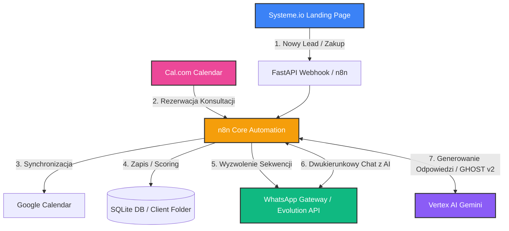

# 🤖 SOP: Automatyzacja Projektów Klienckich (Faza Produkcji) — v1.0

## 📌 Purpose
Zapewnienie bezbłędnej, pancernej i w pełni zautomatyzowanej orkiestracji technicznej dla projektów produkcyjnych: **x2o.jaison.pl** (edukacja zdrowotna i nawodnienie) oraz **mlm.jaison.pl** (wsparcie rekrutacji i onboardingu partnerów LifeWave). 

SOP eliminuje konieczność manualnego zarządzania kalendarzem Cal.com oraz ręcznego odpisywania na WhatsApp, integrując te kanały bezpośrednio z n8n, Systeme.io i modelami LLM (Gemini via Vertex AI).

---

## 🗺️ Architektura Przepływu Danych (Low-Friction)



---

## 📅 Część I: Automatyzacja Kalendarza Cal.com

Cal.com to centralny punkt umawiania konsultacji. Cel: Po rezerwacji termin ma automatycznie zapisać się w Google Calendar, zaktualizować status kontaktu w Systeme.io i wyzwolić spersonalizowane przypomnienie na WhatsApp.

### 1. Rejestracja Webhooków w Cal.com
Agent / Administrator musi zarejestrować następujące webhooki w konsoli Cal.com (lub w bazie przez API) kierujące do n8n:

| Zdarzenie Cal.com | Endpoint n8n | Opis działania |
|-------------------|--------------|----------------|
| `BOOKING_CREATED` | `/webhook/cal-booking-created` | Wyzwala natychmiastowe podziękowanie i onboarding. |
| `BOOKING_RESCHEDULED` | `/webhook/cal-booking-rescheduled` | Aktualizuje termin w CRM i powiadamia o zmianie. |
| `BOOKING_CANCELLED` | `/webhook/cal-booking-cancelled` | Zwalnia slot, zmienia status w CRM, pyta o powód. |

### 2. Struktura Danych Webhooka (Payload JSON)
Przykładowy payload, który n8n musi sparsować:
```json
{
  "triggerEvent": "BOOKING_CREATED",
  "payload": {
    "bookingId": 12345,
    "startTime": "2026-07-20T10:00:00Z",
    "endTime": "2026-07-20T10:30:00Z",
    "title": "Konsultacja Hydratacyjna x2o — Jan Kowalski",
    "attendees": [
      {
        "email": "jan.kowalski@gmail.com",
        "name": "Jan Kowalski",
        "timeZone": "Europe/Warsaw"
      }
    ],
    "responses": {
      "numer-telefonu": "+48600100200",
      "cel-konsultacji": "Chcę poprawić poziom energii i nawodnienie."
    }
  }
}
```

### 3. Wdrożenie w n8n (Kroki Konfiguracji)
- **Krok 1 (Webhook Trigger):** Ustawienie jako POST na dedykowany adres url.
- **Krok 2 (Set Variables):** Wyciągnięcie `email`, `name`, `phone` (z pola custom responses) oraz `dateTime`.
- **Krok 3 (Systeme.io Sync):** Dodanie kontaktu do Systeme.io za pomocą węzła HTTP Request (lub dopięcie tagu np. `Umówił Konsultację`).
- **Krok 4 (WhatsApp Notification):** Wysłanie dynamicznej wiadomości (patrz Część II).

---

## 📱 Część II: Orkiestracja Bota WhatsApp

Aby uniknąć blokad numeru (bany od Meta) i zapewnić maksymalny standard premium, stosujemy **Evolution API** (lekka, stabilna bramka self-hosted integrująca się z n8n) lub natywne **Twilio API**.

### 1. Konfiguracja Połączenia z Evolution API (n8n HTTP Request)
W celu wysłania wiadomości WhatsApp, n8n wykonuje zapytanie:
*   **Metoda:** `POST`
*   **URL:** `https://your-evolution-api-domain.com/message/sendText/[instance_name]`
*   **Nagłówki:**
    *   `apikey`: `TWÓJ_TAJNY_KLUCZ_EVOLUTION`
    *   `Content-Type`: `application/json`
*   **Payload:**
```json
{
  "number": "+48600100200",
  "options": {
    "delay": 1200,
    "presence": "composing"
  },
  "textMessage": {
    "text": "Cześć Jan! 👋 Z tej strony asystent AI z zespołu Jaison. Potwierdzam rezerwację Twojej konsultacji x2o na dzień *20 lipca o godzinie 10:00*. Przygotuj szklankę wody! 💧 Do usłyszenia!"
  }
}
```

### 2. Obsługa Stanu Konwersacji (State Management)
W celu prowadzenia dwukierunkowej rozmowy (bot odpowiada na pytania klienta), n8n realizuje następującą pętlę logiczną:
1.  **Webhook Trigger:** n8n odbiera wiadomość przychodzącą z WhatsApp.
2.  **Sprawdzenie sesji:** n8n odpytuje lokalną bazę SQLite (`webhook_api.py` / `database`) o historię rozmowy dla danego numeru telefonu.
3.  **Generowanie odpowiedzi (LLM):** n8n przesyła historię rozmowy + nową wiadomość do Vertex AI Gemini, używając System Promptu **GHOST v2** (stylizacja na naturalny język Tomasza).
4.  **Wysyłka:** Odpowiedź wraca na WhatsApp klienta za pośrednictwem Evolution API.

---

## 🧪 Część III: Ścieżki Produkcyjne Klientów (Pipelines)

### 🌊 1. Projekt: x2o.jaison.pl (Wyzwanie Nawodnienia)

Projekt ma na celu asynchroniczne przeprowadzenie klienta przez 7-dniowe wyzwanie poprawy nawodnienia, budując zaufanie do marki przed zaoferowaniem płatnego coachingu zdrowotnego.

#### Ścieżka klienta (Customer Journey):
1.  **Zapisu na LP:** Klient podaje imię i numer telefonu na `x2o.jaison.pl` (obsługiwane przez Systeme.io).
2.  **Inicjacja (Dzień 0):** Systeme.io wyzwala Webhook do n8n. Bot WhatsApp wysyła pierwszą wiadomość powitalną i prosi o potwierdzenie startu ("Odpisz START").
3.  **Wyzwanie (Dni 1-7):** Każdego dnia o **8:00 rano** oraz o **15:00 po południu**, n8n (wyzwalany przez Cron) wysyła krótką, angażującą wiadomość:
    *   *Rano:* "Cześć [Imię]! Rozpoczynamy dzień. Twoje zadanie na dziś to wypicie 1 szklanki ciepłej wody z cytryną przed kawą. Daj znać, jak poszło! 🍋"
    *   *Popołudnie:* "Jak tam Twoje nawodnienie? Czy szklanka wody stoi na biurku? Odpisz TAK, jeśli już wypiłeś! 💧"
4.  **Ankieta i Zamykanie (Dzień 8):** Bot wysyła krótką ankietę podsumowującą samopoczucie i oferuje darmową, 15-minutową konsultację zdrowotną (link do **Cal.com**).

#### Złote zasady copywritingu dla bota x2o:
- **Krótko i konkretnie:** Zero ścian tekstu. Maksymalnie 3 zdania na wiadomość.
- **Interaktywność:** Zadawaj pytania zamknięte, na które łatwo odpowiedzieć jednym słowem (TAK / NIE / START / OK).
- **Zasada Micro-Gratification:** Po odpowiedzi "TAK" wyślij radosną reakcję (np. "Świetnie! Twój mózg właśnie zyskał 2% wydajności! 🧠🔋").

---

### 💎 2. Projekt: mlm.jaison.pl (Partner Onboarding LifeWave)

Projekt ma na celu maksymalne zautomatyzowanie kwalifikacji, onboardingu oraz edukacji nowych partnerów i klientów w strukturze MLM LifeWave (technologia fototerapii / plastry X39).

#### Ścieżka klienta (Customer Journey):
1.  **Darmowy Audyt / E-book:** Lead zapisuje się na `mlm.jaison.pl` po darmowy materiał o aktywacji komórek macierzystych.
2.  **Dostarczenie wartości (WhatsApp):** Bot natychmiast wysyła PDF oraz krótkie wideo wyjaśniające naukowe podstawy działania plastrów X39.
3.  **Kwalifikacja Asynchroniczna:** Bot zadaje 3 proste pytania kwalifikacyjne:
    *   *Pytanie 1:* "Czy szukasz rozwiązania dla problemów zdrowotnych (ból, sen, energia), czy interesuje Cię budowa dodatkowego źródła dochodu?"
    *   *Pytanie 2:* "Ile czasu tygodniowo możesz poświęcić na rozwój tego projektu (np. 2-5h, czy powyżej 10h)?"
    *   *Pytanie 3:* "Czy masz już doświadczenie w marketingu sieciowym lub sprzedaży?"
4.  **Routing logiczny (n8n):**
    *   *Ścieżka A (Klient Zdrowotny):* Bot przesyła materiały o regeneracji organizmu i link do zakupu plastrów w sklepie.
    *   *Ścieżka B (Biznes / MLM):* Bot ocenia potencjał leada. Jeśli lead ma doświadczenie i czas -> bot automatycznie udostępnia link do **Cal.com** w celu umówienia strategicznej rozmowy z Tomaszem.
5.  **Onboarding Nowego Partnera:** Po zakupie pakietu startowego, n8n uruchamia sekwencję szkoleniową:
    *   Dzień 1: Jak prawidłowo naklejać plastry X39 (instrukcja wideo).
    *   Dzień 3: Pierwsze kroki w biznesie (Darmowe szablony zaproszeń dla znajomych).
    *   Dzień 5: Zaproszenie na najbliższy webinar zespołowy (przypomnienie na WhatsApp 15 minut przed startem).

---

## 🛑 Common Mistakes & How to Avoid Them

| Błąd | Skutek | Zapobieganie |
|------|--------|--------------|
| Zbyt szybka wysyłka wiadomości | Blokada konta WhatsApp przez Meta | Zawsze dodawaj `delay` o losowej długości (np. 1-3 sekundy) i włączaj status `presence: "composing"` (pisanie) przed wysłaniem wiadomości. |
| Brak historii w promptach LLM | Bot "zapomina" co pisał klient | Zawsze przekazuj do Vertex AI tablicę z historią ostatnich 5-10 wiadomości (context window). |
| Hardkodowanie terminów w n8n | Błędy stref czasowych | Zawsze ujednolicaj czas do strefy `Europe/Warsaw` (`HH:MM`). |

---

## 📈 Success Criteria
- [ ] Wszystkie rezerwacje z Cal.com bezbłędnie aktualizują bazy danych i Systeme.io.
- [ ] Powiadomienia na WhatsApp docierają do klienta w ciągu maksymalnie 60 sekund od akcji.
- [ ] Konwersacja z botem WhatsApp brzmi naturalnie, zgodnie ze standardem **GHOST v2**.
- [ ] Zero banów ze strony Meta dzięki zaimplementowanym opóźnieniom (presence delays).

---

## 📝 Revision History
| Data | Wersja | Autor | Opis Zmian |
|------|--------|-------|------------|
| 2026-07-17 | 1.0 | Antigravity | Pierwsze pełne wydanie SOP automatyzacji Cal.com oraz WhatsApp dla projektów x2o i mlm. |
