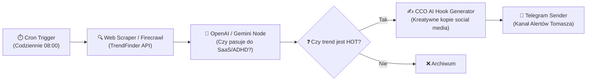
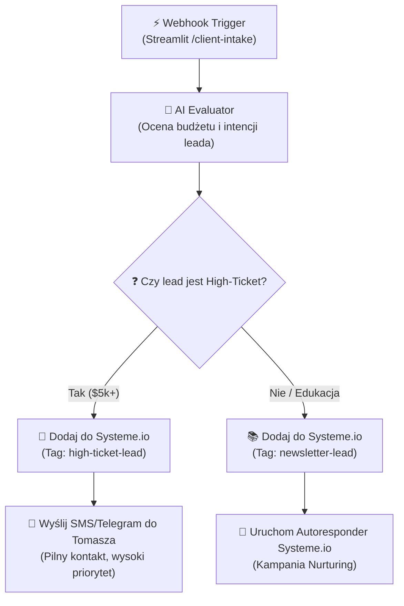

# 🤖 ckm:n8n-automation-blueprints — n8n Async Workflows & Blueprints

Ten skill zawiera gotowe schematy myślowe, logiczne i strukturalne JSON-y (Blueprints) służące do budowania automatyzacji w **n8n** (self-hosted lub darmowa instancja lokalna). 
Służy do łączenia modułów Holistic OS z zewnętrznymi usługami (Systeme.io, Telegram, TrendFinder, Google Cloud) bez pisania setek linii skomplikowanego kodu w Pythonie.

---

## 🗺️ Architektura Przepływów (Master Blueprints)

### Blueprint A: Trend-to-Hook Content Engine 🚀
Automatycznie pobiera najnowsze trendy (zwrócone przez **TrendFinder**), filtruje je za pomocą LLM i generuje gotowe hooki (zaczepy) marketingowe dla agencji, a następnie wysyła raport na Telegram Tomasza.

#### Przepływ Logiczny (n8n Node Tree):


---

### Blueprint B: Client Intake Auto-Responder (Systeme.io Integration) 📈
Uruchamiany automatycznie w momencie, gdy potencjalny klient wypełni formularz `Client Intake Scanner` na Streamlicie.

#### Przepływ Logiczny (n8n Node Tree):


---

## 💾 Przykładowy JSON Blueprint (Importuj do n8n)
Poniższy kod JSON można skopiować i wkleić bezpośrednio w edytorze n8n (skrót `Ctrl+V` na płótnie roboczym), aby natychmiast utworzyć podstawowy webhook odbierający zgłoszenia `Client Intake` i przesyłający je na Telegram.

```json
{
  "nodes": [
    {
      "parameters": {
        "path": "holistic-intake",
        "options": {}
      },
      "id": "1b0895c1-e7ef-4171-bc01-e2d4d9b23bfa",
      "name": "⚡ Webhook",
      "type": "n8n-nodes-base.webhook",
      "typeVersion": 1,
      "position": [250, 300]
    },
    {
      "parameters": {
        "chatId": "=@custom_chat_id",
        "text": "=🧠 *NOWY LEAD W HOLISTIC OS!*\n\n👤 *Imię:* {{ $json.body.name }}\n📧 *E-mail:* {{ $json.body.email }}\n💼 *Projekt:* {{ $json.body.project_desc }}\n💰 *Budżet:* {{ $json.body.budget }}\n\n🤖 _Wygenerowano automatycznie z poziomu n8n Core._",
        "additionalFields": {
          "parse_mode": "Markdown"
        }
      },
      "id": "2b0895c2-f8ef-4171-bd02-f2d4d9b24cfb",
      "name": "📱 Wyślij na Telegram",
      "type": "n8n-nodes-base.telegram",
      "typeVersion": 1.1,
      "position": [450, 300],
      "credentials": {
        "telegramApi": {
          "id": "1",
          "name": "Telegram Bot Token"
        }
      }
    }
  ],
  "connections": {
    "⚡ Webhook": {
      "main": [
        [
          {
            "node": "📱 Wyślij na Telegram",
            "type": "main",
            "index": 0
          }
        ]
      ]
    }
  }
}
```

---

## 🛡️ Reguły Projektowania Automatyzacji (Guardrails)
1. **Idempotentność:** Każdy webhook i zapytanie musi być zabezpieczone przed podwójnym wykonaniem (np. jeśli klient kliknie przycisk "Wyślij" dwa razy).
2. **Error Handling (Bypass):** Każdy node łączący się z zewnętrznym API (Systeme.io, GCS, OpenAI) musi mieć włączoną opcję `Continue On Fail` lub zdefiniowaną ścieżkę awaryjną (Error Trigger), która powiadomi administratora na Telegramie zamiast cichego wyłączenia całego workflow.
3. **Bezpieczeństwo Poświadczeń:** Pod żadnym pozorem nie umieszczaj tokenów API直接 (hardcoded) w kodzie Javascript (Function nodes). Wszystkie dane dostępowe muszą znajdować się w systemie poświadczeń n8n (Credentials).
