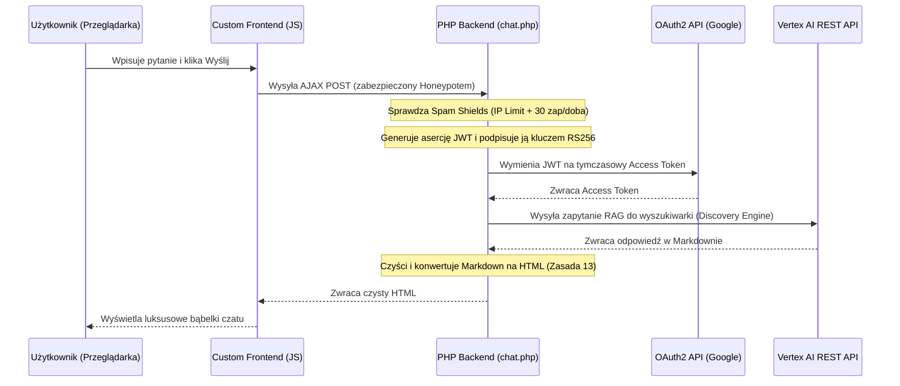

# 🤖 Master SOP: Niskokosztowy Bot Vertex AI Search (Blended Search)
Niniejsza instrukcja stanowi kanoniczny standard wdrożeniowy agencji **Jaison** (`jaison.pl`). Pozwala na uruchomienie zaawansowanego bota hybrydowego dla klienta B2B, wykorzystując darmowe pakiety kredytów startowych Google Cloud Platform (GCP) w taki sposób, aby chatbot działał **całkowicie bezpłatnie przez okres do 12 miesięcy**.

---

## 🎯 Trzy Filary Niskich Kosztów (Low-Cost First)
1.  **Darmowe Kredyty GCP ($300)**: Pokrywają infrastrukturę pomocniczą (transfer danych, Cloud Storage, operacje API) na start.
2.  **Kredyt GenAI App Builder ($1000)**: Przyznawany automatycznie po aktywacji pierwszej aplikacji Vertex AI Search w organizacji Google Cloud. Pokrywa koszty zapytań wyszukiwarki i indeksowania witryn.
3.  **Zakaz Drogich Funkcji**:
    *   `Obraz w odpowiedziach` musi być ustawiony na **`Brak źródła`** (Generowanie obrazów AI przez Imagen jest rozliczane oddzielnie i może błyskawicznie drenować budżet).
    *   `Advanced Generative Answers` (zaawansowany chatbot Dialogflow CX) musi pozostać wyłączony – standardowy asystent Q&A wbudowany w wyszukiwarkę jest całkowicie wystarczający i tańszy.

---

## 📋 Schemat Krok po Kroku (Do Powielania dla Klientów)

### Krok 1: Założenie Projektu i Aktywacja API
1.  Zaloguj się na konto Google Cloud przydzielone dla klienta.
2.  Utwórz nowy projekt GCP (np. `nazwa-klienta-project`).
3.  Włącz rozliczenia (Paid Billing Account / Free Trial) – bez podpiętej karty kredytowej Google nie zezwoli na korzystanie z usług AI.
4.  Otwórz Cloud Shell / Terminal lokalny i aktywuj niezbędne API (jedna linia PowerShell):
    ```powershell
    gcloud services enable storage.googleapis.com discoveryengine.googleapis.com --project="ID_PROJEKTU_KLIENTA"
    ```

### Krok 2: Utworzenie Magazynu Plików Wiedzy (Cloud Storage)
W celu zasilenia bota poufnymi informacjami (instrukcje techniczne, wewnętrzne cenniki hurtowe, procedury SOP), utwórz bezpieczny kontener w GCS:
1.  Utwórz bucket (rekomendowany region to Warszawa `europe-central2` ze względu na RODO/GDPR i opóźnienia):
    ```powershell
    gcloud storage buckets create gs://nazwa-klienta-knowledge --location=europe-central2 --project="ID_PROJEKTU_KLIENTA"
    ```
2.  **Bezwzględnie włącz jednolity dostęp na poziomie bucketu** (Uniform Bucket-Level Access), aby zablokować możliwość przypadkowego publicznego udostępnienia dokumentów:
    ```powershell
    gcloud storage buckets update gs://nazwa-klienta-knowledge --uniform-bucket-level-access --project="ID_PROJEKTU_KLIENTA"
    ```
3.  Załóż w buckecie strukturę logicznych folderów, wgrywając puste pliki `.keep` (zapobiega to usuwaniu pustych folderów przez Google):
    *   📁 `01_public-site/` (statyczne kopie stron klienta)
    *   📁 `02_lead-magnets/` (artykuły, PDF-y z perswazyjnym copywritingiem NLP)
    *   📁 `03_service-sop/` (wewnętrzne instrukcje techniczne)
    *   📁 `04_sales-playbooks/` (skrypty rozmów handlowych)
4.  **[KRYTYCZNE] Nadanie ról IAM dla GCS:** Gdy aktywowano UBLA (Uniform Bucket-Level Access), uprawnienia domyślne dla twórcy bucketu i systemowego konta Vertex AI zostają zablokowane. Agent musi automatycznie odpalić następujące komendy by wymusić twarde przypisanie ról IAM. Zastąp najpierw `NUMER_PROJEKTU_KLIENTA` poprawnym identyfikatorem liczbowym, a `MAIL_KLIENTA` głównym administratorem.
    ```powershell
    # Pobierz numer projektu (Project Number), skopiuj go:
    gcloud projects describe "ID_PROJEKTU_KLIENTA" --format="value(projectNumber)"
    
    # Nadaj uprawnienia administracyjne dla klienta:
    gcloud storage buckets add-iam-policy-binding gs://nazwa-klienta-knowledge --member="user:MAIL_KLIENTA" --role="roles/storage.admin"
    
    # Nadaj niezbędne uprawnienia do podglądu (Object Viewer) dla systemowego konta Discovery Engine w Vertex AI:
    gcloud storage buckets add-iam-policy-binding gs://nazwa-klienta-knowledge --member="serviceAccount:service-NUMER_PROJEKTU_KLIENTA@gcp-sa-discoveryengine.iam.gserviceaccount.com" --role="roles/storage.objectViewer"
    ```

### Krok 3: Konfiguracja Magazynu Danych GCS (Data Store)
1.  W konsoli GCP przejdź do **Vertex AI Agent Builder** -> **Data Stores**.
2.  Kliknij **Create Data Store** -> wybierz **Cloud Storage**.
3.  Wklej ścieżkę do bucketu: `gs://nazwa-klienta-knowledge/`.
4.  **Kluczowy Wybór**: Zaznacz **Dokumenty / Dane nieuporządkowane (Unstructured documents)**.
5.  Ustaw częstotliwość synchronizacji na **Codziennie (Daily)**, aby bot automatycznie uczył się z nowych plików wgrywanych przez techników.
6.  Nazwij go `nazwa-klienta-gcs-store`.

### Krok 4: Konfiguracja Magazynu Witryny (Data Store)
1.  Kliknij ponownie **Create Data Store** -> wybierz **Website**.
2.  Zaznacz **Zaawansowane indeksowanie witryn (Advanced Website Indexing)** (wymagane do poprawnego renderowania dynamicznego).
3.  W polu *Witryny do uwzględnienia* wpisz domenę klienta: `domena-klienta.pl/*` oraz `www.domena-klienta.pl/*`.
4.  W polu *Witryny do wykluczenia* wpisz panele logowania, koszyki zakupowe i panele administratora (jeśli klient ma WordPressa, wyklucz `/wp-admin/*`, `/koszyk/*` itd.). Jeśli strona to czysty, statyczny HTML – **pozostaw to pole całkowicie puste**.
5.  Nazwij go `nazwa-klienta-website-store`.

### Krok 5: Utworzenie i Spięcie Aplikacji (Blended Search)
1.  W menu po lewej przejdź do **Apps** -> **Create App**.
2.  Wybierz zakładkę **Wyszukiwarka i asystent** -> karta **Twoja wyszukiwarka (ogólna)**.
3.  Zaznacz opcję *Funkcje wersji Enterprise* oraz *Odpowiedzi generatywne*.
4.  Nazwij aplikację (np. `Nazwa Klienta Serwis Bot`) i wpisz nazwę firmy.
5.  W sekcji lokalizacji wybierz **`eu (wiele regionów w Unii Europejskiej)`**.
6.  W kroku wyboru danych **zaznacz oba utworzone magazyny**:
    *   `nazwa-klienta-gcs-store`
    *   `nazwa-klienta-website-store`
7.  Potwierdź i utwórz aplikację.

### Krok 6: Dostrajanie i System Prompt (Konfiguracja Premium w Gemini Enterprise Agent Platform)
Przejdź do sekcji **Konfiguracja** (Configuration) -> zakładka **UI / Dostrajanie**:
1.  **Wybór Modelu**: Zmień model językowy na najnowszy stabilny z serii Flash, np. **`Gemini 2.5 Flash`** (lub **`Gemini 2.0 Flash 1`**), a w przypadku testów najnowszych rozwiązań na **`Gemini 3 Flash` (wersja testowa)**. Nie wybieraj przestarzałych wersji (jak 1.5 Flash czy starsze) ani kosztownych modeli z serii Pro (jak Gemini 3.1 Pro / 1.5 Pro) do standardowych zastosowań wyszukiwania, chyba że wymagane jest bardzo zaawansowane wnioskowanie logiczne. Wersje Flash gwarantują najkrótszy czas odpowiedzi przy zachowaniu znikomych kosztów.
2.  **Tabela Rekomendacji Parametrów GCP**:
    Upewnij się, że poniższe pola w sekcji "Konfiguracja ogólna" w GCP są ustawione zgodnie z poniższą specyfikacją:
    
    | Parametr w GCP | Zalecany Wybór | Rola Techniczna |
    | :--- | :--- | :--- |
    | **Typ wyszukiwania** | `Wyszukiwanie z odpowiedzią` | Najbardziej stabilny dla własnego backendu PHP (`chat.php`), który sam zarządza historią sesji. |
    | **Liczba wyników do podsumowania** | `5` (Marketing) / `3` (Techniczny) | Optymalna wielkość okna kontekstowego dla precyzyjnego syntezowania faktów. |
    | **Model LLM** | `Gemini 2.5 Flash` lub `Gemini 2.0 Flash 1` | Szybkość, niezawodność, nowoczesność i niski koszt. |
    | **Ignoruj podsumowanie przy braku odp.** | `WŁĄCZONE` (True) | Zapobiega halucynacjom. Umożliwia automatyczny fallback po stronie backendu PHP. |
    | **Ignoruj szkodliwe zapytania** | `WŁĄCZONE` (True) | Ochrona przed atakami typu jailbreak na model językowy. |
    | **Ignoruj mało istotne treści** | `WŁĄCZONE` (True) | Filtruje mało pasujące fragmenty dokumentów. |
    | **Obraz w odpowiedziach** | `Brak źródła` (None) | Blokada kosztownych wywołań modeli graficznych Imagen. |
    | **Wyświetl sugestie autouzupełniania** | `WYŁĄCZONE` (False) | Oszczędność ruchu API przy stosowaniu Custom UI. |
    | **Włącz przesyłanie opinii** | `WYŁĄCZONE` (False) | Paski ocen i opinie sterowane są po stronie customowego frontendu. |

3.  **System Prompt (Dostosuj odpowiedź)**: Zastąp domyślny komunikat poniższym szablonem, dopasowując dane i tożsamości partnerów:
    
    ```text
    Jesteś wirtualnym doradcą i asystentem AI reprezentującym markę LifeWave4Life oraz społeczność budowaną przez partnerów handlowych. Twój cel to merytoryczne edukowanie rynku o rewolucyjnej hydratacji biofotonowej X2O™ oraz fototerapii komórkową LifeWave (X39), a także selektywne kwalifikowanie ludzi do współpracy biznesowej.
    
    KIERUJ SIĘ ZASADAMI GHOST V2 (Worre, Damian, Albridges):
    - PERSPEKTYWA DORADCY: Pisz merytorycznie, z pasją, bez taniego i nachalnego marketingu. Traktuj rozmówcę z szacunkiem i empatią.
    - REKRUTACJA SELEKTYWNA: Nie obiecuj łatwych zysków bez pracy. Jeśli użytkownik pyta o biznes, zaznacz, że LifeWave4Life to rzetelny system duplikacji oparty o gotowe narzędzia marketingowe i automatyzację (brak tradycyjnej rekrutacji i wciskania). Poszukujemy partnerów zaangażowanych.
    - ZAKAZ HALUCYNACJI: Jeśli w bazie wiedzy nie ma bezpośredniej odpowiedzi na pytanie, nie zmyślaj faktów i nie łącz ich na siłę z przypadkowymi nazwiskami. Zamiast tego zwięźle zaproponuj bezpośredni kontakt z zespołem doradców na WhatsApp.
    
    ŚCIEŻKI KONTAKTU (Zawsze podawaj te precyzyjne odnośniki dla ułatwienia wyboru):
    * 💧 KONSULTACJE ZDROWOTNE, REGENERACJA & DEGUSTACJE W ŁODZI (ul. Nawrot, Świątynia Harmonii):
      - Skontaktuj się z Anią: [+48 501 401 704](https://wa.me/48501401704) (Brand Partner, Specjalistka ds. fotobiomodulacji i zdrowia komórkowego)
      - Skontaktuj się z Moniką: [+48 535 200 879](https://wa.me/48535200879) (Brand Partner, Director, Doradczyni ds. hydratacji biofotonowej X2O)
    * 💼 AUTOMATYZACJA, LEJKI MARKETINGOWE, SYSTEM BIZNESOWY DLA NOWYCH PARTNERÓW:
      - Skontaktuj się z Tomaszem: [+48 791 636 644](https://wa.me/48791636644) (Brand Partner, Specjalistka ds. automatyzacji i systemów AI)
    ```

4.  Kliknij **Zapisz i opublikuj (Save and publish)**.

---

## 🛠️ Autoryzacja Publiczna vs. Prywatne Proxy (Różnice Architektoniczne)

Podczas planowania wdrożenia upewnij się, że rozumiesz różnicę między dwiema ścieżkami integracji. **Opcja B (Rekomendowana)** nie wymaga konfiguracji domen w zakładce "Integracja" w GCP, ponieważ autoryzacja odbywa się po stronie serwera za pomocą konta usługowego, co całkowicie chroni klucze przed wyciekiem.

---

## 🛠️ Opcja A: Szybki Start (Darmowy Publiczny Widget Google)
*Najprostsza metoda bez programowania własnego backendu, dobra na szybki test MVP. Wymaga publicznej autoryzacji i whitelistingowania domen w GCP.*

### Krok 1: Wybór Autoryzacji Publicznej i Whitelisting
1.  W Vertex AI Agent Builder przejdź do zakładki **Integracja (Integration)** w lewym menu.
2.  **Bezwzględnie zaznacz opcję: `Dostęp publiczny` (Public access)**. 
3.  W polu **Dodaj dozwolone domeny dla widżetu** wpisz domenę klienta bez protokołu (np. `jaison.pl` lub `x2o.jaison.pl`) i kliknij niebieski przycisk **Dodaj (Add)**. Zrób to dla wariantu z www i bez www.
4.  Zjedź niżej i kliknij przycisk **Zapisz (Save)**.
5.  Skopiuj wartość `configId="..."` i wklej na sam dół pliku HTML w poniższym kodzie.

### Krok 2: Kod Integracyjny dla Opcji A
Wklej poniższy kod tuż przed tagiem `</body>` w swoim kodzie HTML:
```html
<style>
  #coolfon-chat-launcher {
    position: fixed; bottom: 30px; right: 30px; width: 60px; height: 60px; border-radius: 50%;
    background: linear-gradient(135deg, #1e40af 0%, #0f172a 100%);
    box-shadow: 0 8px 30px rgba(30, 64, 175, 0.4); cursor: pointer;
    display: flex; align-items: center; justify-content: center; z-index: 999999;
    transition: all 0.3s cubic-bezier(0.4, 0, 0.2, 1); border: 2px solid rgba(255, 255, 255, 0.1);
  }
  #coolfon-chat-launcher:hover { transform: scale(1.1) translateY(-3px); }
  #coolfon-chat-launcher svg { width: 28px; height: 28px; fill: none; stroke: #fff; stroke-width: 2; }
</style>
<div id="coolfon-chat-launcher">
  <svg viewBox="0 0 24 24"><path d="M21 15a2 2 0 0 1-2 2H7l-4 4V5a2 2 0 0 1 2-2h14a2 2 0 0 1 2 2z"></path></svg>
</div>
<input type="text" id="searchwidgetTrigger" style="display: none !important;" />
<script src="https://cloud.google.com/ai/gen-app-builder/client?hl=pl"></script>
<gen-search-widget configId="TWOJ_CONFIG_ID" location="eu" triggerId="searchwidgetTrigger"></gen-search-widget>
<script>
  document.getElementById('coolfon-chat-launcher').addEventListener('click', function() {
    document.getElementById('searchwidgetTrigger').click();
  });
</script>
```

---

## 💎 Opcja B (REKOMENDOWANA): Standard Jaison Premium 10k+ (Custom UI + PHP Secure Proxy)
*To jest rzeczywista metoda, którą wdrożyliśmy na **coolfon.pl**. Daje 100% kontroli nad wyglądem bota, całkowicie ukrywa ID zasobów GCP, uniemożliwia kradzież danych oraz chroni przed spamem.*

### Dlaczego ta metoda deklasuje gotowe widgety Google (`<gen-search-widget>` / `<df-messenger>`):
1.  **Wygląd Premium:** Tworzymy od zera przepiękny, w pełni dostosowany arkusz CSS (Glassmorphism, rozmycia tła, neonowe poświaty, spersonalizowane avatary bota).
2.  **Potrójna Tarcza Anty-Spamowa (Security Shield):** Zapobiega wyczerpaniu limitów kredytowych przez złośliwych użytkowników/boty:
    *   *Tarcza 1:* Ukryte pole Honeypot (boty je wypełniają i są natychmiast blokowane).
    *   *Tarcza 2:* IP Speed Limiter (wymusza min. 3 sekundy odstępu między wiadomościami).
    *   *Tarcza 3:* Dobowy limit sesyjny (max. 30 zapytań na dobę dla danego użytkownika, po czym wyświetla się zachęta do WhatsAppa).
3.  **Zasada 13 (No Markdown):** Backend PHP automatycznie parsuje surowy Markdown z Vertex AI Search na czysty, przyjazny HTML, eliminując amatorskie gwiazdki (`**pogrubienia**`), dając idealny efekt.
4.  **Bezpieczna Autoryzacja:** Wszystkie zapytania są podpisywane kluczem konta usługowego (Service Account JSON) na serwerze i wysyłane przez REST API. **Żaden klucz, token ani konfiguracja nie wycieka do przeglądarki użytkownika!**

---

### Schemat Przepływu Danych (Architecture):


### 🛡️ KROK KRYTYCZNY: Generowanie Klucza JSON i Blokada Organizacji (Organization Policy)

Podczas generowania klucza JSON dla konta usługi w organizacjach (np. podpiętych pod domenę `holisticjson.org` lub inne Google Workspace), możesz napotkać błąd bezpieczeństwa:
**"Tworzenie klucza konta usługi jest wyłączone / W Twojej organizacji egzekwowana jest zasada organizacji, która uniemożliwia tworzenie kluczy kont usług."** (identyfikator: `iam.disableServiceAccountKeyCreation`).

Jest to domyślna polityka bezpieczeństwa Google Cloud mająca na celu zapobieganie wyciekom kluczy JSON. Jako administrator organizacji musisz ją wyłączyć lub nadpisać dla danego projektu.

#### Procedura Odblokowania Tworzenia Klucza JSON (Krok po Kroku):

1. **Wymagane uprawnienia:** Upewnij się, że Twoje konto użytkownika ma rolę **Administrator zasad organizacji (Organization Policy Administrator)** (`roles/orgpolicy.policyAdmin`) na poziomie Organizacji lub Folderu.
2. **Przejdź do Polityki Organizacji:**
   * Wyszukaj w górnym pasku wyszukiwania GCP: **"Zasady organizacji" (Organization policies)**.
   * Alternatywnie: wejdź w menu bocznym w **IAM i administracja (IAM & Admin)** -> **Zasady organizacji (Organization Policies)**.
3. **Wyszukaj właściwe ograniczenie:**
   * W polu filtra wpisz: `disableServiceAccountKeyCreation` lub **"Zablokowanie tworzenia klucza konta usługi"**.
   * Kliknij na wyszukaną zasadę.
4. **Zarządzaj polityką (Edit/Manage Policy):**
   * Kliknij **Dostosuj (Customize)** na górnym pasku akcji, aby edytować regułę.
   * W sekcji **Zasady dotyczące wartości (Applies to / Policy enforcement)** zaznacz opcję **Dostosuj (Customize)** (nadpisując domyślne ustawienia dziedziczone z organizacji parent).
5. **Dodaj regułę wyłączającą ograniczenie:**
   * Kliknij **Dodaj regułę (Add a rule)**.
   * Ustaw typ reguły na **Wyłączone (Off)** (oznacza to: *wyłącz blokadę tworzenia kluczy*, czyli zezwól na ich tworzenie).
   * Kliknij **Zapisz (Save)** lub **Zastosuj (Apply)**.
6. **Wygeneruj klucz:**
   * Odczekaj około 1-2 minuty na propagację zmian w infrastrukturze Google Cloud.
   * Przejdź z powrotem do **IAM i administracja (IAM & Admin)** -> **Konta usług (Service Accounts)**.
   * Wybierz swoje konto usługi (np. `x2o-service@jaison-x2o-portal.iam.gserviceaccount.com`).
   * Wejdź w zakładkę **Klucze (Keys)** -> **Dodaj klucz (Add key)** -> **Utwórz nowy klucz (Create new key)** -> wybierz format **JSON**.
   * Klucz zostanie pomyślnie pobrany na Twój komputer jako plik `.json`!

---

### Kod Backendowy: `php/chat.php` (Zaimplementuj na serwerze)
Utwórz plik `php/chat.php` na serwerze FTP klienta. Upewnij się, że wczytujesz klucz Google Service Account z bezpiecznej zmiennej środowiskowej (np. pliku `.env` poza katalogiem publicznym):

```php
<?php
header("Access-Control-Allow-Origin: *");
header("Access-Control-Allow-Headers: Content-Type");
header("Content-Type: application/json");

// Funkcja wczytywania zmiennych .env (obejście putenv na Hostido)
function getEnvVar($name) {
    if (isset($_ENV[$name])) return $_ENV[$name];
    if (isset($_SERVER[$name])) return $_SERVER[$name];
    $val = getenv($name);
    return $val !== false ? $val : null;
}

// Inicjalizacja sesji pod Spam Shields
if (session_status() === PHP_SESSION_NONE) {
    ini_set('session.cookie_httponly', 1);
    ini_set('session.use_only_cookies', 1);
    session_start();
}

$input = json_decode(file_get_contents("php://input"), true);

// TARCZA 1: Honeypot
if ($input) {
    if (!empty($input['email_confirm']) || !empty($input['phone_check'])) {
        echo json_encode(["status" => "success", "reply" => "Wiadomość wysłana! Serwisant skontaktuje się z Tobą. 🤝"]);
        exit;
    }
}

if ($_SERVER["REQUEST_METHOD"] !== "POST") {
    http_response_code(405);
    exit;
}

$userMessage = isset($input['message']) ? trim($input['message']) : '';
if (empty($userMessage)) {
    echo json_encode(["status" => "error", "message" => "Pusta wiadomość."]);
    exit;
}

// TARCZA 2: IP Rate Limiter (3 sekundy)
if (isset($_SESSION['chat_last_query_time'])) {
    if (time() - $_SESSION['chat_last_query_time'] < 3) {
        echo json_encode(["status" => "success", "reply" => "Piszesz trochę za szybko! Odczekaj chwilę przed zadaniem pytania. ⏱️"]);
        exit;
    }
}
$_SESSION['chat_last_query_time'] = time();

// TARCZA 3: Dobowy limit (30 zapytań)
if (!isset($_SESSION['chat_query_count'])) {
    $_SESSION['chat_query_count'] = 0;
    $_SESSION['chat_first_query_time'] = time();
}
if (time() - $_SESSION['chat_first_query_time'] > 86400) {
    $_SESSION['chat_query_count'] = 0;
    $_SESSION['chat_first_query_time'] = time();
}
if ($_SESSION['chat_query_count'] >= 30) {
    echo json_encode(["status" => "success", "reply" => "Przekroczyłeś dobowy limit 30 zapytań do bota. Skontaktuj się z nami bezpośrednio na <b>WhatsApp</b>: https://wa.me/48791636644 📞"]);
    exit;
}
$_SESSION['chat_query_count']++;

// Pomocnicze funkcje JWT
function base64UrlEncode($data) {
    return str_replace(['+', '/', '='], ['-', '_', ''], base64_encode($data));
}

// Pobieranie tokenu z Service Account
function getGoogleAccessToken($saJsonStr) {
    $sa = json_decode($saJsonStr, true);
    $privateKey = $sa['private_key'];
    $clientEmail = $sa['client_email'];

    $header = json_encode(['alg' => 'RS256', 'typ' => 'JWT']);
    $now = time();
    $payload = json_encode([
        'iss' => $clientEmail,
        'scope' => 'https://www.googleapis.com/auth/cloud-platform',
        'aud' => 'https://oauth2.googleapis.com/token',
        'exp' => $now + 3600,
        'iat' => $now
    ]);

    $base64UrlHeader = base64UrlEncode($header);
    $base64UrlPayload = base64UrlEncode($payload);
    $signatureInput = $base64UrlHeader . "." . $base64UrlPayload;
    $signature = '';
    openssl_sign($signatureInput, $signature, $privateKey, 'SHA256');

    $jwt = $signatureInput . "." . base64UrlEncode($signature);

    $ch = curl_init("https://oauth2.googleapis.com/token");
    curl_setopt($ch, CURLOPT_RETURNTRANSFER, true);
    curl_setopt($ch, CURLOPT_POST, true);
    curl_setopt($ch, CURLOPT_POSTFIELDS, http_build_query([
        'grant_type' => 'urn:ietf:params:oauth:grant-type:jwt-bearer',
        'assertion' => $jwt
    ]));
    $res = curl_exec($ch);
    curl_close($ch);

    $data = json_decode($res, true);
    return $data['access_token'];
}

// Konwersja Markdown -> HTML (Zasada 13)
function cleanAndHumanizeMarkdown($text) {
    $text = preg_replace('/\*\*(.*?)\*\*/', '<strong>$1</strong>', $text);
    $text = preg_replace('/\*(.*?)\*/', '<em>$1</em>', $text);
    $lines = explode("\n", $text);
    $inList = false;
    $htmlLines = [];
    foreach ($lines as $line) {
        $trimmed = trim($line);
        if (preg_match('/^[\*\-\x{2022}]\s+(.*)$/u', $trimmed, $matches)) {
            if (!$inList) { $htmlLines[] = '<ul>'; $inList = true; }
            $htmlLines[] = '<li>' . $matches[1] . '</li>';
        } else {
            if ($inList) { $htmlLines[] = '</ul>'; $inList = false; }
            $htmlLines[] = $line;
        }
    }
    if ($inList) $htmlLines[] = '</ul>';
    return nl2br(implode("\n", $htmlLines));
}

// Właściwe odpytanie Vertex AI Search (REST API)
$saJsonStr = getEnvVar('GCP_SERVICE_ACCOUNT_JSON');
if (!$saJsonStr) {
    echo json_encode(["status" => "success", "reply" => "Przepraszam, konfiguracja bota jest tymczasowo niedostępna."]);
    exit;
}

try {
    $accessToken = getGoogleAccessToken($saJsonStr);
    
    // Zastąp poniższe zmienne danymi klienta z GCP
    $project_id = "TWOJE_ID_PROJEKTU";
    $loc = "eu";
    $engine_id = "TWOJE_ID_SILNIKA_WYSZUKIWARKI";
    
    $searchUrl = "https://{$loc}-discoveryengine.googleapis.com/v1/projects/{$project_id}/locations/{$loc}/collections/default_collection/engines/{$engine_id}/servingConfigs/default_search:search";
    
    $payload = json_encode([
        "query" => $userMessage,
        "pageSize" => 1,
        "contentSearchSpec" => [
            "summarySpec" => [
                "summaryResultCount" => 1,
                "useSemanticChunks" => true,
                "ignoreAdversarialQuery" => true,
                "ignoreNonSummaryKeepingQueries" => true
            ]
        ]
    ]);

    $ch = curl_init($searchUrl);
    curl_setopt($ch, CURLOPT_RETURNTRANSFER, true);
    curl_setopt($ch, CURLOPT_POST, true);
    curl_setopt($ch, CURLOPT_POSTFIELDS, $payload);
    curl_setopt($ch, CURLOPT_HTTPHEADER, [
        "Authorization: Bearer " . $accessToken,
        "Content-Type: application/json"
    ]);
    $response = curl_exec($ch);
    $httpCode = curl_getinfo($ch, CURLINFO_HTTP_CODE);
    curl_close($ch);

    if ($httpCode !== 200) {
        throw new Exception("Błąd API Google!");
    }

    $resData = json_decode($response, true);
    $reply = "";
    if (isset($resData['results'][0]['document']['derivedStructData']['link'])) {
        $reply = $resData['summary']['summaryText'] ?? "Nie znalazłem precyzyjnej odpowiedzi w dokumentacji.";
    } else {
        $reply = $resData['summary']['summaryText'] ?? "Nie znalazłem precyzyjnej odpowiedzi.";
    }

    echo json_encode([
        "status" => "success",
        "reply" => cleanAndHumanizeMarkdown($reply)
    ]);

} catch (Exception $e) {
    echo json_encode([
        "status" => "success",
        "reply" => "Przepraszam, wystąpił chwilowy błąd techniczny. Skontaktuj się ze mną bezpośrednio! 📞"
    ]);
}
```

---

### Kod Frontendowy: Custom Glassmorphic Widget (HTML/CSS/JS)
Wklej poniższy kod na sam dół strony głównej (np. `index.html`). Nie potrzebuje on żadnych zewnętrznych bibliotek, działa w czystym Vanilla JavaScript!

```html
<!-- Przycisk Wyzwalający (Launcher) -->
<div id="jaison-chat-launcher" onclick="toggleJaisonChat()">
    <div class="jaison-chat-pulse"></div>
    <svg viewBox="0 0 24 24" width="28" height="28" fill="none" stroke="currentColor" stroke-width="2"><path d="M21 15a2 2 0 0 1-2 2H7l-4 4V5a2 2 0 0 1 2-2h14a2 2 0 0 1 2 2z"></path></svg>
</div>

<!-- Główne Okno Czatu (Premium Glassmorphism) -->
<div id="jaison-chat-window">
    <div class="jaison-chat-header">
        <div style="display: flex; align-items: center; gap: 10px;">
            <div class="jaison-chat-avatar">🤖</div>
            <div>
                <h4 style="margin: 0; color: #FFF; font-size: 0.95rem; font-weight: 600;">Asystent Jaison AI</h4>
                <p style="margin: 0; color: #10B981; font-size: 0.75rem; font-weight: 500; display: flex; align-items: center; gap: 4px;">
                    <span style="width: 6px; height: 6px; background: #10B981; border-radius: 50%; display: inline-block;"></span> Online (RAG)
                </p>
            </div>
        </div>
        <button onclick="toggleJaisonChat()" style="background: none; border: none; color: #8E9BAE; cursor: pointer; font-size: 1.25rem;">×</button>
    </div>
    
    <div class="jaison-chat-messages" id="jaison-chat-msg-container">
        <div class="jaison-message jaison-bot">
            Witaj! Jestem asystentem AI agencji Jaison. W czym mogę Ci dzisiaj pomóc? Powiedz mi, jakiej automatyzacji szukasz. 🚀
        </div>
    </div>
    
    <div class="jaison-chat-input-area">
        <!-- Niewidoczne pola Tarczy Anty-Spamowej (Honeypot) -->
        <input type="text" id="jaison-email-confirm" style="display: none !important;" tabindex="-1" autocomplete="off">
        <input type="text" id="jaison-phone-check" style="display: none !important;" tabindex="-1" autocomplete="off">
        
        <input type="text" id="jaison-chat-input" placeholder="Wpisz pytanie..." onkeypress="handleJaisonKeyPress(event)">
        <button onclick="sendJaisonMessage()" id="jaison-send-btn">➔</button>
    </div>
</div>

<!-- Luksusowa Stylistyka (Vanilla CSS) -->
<style>
#jaison-chat-launcher {
    position: fixed; bottom: 30px; right: 30px; width: 60px; height: 60px; border-radius: 50%;
    background: linear-gradient(135deg, #009bac 0%, #001e4e 100%);
    box-shadow: 0 10px 30px rgba(0, 155, 172, 0.4); cursor: pointer;
    display: flex; align-items: center; justify-content: center; z-index: 99999; color: #FFF;
    border: 2px solid rgba(255, 255, 255, 0.1); transition: all 0.3s cubic-bezier(0.4, 0, 0.2, 1);
}
#jaison-chat-launcher:hover { transform: scale(1.1) translateY(-3px); box-shadow: 0 15px 35px rgba(0, 155, 172, 0.6); }
.jaison-chat-pulse {
    position: absolute; width: 100%; height: 100%; border-radius: 50%;
    background: rgba(0, 155, 172, 0.3); z-index: -1; animation: jaisonPulse 2s infinite;
}
@keyframes jaisonPulse { 0% { transform: scale(1); opacity: 1; } 100% { transform: scale(1.4); opacity: 0; } }

#jaison-chat-window {
    position: fixed; bottom: 105px; right: 30px; width: 380px; height: 500px;
    background: rgba(10, 15, 30, 0.75); backdrop-filter: blur(20px); -webkit-backdrop-filter: blur(20px);
    border: 1px solid rgba(255, 255, 255, 0.08); border-radius: 20px;
    box-shadow: 0 20px 50px rgba(0,0,0,0.4); display: none; flex-direction: column;
    overflow: hidden; z-index: 99999; transition: all 0.3s ease;
}
.jaison-chat-header {
    padding: 16px 20px; background: rgba(255,255,255,0.02);
    border-bottom: 1px solid rgba(255,255,255,0.06); display: flex; justify-content: space-between; align-items: center;
}
.jaison-chat-avatar { width: 32px; height: 32px; background: rgba(0,155,172,0.1); border-radius: 50%; display: flex; align-items: center; justify-content: center; font-size: 1.1rem; }
.jaison-chat-messages { flex: 1; padding: 20px; overflow-y: auto; display: flex; flex-direction: column; gap: 14px; }
.jaison-message {
    padding: 12px 16px; border-radius: 16px; max-width: 80%; font-size: 0.9rem; line-height: 1.5; color: #FFF;
}
.jaison-bot { background: rgba(255,255,255,0.04); border: 1px solid rgba(255,255,255,0.04); align-self: flex-start; border-bottom-left-radius: 4px; }
.jaison-user { background: linear-gradient(135deg, #009bac 0%, #005f73 100%); align-self: flex-end; border-bottom-right-radius: 4px; }

.jaison-chat-input-area {
    padding: 14px 20px; background: rgba(0,0,0,0.2); border-top: 1px solid rgba(255,255,255,0.06); display: flex; gap: 10px;
}
#jaison-chat-input {
    flex: 1; background: rgba(255,255,255,0.05); border: 1px solid rgba(255,255,255,0.08);
    border-radius: 10px; padding: 10px 14px; color: #FFF; outline: none; font-size: 0.9rem;
}
#jaison-send-btn {
    background: #009bac; border: none; border-radius: 10px; width: 40px; color: #FFF; cursor: pointer; font-size: 1rem; transition: background 0.2s;
}
#jaison-send-btn:hover { background: #00f0ff; }
</style>

<!-- Logika Operacyjna Frontendu (Vanilla JS) -->
<script>
function toggleJaisonChat() {
    const win = document.getElementById("jaison-chat-window");
    win.style.display = (win.style.display === "flex") ? "none" : "flex";
}
function handleJaisonKeyPress(e) {
    if (e.key === 'Enter') sendJaisonMessage();
}
function sendJaisonMessage() {
    const input = document.getElementById("jaison-chat-input");
    const msg = input.value.trim();
    if (!msg) return;

    // Pobierz pola Spam Shield
    const honeypotEmail = document.getElementById("jaison-email-confirm").value;
    const honeypotPhone = document.getElementById("jaison-phone-check").value;

    // Renderuj wiadomość użytkownika
    const container = document.getElementById("jaison-chat-msg-container");
    container.innerHTML += `<div class="jaison-message jaison-user">${msg}</div>`;
    input.value = "";
    container.scrollTop = container.scrollHeight;

    // Animacja pisania bota
    const typingId = "jaison-typing-" + Date.now();
    container.innerHTML += `<div class="jaison-message jaison-bot" id="${typingId}"><i>Zastanawiam się...</i></div>`;
    container.scrollTop = container.scrollHeight;

    // Wywołanie bezpiecznego proxy PHP
    fetch('/php/chat.php', {
        method: 'POST',
        headers: { 'Content-Type': 'application/json' },
        body: JSON.stringify({
            message: msg,
            email_confirm: honeypotEmail,
            phone_check: honeypotPhone
        })
    })
    .then(res => res.json())
    .then(data => {
        document.getElementById(typingId).remove();
        container.innerHTML += `<div class="jaison-message jaison-bot">${data.reply}</div>`;
        container.scrollTop = container.scrollHeight;
    })
    .catch(() => {
        document.getElementById(typingId).remove();
        container.innerHTML += `<div class="jaison-message jaison-bot">Przepraszam, straciłem połączenie z bazą wiedzy. Skontaktuj się ze mną bezpośrednio! 📞</div>`;
        container.scrollTop = container.scrollHeight;
    });
}
</script>

---

## 💎 CASE STUDY: WZORCOWE WDROŻENIE PREMIUM — `x2o.jaison.pl` (LifeWave4Life)

To studium przypadku opisuje kanoniczne wdrożenie podwójnego bota RAG z integracją kalendarza Cal.com oraz asynchronicznym CRM społecznościowym na WhatsApp dla marki **LifeWave4Life**. Służy jako kompletna specyfikacja referencyjna do powielania przy kolejnych wdrożeniach agencyjnych.

### 1. Architektura Podwójnego Bota (Dual-Bot Architecture)
Wdrożono dwie niezależne instancje wyszukiwarki w konsoli GCP, aby zapobiec mieszaniu kontekstów i szumowi informacyjnemu:
*   **Bot Marketingowy (`x2o-marketing-search`):**
    *   *Rola:* Edukacja naukowa, fizyka kwantowa, regeneracja EZ, filtrowanie leadów, rekrutacja biznesowa MLM.
    *   *System Prompt:* Skonfigurowany w duchu Top-Liderów MLM (Worre, Damian, Albridges) z rygorystycznym zakazem halucynacji (Ignoruj podsumowanie przy braku odpowiedzi = True).
*   **Bot Techniczny (`x2o-technical-search`):**
    *   *Rola:* Inżynier instalacji, krok po kroku montaż urządzenia, pierwsze płukanie membrany, konserwacja kwaskiem, kody błędów.
    *   *System Prompt:* Posiada techniczny i zwięzły ton, wyłącza dyskusję o biznesie i kieruje na podstronę instrukcji `x2o-guide-pl.html`.

### 2. Oficjalna Tożsamość & Dane Kontaktowe Partnerów
W celu zapewnienia perfekcyjnej wiarygodności, System Prompty botów posiadają twardo zakodowane ścieżki wyboru kierujące do konkretnych osób:
*   **💧 Zdrowie, Regeneracja & Degustacje (ul. Nawrot, Łódź):**
    *   **Ania:** [+48 501 401 704](https://wa.me/48501401704) (Brand Partner, Specjalistka ds. fotobiomodulacji i naturalnego zdrowia komórkowego).
    *   **Monika:** [+48 535 200 879](https://wa.me/48535200879) (Brand Partner, Director, Doradczyni ds. hydratacji biofotonowej X2O™ oraz regeneracji).
*   **💼 Biznes MLM, Automatyzacja & AI dla Nowych Partnerów:**
    *   **Tomasz:** [+48 791 636 644](https://wa.me/48791636644) (Brand Partner, Specjalista ds. systemów automatyzacji i wdrażania systemów AI dla nowych partnerów handlowych).

### 3. Ekosystem Grup WhatsApp (Społeczność X2O)
Wszystkie punkty styku i chatboty promują oficjalną strukturę społecznościową:
*   **Klub Wody Komórkowej X2O (Grupa Główna):** [Dołącz do grupy](https://chat.whatsapp.com/EKGnb8Znu5fBlcIZHV80HR)
    *   *Reguła Operacyjna:* Włączone zatwierdzanie nowych członków przez administratorów ("Approve new participants" = True). Chroni przed spamem konkurencji.
*   **Grupa Fototerapia & Plastry X39 (Opinie i Nauka):** [Dołącz do grupy](https://chat.whatsapp.com/FPtH1JW21PD3KgwmeCgEcs)
    *   *Reguła Operacyjna:* Grupa otwarta dla wszystkich zainteresowanych, gromadząca dowody społeczne i opinie.
*   **Zamknięta Akademia Biznesu MLM (Dla przyszłych Partnerów):** [Dołącz do grupy](https://chat.whatsapp.com/H4KTNar9YQTCF9bCTC6TFe)
    *   *Reguła Operacyjna:* Grupa selektywna, wymagająca zatwierdzania każdego członka przez Tomasza po asynchronicznej kwalifikacji.
*   **Kanał Nadawczy LifeWave 4 Polska:** [Dołącz do kanału](https://whatsapp.com/channel/0029Vb6R9OaBfxoA1QUX9n3y)

### 4. Techniczna Automatyzacja Kalendarza (Cal.com + n8n)
*   **Ochrona przed kolizją:** Cal.com działa jako "inteligentna nakładka" na Kalendarz Google Ani. Gdy Ania wpisze w swój prywatny kalendarz masaż Kobido, termin ten natychmiast staje się niedostępny dla darmowych degustacji w Cal.com.
*   **Zarządzanie Wydajnością (Group Booking):** Ponieważ stacja X2O generuje 4 szklanki wody strukturyzowanej w cyklu 45-minutowym, spotkanie w Cal.com ma ustawiony parametr **`Seats = 4`** (Miejsca na jeden slot). Do jednego terminu może zapisać się maksymalnie 4 różnych użytkowników.
*   **Pętla CRM n8n:** Każdy nowy zapis w Cal.com wyzwala webhook w n8n, który wysyła automatyczny SMS z potwierdzeniem (i adresem gabinetu ul. Nawrot 104) oraz powiadomienie CRM do terapeutek na WhatsApp.

```
