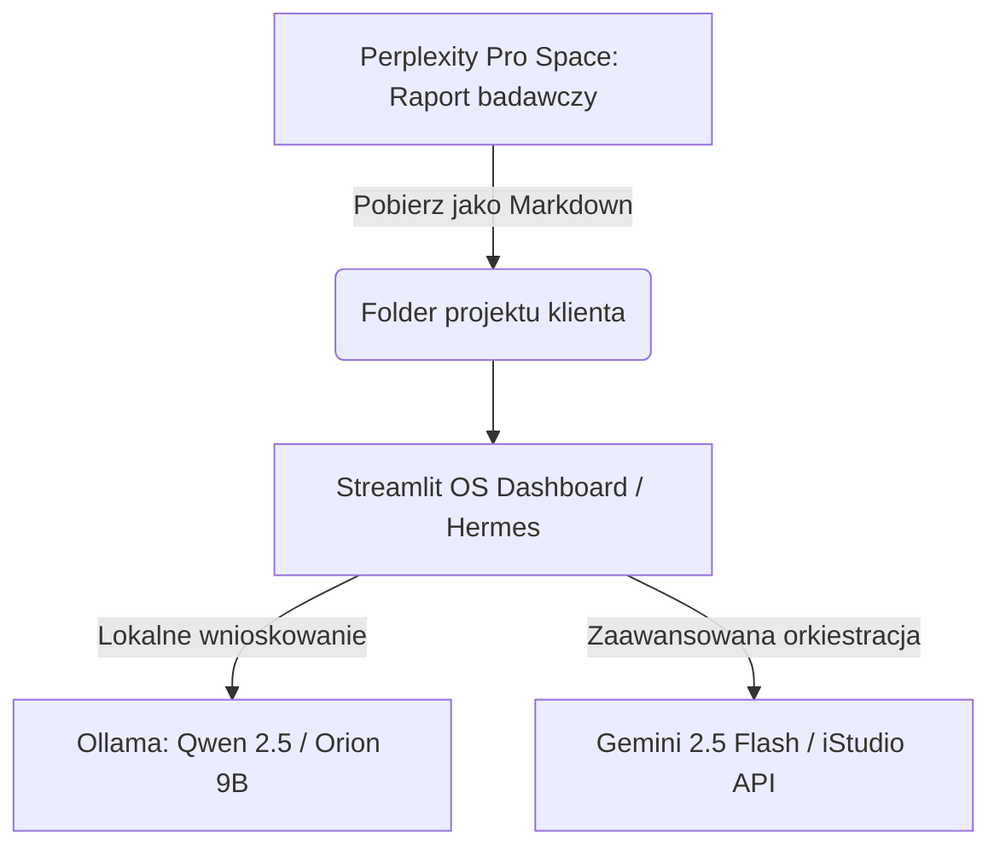

# SOP: Standard Badania Rynku, SEO/AEO i Pain Points (Perplexity Pro)
### Rola odpowiedzialna: CEO AI / Administrator OS
### Status: AKTYWNY (Złoty Standard Onboardingu)

---

## 🧠 1. Cel i Filozofia (Low-Cost & High-Insight First)

Zanim zaangażujemy płatne tokeny modelów komercyjnych (Gemini 1.5 Pro, Vertex AI, GPT-4o) w środowisku Anti-Gravity, **każdy nowy projekt kliencki lub własny musi przejść przez fazę darmowego i głębokiego researchu w Perplexity Pro.**

Używamy dedykowanej przestrzeni **Perplexity Pro Space** z wdrożonymi skillami, aby w 5 minut pozyskać głęboki profil rynku, zmapować psychologiczne bóle klientów (NLP) oraz zaprojektować cenniki i pozycjonowanie AEO/SEO.

---

## 📋 2. Krok po Kroku: Procedura Startowa Projektu

### Krok 1: Wstępna Diagnostyka (Ankieta)
Przejdź z klientem przez kwestionariusz **[Audit_21_Pytan.md](file:///C:/Aplikacje%20MVP/Holistic%20Jason/01-jaison-core/admin/Audit_21_Pytan.md)**. Zapisz odpowiedzi w jednym pliku tekstowym (np. `brief-klienta.md`).

### Krok 2: Tworzenie dedykowanej Przestrzeni (Space) w Perplexity Pro
1. Załóż nową przestrzeń w Perplexity i nazwij ją nazwą projektu (np. `Jaison - [Nazwa Klienta]`).
2. Wgraj do Przestrzeni następujące pliki:
   - Przygotowany `brief-klienta.md`.
   - Plik **[Ghost v2 - Głos Marki Tomasz.md](file:///C:/Aplikacje%20MVP/Holistic%20Jason/01-jaison-core/ghost/Ghost%20v2%20-%20Głos%20Marki%20Tomasz.md)** (lub głos marki klienta, jeśli ma swój).
   - Istniejące materiały ofertowe klienta.

### Krok 3: Konfiguracja Promptów Startowych (Skilli)
Wgraj jako Prompty Startowe 3 zunifikowane pliki ze ścieżki:
📁 `C:\Aplikacje MVP\Holistic Jason\01-jaison-core\skills_for_upload\`
- `skanuj-rynek.md`
- `gleboki-research-person.md`
- `zaprojektuj-cennik.md`

### Krok 4: Wyzwolenie Badań (Sekwencja Jednego Kliknięcia)
1.  Kliknij **`[skanuj-rynek]`**: Wyciągnij konkurencję, trendy, palące pain points i pomysły na infoprodukty do folderu `11_digital_product`.
2.  Kliknij **`[gleboki-research-person]`**: Zbierz surowy język klienta (Voice of Customer) i wygeneruj perswazyjne nagłówki NLP VAK.
3.  Kliknij **`[zaprojektuj-cennik]`**: Zaprojektuj stawkę godzinową oraz gotowe pakiety wdrożeniowe No-Code/AI.

---

## 💻 3. Integracja z Anti-Gravity OS i Lokalnymi Modelami LLM

Aby spiąć darmowy research z Perplexity z naszą automatyzacją i Streamlit Dashboardem:

### A. Środowisko sprzętowe (Laptop z 32GB RAM / SSD / GeForce)
Twój laptop posiada mocniejszy procesor i 32GB RAM, co czyni go **idealną stacją dla lokalnego AI (Local Edge Agent).** 
- **Rekomendacja modelu:** Skwantyzowany model **Qwen 2.5 7B/14B** lub **Orion 1.0 9B** w wersji GGUF (Q4_K_M lub Q8_0).
- **Narzędzie uruchomieniowe:** **Ollama** lub **LM Studio** działające jako lokalny serwer API na porcie `12345` lub `11434`.

### B. Potok Danych (Data Pipeline)

### C. Podłączenie Perplexity pod API (Opcja Hybrydowa)
Jeśli zechcesz zautomatyzować ten proces całkowicie z poziomu kodu Streamlit Dashboard bez ręcznego przeklejania:
1.  Możemy podpiąć pod dashboard **Perplexity API** (wykorzystujące modele serii `sonar` z pay-as-you-go). Koszt to ok. $5-$10 miesięcznie za zapytania deweloperskie.
2.  Lokalny agent w Streamlit automatycznie wyśle zapytanie o wyszukiwanie trendów, a następnie przekaże wyniki do lokalnego modelu **Orion 9B** na Twoim laptopie do ustrukturyzowania (np. zapisania jako JSON do bazy CRM).
3.  **Hermes Browser Extension:** W przypadku stron zabezpieczonych Cloudflare, lokalne rozszerzenie przeglądarki Hermes pobiera surowy HTML, omija blokady, i przekazuje go do lokalnej bazy wiedzy.
