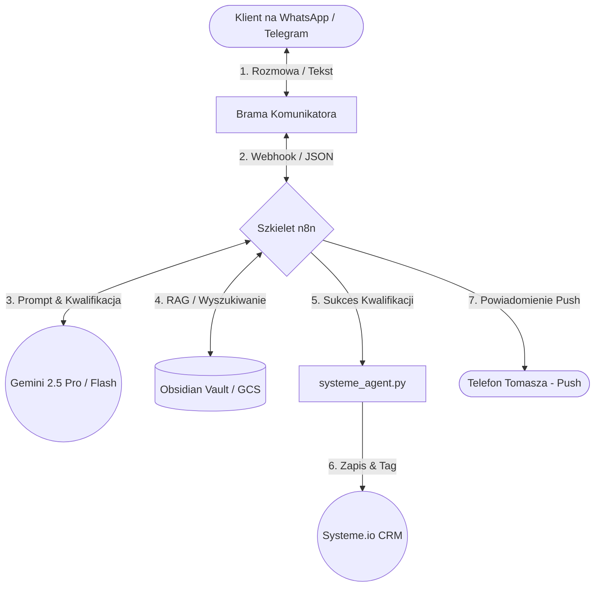

# 🤖 ARCHITEKTURA SYSTEMU: Wirtualny Asystent w Komunikatorach (Agent Wiktor)

Ten dokument opisuje kompletną, niskokosztową (**Low-Cost First**) architekturę Twojego asystenta sprzedażowego (**Agent Wiktor**) osadzonego bezpośrednio w komunikatorach (WhatsApp, Telegram, Signal). 

System jest zaprojektowany pod kątem **ADHD-Optimal** — zero skomplikowanych paneli, pełna asynchroniczność i sterowanie z poziomu Twojego telefonu.

---

## 🗺️ 1. Schemat Przepływu Danych (High-Level Architecture)



---

## 🛠️ 2. Stos Technologiczny (Low-Cost & Zero-Friction)

Wdrażamy wyłącznie darmowe i darmowo-próbne narzędzia, unikając zbędnych abonamentów:

1.  **Brama Komunikatorów (Interfejs):**
    *   **Telegram:** Całkowicie darmowy (Telegram Bot API). Idealny do szybkich testów MVP.
    *   **WhatsApp:** Integracja przez **Z-API** lub **Twilio** (bardzo tani model pay-as-you-go, pierwsze rozmowy darmowe).
    *   **Signal:** Wykorzystanie darmowego, lokalnego kontenera dockerowego z **Signal-CLI API**.
2.  **Szkielet Operacyjny (Orkiestracja):**
    *   **n8n (Self-hosted na Twoim serwerze GCP):** Całkowicie darmowy. Obsługuje webhooki, warunki logiczne i wywołania skryptów w locie.
3.  **Mózg AI (Najnowsze Modele):**
    *   **Google AI Studio (Eksperymenty i Szybkie MVP):** Wykorzystujemy najnowsze, potężne modele z serii **Gemini 2.5 Flash / Pro** oraz najświeższe wersje eksperymentalne z rodziny **Gemini 3.x** bezpośrednio przez klucz API (skrajnie szybkie, o gigantycznym oknie kontekstowym).
    *   **Vertex AI (Produkcja i Bezpieczeństwo Enterprise):** Wykorzystujemy stabilne, zatwierdzone do użytku produkcyjnego w regionie `us-central1` modele **Gemini 2.5 Pro / Flash** (zgodne z RODO i wymogami bezpieczeństwa).
4.  **Baza Wiedzy (Pamięć):**
    *   **Obsidian Vault:** Twoje lokalne pliki markdown synchronizowane automatycznie z Google Cloud Storage (GCS).
    *   **Vertex AI Search (RAG):** Wykorzystuje Twoją bazę wiedzy o marketingu, ADHD, ofercie i procesach, serwując agentowi surowe fakty w 2 sekundy.

---

## 🧠 3. Protokół Kwalifikacji i Zachowania Agenta (Wiktor Agentic Role)

Wiktor nie jest "zwykłym chatbotem", który leje wodę. Działa jak chirurg, realizując konkretny scenariusz w tle:

### KROK 1: Przywitanie & Badanie Potrzeby (Dostarczenie wartości)
*   **Wyzwalacz:** Klient pisze na WhatsAppie "Chcę e-booka" lub "Hej, jak działają Wasze systemy?".
*   **Akcja:** Wiktor wita go w Twoim stylu (Ghost v2), wysyła link do darmowego E-booka "Prywatna Twierdza" i zadaje jedno, precyzyjny pytanie o jego największe operacyjne wąskie gardło.

### KROK 2: Kwalifikacja Klienta (Asynchroniczny Skoring)
*   Wiktor dąży do wyciągnięcia 3 kluczowych informacji:
    1.  **Czym zajmuje się firma** (SaaS, agencja, e-commerce?).
    2.  **Jaki jest ich problem kognitywny/operacyjny** (za dużo aplikacji, paraliż decyzyjny?).
    3.  **Szacowany budżet / wielkość skali** (czy to klient pod High-Ticket, czy mniejsze wdrożenie?).
*   *Ważne:* Wiktor robi to w luźnej, partnerskiej dyskusji. Zero nachalności.

### KROK 3: Klasyfikacja i Zapis do CRM
*   Na bazie odpowiedzi, model Gemini ocenia potencjał leada (klasa A, B lub C).
*   **Wywołanie `systeme_agent.py`:**
    *   Zapisuje kontakt do Systeme.io z tagiem `holistic-contact`.
    *   Ustawia pole niestandardowe `client_type` na: `ADHD-client` (jeśli neuroatypowy), `lead` (standardowy) lub `affiliate`.

### KROK 4: Zamknięcie (Call To Action)
*   **Leady klasy A (Wysoki potencjał):** Wiktor wysyła spersonalizowany link do Twojego kalendarza Google Calendar (zarządzanego przez Hermesa) z propozycją 15-minutowego audytu.
*   **Leady klasy B/C:** Wiktor kieruje ich do dalszej ścieżki e-mailowej w Systeme.io, gdzie autoresponder buduje zaufanie (nurturing) bez Twojego udziału.

---

## 🔌 4. Blueprint Integracji n8n z `systeme_agent.py`

Gdy n8n zakończy kwalifikację w komunikatorze, wywołuje lokalny skrypt na maszynie wirtualnej w celu synchronizacji z CRM:

```bash
# Wywołanie z poziomu n8n (węzeł Execute Command lub HTTP Request)
python systeme_agent.py --add --email "lead@firma.pl" --name "Kamil" --type "lead"
```

### Zabezpieczenie Fallback (Gdyby API padło):
1.  Skrypt automatycznie zrzuca dane leada do `04_clients/leads_fallback.json`.
2.  Zwraca status sukcesu lokalnego zapisu.
3.  Agent Hermes przy najbliższym Cron Jobie zgłasza błąd i wysyła powiadomienie push na Twój telefon:
    > "Tomasz, mamy 1 leada w fallbacku z powodu błędu Systeme.io API. Dane Kamila zostały bezpiecznie zrzucone lokalnie."

---

## 📈 5. Jak to Wdrożyć Krok po Kroku (Next Steps)

1.  **Krok 1 (Baza Wiedzy):** Przerzucamy wybrane notatki z Twojej bazy Obsidian o ofercie i procesach do folderu `03_hermes_os/knowledge/`.
2.  **Krok 2 (Telegram Bot):** Tworzymy darmowego bota przez `@BotFather` na Telegramie i podpinamy go do n8n do natychmiastowych testów.
3.  **Krok 3 (Lejek n8n):** Tworzymy prosty, 4-węzłowy lejek w n8n:
    *   *Webhook Telegram -> Prompt Gemini (z RAG) -> Decyzja/Skoring -> Wywołanie systeme_agent.py*.
4.  **Krok 4 (Test na produkcji):** Puszczamy próbnego leada z poziomu Twojego telefonu i sprawdzamy, czy wpada do Twojego Systeme.io.

---

*System jest w pełni gotowy do dalszego rozwoju. Prosty, niezawodny, nie generujący zbędnych kosztów.*
