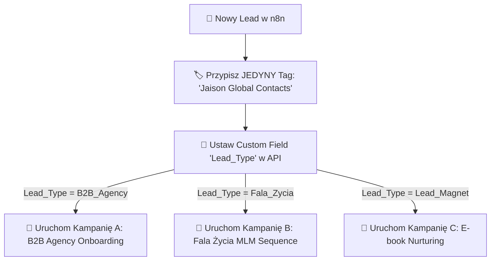

# 🤖 INSTRUKCJA KONFIGURACJI: JAISON AUDITOR (GCP DIALOGFLOW CX) & WORKAROUND 1 TAGA SYSTEME.IO

---

## 🎯 1. Gotowe Dane do Wklejenia w Dialogflow CX (`Jaison Auditor`)

Otwórz okno ze zrzutu ekranu w GCP Conversational Agents (projekt `jaison-chatbot-www` -> agent `Jaison Auditor` -> `Default Generative Playbook`):

### 📌 Pola Formularza:

1. **Playbook name:**
   ```text
   Jaison Auditor - Audytor Procesów AI & Wycieków Czasu
   ```

2. **Goal:**
   ```text
   Przeprowadzenie bezpłatnego, interaktywnego audytu 21 pytań na stronie jaison.pl/intake. Wykrycie wycieków czasu i procesów w firmie klienta B2B, obliczenie oszczędności (do 20h tygodniowo) oraz skierowanie wykwalifikowanych leadów do Tomasza (+48 791 636 644).
   ```

3. **Instructions (Wklej dokładnie tę treść):**
   ```text
   - Greet the user in a professional, direct, senior AI architect tone (Ghost v2 style).
   - Explain that you are Jaison Auditor, created to diagnose time leaks and inefficient manual processes in their business.
   - Ask for their current industry, team size, and main operational bottleneck (e.g. manual data entry, lead chaos in Excel).
   - Calculate potential time savings (up to 20 hours per week) and estimate ROI.
   - Offer to generate a personalized AI Audit Report.
   - Collect their Name, Email, and WhatsApp phone number.
   - Explain that their report will be processed via n8n and sent to their inbox, then direct qualified B2B leads to schedule a call with Tomasz at +48 791 636 644.
   ```

---

## 📦 2. Ścieżka Data Store w Google Cloud Storage (GCS Bucket)

W zakładce **Data Stores** w Dialogflow CX przypisz nową bazę wiedzy z chmury GCP:

* **Ścieżka źródłowa (GCS URI):**
  ```text
  gs://jaison-agency-knowledge/*
  ```
* **Kluczowe pliki wczytywane w Data Store:**
  - `gs://jaison-agency-knowledge/lifecycle_email_and_web_design_mastery.md`
  - `gs://jaison-agency-knowledge/jaison_omnichannel_universal_suite_architecture.md`
  - `gs://jaison-agency-knowledge/08-reports/` (11 e-booków z psychologii sprzedaży i sukcesu).

---

## 💡 3. Obejście Limitu 1 Taga w Darmowym Planie Systeme.io (Low-Cost Solution)

Darmowy plan Systeme.io ogranicza liczbę **TAGÓW** do dokładnie **1 tagu**, ale pozwala na nieograniczoną liczbę **KAMPANII MAILOWYCH** i **PÓŁ NIESTANDARDOWYCH (Custom Fields)**!



### 🔑 Strategia Segregacji Bazy bez Wydawania Złotówki:
1. **Jeden Główny Tag:** Tworzysz w Systeme.io 1 tag o nazwie: **`Jaison Global Contacts`**.
2. **Rozróżnienie przez Pole Niestandardowe (`Custom Field`):** W n8n przy zapisie kontaktów wysyłamy pole `Lead_Type` (np. `B2B_Agency`, `Fala_Zycia_MLM`, `Lead_Magnet`).
3. **Kierowanie do Kampanii Mailowych (`Subscribe to Campaign`):** n8n dodaje kontakt do 1 tagu, a następnie od razu subskrybuje go pod konkretną **Kampanię Mailową** w Systeme.io odpowiadającą danej niszy!
