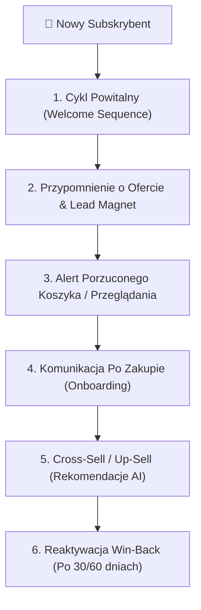

# 🎨 MASTER CLASS: LIFECYCLE EMAIL MARKETING, HIGH-CONVERTING WEB & IMPECCABLE STYLE (JAISON OS)

Ten dokument stanowi kanoniczny skonsolidowany podgląd wiedzy dla naszych agentów (**CMO AI, CCO AI, CPO AI & CTO AI**) połączony z 3 kluczowych źródeł:
1. **GetResponse E-Book (68 stron):** *Lifecycle Automation dla E-Commerce i B2B*.
2. **Checklista Strony WWW (Jan Szopa / Simon Szymczak):** *High-Converting Landing Pages & UX/UI*.
3. **Impeccable.style Standard:** *Kodowanie bez długu technologicznego, testowanie UI/UX i visual anchoring*.

---

## 📩 1. Lifecycle Email Automation (GetResponse Framework)

Przekształcamy zwykły mailing w **spójny system automatyzacji cyklu życia klienta**:

### 🔑 6 Obowiązkowych Sekwencji Mailowych w Systeme.io & n8n:
1. **Cykl Powitalny (Welcome Sequence - 3 Maile):**
   - *Mail 1 (Natychmiast):* Dostarczenie obiecanego leda/e-booka + mocny, osobisty hook Ghost v2.
   - *Mail 2 (24h później):* Historia zdemaskowania patologii agencji/MLM (metodologia Robin Hooda).
   - *Mail 3 (48h później):* Zaproszenie do pierwszej akcji (audyt B2B na `jaison.pl` lub społeczność WhatsApp `x2o.jaison.pl`).
2. **Przypomnienie o Ofercie:** Edukacja o wartości, przełamywanie obiekcji (cena, czas, RODO).
3. **Porzucone Przeglądanie / Koszyk:** Delikatny impuls z wyjaśnieniem dlaczego warto podjąć akcję teraz.
4. **Onboarding po zakupie:** Łopatologiczna instrukcja wdrożenia i budowanie zaufania.
5. **Cross-Sell / Up-Sell:** Rekomendacje powiązanych rozwiązań w odpowiednim momencie.
6. **Reaktywacja Win-Back:** Specjalna oferta wyzwalająca aktywność u uśpionych subskrybentów.

---

## 💻 2. High-Converting Web Design (Wytyczne Landing Page & UX/UI)

### 📋 Checklista Konwersji Strony i Landing Page:
- [x] **Audyt Wydajności:** Zoptymalizowany czas ładowania (GTmetrix/PageSpeed > 90/100).
- [x] **Skupienie na Problemie Klienta:** 80% treści mówi o bólach i rezultacie klienta, a nie o firmie.
- [x] **Wyraźna Hierarchia Nagłówków (H1, H2, H3):** Zero ścin tekstu — nagłówki przyciągające uwagę w 3 sekundy.
- [x] **Otoczenie Przycisków CTA Wyjaśnieniem Wartości:** Pod każdym przyciskiem akcji znajduje się wyjaśnienie *"Dlaczego warto kliknąć teraz"* oraz gwarancja bezpieczeństwa (np. *"Bezpłatnie, 0 PLN, RODO safe"*).
- [x] **Formularz Zapisu z Niskim Tarciem (Low-Friction):** Maksymalnie 2-3 pola (Imię + Email/WhatsApp).

---

## 🎨 3. Impeccable Style Code & UI Standards (`impeccable.style`)

### ⚡ Zasady Pisania Kodu i Projektowania UI w Jaison OS:
1. **Visual Anchoring (ADHD-Optimal):** Wykorzystanie neonowych akcentów, wyrazistych kontrastów i kart Bento Grid.
2. **Brak Długu Technologicznego:** Pisanie czystego, semantycznego kodu HTML/CSS/JS bez ciężkich frameworków tam, gdzie wystarczy Vanilla.
3. **Zero Maskowania Błędów:** Każdy komponent UI jest przetestowany i odporny na brak danych (fallbacki i czyste komunikaty błędów).
