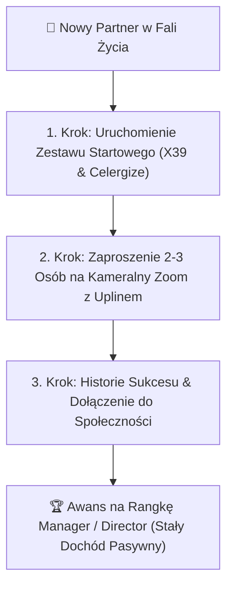

# 🌿 STRATEGIA FALA ŻYCIA: PLAN KOMPENSACYJNY LIFEWAVE, PODZIAŁ ZADAŃ & SMART ROUTING LLM

Dokument definiuje architekturę biznesową dla projektu **Fala Życia (MLM LifeWave)**, podział ról między stacjonarnym PC a laptopem oraz dobór modeli LLM dla Mentora Biohackera.

---

## 💰 1. Łopatologiczny Plan Wynagrodzeń LifeWave (Cele dla Podopiecznych)

Skomplikowany plan kompensacyjny LifeWave przeliczamy na prostą, mierzalną metodologię 3 kroków:



### 🔑 Główne Zasadnicze Wskazówki Mentora AI:
- **Zero Przebodźcowania Regulaminami:** Mentor nie zalewa podopiecznego wykresami prowizji.
- **Konkretne Zadanie Tygodnia:** "Zróbmy 2 krótkie rozmowy na Zoomie z 2 znajomymi zainteresowanymi regeneracją organizmu i energią."

---

## 💻 2. Podział Ról: PC Stacjonarny vs Laptop (`jaisonmlm.os`)

```text
🖥️ STACJONARNY PC (Tutaj ze mną):
 ├── Finalizacja Agencji Jaison (jaison.pl)
 ├── Konfiguracja Discorda i Bota Jaison OS Bot
 ├── Przygotowanie Produkcyjnego Deployu na GCP VM (os.jaison.pl)
 └── Git Sync (Wypychanie najnowszego kodu do repozytorium GitHub)

💻 LAPTOP (Subagent jaisonmlm.os w trybie /goal):
 ├── Kliknięcie '1-KLIK_POBIERZ_Z_GITHUB.bat' (Dociągnięcie paszportów wiedzy)
 ├── Głębokie rozpracowanie materiałów z Backoffice LifeWave (02_CLIENTS_AND_PROJECTS/lifewave)
 ├── Generowanie sekwencji mailowych i postów dla Fali Życia
 └── Wdrożenie Mentora Biohackera na kanał #falazycia-biohacker
```

---

## 🧠 3. Smart Routing Modelów LLM dla Mentora Biohackera

Dla osiągnięcia najwyższej retencji i zerowych opóźnień stosujemy hybrydowy routing modeli:

| Warstwa Systemu | Wybrany Model / Silnik | Dlaczego ten model? | Budżet / Koszt |
|---|---|---|---|
| **1. Szybki Czat & Audyt** | **Gemini 2.5 Flash** (GCP Agent Builder) | Natychmiastowa odpowiedź (sub-second), darmowe grounding w GCS Data Store. | $1000 GenAI Credit |
| **2. Głęboki Coaching & Psychologia** | **DeepSeek R1 / V3** (via Together AI) | Najlepsze na świecie rozumowanie perswazyjne, uziemione w naukach Dispenzy i Worre. | Test z budżetu $50-$100 Together AI |
| **3. Masowa Parafraza & SEO Meta** | **Llama 3.3 70B / Qwen 2.5 72B** (Together AI) | Brak generycznego "AI-ish" zwrotu, pełna naturalność języka polskiego. | Ułamki centa za token |
| **4. Wizualizacja Marzeń (Dream Canvas)** | **Imagen 3** (Vertex AI / GCP) | Fotorealistyczne obrazy celów podopiecznego (dom, podróż, zdrowie). | $1000 GenAI Credit |
