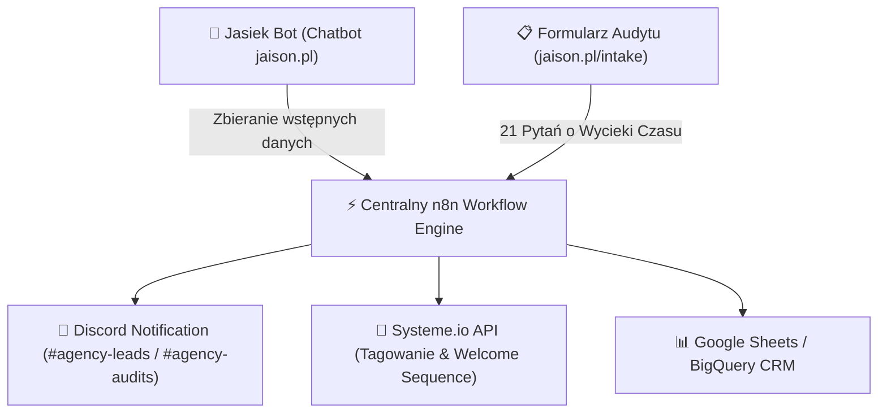

# 🥩 ROAST & AUDIT: INTEGRACJA N8N Z BOTEM JAŚKIEM I FORMULARZEM AUDYTU (`jaison.pl`)

---

## 🥩 1. Roast Audytowy: Co Nie Jest Spięte w 100% w n8n?

> [!WARNING] ZAUWAŻONE LUKI LOGICZNE & BRAKUJĄCE POŁĄCZENIA:
> 1. **Brak Natychmiastowego Powiadomienia na Discordzie (`#agency-leads` & `#agency-audits`):**  
>    Stare przepływy n8n kierowały powiadomienia na e-mail lub Telegram. Teraz, po dodaniu Bota Discorda, n8n **musi natychmiast wysyłać kartę leada z audytu** bezpośrednio na nasz kanał Discord **`#agency-leads`** z przyciskami podglądu wyników!
> 2. **Brak Automatycznej Dystrybucji w Systeme.io (GetResponse Lifecycle):**  
>    Po wypełnieniu formularza audytowego (21 pytań o wycieki czasu), n8n nie przydzielał dynamicznie tagów w Systeme.io (`high-ticket-audited` vs `smb-lead-audited`), przez co klient nie trafiał automatycznie do naszej nowej sekwencji mailowej *Lifecycle Automation*.
> 3. **Brak Przekazywania Pamięci z `Jasiek Bot` do `Jaison Auditor`:**  
>    Jeśli klient rozmawia z Jaśkiem na stronie `jaison.pl`, a potem przejdzie na formularz `jaison.pl/intake`, n8n powinien na podstawie `session_id` wstępnie uzupełnić dane z konwersacji, znosząc tarcie (Low-Friction).

---

## 🛠️ 2. Kompletna Architektura n8n dla Jaśka i Audytora



---

## 🔄 3. Potwierdzenie Strategii Local-First Continuous Deployment

Potwierdzamy w 100% zaproponowany przez Tomasza model wdrażania zmian:

```text
💻 Praca Lokalna (PC / Laptop)
 └── Piszemy i testujemy skrypty w środowisku AntiGravity
      └── Uruchomienie git_sync.ps1 (Commit & Push do main)
           └── ☁️ Maszyna GCP VM (os.jaison.pl) w tle robi git pull
                └── Auto-reload w PM2 bez przerw w działaniu bota 24/7!
```

---

## ⚡ 4. Plan Działań do Wykonania po Deployu:

- [ ] **1. n8n Node Discord Webhook:** Dodanie wtyczki Discord Webhook w n8n wysyłającej karty z audytu leada na `#agency-leads`.
- [ ] **2. Systeme.io Auto-Tagging Node:** Automatyczna rejestracja leada w Systeme.io i przypisanie tagu `high-ticket-audited`.
- [ ] **3. Uruchomienie skryptu PM2 na GCP VM:** Wdrożenie produkcyjne.
