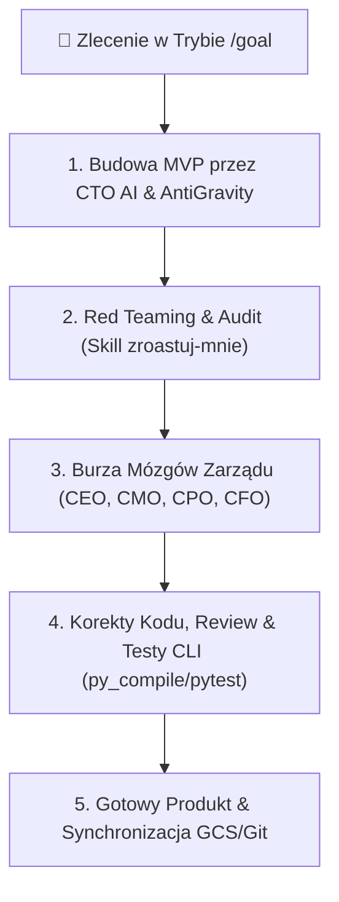

# 🏛️ MASTER SOP: NOWY PROJEKT, TRYB GOAL I PĘTLA WIRTUALNEGO ZARZĄDU (JAISON OS)

Standard Operacyjny dla tworzenia nowych projektów klienckich, aplikacji, lejków niszowych i automatyzacji z wykorzystaniem pełnej autonomii **AntiGravity** i **Wirtualnego Zarządu AI**.

---

## 🗺️ Faza 1: Mapa Myśli & Koncepcja (Mind Mapping & Architecture)

Przed napisaniem jakiegokolwiek kodu, Tomasz i Wirtualny Zarząd AI tworzą **Mapę Myśli (Mind Map)**:
1. **Analiza Niszowa (Skill `gcp-startup-credits-sop` & `cmo`):** Diagnoza bólów klienta, konkurencji oraz celów ROI.
2. **Szkic Struktury (Skill `cpo` & `ui-ux-pro-max`):** Rozpisanie 8 etapów Customer Journey, widoków strony, bazy danych oraz automatyzacji n8n.
3. **Zasada Low-Cost / Low-Friction:** Użycie darmowych kredytów GCP ($300 Trial + $1000 GenAI), Systeme.io i Composio.

---

## 🎯 Faza 2: Uruchomienie i Zlecenie w Trybie `/goal`

Tomasz zleca agentowi zadanie z użyciem slash-command **`/goal`** oraz precyzyjnych wytycznych:

```text
Wywołanie w Chat UI:
/goal "Zbuduj od A do Z nowoczesną aplikację/stronę pod niszę [Nazwa Niszy] wraz z automatyzacją n8n, bazą danych, pełnym testowaniem kodu i zoptymalizowanym copywriterem Ghost v2."
```

---

## 🔄 Faza 3: Autonomiczna Pętla Wirtualnego Zarządu (Refinement Loop)



### 🛠️ 4 Kroki Pętli Jakościowej (Anthropic Agentic Standards):
1. **Szybki Kod MVP (CTO AI):** Tworzenie czystego kodu bez długu technologicznego na podstawie `impeccable.style`.
2. **Red Teaming (Skill `zroastuj-mnie`):** Rygorystyczny krytyk bezlitośnie wytyka luki w UX, błędne parametry API i słabe nagłówki.
3. **Optymalizacja Copywritingu (CMO AI & Ghost v2):** Zastosowanie NLP VAK, uziemionych e-booków sukcesu (GetResponse, Szkoła Sukcesu, Przypomnienia o Ofercie) oraz tagów `<strong>` w HTML.
4. **Weryfikacja CLI & Code Review:** Kompilacja kodu w konsoli i testy przed declared success.

---

## 🕵️‍♂️ Faza 4: Apify Meta Ads Spy (Analiza Konkurencji & Pawła Skaluje)

Zintegrowany moduł szpiegowania reklam Meta Ads w skillu `media-buyer-ads`:
1. **Apify Facebook Ads Scraper:** Przechwytywanie kreacji wideo, nagłówków i lejków konkurencji (np. Pawła Skaluje).
2. **Analiza Skuteczności:** Wyciągnięcie haków reklamowych, struktur landing page i ofert High-Ticket.
3. **Re-Engineered Campaign:** Stworzenie lepszej, bardziej etycznej wersji w duchu Robin Hooda na Systeme.io.

---

## 📚 Faza 5: Baza Wiedzy 11 E-Booków Sukcesu (Uziemienie w GCP Storage)

Wszystkie 11 e-booków z folderu `08-reports/e_booki_wiedza/` zostały zsynchronizowane z chmurą GCP Storage `gs://jaison-agency-knowledge` i zasilają agentów:
- **`Holistic Soul`:** *Czy jesteś psychicznie gotowy na sukces*, *Psychologia osiągnięć*, *Kompas zwycięzcy*, *Sztuka wyznaczania celów*.
- **`CMO AI`:** *Jak prowadzić tani i skuteczny marketing*, *Kurs tworzenia map myśli*.
- **`CEO AI`:** *Zarobić na kryzysie*, *Pociąg do sukcesu*, *Słodycze sukcesu*.
