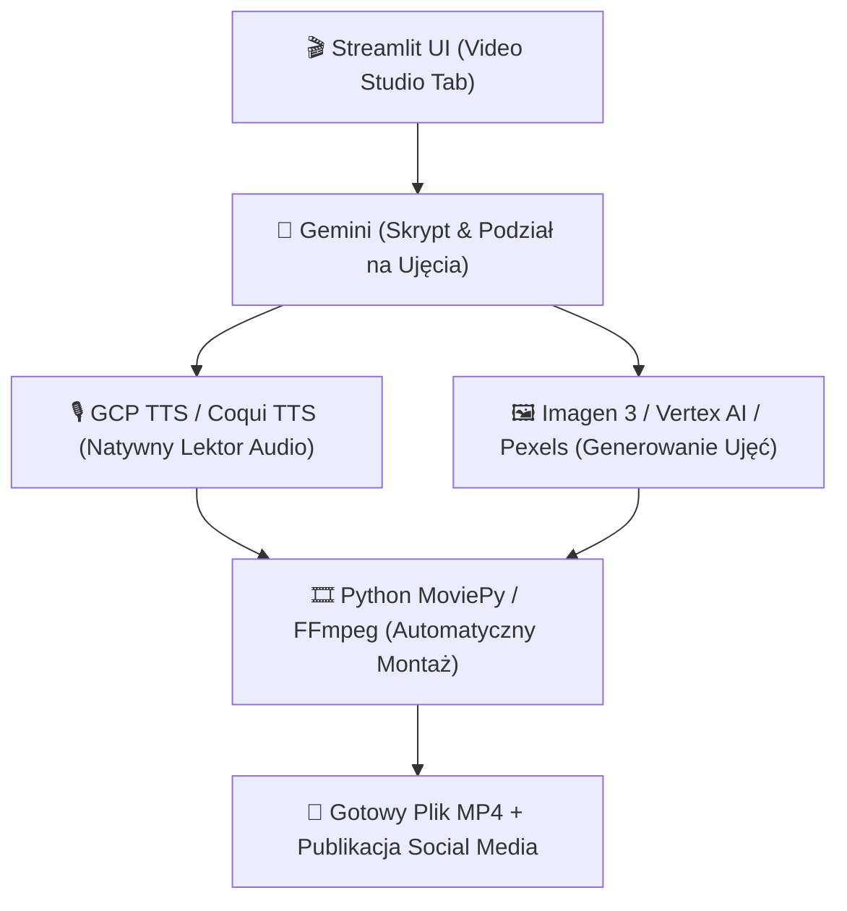

# 🥩 ROAST PROPOZYCJI PERPLEXITY & ARCHITEKTURA SKRZYNEK E-MAIL (JAISON OS)

---

## 🥩 1. Roast Propozycji Perplexity (Video Studio Pipeline)

> [!WARNING] ZAUWAŻONE DZIURY LOGICZNE & PRZEWYMIAROWANIE ARCHITEKTURY:
> 1. **"Dependency Hell" & Przewymiarowanie (Node.js + Python + Docker):**  
>    Perplexity proponuje klonowanie 2 wielkich zewnętrznych repozytoriów (`OpenMontage` + `Open-Generative-AI`), stawianie serwera Node.js (`localhost:3000`), serwera HTTP API (`localhost:8080`), Remotion i HyperFrames. Na systemie Windows doprowadzi to do natychmiastowego błędu środowiskowego i gigantycznego długu technologicznego przy każdej aktualizacji paczek `npm`.
> 2. **Płatne Usługi (Muapi / fal.ai) Zamiast Darmowych Środków GCP ($1300+):**  
>    Zgodnie ze **Złotą Zasadą 5 i 12 (Low Cost First & GCP Credits)**, narzucanie płatnego agregatora Muapi to marnotrawstwo budżetu, podczas gdy mamy darmowe **$1000 GenAI App Builder credit** oraz **$300 GCP Free Trial** do wykorzystania na modele **Imagen 3**, **Gemini Omni Flash** i **Vertex AI Video**!
> 3. **Wymyślanie Koła Od Nowa (Skill `generate-video-reel` Już Istnieje!):**  
>    W naszym workspace posiada już sprawny skill **`generate-video-reel`**:  
>    `Gemini Pro (Skrypt) ➔ GCP TTS / Coqui (Lektor) ➔ Pexels API (Darmowe B-Rolle) ➔ MoviePy/FFmpeg (Natywny montaż Python w Streamlit)`.  
>    Działa w 100% lokalnie z poziomu Pythona, bez potrzeby stawiania 2 osobnych serwerów Node.js!

---

### ⚡ Rekomendowane Proste Wdrożenie Video Studio (Low-Cost / Low-Friction):



---

## 📧 2. Architektura Zarządzania Skrzynkami E-mail (`hello@jaison.pl` & `info@jaison.pl`)

Zgodnie ze **Złotą Zasadą 14 & 15 (Poczta Firmowa & Composio MCP)**:

```mermaid
graph TD
    subgraph ✉️ SKRZYNKI E-MAIL JAISON.PL
        M1["hello@jaison.pl (Biznes / Kontakt)"]
        M2["info@jaison.pl (RODO / Administracja / Newsletter)"]
    end

    subgraph 🔌 HUB COMPOSIO MCP & N8N
        C["Centralny Hub Composio (OAuth2 Gmail / Workspace)"]
        N8N["n8n Automated Workflow (Jaison Auditor Intake)"]
    end

    subgraph 🖥️ INTERFEJS ZARZĄDZANIA
        DASH["💻 Streamlit Dashboard (Zakładka Skrzynka E-mail)"]
        DISC["💬 Discord Channel (#agency-leads)"]
    end

    M1 & M2 <--> C <--> DASH & DISC
    N8N --> M1
```

### 📋 Szablon Profesjonalnej Stopki HTML z Banerem & Audytem:

```html
<div style="font-family: Arial, sans-serif; color: #1e293b; line-height: 1.6; border-left: 4px solid #6366f1; padding-left: 16px; margin-top: 24px;">
    <p style="margin: 0; font-weight: bold; font-size: 16px; color: #0f172a;">Tomasz Duda</p>
    <p style="margin: 0; font-size: 14px; color: #64748b;">CEO & Starszy Architekt Systemów AI | Jaison.pl</p>
    <p style="margin: 4px 0 12px 0; font-size: 13px; color: #475569;">
        📧 <a href="mailto:hello@jaison.pl" style="color: #6366f1; text-decoration: none;">hello@jaison.pl</a> | 
        🌐 <a href="https://jaison.pl" style="color: #6366f1; text-decoration: none;">jaison.pl</a> | 
        📞 +48 791 636 644
    </p>
    
    <div style="background: linear-gradient(135deg, #0f172a 0%, #1e1b4b 100%); padding: 12px 16px; border-radius: 8px; color: #ffffff; margin-top: 12px;">
        <p style="margin: 0 0 6px 0; font-size: 13px; font-weight: bold; color: #38bdf8;">
            🚀 Odzyskaj do 20 godzin tygodniowo dzięki suwerennym agentom AI
        </p>
        <p style="margin: 0; font-size: 12px; color: #cbd5e1;">
            Wykonaj bezpłatny, 3-minutowy audyt procesów w Twojej firmie:
        </p>
        <a href="https://jaison.pl/intake" style="display: inline-block; margin-top: 8px; background: #6366f1; color: #ffffff; padding: 6px 14px; border-radius: 6px; text-decoration: none; font-size: 12px; font-weight: bold;">
            👉 Rozpocznij Darmowy Audyt AI (Jaison Auditor)
        </a>
    </div>
</div>
```

---

## 🚀 3. Następny Krok Wdrożeniowy:

1. **Podpięcie OAuth Gmail w Composio.dev:** Połączenie kont `hello@jaison.pl` i `info@jaison.pl`.
2. **Dodanie Zakładki Skrzynka Poczty w Dashboardzie:** Prosty podgląd wiadomości i wysyłka maili z poziomu Streamlita.
3. **Popołudniowy Deploy na GCP VM (`os.jaison.pl`):** Uruchomienie kontenera z `discord_bot.py`.
