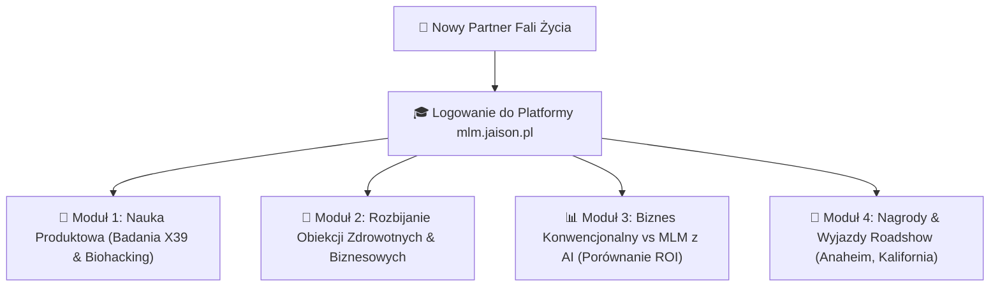

# 🏛️ RAPORT ZWOŁANIA WIRTUALNEGO ZARZĄDU (ROAST & ARCHITEKTURA MLM)

Dokument podsumowuje werdykt Wirtualnego Zarządu AI (CEO, CMO, CPO, CFO, CTO) w sprawie jedności Dashboardu, platformy szkoleniowej `mlm.jaison.pl` oraz strategii konwersji partnerów Fali Życia.

---

## 🥩 1. Roast Wirtualnego Zarządu: 1 Dashboard vs 2 Osobne Dashboardy

> [!WARNING] WERDYKT ZARZĄDU: ZAKAZ TWORZENIA DRUGIEGO DASHBOARDU!
> - **Dziura Architektoniczna:** Tworzenie osobnej aplikacji/dashboardu dla Fali Życia to duplikacja kodu, podwójne koszty utrzymania i zbędne tarcie (Low-Friction Rule).
> - **Rozwiązanie Złotego Standardu:** **JEDEN CENTRALNY STREAMLIT DASHBOARD** z górnym przełącznikiem kontekstu:
>   `[ 🌐 Agencja Jaison B2B  |  🌿 Fala Życia MLM  |  🛠️ Projekty Klienckie ]`
> - Przełączenie profilu dynamicznie dostosowuje wszystkie zakładki (baza leada, generator postów, statystyki i integracje social media z Composio)!

---

## 🎬 2. Platforma Szkoleniowa & Streamingowa `mlm.jaison.pl`

Każdy nowy członek Fali Życia otrzymuje natychmiastowy darmowy dostęp do platformy szkoleniowej na `mlm.jaison.pl`:

### 🥊 Moduł 3: Porównanie Biznesu Konwencjonalnego vs MLM z Jaison OS:

| Kryterium | Konwencjonalny Biznes (Sklep/Usługi) | Fala Życia MLM + Jaison OS |
|---|---|---|
| **Ryzyko Finansowe** | Bardzo Wysokie (Kredyty, lokale, zatowarowanie) | **Zero Ryzyka** (Brak kosztów stałych) |
| **Próg Wejścia** | 50 000 PLN - 200 000 PLN | **Niski Próg** (Zestaw Startowy X39) |
| **Poziom Stresu** | Gigantyczny (Zarządzanie pracownikami, ZUS, podatki) | **Niski** (Autonomiczni agenci AI 24/7) |
| **Wsparcie i Nagrody** | Samotność w biznesie | **Wsparcie Zarządu, Wyjazdy VIP (Anaheim)** |

---

## 🔌 3. Integracja Social Media przez Composio MCP

1. **Agenci Autonomiczni (CMO AI & Trend Finder):**  
   Przeszukują grupy Facebookowe, rolki TikTok/Instagram i Reddit pod kątem najczęstszych bólów zdrowotnych (zmęczenie, ból, brak energii).
2. **Auto-Generator Postów & Odpowiedzi (ManyChat Killer):**  
   Agent generuje posta rozbijającego obiekcje i wrzuca wideo przez Composio MCP z linkiem do bezpłatnego audytu na `mlm.jaison.pl`!
