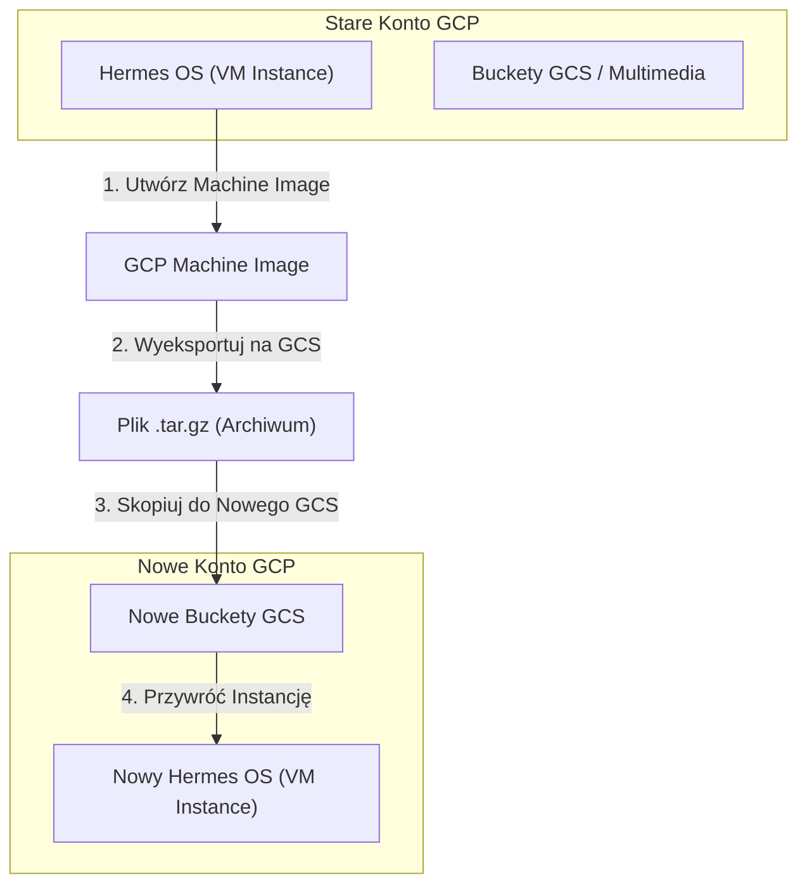

# ☁️ STRATEGIA I SOP: Migracja GCP & Zarządzanie Budżetem $300 (J(AI)SON OS v2.0)

Ten dokument definiuje pancerne, niskokosztowe standardy operacyjne (SOP) przenoszenia instancji i zasobów systemu J(AI)SON OS pomiędzy kontami Google Cloud Platform (GCP). Zapobiega to przerwom w działaniu systemów w przypadku wyczerpania darmowych kredytów trialowych ($300 USD / 1200+ PLN).

---

## 🎯 CEL STRATEGICZNY: Maksymalizacja "Free-Trial" (0 zł za chmurę)
Google oferuje darmowe $300 USD (ok. 1200 PLN) na start dla każdego nowego konta GCP. Aby Twoje systemy (Hermes OS, Bazy danych, Buckety) działały bezkosztowo, co kilka miesięcy (lub przy wyczerpaniu środków) będziemy klonować infrastrukturę na świeże konto GCP.



---

## 📋 ROZDZIAŁ 1: Klonowanie i Przenoszenie Maszyny Hermes OS (`hermes-os` VM)

Gdy na starym koncie kończą się środki, Twoja instancja wirtualna `hermes-os` (gdzie stoi Telegram Bot, PM2, integracje) musi zostać przeniesiona. Robimy to za pomocą **Obrazów Maszyn (Machine Images)**.

### 🛑 KROK 1: Przygotowanie i Zamrożenie Maszyny (Stare Konto)
Przed zrobieniem obrazu, zaleca się zatrzymanie instancji, aby baza danych i stan plików były spójne.
1.  Przejdź do konsoli GCP -> **Compute Engine -> VM Instances**.
2.  Zaznacz `hermes-os` i kliknij **STOP**.

### 📸 KROK 2: Tworzenie Obrazu Maszyny (Machine Image)
Machine Image zapisuje kompletny stan dysków, konfiguracji sieciowej i metadanych instancji.
1.  W menu po lewej wybierz **Compute Engine -> Machine Images**.
2.  Kliknij **CREATE MACHINE IMAGE**.
3.  **Source VM instance:** Wybierz `hermes-os`.
4.  **Name:** `hermes-os-backup-v2-0`
5.  **Location:** Wybierz Regional (np. `us-central1` lub `europe-west3` - tam gdzie masz darmowe limity).
6.  Kliknij **CREATE**.

### 📦 KROK 3: Wyeksportowanie Obrazu i Kopiowanie (Między Kontami)
Wersja najprostsza ("Low-Friction") bez skomplikowanego udostępniania IAM:
1.  Stwórz tymczasowy kubełek w Google Cloud Storage na starym koncie: `gs://hermes-migration-temp`.
2.  Zmień Machine Image w plik wirtualnego dysku `.tar.gz` i zapisz go w tym kubełku.
3.  Z poziomu nowego konta nadaj dostęp do odczytu tego kubełka lub po prostu pobierz plik i wgraj do nowego GCS.

### ⚡ KROK 4: Odtwarzanie Maszyny (Nowe Konto)
1.  Na nowym koncie GCP przejdź do **Compute Engine -> Images**.
2.  Kliknij **CREATE IMAGE** i jako źródło (Source) wskaż plik `.tar.gz` z Twojego nowego bucketu GCS.
3.  Gdy obraz zostanie utworzony, przejdź do **Compute Engine -> VM Instances**.
4.  Kliknij **CREATE INSTANCE**, w sekcji **Boot Disk** kliknij **CHANGE**, przejdź do zakładki **CUSTOM IMAGES** i wybierz swój utworzony obraz!
5.  Kliknij **CREATE**. 

> [!TIP]
> Twoja nowa maszyna wstaje ze wszystkimi zainstalowanymi programami, bazami, konfiguracjami, a nawet sesją PM2! Zero ponownego instalowania Node.js czy Pythona!

---

## 🪣 ROZDZIAŁ 2: Klonowanie Kubełków Google Cloud Storage (GCS)

Jeśli przechowujesz nagrania głosowe, wideo b-roll lub dane historyczne w bucketach (np. `gs://jaison-multimedia`), przeniesiesz je w jedną sekundę za pomocą darmowego narzędzia konsolowego **gcloud storage**.

### 💻 Instrukcja migracji danych między kubełkami:
Zaloguj się w terminalu laptopa i wpisz jedno proste polecenie:

```powershell
# 1. Zaloguj się na nowe konto GCP
gcloud auth login

# 2. Skopiuj wszystkie pliki bezpośrednio ze starego kubełka do nowego
gcloud storage cp --recursive gs://stary-bucket-klienta/* gs://nowy-bucket-klienta/
```
*To polecenie przesyła pliki bezpośrednio między serwerami Google z prędkością gigabitów na sekundę – nie obciąża to Twojego domowego internetu!*

---

## 🚨 ROZDZIAŁ 3: Jak kontrolować zużycie środków, by uniknąć opłat?

Aby GCP nigdy nie naliczyło opłat na Twojej karcie kredytowej po wygaśnięciu darmowych $300, wdróż te **dwie pancerne zasady**:

### 🛡️ Zasada 1: Budżety i Alerty (Zawsze na 100%)
Przy zakładaniu każdego nowego konta GCP, natychmiast ustaw powiadomienia e-mail:
1.  Przejdź do: **Billing -> Budgets & Alerts**.
2.  Kliknij **CREATE BUDGET**.
3.  Ustaw kwotę na wartość darmowych kredytów (np. 1200 PLN) lub małą kwotę bezpieczną (np. 50 PLN).
4.  Ustaw progi alertów na **50%**, **90%** i **100%**. Gdy zużycie osiągnie próg, otrzymasz natychmiast alarm e-mail na adres `hello@jaison.pl`.

### 🛡️ Zasada 2: Wyłączenie Automatycznego Przejścia na Płatne Konto
*   Google Cloud na koncie Free Trial **nigdy nie naliczy opłat automatycznie**. 
*   Po wyczerpaniu $300 lub po 90 dniach usługi zostaną po prostu zamrożone (zapauzowane), dopóki sam nie klikniesz przycisku "Upgrade" (przejście na konto płatne).
*   **KATEGORYCZNIE ZABRANIA SIĘ klikania przycisku "UPGRADE"** na kontach testowych. Zamiast tego wdrażamy powyższą procedurę klonowania na świeże konto!

---

## 📝 ROZDZIAŁ 4: Szybkie odtworzenie uprawnień w n8n

Po migracji na nowe konto GCP:
1.  Generujesz nowy plik **Service Account JSON** (według instrukcji, którą daliśmy Cometowi).
2.  Wklejasz go w n8n w poświadczeniach *"Google Service Account account"*.
3.  Wszystkie przepływy n8n od razu kierują zapytania do nowego projektu i zużywają nowe darmowe kredyty!
