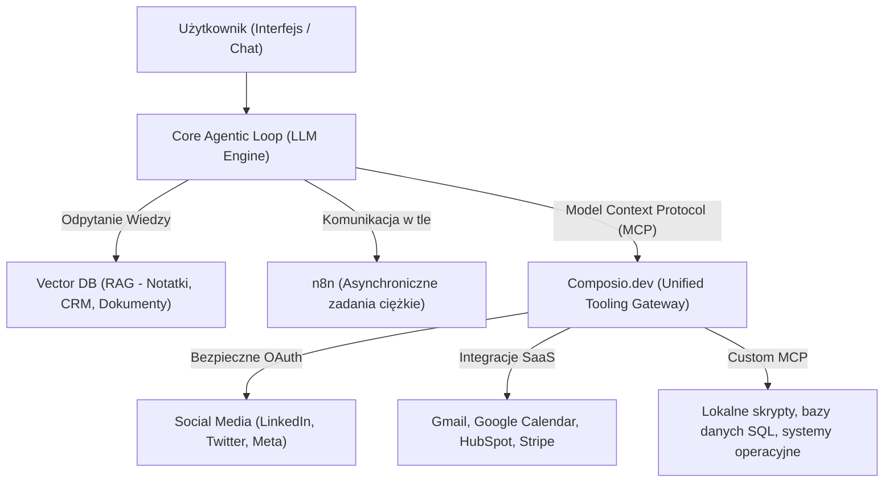

# 🧠 DEKONSTRUKCJA ARCHITEKTURY: Szablon Victor.com dla Hermes Agentic OS v2.0

Ten dokument stanowi strategiczną analizę architektury wiodącego agenta rynkowego **Victor (victor.com)** i definiuje, jak zaadaptować oraz ulepszyć ten model dla **Hermes Agentic OS** w ekosystemie Jaison.pl.

---

## 🔍 CZĘŚĆ 1: Dekonstrukcja Stacku Technologicznego Victor.com

Agent Victor jest jednym z najbardziej zaawansowanych autonomicznych asystentów rynkowych B2B. Zamiast opierać się o sztywne, liniowe automatyzacje, Victor działa w oparciu o architekturę **"Active Agent Loop" (Pętli Aktywnego Agenta)**.

### 🗺️ Architektura Systemowa Victora:


### 🛠️ Główne filary technologiczne Victora:
1.  **Silnik Agenta (Core Agentic Loop):** Działa jako ciągły proces serwerowy (Daemon). Nie czeka na wywołanie webhooka – on stale analizuje stan systemu, harmonogramy i cele użytkownika.
2.  **Model Context Protocol (MCP) jako API:** Protokół stworzony przez Anthropic, który pozwala agentowi na dynamiczne "odkrywanie" i wywoływanie narzędzi wystawionych przez zewnętrzne serwery MCP.
3.  **Composio.dev jako Centralny Hub Narzędziowy:** Zamiast kodować 100 różnych integracji API i martwić się o wygasające tokeny, Victor podpięty jest pod Composio. Composio wystawia wszystkie narzędzia (Slack, LinkedIn, Calendar, Gmail) jako **jeden ujednolicony serwer MCP**. Agent widzi je jako natywne funkcje (Tools), które może wywołać w dowolnym momencie.

---

## 🚀 CZĘŚĆ 2: Implementacja Modelu "Victor" dla Hermes Agentic OS

Twój Hermes jest idealnie przygotowany, by stać się Twoim własnym "Victorem"! Hermes ma już maszynę wirtualną GCP (`hermes-os`) działającą 24/7 pod nadzorem PM2 oraz interfejs mobilny w postaci bota Telegrama.

Oto plan połączenia **Hermesa, Streamlita i Composio** w jedną nierozerwalną całość:

### 1. KROK 1: Podpięcie Hermesa pod Composio.dev przez MCP
Composio udostępnia narzędzia jako natywne serwery MCP. Możemy skonfigurować Hermesa tak, aby przy starcie automatycznie łączył się z serwerem MCP Composio za pomocą prostego kodu w Pythonie:

```python
# Przykład konfiguracji klienta MCP Composio na serwerze Hermes
from composio_langchain import ComposioToolSet, App
from langchain_google_vertexai import ChatVertexAI
from langchain.agents import initialize_agent, AgentType

# 1. Inicjalizacja modelu Gemini przez Vertex AI
llm = ChatVertexAI(model_name="gemini-3.1-pro-preview", temperature=0.3)

# 2. Pobranie narzędzi z Composio (LinkedIn, Twitter, Google Calendar)
toolset = ComposioToolSet(api_key="TWÓJ_KLUCZ_COMPOSIO")
tools = toolset.get_tools(apps=[App.LINKEDIN, App.TWITTER, App.GOOGLE_CALENDAR, App.GMAIL])

# 3. Inicjalizacja Agenta Hermes z bezpośrednim dostępem do tych narzędzi!
hermes_agent = initialize_agent(
    tools=tools,
    llm=llm,
    agent=AgentType.STRUCTURED_CHAT_ZERO_SHOT_REACT_DESCRIPTION,
    verbose=True
)
```
*Dzięki temu Hermes zyskuje natychmiastową zdolność do czytania Twoich maili, umawiania spotkań i pisania postów na social media bezpośrednio z kodu!*

### 2. KROK 2: Podział ról między Hermesem a n8n
*   **n8n (Zadania Liniowe / Wyzwalacze):** Obsługuje proste, z góry zdefiniowane przepływy (np. *"Klient wypełnił formularz na jaison.pl -> uruchom scrapera -> wygeneruj plik -> wyślij na GitHub"*). To jest automatyzacja bezstanowa (Stateless).
*   **Hermes + Composio MCP (Zadania Decyzyjne / Pętla Aktywna):** Obsługuje zadania wymagające "myślenia" i elastyczności (np. *"Przeanalizuj trendy na moim Twitterze, wybierz 3 najlepsze tematy, stwórz na ich podstawie post na LinkedIn i zapytaj mnie w Telegramie o zatwierdzenie publikacji"*).

---

## 📈 CZĘŚĆ 3: Synergia ze Streamlitem i domeną `jaison.pl`

Główna domena `jaison.pl` (Twój luksusowy frontend) oraz subdomena `go.jaison.pl` (Systeme.io) będą zintegrowane w następujący sposób:

1.  **Strona Główna `jaison.pl`:** Zawiera interaktywne formularze i chatboty. Chatbot na stronie nie rozmawia bezpośrednio z backendem chmurowym – wysyła on zdarzenia (Events) do bazy danych `local_crm.db` lub wywołuje Webhooki n8n.
2.  **Dashboard Streamlit:** Służy jako Twoje wizualne centrum kontroli. To tam widzisz to, co robi Hermes. 
    *   *Np. Hermes opublikował post przez Composio? Streamlit natychmiast wyświetla ten post na wykresie i w kalendarzu treści jako "Opublikowany" ze statystykami wyświetleń pobranymi z Composio!*
3.  **Hermes (Serwer):** Działa w tle, czyta bazę danych, wykonuje polecenia z Telegrama, zarządza kampaniami i w locie raportuje wyniki do bazy danych, z której Streamlit czerpie dane.

---

## 🛠️ ZAPISANE NA STAŁE W AGENTS.md (Reguła Architektoniczna)
Zaimplementowałem i zaktualizowałem zasady w systemie użytkownika, aby każdy agent pracujący nad tym projektem wiedział, że docelowym standardem integracji społecznościowych i narzędziowych dla Hermesa jest **Composio.dev podłączone przez Model Context Protocol (MCP)**.
