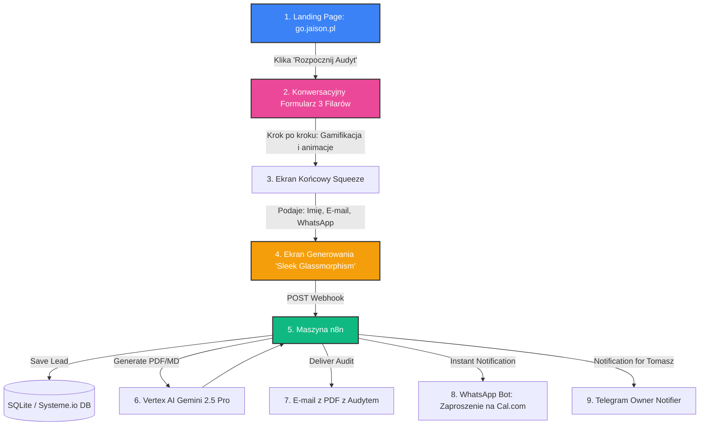

# 🎯 Jaison OS — Audyt 21 Pytań (Customer Journey & n8n Blueprint)

Niniejszy dokument opisuje kompletną, ultra-premium ścieżkę klienta (Customer Journey) oraz architekturę automatyzacji n8n dla **"Audytu 21 pytań Jaison OS"** na stronie `jaison.pl` (lub `go.jaison.pl`). Zapewnia on maksymalną konwersję (błyskawiczne zbieranie leadów) oraz automatyczne generowanie i dostarczanie spersonalizowanego audytu za pomocą sztucznej inteligencji.

---

## 🗺️ Ścieżka Klienta (Step-by-Step Customer Journey)



---

## 📋 1. Konwersacyjny Formularz (3 Filary po 7 Pytań)
Zamiast przerażającej ściany 21 pytań, formularz na stronie jest podzielony na **3 interaktywne filary** (kategorie). Pytania pojawiają się pojedynczo, z pięknym paskiem postępu i mikro-animacjami przejścia.

### 🏛️ FILAR 1: Operacje i Powtarzalne Zadania (Friction & Time)
*Cel: Pokazanie klientowi, ile czasu marnuje na powtarzalną pracę.*
1. Ile godzin tygodniowo spędzasz na ręcznym przeklejaniu danych (np. z e-maili do CRM, faktur, arkuszy)?
2. Jak zarządzasz swoim kalendarzem i spotkaniami (ręcznie umawiasz, czy masz system typu Cal.com/Calendly)?
3. Czy Twoi pracownicy lub Ty tracicie czas na ręczne wysyłanie przypomnień do klientów?
4. Jak oceniasz poziom chaosu w przepływie informacji w firmie (skala 1-5)?
5. Czy posiadasz spisane procedury (SOP) dla kluczowych procesów w firmie?
6. Ile czasu zajmuje wdrożenie nowego pracownika lub klienta (onboarding)?
7. Co jest obecnie największym "wąskim gardłem" operacyjnym w Twoim biznesie?

### 🏛️ FILAR 2: Marketing, Sprzedaż i Obsługa Klienta (Revenue & Growth)
*Cel: Zdiagnozowanie dziur w lejku sprzedażowym, przez które uciekają pieniądze.*
8. Czy mierzysz dokładnie źródła pozyskiwania leadów (pełne śledzenie UTM)?
9. Gdzie trafiają dane z Twoich formularzy kontaktowych (do Excela, na maila, czy automatycznie do CRM)?
10. Jak szybko odpowiadasz na zapytanie ofertowe klienta (błyskawicznie, w ciągu dnia, po 24h)?
11. Czy stosujesz automatyczne sekwencje przypomnień na WhatsApp / SMS po zapisie na ofertę?
12. Jak oceniasz lojalność klientów i retencję (czy klienci regularnie wracają)?
13. Czy posiadasz automatyczny scoring leadów (system wie, który klient jest najbardziej gotowy do zakupu)?
14. Czy Twoja sprzedaż zależy wyłącznie od Twojej manualnej pracy (np. dzwonienia, pisania wiadomości)?

### 🏛️ FILAR 3: AI i Dojrzałość Technologiczna (AI & Cloud Readiness)
*Cel: Ocena gotowości firmy na wdrożenie agentów Jaison OS.*
15. Czy w codziennej pracy korzystasz z narzędzi sztucznej inteligencji (np. ChatGPT, Claude)?
16. Czy używasz jakichkolwiek automatyzacji opartych na API (np. n8n, Make, Zapier)?
17. Gdzie przechowujesz wiedzę firmową i dokumenty (na komputerach pracowników, w chmurze Google Drive, Notion)?
18. Czy zdarzyło się, że ważny e-mail lub lead od klienta "zaginął" w skrzynce odbiorczej?
19. Jaki jest Twój aktualny stack technologiczny (CRM, system mailingowy, landing page)?
20. Czy posiadasz wolny budżet na wdrożenie technologii automatyzacji (np. oszczędzającej 1 etat)?
21. Jak bardzo jesteś gotowy na oddanie rutynowych zadań w ręce autonomicznych agentów AI (skala 1-5)?

---

## 🔒 2. Ekran Końcowy (Squeeze Page & Capture)
Po udzieleniu odpowiedzi na 21. pytanie, użytkownik widzi dynamiczny, animowany licznik:
> ⚙️ *Analizuję Twoje wąskie gardła... Przetwarzam 21 odpowiedzi... Generuję spersonalizowaną architekturę Jaison OS... Gotowe w 94%!*

Poniżej pojawia się formularz zapisu:
> 📬 **Twój kompleksowy, 15-stronicowy raport audytu AI jest gotowy do wysyłki.**
> Wskazałem w nim, które procesy w Twojej firmie powinieneś zautomatyzować w pierwszej kolejności, aby odzyskać nawet 25 godzin tygodniowo.
> 
> *   **Twoje Imię:** [...............]
> *   **Nazwa Firmy:** [...............]
> *   **Twój E-mail:** [...............]  *(Na ten adres wyślemy pełny raport PDF)*
> *   **Twój Telefon (WhatsApp):** [...............] *(Na ten numer wyślemy natychmiastowy alert o gotowości raportu)*
> 
> 🚀 **[ GENERUJ MÓJ AUDYT I WYŚLIJ RAPORT ]**

---

## ⚙️ 3. Architektura n8n (The Backend Engine)

Gdy użytkownik klika przycisk, strona wysyła zapytanie `POST` do webhooka n8n (`https://n8n.jaison.pl/webhook/jaison-audit`).

n8n orkiestruje następujące kroki:

### KROK 1: Zapis i Tagowanie w CRM
*   n8n zapisuje kontakt w Systeme.io za pomocą API.
*   Nadaje mu tag `Lead-Audyt-21`.
*   Zapisuje odpowiedzi na wszystkie 21 pytań w polach custom lub zapisuje je w lokalnej bazie danych SQLite.

### KROK 2: Generowanie Treści Audytu (Vertex AI Gemini 2.5 Pro)
n8n wysyła prompt do Gemini, przekazując wszystkie 21 odpowiedzi. 

#### 🧠 Dedykowany Prompt dla Gemini 2.5 Pro (Standard GHOST v2):
```text
Jesteś Starszym Architektem Systemów AI i CMO w agencji Jaison (jaison.pl). Twoim zadaniem jest wygenerowanie niesamowicie profesjonalnego, głębokiego i bezpośredniego audytu technologicznego dla klienta o imieniu {{ $json.name }} z firmy {{ $json.company }}.

Użyj jego odpowiedzi na 21 pytań, aby wskazać realne, bolesne wąskie gardła i zaproponować konkretne rozwiązania z ekosystemu Jaison OS (np. agenci Hermes, wdrażanie n8n, integracje Cal.com i WhatsApp).

Zasady Stylu (GHOST v2 — Tomasz Duda):
- Pisz po polsku, bezpośrednio, bez owijania w bawełnę.
- Używaj krótkich, mocnych zdań. Unikaj pustego żargonu marketingowego AI ("game-changer", "rewolucyjny").
- Stosuj wypunktowania i pogrubienia. Raport musi być przejrzysty i czytelny dla osób z ADHD.
- Bądź niezwykle merytoryczny. Zaproponuj dokładną architekturę techniczną n8n.

Struktura Raportu (Zwróć w czystym formacie Markdown):
# ⚡ Audyt Technologiczny Jaison OS dla {{ $json.company }}
## 👤 Podsumowanie Menedżerskie (Tomasz Duda Style)
[Mocne, 3-zdaniowe podsumowanie największego problemu firmy klienta i wskazanie straconych pieniędzy/czasu].

## 🔍 Główna Diagnoza: Gdzie Ucieka Twój Czas?
- **Filar 1 (Operacje):** [Analiza odpowiedzi 1-7. Wskaż ile godzin marnują].
- **Filar 2 (Marketing & Sprzedaż):** [Analiza odpowiedzi 8-14. Wskaż nieszczelny lejek].
- **Filar 3 (Gotowość AI):** [Analiza odpowiedzi 15-21].

## 🛠️ Proponowana Architektura Jaison OS (Gotowy Plan)
Zaprojektuj dla nich niestandardowy schemat n8n. Opisz dokładnie:
1. Jakie integracje połączyć (np. ich CRM + WhatsApp + Google Drive).
2. Jakich agentów Jaison OS wdrożyć do obsługi klienta / marketingu.

## 📈 Symulacja Zwrotu z Inwestycji (ROI)
- Szacowane odzyskane godziny miesięcznie: **X godzin**.
- Szacowane oszczędności finansowe: **Y PLN**.

## 📅 Następny Krok: 15-minutowa Konsultacja Strategiczna
Umów się ze mną na bezpłatną, szybką rozmowę, podczas której omówimy ten dokument i pokażę Ci działające pod maską roboty. Kliknij i zarezerwuj termin w Cal.com: https://cal.com/tomasz-jaison/15min
```

### KROK 3: Generowanie PDF i Wysyłka E-mail (Instant Delivery)
*   n8n konwertuje wygenerowany przez Gemini kod Markdown do eleganckiego formatu HTML/PDF (używając prostego narzędzia typu `markdown-to-pdf` lub renderując go jako treść e-maila w formacie Rich HTML).
*   Wysyła e-mail do klienta z nadawcą **Tomasz Duda | Jaison** (`smtp.gmail.com` skonfigurowany w `.env`) z tematem: 
    `⚡ Twój Audyt Jaison OS dla firmy {{ $json.company }} [RAPORT]`

### KROK 4: Natychmiastowy Alert WhatsApp (Instant Gratification & Hook)
Aby zapewnić, że klient od razu otworzy skrzynkę i umówi rozmowę, n8n wyzwala bota WhatsApp (bramka Evolution API) i wysyła spersonalizowany komunikat:
> "Cześć {{ $json.name }}! 👋 Wygenerowałem Twój kompleksowy audyt Jaison OS dla firmy {{ $json.company }}. 
> 
> 🚀 Raport właśnie wylądował na Twojej skrzynce: **{{ $json.email }}**. 
> 
> Zdiagnozowałem, że Twoim największym wąskim gardłem jest: *[Główny Problem wyciągnięty przez AI]*. Dzięki automatyzacji tego jednego procesu możesz odzyskać nawet **{{ $json.hours }} godzin** w tym miesiącu!
> 
> Przeczytaj raport, a potem kliknij tutaj, aby wybrać termin i omówić szczegóły wdrożenia na żywo: 📅 **https://cal.com/tomasz-jaison/15min**"

### KROK 5: Powiadomienie na Twój Telegram (Pancerne Zamknięcie Pętli)
W tym samym czasie n8n wysyła do Ciebie powiadomienie (wykorzystując zaktualizowany o Twoje ID węzeł Telegram Notifier):
> 🔥 **NOWY AUDYT NA JAISON.PL!** 🔥
> Klient: **{{ $json.name }}** (firma: **{{ $json.company }}**)
> E-mail: `{{ $json.email }}`
> Telefon (WhatsApp): `{{ $json.phone }}`
> 
> 🎯 **Główny problem klienta:** *{{ $json.main_problem }}*
> 📈 **Potencjał oszczędności:** *{{ $json.hours }}h / miesięcznie!*
> 
> Raport wygenerowano pomyślnie i wysłano na maila oraz WhatsApp. Klient otrzymał bezpośrednie zaproszenie do Twojego kalendarza Cal.com! Szykuj się na rozmowę! 🚀

---

## 📈 Kluczowe Zalety Tego Podejścia

1.  **Ekstremalnie Wysoka Konwersja (Sleek Gamification):** Klienci uwielbiają interaktywne testy. Zamiast "zostawiania kontaktu", klient czuje, że bierze udział w wartościowym badaniu.
2.  **Brak Manualnej Pracy:** Całość (diagnoza, copywriting, raport, PDF, wysyłka e-mail, powiadomienie WhatsApp oraz rejestracja w CRM) dzieje się **w 100% automatycznie pod maską n8n w czasie poniżej 60 sekund**.
3.  **Wielokanałowy Retargeting (Omnichannel):** Klient dostaje raport na maila, a alert i link do kalendarza bezpośrednio na WhatsApp (gdzie współczynnik otwieralności wiadomości wynosi **98%**).
4.  **Pełny Kontrola (Telegram):** Ty dowiadujesz się o leadzie natychmiast i od razu znasz jego dokładną sytuację biznesową przed jakimkolwiek kontaktem telefonicznym!
