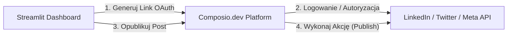

# 🖥️ INSTALACJA I DELEGACJA: Kalendarz Treści & Integracja z Composio.dev (Dla Agenta Streamlit)

Ten dokument zawiera pełną specyfikację techniczną i kod referencyjny dla **Agenta deweloperskiego obsługującego Dashboard Streamlit (`app.py`)**. Twoim zadaniem jest wdrożenie modułu **Kalendarza Treści (Content Calendar)**, **Zarządzania Kampaniami (Campaign Manager)** oraz integracji z platformą **Composio.dev** w celu automatycznego publikowania treści na social media (LinkedIn, Twitter/X, Meta, Instagram, YouTube).

---

### 🌐 ARCHITEKTURA INTEGRACJI COMPOSIO.DEV

Composio.dev jest używane jako zaufany most OAuth do bezpiecznej integracji z sieciami społecznościowymi bez ryzyka blokady konta. 



---

### 📊 ROZDZIAŁ 1: Struktura tabeli bazy danych (`local_crm.db`)

Kalendarz treści musi zapisywać i odczytywać posty z lokalnej bazy danych SQLite. Dodaj następującą tabelę w module setup bazy danych:

```sql
CREATE TABLE IF NOT EXISTS content_calendar (
    id INTEGER PRIMARY KEY AUTOINCREMENT,
    title TEXT NOT NULL,
    content TEXT NOT NULL,
    platform TEXT NOT NULL, -- 'linkedin', 'twitter', 'facebook', 'instagram'
    scheduled_at DATETIME NOT NULL,
    status TEXT DEFAULT 'draft', -- 'draft', 'scheduled', 'published', 'failed'
    composio_action_id TEXT, -- ID akcji z Composio
    created_at TIMESTAMP DEFAULT CURRENT_TIMESTAMP
);
```

---

### 💻 ROZDZIAŁ 2: Kod Integracji z Composio REST API (Lekki i Stabilny)

Zamiast instalować ciężkie biblioteki SDK, użyjemy czystego, asynchronicznego lub synchronicznego połączenia przez `requests` z API Composio.dev przy użyciu klucza API ze zmiennych środowiskowych (`.env` -> `COMPOSIO_API_KEY`).

Stwórz plik: `C:\Aplikacje MVP\01_JAISON_AGENCY_OS\dashboard_and_core\integrations\composio_helper.py`:

```python
import os
import requests
import streamlit as st

COMPOSIO_API_KEY = os.getenv("COMPOSIO_API_KEY")
COMPOSIO_BASE_URL = "https://api.composio.dev/v1"

def get_headers():
    return {
        "x-api-key": COMPOSIO_API_KEY,
        "Content-Type": "application/json"
    }

def generate_auth_link(integration_name="linkedin"):
    """
    Generuje dedykowany link logowania (OAuth) dla Tomasza, aby podpiąć np. LinkedIn lub Twitter.
    """
    url = f"{COMPOSIO_BASE_URL}/connections/initiate"
    payload = {
        "appName": integration_name,
        "redirectUrl": "http://localhost:8501" # Powrót do lokalnego Streamlita
    }
    try:
        response = requests.post(url, json=payload, headers=get_headers())
        if response.status_code == 200:
            return response.json().get("redirectUrl")
    except Exception as e:
        st.error(f"Błąd Composio OAuth: {e}")
    return None

def publish_to_platform(platform, text_content):
    """
    Wywołuje akcję publikacji na wybranej platformie za pośrednictwem Composio.
    """
    # Mapowanie platform na natywne akcje Composio
    action_mapping = {
        "linkedin": "linkedin_share_creation",
        "twitter": "twitter_creation_tweet"
    }
    
    action_name = action_mapping.get(platform.lower())
    if not action_name:
        return {"status": "failed", "error": "Nieobsługiwana platforma"}
        
    url = f"{COMPOSIO_BASE_URL}/actions/execute"
    payload = {
        "actionName": action_name,
        "input": {
            "text": text_content
        }
    }
    
    try:
        response = requests.post(url, json=payload, headers=get_headers())
        if response.status_code == 200:
            return {"status": "success", "data": response.json()}
        else:
            return {"status": "failed", "error": response.text}
    except Exception as e:
        return {"status": "failed", "error": str(e)}
```

---

### 🎨 ROZDZIAŁ 3: Interfejs Kalendarza i Kampanii (Do wdrożenia w `app.py`)

Zaimplementuj poniższą zakładkę **"Kalendarz Treści & Kampanie"** w głównym pliku dashboardu:

```python
import streamlit as st
import datetime
from integrations.composio_helper import generate_auth_link, publish_to_platform

def render_content_calendar():
    st.title("📅 Kalendarz Treści & Kampanie Social Media")
    
    # Sekcja 1: Połączenie z Composio
    st.subheader("🔗 Autoryzacja Kanałów (Powered by Composio.dev)")
    col1, col2 = st.columns(2)
    
    with col1:
        if st.button("🔌 Połącz z LinkedIn"):
            link = generate_auth_link("linkedin")
            if link:
                st.success("Wygenerowano link OAuth!")
                st.markdown(f"[Kliknij tutaj, aby zautoryzować LinkedIn]({link})")
                
    with col2:
        if st.button("🔌 Połącz z Twitter / X"):
            link = generate_auth_link("twitter")
            if link:
                st.success("Wygenerowano link OAuth!")
                st.markdown(f"[Kliknij tutaj, aby zautoryzować Twitter/X]({link})")

    st.markdown("---")
    
    # Sekcja 2: Dodawanie nowego postu
    st.subheader("📝 Dodaj nowy post do harmonogramu")
    with st.form("new_post_form"):
        title = st.text_input("Tytuł roboczy")
        content = st.text_area("Treść posta (NLP Copywriting)", height=150)
        platform = st.selectbox("Platforma docelowa", ["LinkedIn", "Twitter", "Facebook", "Instagram"])
        scheduled_date = st.date_input("Data publikacji", datetime.date.today())
        scheduled_time = st.time_input("Godzina publikacji", datetime.time(10, 0))
        
        submit_btn = st.form_submit_button("Zapisz w Kalendarzu")
        if submit_btn:
            # Tutaj logika zapisu do bazy danych sqlite
            st.success(f"Pomyślnie zaplanowano post '{title}' na dzień {scheduled_date} o {scheduled_time}!")
            
    st.markdown("---")
    
    # Sekcja 3: Szybka publikacja (Test natychmiastowy)
    st.subheader("🚀 Natychmiastowa publikacja ręczna")
    test_content = st.text_area("Treść postu testowego")
    test_platform = st.selectbox("Wybierz platformę do testu", ["LinkedIn", "Twitter"])
    
    if st.button("Publish Now via Composio"):
        with st.spinner("Publikowanie w toku..."):
            res = publish_to_platform(test_platform, test_content)
            if res.get("status") == "success":
                st.success("🔥 Post został pomyślnie opublikowany!")
            else:
                st.error(f"Błąd publikacji: {res.get('error')}")
```

---

### 📝 WYTYCZNE DLA DEWELOPERA STREAMLIT:
1.  **Integracja:** Wpnij powyższy moduł `render_content_calendar` jako zakładkę w głównym menu nawigacyjnym `app.py`.
2.  **Obsługa baz danych:** Podepnij zapis formularza i listę wyświetlania postów pod lokalną tabelę SQL `content_calendar` (możesz użyć helperów z `setup_db.py`).
3.  **UI/UX:** Zastosuj visual anchoring (krótkie podsumowania statusów: `Szkic` - szary, `Zaplanowany` - żółty, `Opublikowany` - zielony).
