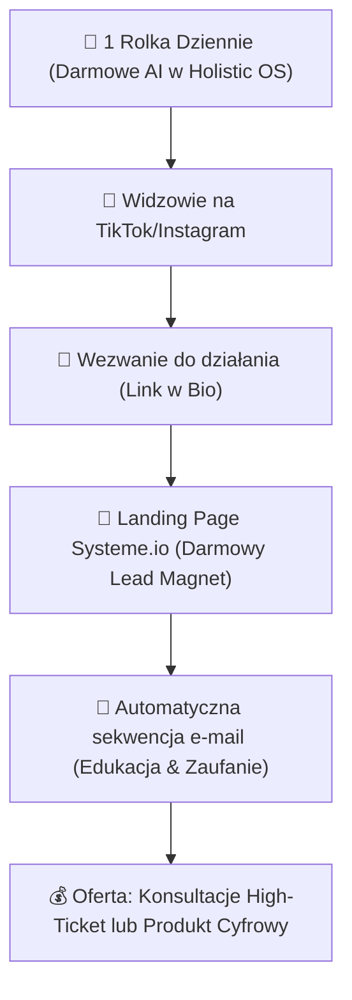

# Instrukcja Konfiguracji Integracji Social Media (Natywny Python)

Holistic OS pozwala na bezpośrednie publikowanie treści na **LinkedIn**, **Facebook Pages** oraz **Instagram Business** z poziomu Dashboardu. Wszystkie połączenia są oparte o oficjalne, bezpieczne API deweloperskie i nie wywołują blokad kont (jak ma to miejsce przy scraping-u czy botach opartych o symulację przeglądarek).

Poniżej znajdziesz instrukcję krok po kroku, jak bezpłatnie uzyskać wymagane tokeny i skonfigurować plik `.env`.

---

## 1. LinkedIn

### Krok A: Założenie Aplikacji Deweloperskiej
1. Zaloguj się na swoje konto LinkedIn i przejdź do portalu deweloperskiego: [LinkedIn Developer Portal](https://developer.linkedin.com/).
2. Kliknij **Create App**.
3. Wpisz nazwę aplikacji (np. `Holistic OS`), powiąż ją ze swoją stroną firmową na LinkedIn (jeśli nie masz, utwórz darmową stronę firmową) i prześlij logo.
4. Zaakceptuj warunki i kliknij **Create**.

### Krok B: Wybór Produktów i Uprawnień
1. Po utworzeniu aplikacji przejdź do zakładki **Products**.
2. Aktywuj produkt **Share on LinkedIn** (pozwala na publikowanie na profilu osobistym) oraz opcjonalnie **Sign In with LinkedIn**.
3. Jeśli chcesz publikować na stronie firmowej, aktywuj produkt **Community Management API** (wymaga weryfikacji przez administratora strony).

### Krok C: Pozyskanie Access Tokena (Tokenu Użytkownika)
Dla prostych zastosowań własnych najszybciej wygenerujesz token za pomocą wbudowanego narzędzia:
1. Przejdź do [LinkedIn Token Generator Tool](https://developer.linkedin.com/developer-portal/tools/token-generator).
2. Wybierz swoją aplikację i zaznacz uprawnienia:
   - `w_member_social` (do postowania na profilu osobistym)
   - `w_organization_social` (do postowania na stronie firmowej)
3. Kliknij **Generate Token**, przejdź przez autoryzację i skopiuj wygenerowany token.

### Krok D: Pobranie ID Profilu (Person ID)
Aby dowiedzieć się, jakie jest Twoje ID użytkownika (wymagane w API):
1. Przejdź do zakładki **Token Generator** lub wykonaj zapytanie testowe:
   ```bash
   curl -H "Authorization: Bearer TWÓJ_ACCESS_TOKEN" https://api.linkedin.com/v2/userinfo
   ```
2. Twoje ID to pole `sub` (lub `id`).

### Krok E: Zapis w `.env`
Dodaj do swojego pliku `.env` na serwerze:
```env
LINKEDIN_ACCESS_TOKEN=twój_skopiowany_token
LINKEDIN_PERSON_ID=twoje_id_person
# Opcjonalnie, jeśli chcesz postować jako strona firmowa:
LINKEDIN_ORGANIZATION_ID=twoje_id_organizacji
```

---

## 2. Meta (Facebook Page & Instagram Business)

Obie platformy (Facebook oraz Instagram) są zarządzane przez jedno Graph API od Meta. Aby publikować na Instagramie, Twoje konto na Instagramie musi być kontem **profesjonalnym/firmowym** i być **powiązane z Twoim fanpage'em na Facebooku**.

### Krok A: Założenie Aplikacji w Meta Developers
1. Zaloguj się na Facebooku i przejdź do portalu deweloperskiego: [Meta for Developers](https://developers.facebook.com/).
2. Kliknij **My Apps** -> **Create App**.
3. Wybierz typ aplikacji: **Other** -> **Business** (lub inny odpowiedni dla integracji stron).
4. Wpisz nazwę aplikacji i kliknij **Create App**.

### Krok B: Wybór Uprawnień w Graph API Explorer
Do wygenerowania bezterminowego tokenu strony (Page Access Token) użyjemy Graph API Explorera:
1. Przejdź do narzędzia [Graph API Explorer](https://developers.facebook.com/tools/explorer/).
2. W menu bocznym po prawej stronie wybierz swoją aplikację w polu **Meta App**.
3. W sekcji **User or Page** wybierz **Get User Access Token**.
4. W sekcji **Permissions** dodaj następujące uprawnienia:
   - `pages_manage_posts`
   - `pages_read_engagement`
   - `instagram_basic`
   - `instagram_content_publish`
5. Kliknij **Generate Access Token** i przejdź przez proces autoryzacji logowania na Facebooku, wybierając strony i konta Instagram, którymi chcesz zarządzać.

### Krok C: Zamiana na Bezterminowy Token Strony (Permanent Page Access Token)
Domyślny token wygasa po 2 godzinach. Zamieńmy go na bezterminowy token:
1. Skopiuj tymczasowy token użytkownika z okna Explorera.
2. Wejdź na [Access Token Tool](https://developers.facebook.com/tools/accesstoken/) lub prześlij zapytanie do API, aby pobrać "Long-lived User Token" (ważny 60 dni).
3. Aby uzyskać **bezterminowy token strony**:
   Wpisz w Graph API Explorer zapytanie:
   `GET /me/accounts` (z wygenerowanym wcześniej tokenem użytkownika).
4. Otrzymasz listę swoich stron na Facebooku. Znajdź właściwą stronę i skopiuj jej `access_token` oraz `id`. Ten token strony dla kont biznesowych **nigdy nie wygasa**.

### Krok D: Pobranie ID Konta Instagram (Instagram Business Account ID)
Wpisz zapytanie w Graph API Explorer:
`GET /{id_twojej_strony_facebooka}?fields=instagram_business_account`
Otrzymasz ID powiązanego konta Instagram. Skopiuj je.

### Krok E: Zapis w `.env`
Dodaj do swojego pliku `.env` na serwerze:
```env
FACEBOOK_PAGE_ACCESS_TOKEN=twój_bezterminowy_token_strony
FACEBOOK_PAGE_ID=id_twojej_strony
INSTAGRAM_BUSINESS_ACCOUNT_ID=id_konta_instagram
```

---

## 3. YouTube (Wdrożenie Opcjonalne)

YouTube wymaga uwierzytelnienia za pomocą protokołu OAuth2.
1. Zaloguj się w [Google Cloud Console](https://console.cloud.google.com/).
2. Włącz interfejs **YouTube Data API v3** dla swojego projektu.
3. Utwórz dane uwierzytelniające typu **OAuth Client ID** (Desktop Application).
4. Pobierz plik `client_secrets.json` i zapisz w konfiguracji.
5. Uruchom skrypt autoryzacji raz, aby wygenerować token odświeżania (`refresh_token`), co pozwoli Holistic OS na bezterminowe dodawanie filmów w tle.

---

## 4. X (dawny Twitter)

API v2 dla X w wersji bezpłatnej (Free Tier) pozwala na postowanie do 1500 tweetów na miesiąc. Wymaga autoryzacji typu OAuth 1.0a User Context.

### Krok A: Założenie Aplikacji Deweloperskiej
1. Zaloguj się na Twitterze i przejdź do portalu deweloperskiego: [X Developer Portal](https://developer.twitter.com/en/portal/dashboard).
2. Jeśli nie masz konta deweloperskiego, przejdź przez proces rejestracji (wybierz darmowy plan).
3. Kliknij **Add App** lub utwórz projekt (Project) i powiąż z nim aplikację.

### Krok B: Konfiguracja Ustawień Uwierzytelniania (User Authentication Settings)
1. W ustawieniach swojej aplikacji kliknij **Set up** pod **User authentication settings**.
2. Zaznacz uprawnienia: **Read and Write** (kluczowe do postowania).
3. Wybierz typ aplikacji: **Web App, Automated App or Bot**.
4. Wpisz dowolny URL przekierowania w **Callback URI** (np. `http://127.0.0.1`) oraz adres strony (np. `https://twitter.com`).
5. Kliknij **Save**.

### Krok C: Wygenerowanie Kluczy i Tokenów
1. Przejdź do zakładki **Keys and Credentials** w szczegółach aplikacji.
2. Wygeneruj i skopiuj:
   - **API Key** (Consumer Key)
   - **API Key Secret** (Consumer Secret)
3. W sekcji **Access Token and Secret** kliknij **Generate** (upewnij się, że ma uprawnienia Created with Read and Write) i skopiuj:
   - **Access Token**
   - **Access Token Secret**

### Krok D: Zapis w `.env`
Dodaj do swojego pliku `.env` na serwerze:
```env
TWITTER_CONSUMER_KEY=twój_api_key
TWITTER_CONSUMER_SECRET=twój_api_key_secret
TWITTER_ACCESS_TOKEN=twój_access_token
TWITTER_ACCESS_TOKEN_SECRET=twój_access_token_secret
```

---

## 5. TikTok

TikTok oferuje oficjalne **Content Posting API** do bezpośredniej publikacji filmów.

### Krok A: Rejestracja w TikTok Developer
1. Zarejestruj się w portalu dla deweloperów: [TikTok Developer Portal](https://developers.tiktok.com/).
2. Utwórz nową aplikację.
3. Wybierz i aktywuj produkt **Content Posting API** w zakładce produktów aplikacji.
4. Po zaakceptowaniu aplikacji przez TikTok, otrzymasz `Client Key` oraz `Client Secret`.

### Krok B: Wygenerowanie Access Tokena
TikTok wykorzystuje standardowy protokół OAuth 2.0:
1. Użytkownik (lub Ty jako właściciel konta) musi autoryzować aplikację przechodząc pod adres autoryzacji z uprawnieniem `video.publish`.
2. Po przekierowaniu, wymieniasz kod autoryzacji na bezterminowy (lub odświeżalny) `access_token` za pomocą żądania POST:
   `POST https://open.tiktokapis.com/v2/oauth/token/`
   przesyłając `client_key`, `client_secret`, `code`, oraz `grant_type="authorization_code"`.
3. Skopiuj uzyskany `access_token`.

### Krok C: Zapis w `.env`
Dodaj do swojego pliku `.env` na serwerze:
```env
TIKTOK_ACCESS_TOKEN=twój_tiktok_access_token
```

---

## 🚀 6. Strategia Bezbudżetowa (Organic Faceless & Creator Accounts)

Dla Tomasza (Holistic Jason) **najszybszym i najtańszym sposobem walidacji rynku** oraz pozyskania pierwszych klientów na usługi doradcze / produkty cyfrowe jest ruch organiczny wspierany przez wideo o wysokim zaangażowaniu (Shorts / Reels). 

Poniżej znajdziesz precyzyjne odpowiedzi na pytania dotyczące konfiguracji i zarządzania tymi kontami bez wydawania budżetu reklamowego.

### ❓ Zarządzanie z Poziomu Kont Prywatnych czy Osobne Konta?

> [!IMPORTANT]
> **ZŁOTA ZASADA:** Używasz swoich istniejących prywatnych kont jako "właściciel/administrator", ale tworzysz pod nimi **nowe, dedykowane, profesjonalne profile marki**. 
> Dzięki temu:
> 1. Nie musisz ciągle wylogowywać się i logować na inne konta.
> 2. Chronisz prywatność swojego osobistego profilu.
> 3. Masz pełną analitykę i profesjonalne narzędzia biznesowe (Meta Business Suite).

#### 👥 Meta (Facebook i Instagram):
1. **Facebook Fanpage:** Stwórz nową stronę (Fanpage) o nazwie **Holistic Jason** bezpośrednio ze swojego prywatnego konta na Facebooku. Ty jesteś administratorem, ale nikt na zewnątrz nie widzi Twojego prywatnego profilu.
2. **Konto Instagram (Twórca):** Załóż nowy, świeży profil na Instagramie. Zaraz po założeniu wejdź w `Ustawienia -> Rodzaj konta i narzędzia` i przełącz je na **Konto Profesjonalne (Professional Account)**, a następnie wybierz **Konto Twórcy (Creator)**.
3. **Powiązanie:** Połącz swoją Stronę na Facebooku z profesjonalnym kontem na Instagramie. Dzięki temu będziesz mógł zarządzać publikacją, komentarzami i reklamami (jeśli kiedyś się zdecydujesz) z jednego bezpłatnego panelu: **Meta Business Suite**.

#### 📱 TikTok:
1. **Dedykowany Profil:** Załóż zupełnie nowe, świeże konto na TikToku dedykowane marce **Holistic Jason**.
2. **TikTok dla Twórców (Creator Account):** Twoje nowe konto domyślnie będzie kontem osobistym/twórcy. Daje Ci to dostęp do pełnej analityki, narzędzi twórcy oraz — co kluczowe — do **Trendów i Pełnej Biblioteki Muzycznej** (w tym komercyjnych dźwięków).
3. **Link w Bio:** Na TikToku darmowy link w bio (przekierowujący na Twój lejek w Systeme.io) można dodać:
   - Na koncie Twórcy po osiągnięciu **1000 obserwujących** (bardzo łatwe do zrobienia przy regularnym wrzucaniu 1 rolki dziennie za pomocą naszego generatora).
   - Alternatywnie: Możesz przełączyć konto na **Konto Biznesowe (Business)**, które pozwala na dodanie linku w bio od 0 obserwujących, ale ogranicza bibliotekę muzyczną tylko do dźwięków komercyjnych (mniej popularnych). Rekomendujemy zacząć jako konto **Twórcy** i organicznie urosnąć do 1000 obserwujących za pomocą darmowych rolek, budując prawdziwy autorytet.

---

## 🎯 7. Bezbudżetowy Lejek Sprzedażowy (Krok po Kroku)

Nie potrzebujesz budżetu reklamowego, by zdobyć pierwszych klientów. Zastosujemy darmowy, automatyczny lejek o wysokiej konwersji:



1. **Zaciąg (Generowanie Ruchu):** Używasz wbudowanego generatora wideo faceless w Holistic OS do automatycznego dowożenia 1 krótkiej, dynamicznej merytorycznej rolki dziennie (np. *"Jak AI oszczędza 5 godzin dziennie przy ADHD"*).
2. **Przekierowanie (Link w Bio):** W opisie wideo i bio umieszczasz wezwanie do działania: *"Odbierz darmowy Kalkulator Oszczędności Czasu z AI. Link w bio!"*
3. **Konwersja na Kontakt (Systeme.io):** Użytkownik wchodzi na darmowy, estetyczny landing page w Systeme.io, wpisuje e-mail, by pobrać prezent.
4. **Automatyczna Sprzedaż (E-mail Marketing):** Systeme.io w darmowym planie automatycznie wysyła mu serię 3-5 e-maili (które pomoże Ci napisać nasz agent Ghost/CCO). E-maile budują zaufanie, a na końcu kierują na zakup Twojego produktu cyfrowego lub darmową konsultację (na której domykasz sprzedaż usługi agencji).
