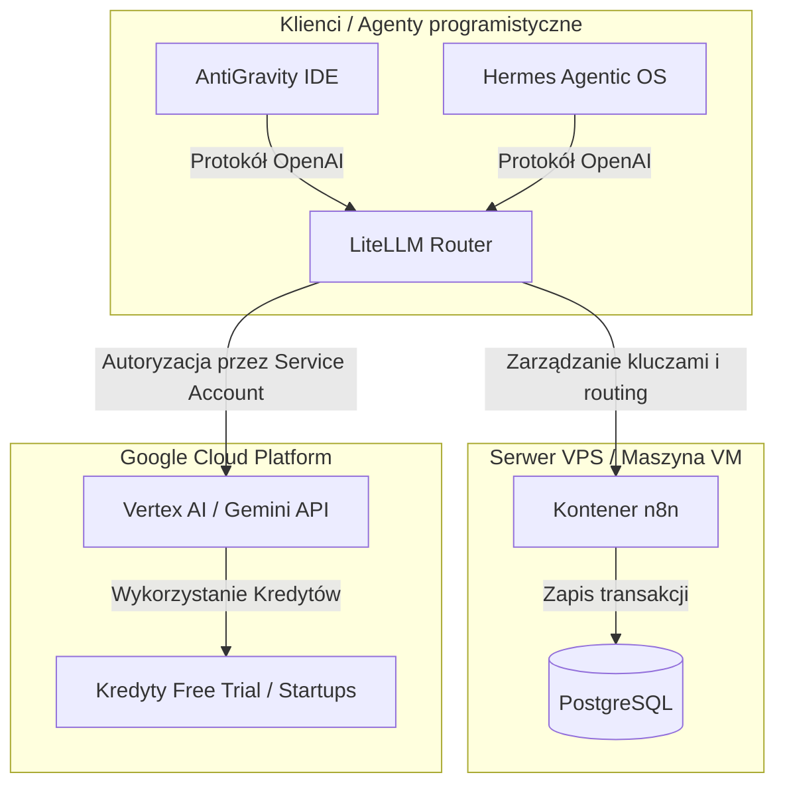
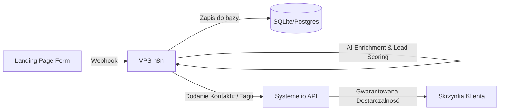

# Standard Operating Procedure (SOP) — Blueprint wdrożeniowy GCP + n8n + Vertex AI + LiteLLM + Startups program

> **Cel dokumentu:** Przewodnik krok po kroku (od A do Z) służący do replikacji kompletnego, taniego i bezpiecznego środowiska sztucznej inteligencji (AI/LLM) dla startupów i projektów biznesowych. Architektura łączy autonomiczne kontenery (n8n na VPS) z bezpieczną chmurą obliczeniową Google Cloud (Vertex AI) oraz warstwą proxy (LiteLLM) do zarządzania kredytami.

---

## 🏛️ Schemat architektury hybrydowej



---

## 📑 Krok 1: Konfiguracja GCP i Aktywacja Środków (Osoba Fizyczna vs Organizacja)

Weryfikatorzy Google wymagają posiadania profesjonalnej tożsamości biznesowej. Wybór odpowiedniej struktury konta na samym starcie pozwala uniknąć bolesnych blokad anty-fraudowych i problemów z limitami API.

### 1.1 Jak założyć konto Google Cloud Platform od zera
1. **Dostęp do konsoli:** Wejdź na stronę [Google Cloud Console](https://console.cloud.google.com/).
2. **Uwierzytelnienie:** Zaloguj się kontem Google (Gmail dla konta osoby fizycznej lub Google Workspace dla konta organizacji).
3. **Akceptacja regulaminów:** Zaakceptuj warunki korzystania z usług i wybierz swój kraj (Polska).
4. **Aktywacja darmowych środków:** Kliknij w wyróżniony niebieski baner **„Aktywuj darmowy okres próbny”** (dający $300 na start).
5. **Konfiguracja profilu płatności:** Podaj dane rejestrowe firmy (NIP, adres) i podepnij kartę płatniczą (debetową lub kredytową).

---

### 1.2 Tabela Porównawcza: Osoba Fizyczna (Standalone) vs Organizacja (GCP Org)

> [!TIP]
> **Zwróć uwagę na detale:** Zobacz czarno na białym, jak wybór właściwej drogi na starcie ułatwi Ci skalowanie i da pełną ciszę operacyjną bez niespodziewanych blokad.

| Cecha / Limit | 👤 Osoba Fizyczna (Standalone) | 🏢 Konto Organizacji (GCP Org via Workspace) |
| :--- | :--- | :--- |
| **Hierarchia zasobów** | Brak nadrzędnej struktury (`No organization`). Projekty wiszą niezależnie. | Drzewiasta struktura (`Organizacja -> Foldery -> Projekty`). Pełna przejrzystość. |
| **Zarządzanie uprawnieniami** | Przypisywanie ról IAM osobno dla każdego projektu. Duże ryzyko błędu ludzkiego. | Globalne polityki IAM i zabezpieczeń przypisywane na poziomie całej domeny. |
| **Startowe limity projektów** | Niskie (zazwyczaj max **3-5 projektów** na konto). | Wysokie (standardowo **10-20 projektów** z łatwym podniesieniem). |
| **Limity zapytań (Rate Limits)** | Niższe limity żądań na minutę (RPM) dla Vertex AI / Gemini API. | Zdecydowanie wyższe startowe limity RPM. Google ufa autoryzowanym domenom. |
| **Logowanie przez OAuth** | Szybkie wyczerpywanie limitu **2000 tokenów/dobę** przy masowej pracy agentów. | Wyższe limity zapytań i szybsza weryfikacja aplikacji w procesie OAuth. |
| **Rozliczenia i Faktury** | Utrudnione zarządzanie (osobne Billing Accounts dla pojedynczych projektów). | Jeden centralny Billing Account spięty z całą organizacją i jej folderami. |

---

### 1.3 Jak skonfigurować Konto Rozliczeniowe (Billing Account) i Projekt
1. **Przejdź do sekcji Billing:** W lewym menu nawigacyjnym wybierz **Billing**.
2. **Utwórz profil rozliczeniowy:** Kliknij **Manage billing accounts** -> **Create account**. Nazwij go np. `Jaison Main Billing`.
3. **Podpięcie karty płatniczej:** Wpisz dane karty. System może dokonać autoryzacyjnej blokady środków (np. 110 PLN), która zostanie automatycznie zwolniona lub zaliczona na poczet usług.
4. **Stworzenie projektu:** W górnym pasku kliknij listę projektów -> **New Project**. Nazwij go zgodnie ze standardem (np. `jaison-production`). 
5. **Powiązanie projektu z Billingiem:** Upewnij się, że nowo utworzony projekt jest spięty z Twoim Billing Account w zakładce **Billing -> My Projects**. Bez tego powiązania usługi Gen AI / Vertex AI nie będą działać.

---

### 1.4 Jak podnosić limity zasobów (Quotas)
Gdy Twoje agenty AI zaczną przetwarzać setki dokumentów, domyślne limity mogą okazać się wąskim gardłem.
1. Wyszukaj w konsoli GCP hasło **„Quotas & System Limits”** (sekcja IAM & Admin).
2. Użyj filtrów, aby znaleźć żądany limit, na przykład:
   * **Service:** `Vertex AI API`
   * **Metric:** `Generate Content Requests per minute` dla wybranego modelu (np. `gemini-2.5-flash`).
3. Zaznacz pole wyboru obok limitu i kliknij przycisk **Edit Quotas** na górze strony.
4. Wpisz nową wartość (np. podwojenie obecnego limitu) i podaj krótkie, logiczne uzasadnienie (np. *„Wdrożenie autonomicznych agentów AI do automatyzacji procesów w agencji marketingowej jaison.pl”*).
5. Wyślij wniosek. Wnioski o umiarkowane podwyższenie limitów są akceptowane automatycznie przez system w ciągu kilku minut. Większe wymagają 24-48h weryfikacji inżynierskiej.

---

### 1.5 Aktywacja Darmowych Środków Trial i Gen AI App Builder
Po podpięciu karty płatniczej do nowego Konta Rozliczeniowego (Billing Account) Google automatycznie przyznaje:
1. **$300 USD (ok. 1200 PLN) Free Trial:** Ważne przez 90 dni na wszystkie usługi GCP.
2. **$1000 USD (ok. 3900 PLN) Gen AI App Builder credits (Ważne przez 1 ROK):** Przyznawane automatycznie w celach testowania modeli językowych na platformie Vertex AI (Search, Conversation oraz Gemini API). Kredyty te są ważne przez pełne **12 miesięcy (rok)** i są rozliczane automatycznie w pierwszej kolejności, odciążając Twój budżet przed środkami z karty płatniczej i tradycyjnym trialem.

> [!IMPORTANT]
> **KRYTYCZNE ZASADY REJESTRACJI PŁATNOŚCI W POLSCE:**
> *   **Wybór typu konta (Business vs Individual):** Podczas rejestracji konta rozliczeniowego, even dla Jednoosobowej Działalności Gospodarczej (JDG), **zawsze wybieraj typ konta "Firma / Business"**. Jeśli wybierzesz "Osoba fizyczna / Individual" (typ ten jest zablokowany i nie można go później zmienić!), Google doliczy standardowy 23% VAT konsumencki, a na fakturze zabraknie NIP-u Twojej firmy, co uniemożliwi wrzucenie tych wydatków w koszty uzyskania przychodu.
> *   **Weryfikacyjna przedpłata 110 PLN:** Ze względu na rygorystyczne polityki anty-fraudowe, Google może wymagać dokonania **jednorazowej przedpłaty weryfikacyjnej w wysokości 110,00 PLN** przy rejestracji nowej karty. Pieniądze te **nie przepadają** – zostają zaksięgowane jako dodatnie saldo na Twoim koncie GCP (do wykorzystania na usługi) lub podlegają pełnemu zwrotowi w przypadku zamknięcia Billing Account. Dokonanie przedpłaty natychmiastowo aktywuje darmowe $300 Free Trial.

---

## 📑 Krok 2: Lokalna Autoryzacja i Integracja z AntiGravity (IDE & Agentic)

Abyś mógł w pełni wykorzystać moc modeli chmurowych bezpośrednio w swoim lokalnym środowisku programistycznym (AntiGravity IDE, AntiGravity Agentic), musisz powiązać lokalne uwierzytelnianie z Twoim nowym kontem organizacji GCP.

### 2.1 Instalacja Google Cloud SDK
1. Pobierz oficjalny instalator dla Windows ze strony [Google Cloud SDK Install](https://cloud.google.com/sdk/docs/install).
2. Uruchom instalator i upewnij się, że zaznaczona jest opcja dodania narzędzi do systemowej zmiennej `PATH`.

---

### 2.2 Uwierzytelnianie w Windows PowerShell (Autoryzacja ADC)
Otwórz terminal PowerShell w systemie Windows i wykonaj poniższe kroki (pamiętaj o zasadzie One-Liners — bez znaków kontynuacji linii `\`).

1. **Logowanie do konta dewelopera:**
   ```powershell
   gcloud auth login
   ```
   *To polecenie otworzy okno przeglądarki. Zaloguj się kontem powiązanym z Twoją organizacją GCP i zaakceptuj uprawnienia.*

2. **Ustawienie aktywnego projektu:**
   ```powershell
   gcloud config set project ID_TWOJEGO_PROJEKTU_GCP
   ```

3. **Generowanie poświadczeń aplikacyjnych (Application Default Credentials):**
   ```powershell
   gcloud auth application-default login
   ```
   *Po zalogowaniu w przeglądarce, Google wygeneruje lokalny plik JSON z poświadczeniami w katalogu użytkownika systemowego (np. `%APPDATA%\gcloud\application_default_credentials.json`).*

> [!NOTE]
> **Dlaczego to działa?**
> Gdy uruchamiasz AntiGravity IDE, AntiGravity Agentic lub lokalny kod w Pythonie/Node, biblioteki Google automatycznie przeszukują system pod kątem obecności pliku ADC. Dzięki temu logujesz się raz na poziomie systemu, a całe Twoje lokalne środowisko programistyczne ma bezpieczny, natychmiastowy dostęp do modeli Vertex AI bez potrzeby ręcznego kopiowania kluczy.

---

### 2.3 Wykorzystanie zainstalowanych skilli i serwera MCP
Dla AntiGravity zostały wdrożone następujące rozszerzenia podnoszące skuteczność pracy:
*   **Repozytorium skilli Google:** Daje agentowi gotowe reguły architektoniczne dla AlloyDB, BigQuery, GKE oraz Well-Architected Framework.
*   **Repozytorium skilli Gemini:** Udostępnia wzorce implementacyjne i szablony dla API/SDK.
*   **MCP Server `gemini-api-docs-mcp`:** Zapewnia agentowi dynamiczne narzędzie `search_docs` odpytujące na żywo aktualną dokumentację pod adresem `gemini-api-docs-mcp.dev`, co eliminuje halucynacje związane ze starymi wersjami bibliotek.

---

## 📑 Krok 3: Bezpieczne Połączenie VPS z GCP (IAM & Service Account)

NIGDY nie wystawiaj kluczy głównego administratora w kodzie ani w n8n. Komunikacja musi odbywać się przez konto usługowe z zasadą najmniejszych uprawnień.

### 3.1 Tworzenie Konta Usługowego (Service Account)
1. Wi konsoli GCP przejdź do sekcji **IAM & Admin -> Service Accounts**.
2. Kliknij **Create Service Account**. Nazwij je np. `n8n-vertex-agent`.
3. W kroku nadawania ról przypisz rolę:
   * **`Vertex AI User`** (pozwala na odpytywanie modeli Gemini).
4. Kliknij w utworzone konto, przejdź do zakładki **Keys -> Add Key -> Create new key (format JSON)**.
5. Pobierz plik klucza na dysk. Plik ten zawiera bezpieczne poświadczenia dostępowe.

### 3.2 Przesłanie klucza na serwer VPS
1. Zapisz plik na serwerze w bezpiecznym katalogu, do którego dostęp ma wyłącznie kontener dockera (np. `/opt/n8n-broker/gcp-sa-key.json`).
2. Ustaw uprawnienia dostępu:
   ```bash
   chmod 600 /opt/n8n-broker/gcp-sa-key.json
   chmod 600 /opt/n8n-broker/gcp-sa-key.json
   ```

---

## 📑 Krok 4: Wdrożenie n8n na serwerze VPS (Docker Compose + SSL)

Dla zachowania pełnej poufności danych i braku limitów operacji (Zero Data Leakage), n8n jest wdrażany jako kontener na serwerze VPS za reverse proxy.

### 4.1 Plik `docker-compose.yml`
Utwórz plik konfiguracyjny w katalogu `/opt/n8n-broker/`:

```yaml
version: '3.8'

services:
  n8n-postgres:
    image: postgres:16-alpine
    container_name: n8n-postgres
    restart: always
    environment:
      - POSTGRES_USER=n8n_admin
      - POSTGRES_PASSWORD=TWOJE_SILNE_HASLO
      - POSTGRES_DB=n8n_database
    volumes:
      - ./postgres_data:/var/lib/postgresql/data
    ports:
      - "127.0.0.1:5432:5432"

  n8n:
    image: docker.n8n.io/n8nio/n8n:latest
    container_name: n8n
    restart: always
    environment:
      - DB_TYPE=postgresdb
      - DB_POSTGRESDB_HOST=n8n-postgres
      - DB_POSTGRESDB_PORT=5432
      - DB_POSTGRESDB_DATABASE=n8n-database
      - DB_POSTGRESDB_USER=n8n_admin
      - DB_POSTGRESDB_PASSWORD=TWOJE_SILNE_HASLO
      - N8N_HOST=n8n.twojadomena.pl
      - N8N_PORT=5678
      - N8N_PROTOCOL=https
      - WEBHOOK_URL=https://n8n.twojadomena.pl/
      - N8N_TRUST_PROXY=true
    volumes:
      - ./n8n_data:/home/node/.n8n
      - /opt/n8n-broker/gcp-sa-key.json:/home/node/gcp-sa-key.json:ro
    ports:
      - "127.0.0.1:5678:5678"
    depends_on:
      - n8n-postgres
```

### 4.2 Zabezpieczenie SSL (Nginx + Certbot)
Skonfiguruj Nginx jako reverse proxy na porcie 80/443 i przekieruj ruch na `127.0.0.1:5678`. Uruchom certbot w celu wygenerowania darmowego certyfikatu SSL Let's Encrypt:
```bash
sudo certbot --nginx -d n8n.twojadomena.pl
```

---

## 📑 Krok 5: Wdrożenie i konfiguracja LiteLLM Router

**LiteLLM** służy jako centralny router i proxy, który:
* Tłumaczy zapytania w standardzie OpenAI na format Vertex AI (Gemini).
* Umożliwia agentycznym środowiskom programistycznym (takim jak **AntiGravity** w IDE) oraz autonomicznym agentom (np. **Hermes**) na bezpośrednie korzystanie z modeli GCP z darmowych kredytów.

### 5.1 Instalacja i uruchomienie LiteLLM
LiteLLM można uruchomić jako usługę systemową lub w kontenerze Dockera.

1. Utwórz plik konfiguracyjny `/opt/litellm/config.yaml`:
```yaml
model_list:
  - model_name: gemini-2.5-flash
    litellm_params:
      model: vertex_ai/gemini-2.5-flash
      vertex_project: ID_TWOJEGO_PROJEKTU_GCP
      vertex_location: us-central1
      vertex_credentials: "/home/node/gcp-sa-key.json"

  - model_name: gemini-2.5-pro
    litellm_params:
      model: vertex_ai/gemini-2.5-pro
      vertex_project: ID_TWOJEGO_PROJEKTU_GCP
      vertex_location: us-central1
      vertex_credentials: "/home/node/gcp-sa-key.json"
```

2. Dołącz LiteLLM do pliku `docker-compose.yml`:
```yaml
  litellm:
    image: ghcr.io/berriai/litellm:main-latest
    container_name: litellm
    restart: always
    volumes:
      - /opt/litellm/config.yaml:/app/config.yaml:ro
      - /opt/n8n-broker/gcp-sa-key.json:/home/node/gcp-sa-key.json:ro
    ports:
      - "127.0.0.1:4000:4000"
    command: ["--config", "/app/config.yaml", "--port", "4000"]
```

3. Wygeneruj klucz dostępowy w LiteLLM:
   * Wykorzystaj zapytanie do panelu administracyjnego LiteLLM w celu wygenerowania tokenu OpenAI-compatible (np. `sk-1234...`), który rozdziela dostęp na poszczególnych użytkowników i kontroluje zużycie budżetu.

---

## 📑 Krok 6: Aplikacja do Google for Startups Cloud Program (Start Tier)

Możesz aplikować po dodatkowy grant **$2,000 USD (ok. 8,000 PLN)** w dowolnym momencie. **NIE musisz** czekać na wyczerpanie darmowych środków próbnych ($300 + $1000) do zera. Google pozwala na łączenie (kumulowanie) tych budżetów, co daje Ci pełną ciągłość pracy bez ryzyka niespodziewanych przerw w działaniu agentów AI.

### 6.1 Kryteria kwalifikacji (Start Tier)
* **Dowolna forma działalności gospodarczej:** Do programu kwalifikują się zarówno **Jednoosobowe Działalności Gospodarcze (JDG)** zarejestrowane w CEIDG, jak i spółki prawa handlowego (np. Sp. z o.o., S.A.) zarejestrowane w KRS. Kluczowy jest wpis do oficjalnego rejestru państwowego.
* **Wiek firmy (Maksymalnie 10 lat):** Zgodnie z oficjalną polityką Google, firma może mieć **do 10 lat** od momentu rejestracji (w formularzu zaznacza się odpowiedni przedział: *3-12 miesięcy*, *1-2 lata*, *2-5 lat* lub *5-10 lat*).
* **Profesjonalny wizerunek cyfrowy:** Działająca strona WWW w języku polskim oraz angielskim (dla międzynarodowych weryfikatorów z Google).
* **Aktywne konto billingowe:** Posiadanie aktywnego, płatnego konta rozliczeniowego GCP (Upgraded Billing Account).
* Startup nie może być wcześniej beneficjentem wysokich grantów chmurowych od Google.

### 6.2 Ścieżka wypełniania formularza aplikacyjnego
1. Przejdź do oficjalnego formularza: [Google for Startups Apply](https://cloud.google.com/startup/apply).
2. **E-mail aplikacyjny:** Zawsze używaj skrzynki w domenie firmy (np. `kontakt@twojadomena.pl`), a nie darmowej poczty Gmail.
3. **AI Startup:** Wybierz opcję **`AI startups`** — kwalifikuje to projekt do dodatkowych benefitów i bezpośredniej opieki inżynierskiej.
4. **Google Cloud Billing Account ID:** Wklej 18-znakowy identyfikator swojego aktywnego konta rozliczeniowego (np. `01C9FD-39357F-3918B8`).
5. **Funding Stage:** Zaznacz **`Bootstrapped`** (finansowanie ze środków własnych).
6. **Program Partner / Accelerators:** Wpisz **`NONE`** (jeśli nie jesteś członkiem funduszu VC z sieci Google).
7. Po wysłaniu wniosku, decyzja o przyznaniu kredytów zapada w terminie **3-5 dni roboczych**, a środki są natychmiast przypisywane do wybranego ID konta rozliczeniowego.

---

### 6.3 Poziomy i Fazy Programu Google for Startups Cloud (Tiers)

Wsparcie finansowe Google jest podzielone na przejrzyste fazy dopasowane do dojrzałości biznesowej projektu. Poniższa struktura pozwala zaplanować budżet chmurowy na każdym etapie rozwoju:

| Poziom (Tier) | Maksymalna kwota grantu | Czas ważności | Główne kryteria i warunki kwalifikacji |
| :--- | :--- | :--- | :--- |
| **Start Tier** *(Bootstrapped)* | **$2,000 USD** *(ok. 8,000 PLN)* | **1 rok** | brak finansowania zewnętrznego VC (środki własne, aniołowie biznesu, granty), wiek firmy do 10 lat, działająca domena i e-mail biznesowy. |
| **Scale Tier** *(Pre-funded / Series A)* | **$200,000 USD** *(ok. 800,000 PLN)* | **2 lata** | Posiadanie finansowania instytucjonalnego (od funduszy VC, akceleratorów partnerskich lub inkubatorów), wiek firmy do 10 lat. Kredyty pokrywają 100% kosztów w Roku 1 (do $100k) oraz 20% kosztów w Roku 2 (do $100k). |
| **AI-First Track** *(Dla liderów AI)* | **$350,000 USD** *(ok. 1,400,000 PLN)* | **2 lata** | Budowanie głównego produktu w oparciu o silniki Vertex AI lub Gemini. Oferuje do $100,000 w Roku 1, refundację w Roku 2 oraz dedykowany budżet $12,000 na wsparcie inżynierskie Google (Enhanced Support). |

#### **Jak wygląda przechodzenie między poziomami (Fazy)?**
1.  **Faza Inicjacji:** Zaczynasz jako projekt bootstrapped w **Start Tier** ($2k). To pozwala na zbudowanie MVP, uruchomienie n8n oraz integrację agentów AI bez żadnego ryzyka finansowego.
2.  **Faza Skalowania:** Gdy pozyskasz inwestora instytucjonalnego (VC / anioła z sieci partnerskiej Google), składasz wniosek o **Upgrade** do poziomu **Scale Tier**. Kredyty z pierwszego poziomu zostaną automatycznie zastąpione potężnym grantem na rozwój infrastruktury.

---

## 📑 Krok 7: Zrozumieć Google OAuth — Cel, Weryfikacja i Limity Tokenów

Ta sekcja wyjaśnia logiczne i praktyczne zasady działania bezpiecznego logowania przez Google (OAuth) w Twojej aplikacji.

### 7.1 Czym jest Google OAuth i po co go wdrażamy? (Perspektywa Sensoryczna VAK AD)

*   👁️ **Wzrokowiec (Visual):** Wyobraź sobie ten moment, gdy klient wchodzi na Twoją stronę i zamiast żmudnego przepisywania hasła widzi znajomy, elegancki przycisk **„Zaloguj przez Google”**. Po jego kliknięciu pojawia się czytelne okienko z logo Twojej firmy i prośbą o potwierdzenie. Całość wygląda spójnie, bezpiecznie i profesjonalnie.
*   👂 **Słuchowiec (Auditory):** Wycisz hałas związany z tłumaczeniem klientom kwestii bezpieczeństwa danych. Gdy system pyta: *„Czy ta aplikacja jest bezpieczna?”*, Google odpowiada harmonijnym komunikatem potwierdzającym tożsamość Twojego startupu. Zamiast zaniepokojenia, klient słyszy profesjonalny przekaz.
*   🤝 **Kinestetyk (Kinesthetic):** Poczuj głęboką ulgę i zdejmij ze swoich barków ciężar odpowiedzialności za przechowywanie haseł użytkowników. Przekazując proces autoryzacji w ręce Google, opierasz bezpieczeństwo na solidnym, globalnym fundamencie. Użytkownik czuje się bezpiecznie, a Ty masz pewność, że jego dane są chronione.
*   📊 **Analityk (Auditory Digital):** Dane logiczne są jednoznaczne. Wdrożenie protokołu OAuth 2.0 to standard branżowy, który redukuje tarcie przy rejestracji o ponad 40%. Weryfikacja w GCP polega na zmapowaniu identyfikatorów klienta (Client ID) i kluczy tajnych (Client Secret) w bezpiecznym środowisku produkcyjnym.

---

### 7.2 Dlaczego Google wymaga weryfikacji? (Ochrona przed „Czerwoną Tarczą”)

Gdy aplikacja (np. n8n lub Twój panel klienta) łączy się z kontem Google użytkownika, Google sprawdza jej wiarygodność. 

*   **Brak Weryfikacji (Stan testowy):** Jeśli aplikacja nie przejdzie weryfikacji, każdy użytkownik po próbie logowania zobaczy **niepokojącą czerwoną tarczę ostrzegawczą** z tekstem: *„Ta aplikacja nie została zweryfikowana przez Google”*. 
*   **Weryfikacja automatyczna (Bezobsługowa):** Jeśli Twoja aplikacja prosi wyłącznie o podstawowe dane użytkownika (np. adres e-mail i imię w celu utworzenia konta na platformie — tzw. *non-sensitive scopes*), Google weryfikuje aplikację **natychmiast** po uzupełnieniu podstawowych danych marki i kliknięciu *„Opublikuj aplikację”*. Nie musisz czekać ani wysyłać nagrań wideo.

---

### 7.3 Częstotliwość przyznawania tokenów OAuth (Rate Limiting)

Każde logowanie lub odpytanie API w imieniu użytkownika wymaga wygenerowania tzw. **tokenu dostępu (Access Token)**. Google domyślnie nakłada limit na częstotliwość ich generowania (standardowo do **2000 tokenów na dobę** dla całego projektu).

```
[MIEJSCE NA INFOGRAFIKĘ: Wykres przepływu żądań OAuth - od użytkownika, przez Twój serwer, do Google OAuth API, pokazujący blokadę Rate Limit przy 2000 żądań/dobę]
```

#### **Po co zwiększać ten limit?**
Gdy Twój system (np. agenty automatyzacji n8n) zacznie przetwarzać setki dokumentów na godzinę, generując automatyczne zapytania w pętli, limit 2000 zapytań dziennie może zostać szybko wyczerpany. Wtedy użytkownicy lub agenty AI napotkają **błąd 429 (Too Many Requests)**. Zwiększenie limitu zapewnia:
*   Płynność działania masowych automatyzacji bez przestojów.
*   Bezpieczną obsługę tysięcy aktywnych użytkowników jednocześnie.

#### **Jakie warunki trzeba spełnić, aby zwiększyć ten limit?**
1.  **Status Produkcyjny:** Aplikacja musi zostać opublikowana (nie może być w trybie testowym).
2.  **Uwierzytelniona domena:** Wszystkie adresy URL (Polityka Prywatności, Regulamin) muszą być aktywne i umieszczone w autoryzowanej domenie (np. `twojadomena.pl`).
3.  **Wypełnione Uzasadnienie (App Justification):** W zakładce **Centrum Weryfikacji** należy złożyć krótki wniosek opisujący cel biznesowy aplikacji (np. automatyzacja dokumentów i analityka nieruchomości), który weryfikatorzy Google zatwierdzają w ciągu kilku dni.

```
[MIEJSCE NA ZRZUT EKRANU: Konsola Google Cloud -> Platforma uwierzytelniania Google -> Przegląd -> Wykres "Częstotliwość przyznawania tokenów OAuth" z widocznym przyciskiem "Zwiększ dzienny limit tokenów"]
```

---

### 7.4 Instrukcja konfiguracji krok po kroku

1. W konsoli GCP przejdź do **Platforma uwierzytelniania Google (Google Auth Platform) -> Elementy marki**.
2. Uzupełnij wymagane adresy URL, korzystając z działających stron z domeny startupu:
   * **Strona główna:** `https://twojadomena.pl`
   * **Polityka Prywatności:** `https://twojadomena.pl/polityka-prywatnosci.html`
   * **Regulamin:** `https://twojadomena.pl/regulamin.html`
3. Dodaj domenę `twojadomena.pl` w sekcji **Autoryzowane domeny**.
4. W zakładce **Odbiorcy (Audience)** kliknij niebieski przycisk **Opublikuj aplikację (Publish app)**, aby przenieść ją ze stanu testowego w produkcyjny.
5. Przejdź do **Centrum weryfikacji** — ponieważ korzystamy wyłącznie ze standardowych uprawnień odczytu profilu/email (non-sensitive scopes), system wyświetli status: **`Weryfikacja nie jest wymagana`**, a Twoja aplikacja od razu zacznie działać produkcyjnie dla każdego klienta.

---

### 7.5 Czas oczekiwania na weryfikację marki (Branding Review Timeline)

Gdy prześlesz elementy graficzne swojej marki (logo, nazwa) do zatwierdzenia przez kliknięcie **`Zweryfikuj markę`**:

*   **Czas trwania audytu:** Pełna weryfikacja przez dedykowany zespół Google Trust & Safety trwa zazwyczaj **od 4 do 6 tygodni**.
*   **Pierwszy kontakt:** Pierwszą wiadomość zwrotną od weryfikatora (np. prośbę o doprecyzowanie, jak logo wyświetla się w aplikacji) otrzymasz na e-mail deweloperski w ciągu **3 do 5 dni roboczych**.
*   **Wpływ na ciągłość działania (Brak przestojów):** Podczas trwania weryfikacji Twoja aplikacja **działa nieprzerwanie w wersji produkcyjnej**. Google serwuje użytkownikom ostatnią zatwierdzoną wersję ekranu logowania lub wersję tekstową. Brak weryfikacji marki **nie blokuje** logowania ani operacji API.

---

## 📑 Krok 8: Konfiguracja Warstwy Sieciowej i Bezpieczeństwa (Cloudflare)

Dla wszystkich domen i subdomen w projektach Agencji AI wdrożona jest ochrona i routowanie Cloudflare. Wprowadza to wysoki standard bezpieczeństwa i przyspiesza ładowanie stron.

### 8.1 Tryb SSL/TLS
*   **Wymagany tryb:** **Full (Strict)**. Ponieważ na serwerze VPS instalujemy własne certyfikaty Let's Encrypt (Certbot), Cloudflare musi szyfrować połączenie na całej trasie (od użytkownika do Cloudflare i od Cloudflare do VPS). Wybranie niższego trybu (np. Flexible) spowoduje zapętlenie przekierowań (`ERR_TOO_MANY_REDIRECTS`).

### 8.2 Obsługa WebSockets (Kluczowa dla Streamlit i Hermes OS)
*   **Weryfikacja w Cloudflare:** Zakładka **Network -> WebSockets** must be włączona (Enabled). Bez tego komunikacja czasu rzeczywistego w panelach Streamlit (`os.jaison.pl`) oraz Hermes Studio zostanie zerwana.
*   **Ważny Limit:** Darmowe konta Cloudflare posiadają limit czasu trwania bezczynnego połączenia TCP na poziomie **100 sekund**. Jeśli agent AI wykonuje zadanie dłużej niż 100 sekund i nie przesyła żadnych danych, Cloudflare zerwie połączenie (błąd 524). **Rozwiązanie:** W aplikacjach agentycznych należy stosować mechanizmy podtrzymywania połączenia (ping/pong, keep-alive) lub asynchroniczne odpytywanie.

### 8.3 Ustawienia Proxy (Orange vs Grey Cloud)
*   **Scenariusz proxy (Orange Cloud - 🟠):** Stosowany dla landing page i publicznych API (np. `jaison.pl`, `api.jaison.pl`). Ukrywa prawdziwy adres IP serwera, chroni przed atakami DDoS i optymalizuje ruch (cache).
*   **Scenariusz bez proxy (Grey Cloud - ⚪):** Stosowany w fazie testowej, przy odnawianiu certyfikatów SSL przez certbot za pomocą protokołu HTTP-01 lub dla portów nieobsługiwanych przez Cloudflare proxy.

---

## 📑 Krok 9: Integracja Lejków i Marketing Automation (Systeme.io)

W projektach Agencji AI obowiązuje **bezwzględny zakaz pisania własnego kodu do newsletterów i lejków od zera**. Korzystamy z darmowego planu **Systeme.io** (do 2000 kontaktów), który rozwiązuje problem dostarczalności (ochrona przed banami domen i wpadaniem do spamu).

### 9.1 Architektura przepływu danych


### 9.2 Standard integracji n8n z Systeme.io
1.  **Wyzwalacz (Trigger):** Formularz kontaktowy na landing page wysyła zapytanie POST na dedykowany Webhook w n8n.
2.  **Przetwarzanie (n8n + Vertex AI):** n8n sprawdza poprawność danych, a model Gemini ocenia potencjał leada (Lead Scoring).
3.  **Synchronizacja:** n8n wysyła zapytanie do API Systeme.io w celu utworzenia kontaktu i przypisania odpowiedniego tagu (np. `lead-agentic-os`), co automatycznie uruchamai kampanię mailingową w Systeme.io.

---

## 📑 Krok 10: Standardy Konteneryzacji i Kompatybilności CLI

Podczas wdrażania kodu na serwery produkcyjne należy przestrzegać rygorystycznych standardów kompatybilności systemowej.

### 10.1 Kompatybilność z Windows PowerShell (Standardy CLI)
Wszystkie komendy udostępniane deweloperom lub użytkownikom pracującym na systemie Windows **muszą być sformatowane jako jedna linia (One-Liners)** i być całkowicie wolne od linuksowych znaków kontynuacji linii (`\`). Ukośniki te powodują krytyczne błędy parsera PowerShell.
*   *Źle (PowerShell error):*
    ```powershell
    gcloud compute ssh instance \
      --zone=europe-west1-b \
      --project=my-project
    ```
*   *Dobrze (PowerShell OK):*
    ```powershell
    gcloud compute ssh instance --zone=europe-west1-b --project=my-project
    ```

### 10.2 Kompatybilność z PNPM v10+ (Blokady Buildów)
Menedżery pakietów `pnpm` (od wersji v10/v11) domyślnie blokują wykonywanie skryptów instalacyjnych dla bezpieczeństwa.
*   **Standard Agencji:** Aby umożliwić kompilację pakietów binarnych (takich jak `better-sqlite3` czy `esbuild`), w głównym katalogu projektu **musi** znajdować się plik `pnpm-workspace.yaml` z jawną konfiguracją zgody:
    ```yaml
    packages:
      - '.'
    allowBuilds:
      better-sqlite3: true
      esbuild: true
      unrs-resolver: true
    ```
*   Plik `package.json` musi mieć zdefiniowaną listę `onlyBuiltDependencies` na poziomie głównym (nie w obiekcie `"pnpm"`).

### 10.3 Zależności C++ w Kontenerach Pythona (`libgomp1`)
Kontenery oparte na `python-slim` nie posiadają zainstalowanych zewnętrznych bibliotek współdzielonych kompilatora Rust/C++.
*   **Standard Agencji:** Jeśli aplikacja korzysta z bibliotek takich jak `tiktoken` (niezbędna do pracy z modelami LLM w n8n/Hermes), obraz Dockerfile musi jawnie doinstalować pakiet `libgomp1`:
    ```dockerfile
    RUN apt-get update && apt-get install -y --no-install-recommends libgomp1 && rm -rf /var/lib/apt/lists/*
    ```

---

## 📑 Krok 11: Repozytorium Produktów Cyfrowych i E-booków (11_digital_product)

Wszystkie produkty cyfrowe, e-booki, poradniki oraz lead magnety wytwarzane przez Agencję AI i jej agentów (w tym Dyrektorów AI: CEO, CMO, CTO) **muszą być zapisywane** w dedykowanym katalogu:
`C:\Aplikacje MVP\Holistic Jason\11_digital_product\`

### 11.1 Koncepcja e-booka "GCP + n8n + Vertex AI Startup Blueprint"
Na bazie niniejszego SOP tworzymy dedykowany, darmowy poradnik dla startupów i klientów Agencji AI:
*   **Tematyka:** Jak założyć, skonfigurować i zabezpieczyć własne środowisko AI/LLM, wykorzystując $300 + $1000 darmowych kredytów chmurowych od Google.
*   **Bezpieczeństwo:** Poradnik uczy jak unikać płacenia za komercyjne subskrypcje chatbotów oraz jak zachować 100% poufności danych firmowych (brak wycieków i treningu modeli na danych klienta).

### 11.2 Obowiązki Agentów i Dyrektorów AI
*   Wszyscy agenci deweloperscy oraz dyrektorzy wirtualni (np. Android Agent, CCO, CMO) mają obowiązek automatycznego zapisywania finalnych wersji publikacji, e-booków i dokumentacji szkoleniowej bezpośrednio w folderze `11_digital_product`.
