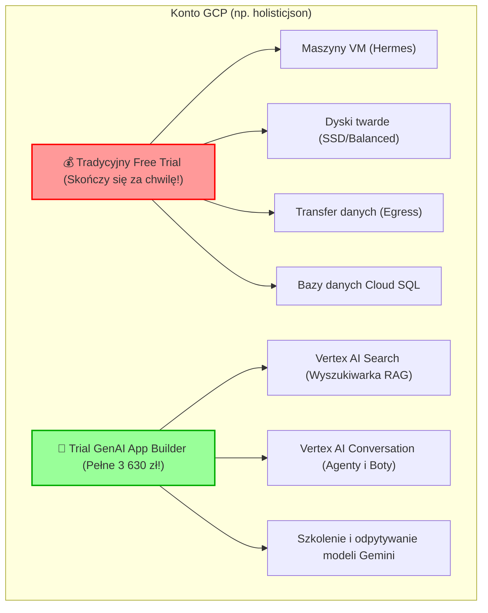

# 📊 RAPORT CFO: Optymalizacja Budżetów GCP & Plan Ratunkowy Free Trial
## Analiza finansowa i plan natychmiastowego zatrzymania odpływu środków (Jaison & Broker)

> [!CAUTION]
> **KRYTYCZNE OSTRZEŻENIE (STAN ALARMOWY):**
> Twój tradycyjny budżet **Free Trial** (na maszyny VM, dyski, bazy SQL i transfer danych) ulega wyczerpaniu:
> *   **Konto Jaison (`holisticjson@gmail.com`):** Pozostało tylko **148,45 zł** (ok. 13%).
> *   **Konto Broker (`brokerholistic@gmail.com`):** Pozostało tylko **86,55 zł** (ok. 8% - **STAN ZAGROŻENIA**).
>
> Jednocześnie na obu kontach masz **nienaruszone pule GenAI App Builder** (Vertex AI Search / Conversation) o łącznej wartości **7 266,30 zł** (po ~3 630 zł na konto)!

---

## 💡 1. Zrozumieć dwa portfele (Kluczowa różnica dla Twojego budżetu)

Google Cloud Platform dzieli darmowe środki na dwie całkowicie niezależne szuflady. Jeśli jedna się skończy, usługi z niej zasilane zostaną zatrzymane, nawet jeśli w drugiej szufladzie leżą tysiące złotych!



*   **Wniosek strategiczny:** Musimy natychmiast odciążyć tradycyjną szufladę (Free Trial) poprzez usunięcie nieużywanych zasobów, przeniesienie niektórych usług do bezpłatnych pakietów (Free Tier) oraz maksymalne wykorzystanie puli GenAI (RAG i agenty) do budowania wartości.

---

## 🛡️ 2. Plan Ratunkowy CFO — Natychmiastowe zatrzymanie kosztów

Wykonaj poniższe kroki w PowerShell (po przełączeniu profilu), aby zatrzymać generowanie opłat za osierocone zasoby.

### KROK A: Czyszczenie dysków na koncie Jaison (`profile-jaison`)
Dwa stare dyski w regionie amerykańskim (`us-central1-a`) leżą bezczynnie i codziennie wysysają Twoje ostatnie 148 zł. Usuwamy je!

```powershell
# 1. Aktywuj właściwy profil
gcloud config configurations activate profile-jaison

# 2. Usuń nieużywany standardowy dysk hermes-os (30GB)
gcloud compute disks delete hermes-os --zone=us-central1-a --quiet

# 3. Usuń bardzo drogi nieużywany dysk SSD hermes-os-ssd-50gb (50GB)
gcloud compute disks delete hermes-os-ssd-50gb --zone=us-central1-a --quiet
```

### KROK B: Czyszczenie zasobników Cloud Storage (Jaison)
Usuwamy stare zasobniki testowe i poimportowe, za które Google nalicza opłaty za przechowywanie danych:

```powershell
# 1. Usuń stary zasobnik testowy
gcloud storage rm --recursive gs://holistic_kubelek

# 2. Usuń zasobnik po dawnym imporcie FAQ
gcloud storage rm --recursive gs://771359551342_283819567_us_import_content_with_faq_csv
```

---

## 📈 3. Jak przetrwać do czasu otrzymania grantów i darmowych środków?

### Strategia 1: Konsolidacja usług na jednej maszynie VM
Obecnie utrzymujesz dwie wirtualne maszyny typu `e2-medium` (koszt ok. 100 zł/miesięcznie za każdą):
1.  **Serwer Jaison** na `holisticjson@gmail.com` (europe-west1-b).
2.  **Serwer Broker** na `brokerholistic@gmail.com` (europe-west1-b).

*   **Rekomendacja CFO:** Ponieważ na koncie Broker zostało tylko **86,55 zł**, serwer `hermes-broker-core-v2` wyłączy się za około 2-3 tygodnie! 
*   **Rozwiązanie tymczasowe:** Możemy przenieść (sklonować) instancję n8n oraz bazy danych Brokera na serwer Jaison (`hermes-jaison-core-disk`), który ma nieco więcej środków (148,45 zł), i uruchomić je na jednym serwerze jako osobne kontenery Docker / instancje PM2. Jeden serwer `e2-medium` bez problemu uciągnie oba środowiska deweloperskie!

### Strategia 2: Wykorzystanie darmowych środków z konta laptopa (`gtrmgroup@gmail.com`)
Twój laptop i konto `gtrmgroup@gmail.com` (`profile-laptop` / `gtrm-project`) mają **pełne, nienaruszone środki Free Trial (1 126 zł)**!
*   Możesz założyć tam projekt i przenieść na niego część obciążeń (np. bazy testowe, kontenery deweloperskie), oszczędzając resztki budżetu na kontach produkcyjnych.

### Strategia 3: Przejście na Google Cloud Run (Złoty standard bezkosztowy)
Wszystkie Twoje aplikacje frontendowe i backendy API (np. komunikator Jaison, dashboardy Streamlit, strony WWW klientów) powinny być wdrażane przez **Google Cloud Run**, a nie na maszynach VM!
*   **Dlaczego?** Cloud Run posiada gigantyczny **zawsze darmowy pakiet (Free Tier)**: pierwsze 2 miliony żądań miesięcznie oraz 180 000 vCPU-sekund są całkowicie bezpłatne. Jeśli nikt nie korzysta z Twojej aplikacji, koszt wynosi dokładnie **0,00 zł**! Maszyny VM pobierają opłaty za każdą sekundę działania, nawet gdy śpisz i nikt na nie nie wchodzi.

---

## 🗺️ 4. Plan wdrożenia RAG w ramach darmowych 7 200 zł z GenAI App Builder

Ponieważ pule te są w 100% nienaruszone, powinieneś przenieść ciężar przetwarzania danych na usługi z tej rodziny:

1.  **Vertex AI Search:** Zamiast budować własne, skomplikowane i zasobożerne bazy wektorowe na maszynach VM (które zużywają RAM i procesor, za które płacisz z Free Trial), wrzuć dokumenty do Cloud Storage i utwórz wyszukiwarkę semantyczną bezpośrednio w **Vertex AI Search**. Cały koszt wyszukiwania i indeksowania zostanie pokryty z darmowych 3 630 zł!
2.  **Vertex AI Conversation:** Zbuduj boty dla klientów przy użyciu wbudowanej platformy agentowej Google. Ich utrzymanie i rozmowy będą rozliczane z puli GenAI, oszczędzając Twoje środki deweloperskie.
