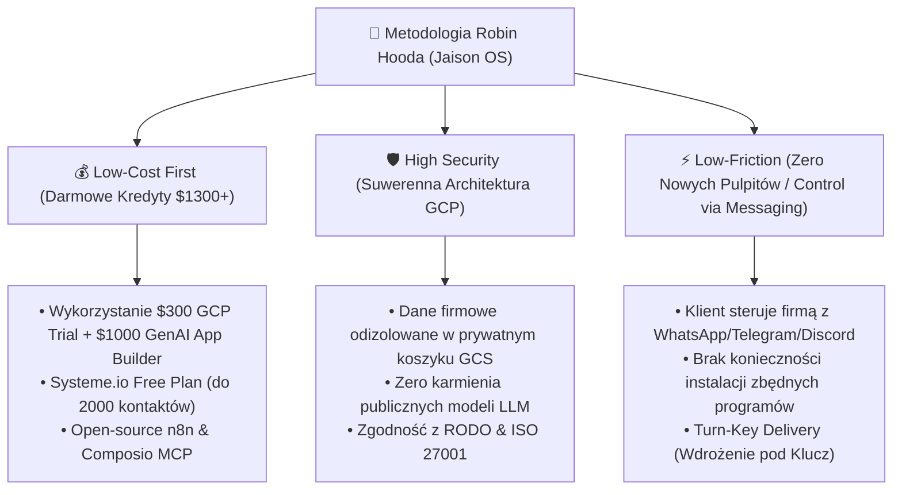

# 🏹 METODOLOGIA ROBIN HOODA: STRATEGIA CONTENTU, PRZEWAG RYNKOWYCH I INFOPRODUKTÓW (JAISON OS)

Ten dokument stanowi strategiczne repozytorium wiedzy agencji **Jaison (jaison.pl)**. Zapisuje nasze unikalne podejście architektoniczne, przewagi nad tradycyjnym rynkiem agencji marketingowo-programistycznych oraz kompletny plan tworzenia postów, lead magnetów i produktów cyfrowych (E-booków) w standardzie **Ghost v2** (NLP Copywriting & ADHD-Friendly Visual Anchoring).

---

## 🎯 1. Filary Strategii "Low-Cost, High-Security, Low-Friction"

---

## 🥊 2. Demaskowanie Kartelu Agencji Trad-Marketingowych (Demaskowanie vs Elegancja Pytaniowa)

Tradycyjne agencje i software house'y wciskają klientom:
1. **Pętlę Uzależnienia (Retainery 5 000 - 15 000 PLN/mies.):** Pobierają stały abonament za ręczne wprowadzanie poprawek lub utrzymanie prostych aplikacji.
2. **Narzucanie Drogiego SaaS-u:** Każdy proces to kolejna subskrypcja (HubSpot $500/msc, Zapier $100/msc, Make, Mailchimp).
3. **Skomplikowane Dashboards:** Zmuszają zespół klienta do wielogodzinnych szkoleń z nowych programów, powodując opór pracowników.

### ❓ Strategia Pytań Robin Hooda w Social Media (Delikatny NLP Hook):
Zamiast agresywnego ataku, publikujemy posty zadające skłaniające do myślenia pytania:

- ❓ *"Dlaczego płacisz 2000 zł miesięcznie za narzędzia do automatyzacji, skoro Google przyznaje 3600 zł darmowych kredytów na prywatną chmurę AI, która wykonuje tę samą pracę w 1 sekunkdę?"*
- ❓ *"Czy zastanawiałeś się kiedyś, co dzieje się z poufnymi umowami Twojej firmy, gdy wklejasz je do darmowych publicznych chatbotów w internecie?"*
- ❓ *"Dlaczego Twoi pracownicy mają spędzać 15 godzin tygodniowo na ręcznym przepisywaniu maile do CRM-u, skoro możesz sterować całą bazą bezpośrednio głosówką z WhatsAppa?"*

---

## 📘 3. Koncepcje Lead Magnetów i Infoproduktów (Folder `11_digital_product`)

### 📕 Lead Magnet #1 (E-Book PDF / Checklist):
**Tytuł:** *"Cichy Auto-Pilot B2B: Jak Odzyskać 20 Godzin w Tygodniu i Zredukować Koszty AI do 0 PLN z Wykorzystaniem Kredytów Google Cloud"*
- **Format:** Interaktywny PDF z kodami QR i uziemieniem VAK.
- **Zawartość:**
  1. Audyt tarcia czasowego w Twojej firmie (Test 5 Pytań).
  2. Jak odebrać $300 + $1000 darmowych środków od Google bez karty kredytowej.
  3. Schemat n8n "WhatsApp ➔ CRM ➔ Oferta w 60 sekund" (do pobrania gotowy JSON).

### 📗 Lead Magnet #2 (Case Study / Video Audit):
**Tytuł:** *"Od Chaosu w Mailach do Wykonania w WhatsAppie: Jak Przekształciliśmy Ręczną Obsługę Leada w 60-Sekundowy System Ofertowy"*
- **Format:** HTML Interactive Case Study z suwakami ROI i nagraniem Loom.
- **Zawartość:**
  1. Analiza "Przed i Po" w branży usługowej / MLM / E-commerce.
  2. Jak uniknąć kar RODO i wycieku danych firmowych przy wdrażaniu botów AI.

---

## 🧠 4. Odpowiedź Architektoniczna: Sztywne Ścieżki vs Elastyczność Asystentów Dashboardu

### ❓ Pytanie Tomasza:
*"Czy agent w Dashboardzie (zastępujący Perplexity / Gemini Pro) ma sztywną ścieżkę rozumowania krok po kroku (jak bity intake'u), czy jest w 100% elastyczny jak Gemini Pro czy NotebookLM?"*

### 💡 Odpowiedź Techniczna (Dynamic Reasoning Loop):

1. **Bot Intake'owy (`Jaison Auditor Bot` w Dialogflow CX):**  
   Działa w trybie **Playbook Routine** (pół-sztywna ścieżka). Jego celem jest pewne i bezbłędne poprowadzenie klienta przez 5 kroków, zebranie danych i przekazanie ich do bazy CRM.

2. **Asystenci w Dashboardzie Streamlit (`Gemini Pro Studio`, `Research Engine`, `Legal & Finance Engine`):**  
   **SĄ W 100% ELASTYCZNI! (Dynamic Reasoning Agentic Loop).**
   - Nie posiadają sztywnego scenariusza.
   - Posiadają dostęp do **Google Search Grounding (Web Store)** — przeszukują żywy internet w czasie rzeczywistym (dokładnie jak Perplexity Pro!).
   - Posiadają dostęp do Twoich koszyków **GCS Storage & Obsidian Vault (Data Store)** — czytają Twoje pliki, analizują poufne umowy i dokumenty (dokładnie jak NotebookLM!).
   - Odpowiadają płynnie i dynamicznie na każde skomplikowane pytanie, łącząc wiedzę z Twojej bazy z wiedzą z internetu — w 100% suwerenny i bezpieczny sposób w Twoim projekcie GCP!
