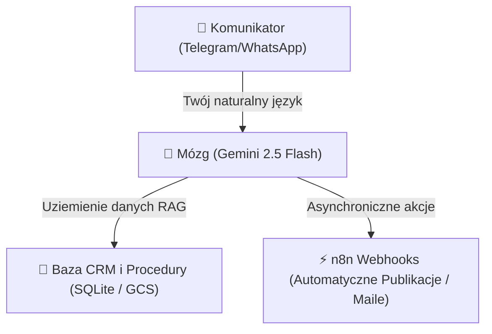

# Zewnętrzny Mózg: Jak okiełznałem paraliż decyzyjny i ADHD za pomocą suwerennego bota (bezkosztowo na GCP)

Słuchaj uważnie, bo ta branża od lat doi Cię z kasy na tym samym patencie. 

Tradycyjne agencje marketingowe, software house'y i "konsultanci IT" uwielbiają komplikować rzeczy. Tworzą wokół sztucznej inteligencji nimb tajemnicy, wmawiając Ci, że wdrożenie prostego systemu automatyzacji w firmie wymaga zespołu programistów, pół roku pracy i budżetu rzędu 50 000 złotych. 

Rozbierzmy tę iluzję na części pierwsze. 

<strong>To jest bezczelne kłamstwo, które ma uzasadnić ich gigantyczne stawki godzinowe i uzależnić Twój biznes od ich stałego wsparcia.</strong>

Prawda jest taka, że technologia jest dziś tańsza i bardziej dostępna niż kiedykolwiek. Jako facet z ADHD, który na co dzień walczy z natłokiem myśli, chaosem kognitywnym i paraliżem decyzyjnym, musiałem znaleźć rozwiązanie, które nie wymaga ode mnie spędzania godzin przed ekranem komputera i pilnowania miliona otwartych kart w przeglądarce. 

Tak narodził się <strong>Jaison OS</strong> — mój suwerenny cyfrowy Co-Pilot, który żyje bezpośrednio w moim komunikatorze (Telegram/WhatsApp) i kontroluje całą agencję za mnie.

W tym krótkim przewodniku zdejmiemy klapki z oczu i pokażę Ci dokładnie, jak za pomocą darmowych środków chmurowych od Google ($300 w darmowym trialu + $1000 na usługi GenAI) zbudować własny, zewnętrzny płat kognitywny, który przejmie od Ciebie 80% rutynowej pracy operacyjnej.

---

## 📍 1. Dlaczego Twój mózg cierpi? (Wizualna diagnoza tarcia)

Tradycyjny model pracy opiera się na ciągłym przełączaniu kontekstu (Context Switching). Przeciętny przedsiębiorca korzysta z 7 różnych aplikacji dziennie (CRM, Slack, Gmail, Trello, kalendarz, narzędzia do wideo, social media).

Dla osoby o wysokiej kreatywności (lub z ADHD) to jest powolna śmierć dla produktywności. Każde powiadomienie, każde otwarcie nowej karty w przeglądarce to wydatek energetyczny, który drenuje Twój poziom dopaminy. Pod koniec dnia jesteś wykończony, choć masz poczucie, że nie posunąłeś kluczowych spraw do przodu.

### Porównanie Architektury Pracy:

```
[ CHAOTYCZNY MODEL KLASYCZNY ]
Tomasz ➔ Otwiera CRM ➔ Kopiuje dane ➔ Otwiera Gmail ➔ Pisze maila ➔ Otwiera Trello ➔ Przesuwa kartę ➔ Frustracja i paraliż.

[ LOW-FRICTION MODEL JAISON OS ]
Tomasz ➔ Pisze 1 zdanie na Telegramie ➔ Jaison OS automatycznie aktualizuje CRM, generuje ofertę, wysyła maila i melduje o sukcesie.
```

---

## 🛡️ 2. Demaskowanie Kartelu: Jak agencje naciągają Cię na automatyzacje?

Zanim podpiszesz jakąkolwiek umowę na wdrożenie systemów AI, sprawdź te 3 najczęstsze triki, którymi konkurencja nabija rachunki:

1. <strong>"Dedykowany kod od zera"</strong> — Wmawiają Ci, że Twoja firma jest tak unikalna, że potrzebujesz dedykowanego systemu napisanego w Pythonie przez zespół deweloperów. W rzeczywistości darmowe narzędzia open-source (takie jak <strong>n8n</strong>) posiadają gotowe integracje ze wszystkim, co istnieje, i pozwalają na wyklikanie logiki w 30 minut.
2. <strong>Sztuczne zawyżanie opłat za chmurę</strong> — Agencje konfigurują serwery w sposób mało wydajny, przez co płacisz setki dolarów miesięcznie za utrzymanie maszyn. Jaison OS działa na infrastrukturze <strong>Serverless (Cloud Run + GCS)</strong>, co oznacza, że kiedy nie korzystasz z bota, system skaluje się do zera i kosztuje Cię równe <strong>0 PLN</strong>.
3. <strong>Ukryte marże na modelach językowych</strong> — Sprzedają Ci dostęp do swoich "autorskich paneli AI" z abonamentem, narzucając marżę na każde zapytanie do GPT-4 czy Gemini. U nas podpinasz swój własny klucz API bezpośrednio z AI Studio, płacąc grosze bezpośrednio do Google, bez pośredników.

---

## ⚙️ 3. Serce Technologii: Jak działa Jaison OS?

Jaison OS to nie jest zwykły bot, który pluje gotowymi szablonami. To jest zamknięta, samodoskonaląca się pętla kognitywna (Memory Loop), oparta na 3 głównych filarach:



### Krok 1: Eliminacja Tarcia (Input)
Nie otwierasz komputera. Nie logujesz się do systemów. Piszesz na czacie: 
<em>"Wpadł klient Janusz, warsztat samochodowy z Łodzi, chce audyt SEO."</em> 
Twój cyfrowy Co-Pilot rozumie intencję i natychmiast rusza do pracy.

### Krok 2: Uziemienie i Kontekst (Brain)
Bot nie zmyśla odpowiedzi. Odpytuje lokalną bazę danych <code>local_crm.db</code> oraz Twoje pliki procedur w chmurze Google Cloud Storage. Zna historię Twoich interakcji i uczy się z każdą wiadomością. Jeśli go poprawisz: <em>"Zmień ton na bardziej surowy"</em>, bot zapamięta to na zawsze w pliku <code>hermes_memory.json</code>.

### Krok 3: Błyskawiczna Egzekucja (Output)
Za pomocą webhooków in n8n bot wywołuje rzeczywiste API Google Maps (Localo), robi zrzut ekranu siatki widoczności klienta w Łodzi, zaprzęga model językowy do wyciągnięcia błędów na jego wizytówce, generuje gotowy raport PDF i odsyła go bezpośrednio Tobie lub klientowi w ułamku sekundy.

---

## 🎁 4. Twój darmowy krok do Wolności: Ukradnij te blueprinty!

Nie chcemy Twoich pieniędzy na start. Chcemy, abyś poczuł fizyczną ulgę, gdy zrzucisz ze swoich barków nudną pracę operacyjną.

Wejdź na stronę <strong>go.jaison.pl</strong> i odbierz bezpłatną paczkę:
* <strong>n8n Blueprint "ManyChat Killer"</strong> — zautomatyzuj wiadomości prywatne i zbieraj leady bezpośrednio z komentarzy na LinkedIn.
* <strong>Skaner Google Business Profile</strong> — gotowy skrypt, który prześwietli Twoją konkurencję w mapach Google za darmo.

Jeśli czujesz, że chaos kognitywny w Twojej firmie blokuje Twój wzrost i chcesz wdrożyć suwerenny system Jaison OS pod klucz — nie trać czasu na czytanie kolejnych poradników.

Złap mnie bezpośrednio na 15-minutowy, asynchroniczny wywiad telefoniczny lub WhatsApp. Bez lania wody, bez sprzedaży – zrobimy brutalną diagnozę Twoich procesów:

👉 **Telefon / WhatsApp: +48 791 636 644**
👉 **Agencja Jaison: jaison.pl**

---
<strong>Robimy to co ważne. Resztę robi kod.</strong>
