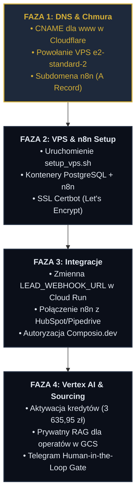

# 🗺️ INSTRUKCJA I ROADMAPA WDROŻENIOWA: HOLISTYCZNY BROKER
## *Kompletny Przewodnik Krok po Kroku (ADHD-Friendly, Strukturalny)*

---

> [!NOTE]
> Ta instrukcja została stworzona na podstawie analizy Twoich aktualnych rekordów DNS w Cloudflare (widocznych na przesłanych zrzutach ekranu). Wszystkie kroki są ustrukturyzowane logicznie, podzielone na fazy i przygotowane do natychmiastowego wykonania.

---

## 🗺️ GŁÓWNA ROADMAPA WDROŻENIA




---

## 🛠️ SZCZEGÓŁOWA INSTRUKCJA OPERACYJNA

### 🌐 FAZA 1: Konfiguracja Cloudflare i Powołanie VPS
*Cel: Naprawienie błędów przekierowań strony głównej, przygotowanie domeny pod n8n i uruchomienie serwera.*

#### **Krok 1.1: Fix błędu `www.holistycznybroker.pl` (Krytyczny)**
Zgodnie z rekomendacją Cloudflare na Twoim zrzucie ekranu, użytkownicy wpisujący adres z `www` otrzymają błąd. Naprawmy to:
1. W panelu Cloudflare kliknij niebieski przycisk **`+ Add record`**.
2. Wypełnij pola następująco:
   * **Type:** `CNAME`
   * **Name:** `www`
   * **Target:** `holistycznybroker.pl`
   * **Proxy status:** 🟠 *Proxied* (Pomarańczowa chmurka)
   * **TTL:** `Auto`
3. Kliknij **`Save`**. Teraz ruch z `www` będzie automatycznie i bezpiecznie kierowany na Twój serwer Cloud Run.

#### **Krok 1.2: Powołanie maszyny wirtualnej (GCP Compute Engine) — Metoda Szybka (Cloud Shell)**
Najprostszym, najszybszym i bezbłędnym sposobem na stworzenie maszyny jest użycie **Google Cloud Shell** (darmowego terminala wbudowanego w przeglądarkę GCP):
1. Zaloguj się do **Google Cloud Console** na koncie `brokerholistic@gmail.com`.
2. Upewnij się, że w lewym górnym rogu masz wybrany projekt **`holistic-broker`**.
3. W prawym górnym rogu paska nawigacyjnego kliknij ikonę **Cloud Shell** (wygląda jak czarny prostokąt z wpisem `>_`).
4. Po uruchomieniu terminala na dole ekranu, wklej poniższą kompletną komendę `gcloud` i naciśnij **Enter**:
   ```bash
   gcloud compute instances create hermes-broker-core-v2 \
       --project=holistic-broker \
       --zone=europe-west1-b \
       --machine-type=e2-medium \
       --network-interface=network-tier=PREMIUM,subnet=default \
       --maintenance-policy=MIGRATE \
       --provisioning-model=STANDARD \
       --scopes=https://www.googleapis.com/auth/cloud-platform \
       --image-family=ubuntu-2204-lts \
       --image-project=ubuntu-os-cloud \
       --boot-disk-size=50GB \
       --boot-disk-type=pd-balanced \
       --boot-disk-device-name=hermes-broker-core-v2 \
       --tags=http-server,https-server \
       --labels=env=dev,project=holistic-broker
   ```
5. Po około 30-45 sekundach w terminalu wyświetli się tabela podsumowująca. **Zapisz i skopiuj wartość z kolumny `EXTERNAL_IP`** (Twój wygenerowany adres IP to: **`34.77.157.191`**).

#### **Alternatywna Metoda Manualna (Przeglądarka GCP):**
Jeśli wolisz wyklikać maszynę ręcznie, ustaw te parametry:
* **Nazwa:** `hermes-broker-core-v2`
* **Region:** `europe-west1` (Belgium) | **Strefa (Zone):** `europe-west1-b`
* **Seria:** `E2`
* **Typ maszyny:** **`e2-medium` (2 vCPU, 4 GB RAM)** — *Wersja zoptymalizowana kosztowo (Low-Cost).*
* **Dysk rozruchowy (Boot disk):** Kliknij *Zmień (Change)*:
  * **System operacyjny:** `Ubuntu`
  * **Wersja:** `Ubuntu 22.04 LTS`
  * **Typ dysku rozruchowego:** **`Balanced persistent disk`** (Zbalansowany dysk trwały SSD).
  * **Rozmiar (GB):** **`50`** (SSD pod stabilną bazę danych i logi).
* **Zapora sieciowa (Firewall):** Zaznacz **`Allow HTTP traffic`** oraz **`Allow HTTPS traffic`**.
* Kliknij **`Utwórz (Create)`** i skopiuj **Zewnętrzny adres IP (External IP)**.

#### **Krok 1.3: Konfiguracja subdomeny dla n8n w Cloudflare**
Gdy masz już IP swojej nowej maszyny (**`34.77.157.191`**):
1. W panelu Cloudflare kliknij **`+ Add record`**.
2. Wypełnij pola dokładnie tak:
   * **Type:** `A`
   * **Name:** `n8n`
   * **IPv4 address:** **`34.77.157.191`**
   * **Proxy status:** ⚪ *DNS only* (Szara chmurka) — **Ważne:** *Musi być szara na czas instalacji, aby Certbot Let's Encrypt na serwerze VPS mógł wygenerować dla Ciebie bezpieczny certyfikat SSL (HTTPS).*
3. Kliknij **`Save`**.

---

### 🐳 FAZA 2: Instalacja n8n i Postgres na VPS
*Cel: Postawienie silnika automatyzacji oraz bazy danych w 100% w architekturze kontenerowej.*

#### **Krok 2.1: Połączenie z VPS i wgranie plików**
1. Połącz się ze swoją maszyną przez SSH (np. klikając przycisk "SSH" bezpośrednio w konsoli Google Cloud przy Twojej maszynie).
2. Stwórz katalog dla instalacji i przejdź do niego:
   ```bash
   sudo mkdir -p /opt/n8n-broker && sudo chown -R $USER:$USER /opt/n8n-broker && cd /opt/n8n-broker
   ```
3. Przenieś lub stwórz na serwerze pliki instalacyjne z katalogu [`C:\Aplikacje MVP\Holistyczny Broker\vps\`](file:///C:/Aplikacje%20MVP/Holistyczny%20Broker/vps/):
   * Stwórz plik `docker-compose.yml`: `nano docker-compose.yml` (wklej zawartość pliku lokalnego, zapisz `Ctrl+O`, wyjdź `Ctrl+X`).
   * Stwórz plik `setup_vps.sh`: `nano setup_vps.sh` (wklej zawartość, zapisz i wyjdź).
   * Stwórz plik `nginx_n8n.conf`: `nano nginx_n8n.conf` (wklej zawartość, zapisz i wyjdź).

#### **Krok 2.2: Uruchomienie automatycznego instalatora**
1. Nadaj uprawnienia wykonawcze dla skryptu i uruchom go jako root:
   ```bash
   chmod +x setup_vps.sh && sudo ./setup_vps.sh
   ```
2. Skrypt automatycznie:
   * Zaktualizuje system i zainstaluje niezbędne pakiety (Docker, Docker Compose, Nginx, Certbot).
   * Skonfiguruje zaporę sieciową UFW (zamknie wszystkie porty oprócz 22, 80 i 443).
   * Wygeneruje silne, losowe hasło do bazy danych PostgreSQL i zapisze je w pliku `.env`.
   * Skonfiguruje serwer Nginx jako Reverse Proxy dla n8n z obsługą WebSockets.
   * Uruchomi n8n i PostgreSQL w kontenerach Docker.

#### **Krok 2.3: Instalacja darmowego certyfikatu SSL (HTTPS)**
1. Po zakończeniu skryptu i upewnieniu się, że rekord `n8n` w Cloudflare jest rozpropagowany, uruchom Certbota:
   ```bash
   sudo certbot --nginx -d n8n.holistycznybroker.pl
   ```
2. Podaj swój adres e-mail, zaakceptuj regulamin. Certbot automatycznie wykryje konfigurację Nginx, wygeneruje certyfikat SSL i zrestartuje serwer.
3. **Gratulacje!** Wejdź w przeglądarce na: **`https://n8n.holistycznybroker.pl`** i załóż swoje konto administratora.
4. (Opcjonalnie) Po pomyślnym wygenerowaniu SSL, możesz wrócić do Cloudflare i zmienić chmurkę przy rekordzie `n8n` na 🟠 *Proxied* (Pomarańczowa) dla dodatkowej ochrony przed atakami DDoS.

---

### 🔗 FAZA 3: Podłączenie "Orurowania" (Piping) i Integracji
*Cel: Spięcie strony internetowej z silnikiem n8n oraz konfiguracja platformy narzędziowej Composio.*

#### **Krok 3.1: Połączenie Webhooka ze stroną internetową**
1. Zaloguj się do swojego n8n na serwerze.
2. Kliknij **`Create Workflow`** -> Dodaj węzeł **`Webhook`**.
3. Ustaw parametry:
   * **Method:** `POST`
   * **Path:** `lead` (Twój adres webhooka to teraz: `https://n8n.holistycznybroker.pl/webhook/lead`).
4. Skopiuj **Production URL** tego webhooka.
5. Przejdź do konsoli Google Cloud, do usługi **`Cloud Run`** dla projektu `holistic-broker`.
6. Wybierz swoją usługę backendu (`broker-backend`) -> kliknij **`Edit & Deploy New Revision`**.
7. Przejdź do zakładki zmiennych środowiskowych (Variables) i ustaw:
   * **Nazwa zmiennej:** **`LEAD_WEBHOOK_URL`**
   * **Wartość:** *Wklej skopiowany adres webhooka z n8n.*
8. Kliknij **`Deploy`**. Od teraz każde wypełnienie formularza na stronie `holistycznybroker.pl` natychmiastowo wyśle ustrukturyzowane dane (JSON) prosto do Twojego n8n na serwerze!

#### **Krok 3.2: Konfiguracja Composio.dev**
1. Wejdź na **[Composio.dev](https://composio.dev)** i zaloguj się.
2. Przejdź do sekcji **Tools** i aktywuj:
   * **Firecrawl / Apify** (do bezwysiłkowego scrapowania ofert).
   * **Clearbit & Hunter.io** (do profilowania i weryfikacji maili inwestorów).
   * **SignWell** (do obsługi e-podpisów umów NDA).
   * **HubSpot** lub **Pipedrive** (Twój CRM).
3. Pobierz API Key z Composio i dodaj go do n8n (używając dedykowanego węzła "Composio" w n8n).

---

### 🧠 FAZA 4: Vertex AI Search i Flota Agentyczna
*Cel: Aktywacja darmowych środków i wdrożenie inteligentnych asystentów sourcingowych.*

#### **Krok 4.1: Uruchomienie Vertex AI Search (Kredyty 3 635,95 PLN)**
1. Zaloguj się w konsoli Google Cloud na konto `brokerholistic@gmail.com`.
2. W wyszukiwarce na górze wpisz **`AI Applications`** (dawna nazwa Vertex AI Search and Conversation).
3. Kliknij **`Enable API`**.
4. Przejdź do: **`Search & Conversation -> Create App`**.
5. Wybierz typ: **`Search`** (Wyszukiwarka semantyczna RAG).
6. Nazwij ją np. `holistyczny-broker-rag`.
7. **Utwórz dwa źródła danych (Data Stores):**
   * **Data Store 1 (Publiczny):** Podepnij adres URL `https://holistycznybroker.pl`. Google automatycznie zeskrapuje stronę i nakarmi nią bota na stronie głównej.
   * **Data Store 2 (Prywatny - Due Diligence):** Utwórz nowy **Cloud Storage Bucket** (np. `gs://holistyczny-broker-operaty`). Podepnij go pod Vertex AI Search. Tutaj będziesz wgrywać poufne operaty szacunkowe i MPZP.
8. Po utworzeniu pierwszej aplikacji, w sekcji **`Billing -> Credits`** automatycznie aktywuje się Twój promocyjny kredyt **3 635,95 zł**.

#### **Krok 4.2: Konfiguracja Bramki LiteLLM i Floty**
1. Na serwerze VPS stwórz plik konfiguracyjny `/opt/n8n-broker/litellm_config.yaml` zgodnie z wytycznymi w PRD.
2. Wygeneruj klucz konta usługowego GCP (Service Account Key) z uprawnieniami Vertex AI i zapisz go jako `/opt/n8n-broker/gcp-sa-key.json`.
3. Uruchom kontener LiteLLM, który będzie tłumaczył zapytania z n8n na super-bezpieczne API Vertex AI (Gemini 2.5 Flash / Pro).
4. **Wdrożenie Agenta 13I (Human-in-the-Loop):**
   * Załóż bota na Telegramie przez `@BotFather`.
   * Skopiuj token bota i dodaj go jako zmienną w n8n.
   * Skonfiguruj węzeł Telegrama w n8n tak, aby po każdym udanym matchingu oferty (Scoring > 80 pkt) system wysyłał do Ciebie prywatną wiadomość z przyciskami: **`[Zatwierdź i Wyślij Oferty]`** oraz **`[Odrzuć / Popraw]`**.

---

### 📊 METRYKA KONTROLI POSTĘPÓW (ADHD CHECKLIST)

| Krok | Zadanie | Odpowiedzialny | Status | Weryfikacja |
| :---: | :--- | :---: | :---: | :--- |
| **1** | CNAME dla `www` w Cloudflare | Tomasz | [ ] | Strona `www.holistycznybroker.pl` ładuje się bez błędu |
| **2** | Uruchomienie VM `e2-standard-2` | Tomasz | [ ] | Instancja ma status "Running" w GCP |
| **3** | Uruchomienie `./setup_vps.sh` | Antigravity / Tomasz | [ ] | Brak błędów w konsoli, Docker działa |
| **4** | Certyfikat SSL Certbot | Tomasz | [ ] | Kłódeczka przy `https://n8n.holistycznybroker.pl` |
| **5** | Zmienna `LEAD_WEBHOOK_URL` w Cloud Run | Antigravity / Tomasz | [ ] | `/api/lead` poprawnie przekazuje dane do n8n |
| **6** | Aktywacja API Vertex AI i bazy GCS | Tomasz | [ ] | Kredyty 3 635,95 PLN są widoczne w bilingu |
| **7** | Spięcie Bramy Telegram (13I) | Antigravity | [ ] | Testowa wiadomość z bota dochodzi na Twój telefon |

---

### *Instrukcja została pomyślnie zapisana na Twoim dysku:*
📂 [**`C:\Aplikacje MVP\Holistyczny Broker\INSTRUKCJA_WDROZENIA_ROADMAP.md`**](file:///C:/Aplikacje%20MVP/Holistyczny%20Broker/INSTRUKCJA_WDROZENIA_ROADMAP.md)
