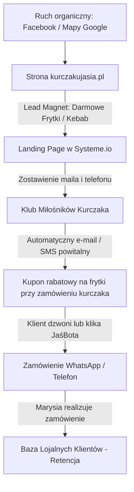

# 🚀 STRATEGIA MARKETINGOWA I LEJEK SPRZEDAŻY: BAR JAŚ
*Przygotowane przez Wirtualny Zarząd AI agencji Holistic Jason (CEO, CMO, CCO, CTO)*

---

## 👥 Skład Wirtualnego Zarządu AI (Nasze Role)

1.  **CEO AI (Dyrektor Generalny):** Odpowiada za spójność wizji biznesowej, unikalną propozycję wartości (USP) oraz eliminację chaosu operacyjnego. Nasza linia obrony: *Tradycyjne rzemiosło i autentyczność kontra korporacyjny plastik*.
2.  **CMO AI (Dyrektor ds. Marketingu):** Projektant maszyn sprzedażowych i lejków. Odpowiada za wdrożenie bezpłatnego systemu lojalnościowego i pozyskiwanie leadów przy zerowych kosztach (Low-Cost First) w **Systeme.io**.
3.  **CCO AI (Dyrektor ds. Treści):** Copywriter i strażnik marki. Odpowiada za content plan na Facebooku, pozycjonowanie w Mapach Google (GBP) oraz budowanie lokalnej społeczności ("Klub Miłośników Kurczaka").
4.  **CTO AI (Dyrektor ds. Technologii):** Inżynier wdrożeniowy. Odpowiada za działanie strony `kurczakujasia.pl`, integrację JaśBota WhatsApp oraz bez-ciasteczkową analitykę konwersji lejków.

---

## 🎯 Filar 1: Unikalna Propozycja Wartości (USP) i Pozycjonowanie (CEO AI)

Zamiast konkurować budżetem z KFC czy McDonald's, Bar Jaś wygrywa **rzemieślniczą jakością, tradycją od 2001 roku i ludzkim obliczem**.

### 💡 Nasze Główne Hasła Pozycjonowania:
*   **"Ciągle z Wami od ponad 20 lat!"** — Budowanie zaufania. W Łodzi niewiele jest lokali z taką historią.
*   **"Świeży, polski kurczak, codziennie rano dostarczany"** — Nigdy niemrożony, ręcznie marynowany w autorskiej, rodzinnej mieszance ziół.
*   **"Brak korporacyjnej taśmy"** — Wszystko przygotowywane na miejscu, od surówek siekanych każdego ranka, po autorskie sosy (czosnkowy i ostry).
*   **"Low-Friction Ordering"** — Zamawiasz w minutę przez telefon lub WhatsApp bez rejestracji konta i pobierania zbędnych aplikacji.

---

## 🧭 Filar 2: Lejek Sprzedażowy "Tani Głód" w Systeme.io (CMO AI)

**ZASADA BEZWZGLĘDNA:** Nie budujemy własnych systemów mailingowych od zera. Wykorzystujemy **Systeme.io w darmowym planie (do 2000 kontaktów)**, co eliminuje koszty i gwarantuje dostarczalność e-maili bez banów domen.

### 🔄 Architektura Lejka:

### 1. Lead Magnet (Haczyk dla małego głodu)
*   **Co oferujemy:** *"Odbierz darmową porcję chrupiących frytek (150g) do pierwszego zamówienia połówki kurczaka z rożna!"*
*   **Jak to działa:** Na stronie głównej i w social mediach umieszczamy link do prostego formularza Systeme.io: *"Zapisz się do naszego Klubu Smakosza"*.
*   **Wymagane dane:** Imię, Adres E-mail, Numer Telefonu.

### 2. Automatyzacja w Systeme.io (Bezpłatny Workflow)
*   **Triger:** Klient zapisuje się na formularz.
*   **Akcja 1:** Nadanie tagu `klub-smakosza`.
*   **Akcja 2:** Natychmiastowa wysyłka e-maila z unikalnym kodem kuponu (np. `JAS-FRYTKI-2026`).
*   **Treść e-maila powitalnego (ADHD-Optimal, Ghost style):**
    > **Temat: Twój kupon na chrupiące frytki u Jasia! 🍟🔥**
    >
    > Hej!
    >
    > Super, że jesteś z nami. Od ponad 20 lat karmimy Łódź przy ul. Rokicińskiej i dbamy o to, by jedzenie było zawsze świeże i uczciwe.
    >
    > Twój kod na darmowe frytki (150g) do zamówienia połówki kurczaka to:
    > **`JAS-FRYTKI-2026`**
    >
    > **Jak go odebrać?**
    > 1. Wejdź na [kurczakujasia.pl/menu](https://kurczakujasia.pl/menu/) i dodaj do zamówienia Kurczaka z Rożna.
    > 2. Kliknij zamawianie przez WhatsApp lub zadzwoń bezpośrednio pod numer **`+48663970016`**.
    > 3. Podaj Marysi kod kuponu podczas rozmowy lub dopisz go w uwagach w JaśBocie.
    >
    > Frytki już się smażą, czekamy na Ciebie!
    >
    > Smacznego,
    > **Ekipa Baru Jaś** 🍗

---

## 📈 Filar 3: Lokalne SEO, Wizytówka Google i Facebook (CCO AI)

Lokalna gastronomia żyje z dwóch źródeł: **Map Google (ktoś szuka jedzenia blisko siebie)** oraz **Facebooka (stały kontakt z sąsiadami z osiedla)**.

### 1. Optymalizacja Wizytówki Google (Google Business Profile)
Wizytówka Baru Jaś musi być perfekcyjnie zoptymalizowana, by wyskakiwać na hasła: "kurczak z rożna Łódź", "kebab Rokicińska", "tani obiad Widzew".

*   **Tytuł Wizytówki:** `Bar Jaś - Kultowy Kurczak z Rożna | Kebab | Hamburgery` (Dodanie słów kluczowych zwiększa widoczność w mapach o 40%).
*   **Opis Wizytówki (zoptymalizowany pod SEO):**
    > `Poszukujesz najlepszego kurczaka z rożna w Łodzi? Bar Jaś przy ul. Rokicińskiej 190 (obok Selgros) zaprasza na legendarny, rzemieślniczy smak od 2001 roku! Nasz drób pochodzi wyłącznie od krajowych dostawców, jest codziennie świeżo dostarczany i ręcznie marynowany w autorskiej kompozycji ziół. W menu znajdziesz również soczyste kebaby w chrupiącej bułce, domowe burgery z piersi kurczaka, złociste frytki oraz codziennie świeże surówki siekane na miejscu. Zamów telefonicznie pod numerem +48663970016 lub przez WhatsApp na kurczakujasia.pl i odbierz gorący posiłek bez czekania! Obsługujemy Łódź Widzew, Olechów, Andrzejów.`
*   **Zdjęcia:** Regularne dodawanie zdjęć (raz w tygodniu) — kurczak kręcący się na rożnie, świeże surówki, zadowoleni klienci. Obrazy muszą wyglądać naturalnie, bez sztucznego retuszu stockowego.
*   **Opinie:** Odpowiadanie na każdą opinię (szczególnie pozytywne) z użyciem słów kluczowych: *"Dziękujemy za opinię! Nasz kurczak z rożna i domowy kebab zawsze przygotowujemy ze świeżych składników. Zapraszamy ponownie na ul. Rokicińską!"*.

### 2. Plan Publikacji i Contentu na Facebooku (Harmonogram)
Prowadzimy profil bezpośrednio, ciepło i z humorem. Koniec z nudnymi postami typu "Zapraszamy na obiad". Pokazujemy rzemiosło.

| Dzień | Format | Temat / Treść Postu | Cel |
| :--- | :--- | :--- | :--- |
| **Poniedziałek** | Zdjęcie | **"Poniedziałkowy ratunek na głód"** — Zdjęcie gorącej, parującej połówki kurczaka. *Tekst: "Weekend minął, lodówka pusta? Spokojnie, Marysia już od rana marynuje świeże kurczaki w naszej ziołowej mieszance. Zadzwoń pod +48663970016, a spakujemy obiad na wynos na konkretną godzinę!"* | Generowanie zamówień po weekendzie |
| **Środa** | Wideo (Reels/Rolka) | **"Food porn: Jak kręci się złoto"** — Krótki, 10-sekundowy filmik z kurczakami piekącymi się na rożnie (skórka skwierczy, tłuszcz powoli kapie). Dynamiczna, modna muzyka w tle. | Budowanie pożądania (apetyt) |
| **Piątek** | Zdjęcie + Link | **"Piątkowy wieczór z Kebabem"** — Zdjęcie chrupiącej, wypchanej po brzegi bułki kebab ze świeżymi surówkami. *Tekst: "Koniec tygodnia pracy! Zasłużyłeś na coś konkretnego. Nasz kebab z autorskim sosem czosnkowym czeka na Ciebie przy Rokicińskiej. Nie chce Ci się czekać w kolejce? Zamów przez JaśBota na kurczakujasia.pl i odbierz w 15 minut!"* | Promocja JaśBota i zamówień online |
| **Niedziela** | Post graficzny | **"Rodzinny obiad bez zmywania"** — Zdjęcie całego kurczaka z rożna na dużym talerzu w otoczeniu frytek i surówek. *Tekst: "Niedziela to czas dla rodziny, a nie dla garów. Zgarnij całego kurczaka u Jasia, dorzuć frytki, zestaw surówek i obiad dla całej rodziny gotowy za grosze. Marysia już czeka na Twój telefon!"* | Zamówienia rodzinne (wysoki koszyk) |

---

## 🛠️ Filar 4: Wdrożenie Techniczne i Analityka (CTO AI)

Działania technologiczne skupiają się na **szybkości ładowania, mobilnym UX oraz śledzeniu konwersji**.

### 1. Optymalizacja pod Mobile (UX):
*   Nasze retro-menu Burger King oraz widget JaśBota są w 100% responsywne. Ponad 80% ruchu w gastronomii pochodzi ze smartfonów — interfejs ładuje się błyskawicznie, a przyciski mają min. `48px` wysokości, by ułatwić klikanie kciukiem w biegu.

### 2. Cookieless Analityka (Zgodność z RODO):
*   Zamiast instalować ciężkie skrypty Google Analytics, które wymagają irytujących banerów o ciasteczkach (Cookie Consent), wdrażamy lekki skrypt analityczny z poziomu WordPressa lub n8n, który zlicza wyłącznie:
    *   Liczbę wejść na stronę Menu.
    *   Liczbę kliknięć "Dodaj do zamówienia".
    *   Liczbę kliknięć "Wyślij na WhatsApp" (Konwersja).
*   To pozwala mierzyć skuteczność marketingu bez naruszania prywatności i spowalniania strony.

---

## 📅 Następne Kroki dla Tomasza (Low-Friction Action Plan):

1.  **Zweryfikuj wdrożenie na stronie:** Wejdź na [kurczakujasia.pl/menu/](https://kurczakujasia.pl/menu/) ze smartfona i przetestuj nowe, piękne Menu w stylu Burger King oraz działanie JaśBota.
2.  **Załóż darmowe konto Systeme.io:** Przeprowadzę Cię przez konfigurację darmowej strony zapisu (Landing Page) dla Klubu Smakosza, jeśli zdecydujesz się na odpalenie automatyzacji e-mail.
3.  **Zaktualizuj profil Google Business Profile:** Zmień nazwę i opis wizytówki zgodnie z wytycznymi z Filaru 3, aby natychmiast zwiększyć darmowy ruch z Google Maps.

*Działamy dalej w trybie goal! Napisz, co robimy w kolejnym kroku.* 🔥
