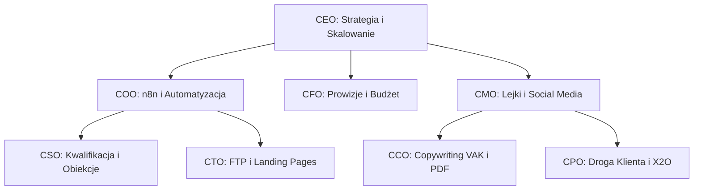

# 📘 BIBLIA TWÓRCY MLM — LIFEWAVE & X2O
### Kompleksowy Podręcznik Budowy Autonomicznego Systemu Rekrutacji i Sprzedaży w Strukturach MLM pod Szyldem hello@jaison.pl
*Dedykowane dla Dyrektorów AI Agencji Jaison oraz Partnerów Biznesowych zespołu Tomasza Dudy*

---

## 1. WPROWADZENIE: NOWA ERA MULTI-LEVEL MARKETINGU (MLM)
Tradycyjny marketing sieciowy (MLM) opierał się na fizycznych spotkaniach, dzwonieniu po liście „stojących w korku” znajomych i ciągłym odpieraniu oporu. **W agencji Jaison redefiniujemy ten model.** Łączymy klasyczne, nienaruszone zasady budowania relacji i duplikacji z nowoczesną technologią: sztuczną inteligencją (AI), automatyzacją procesów (n8n) oraz precyzyjnymi lejkami sprzedażowymi (Systeme.io).

### Filozofia „Low Cost, High Trust”
Wdrażamy model oparty na edukacji i dostarczaniu wartości. Naszym celem jest ułatwienie życia partnerom i klientom poprzez eliminację barier operacyjnych (ADHD-friendly) oraz darmowe testowanie rozwiązań (polityka low-cost). Podstawę naszej oferty produktowej stanowią dwa rewolucyjne rozwiązania:
1. **Fototerapia LifeWave (Plastry X39/X49)** — aktywacja komórek macierzystych za pomocą światła podczerwonego.
2. **X2O Molecular Hydrogen & Light-Frequency System** — zaawansowany system filtracji, strukturyzacji i nasycania wody wodorem molekularnym (Premiera: Kwiecień 2026).

---

## 2. FILARY MINDSETU LIDERA I METODA 1-3-5-7
Sukces w MLM nie jest kwestią przypadku, lecz statystyki i psychologii. Lider to osoba, która reprezentuje niezłomną postawę i długoterminową lojalność wobec swojego biznesu.

### Model 1-3-5-7 (Zasada Kompetencji i Czasu)
Zrozumienie osi czasu w biznesie MLM chroni przed szybkim wypaleniem i rezygnacją:
*   **1 ROK:** Tyle czasu potrzebujesz, aby stać się kompetentnym partnerem. Poznasz produkty, nauczysz się rozmawiać z ludźmi, opanujesz podstawy rekrutacji i zaczniesz zarabiać pierwsze prowizje.
*   **3 LATA:** Przy konsekwentnym działaniu w wymiarze part-time, po 3 latach jesteś w stanie zastąpić swoje dotychczasowe źródło dochodu i przejść na pełny etat w MLM.
*   **5 LAT:** Tyle czasu potrzeba, aby zbudować stabilną, wielotysięczną strukturę i osiągnąć sześciocyfrowe zarobki roczne (dochód pasywny).
*   **7 LAT:** Stajesz się światowej klasy ekspertem w branży marketingu sieciowego, zdolnym do szkolenia liderów na poziomie międzynarodowym.

### Postawa Lojalności i Cykliczności
*   **Lojalność:** Budowanie biznesu wymaga skupienia. Rozpraszanie energii na kilka projektów MLM jednocześnie niszczy zaufanie i uniemożliwia duplikację. Skupiamy się w 100% na LifeWave.
*   **Cykliczność:** Biznes ma swoje sezony (wzrosty, stabilizacje, spadki). Prawdziwy lider wie, że kluczem jest stałość działań niezależnie od fazy cyklu.

---

## 3. CODZIENNE METODY DZIAŁANIA (DMO) — SYSTEM 3-3-1
Najważniejszy nawyk w marketingu sieciowym to codzienna, systematyczna praca operacyjna. Bez codziennego DMO (Daily Method of Operation) nie ma mowy o wzroście struktury.

### System 3-3-1 (Codzienne Minimum)
Każdy partner dążący do sukcesu zobowiązany jest do wykonywania prostego planu każdego dnia:
1.  **3 NOWE ROZMOWY:** Nawiązanie kontaktu z trzema nowymi osobami. Nie sprzedajemy od razu! Celem jest zbudowanie relacji, poznanie potrzeb i zbadanie, czy dana osoba jest otwarta na nowe możliwości.
2.  **3 FOLLOW-UPY:** Powrót do osób, z którymi już wcześniej rozmawialiśmy. Statystyka mówi, że większość sprzedaży i rejestracji domyka się między 5. a 12. kontaktem!
3.  **1 PREZENTACJA:** Pokazanie oferty, planu marketingowego lub prezentacja działania produktów (np. wysłanie wideo o X39 lub udostępnienie instrukcji obsługi X2O) jednej osobie.

### Praktyczne Narzędzia Wspomagające (Metoda Żetonów)
Dla osób z ADHD lub trudnościami z dyscypliną wdrażamy **Metodę Żetonów**:
*   Rano wkładasz 3 żetony (lub monety) do lewej kieszeni spodni.
*   Każda przeprowadzona rozmowa uprawnia Cię do przełożenia jednego żetonu do prawej kieszeni.
*   Nie idziesz spać, dopóki wszystkie żetony nie znajdą się w prawej kieszeni! Proste, fizyczne i niezwykle skuteczne narzędzie motywacyjne.

---

## 4. PROFESJONALNA REKRUTACJA WG ERICA WORRE (GO PRO)
Wdrażamy 7 kroków do stania się profesjonalistą w marketingu sieciowym na podstawie biblii branżowej „Go Pro” autorstwa Erica Worre:

1.  **Znajdowanie Prospektów:** Aktywne rozbudowywanie listy kontaktów. Każda napotkana osoba (np. mechanik przy wymianie opon) to potencjalny partner lub klient.
2.  **Zapraszanie do Poznania Produktu/Biznesu:** Najważniejsza umiejętność. Zapraszamy z pozycji profesjonalisty, budując ciekawość, a nie nachalność.
3.  **Prezentowanie Produktu/Biznesu:** Nie musisz być ekspertem. Używaj narzędzi (prezentacji wideo, instrukcji PDF, webinarów). Jesteś tylko przewodnikiem wskazującym źródło informacji.
4.  **Follow-up (Budowanie Relacji):** Przestrzegaj zasady: „Jedynym celem prezentacji jest umówienie się na kolejną rozmowę”. Zawsze kończ rozmowę ustaleniem dokładnego terminu kolejnego kontaktu.
5.  **Pomoc w Podjęciu Decyzji:** Pomagasz im stać się klientem lub partnerem. Zadawaj pytania zamykające: „Co najbardziej Ci się podobało?”, „W skali 1-10...”.
6.  **Efektywne Wprowadzenie Nowej Osoby (Onboarding):** Praca zaczyna się po rejestracji. Pomóż nowemu partnerowi ustawić jego cele, zainstalować system i przeprowadzić pierwsze rozmowy.
7.  **Promowanie Wydarzeń:** Eventy są kręgosłupem MLM. Osoby, które uczestniczą w wydarzeniach firmowych i szkoleniach, budują najsilniejsze i najtrwalsze struktury.

---

## 5. ZBIJANIE OBIEKCJI I METODY NLP COPYWRITINGU
W agencji Jaison stosujemy zaawansowane metody psychologiczne NLP (Sensoryka VAK, Presupozycje i Model Miltona) do radzenia sobie z obiekcjami klientów.

### Podstawowe Obiekcje i Szablony Odpowiedzi

#### 1. Obiekcja: „To jest za drogie” (Price Marinade — Marynowanie Ceny)
*   *Strategia NLP:* Przesunięcie uwagi z kosztu na wartość i długofalowe oszczędności zdrowotne.
*   *Szablon:* „Rozumiem, że na pierwszy rzut oka cena może wydawać się znacząca. Pomyśl jednak o tym w ten sposób: ile kosztuje Cię brak energii, słaby sen lub codzienne wizyty u fizjoterapeuty? Inwestując w X39, płacisz mniej niż za jedną kawę dziennie, a zyskujesz regenerację na poziomie komórkowym. Czy Twoje zdrowie i codzienna energia nie są warte ceny jednej filiżanki kawy?”

#### 2. Obiekcja: „Nie mam czasu” (Double Bind — Podwójne Wiązanie)
*   *Strategia NLP:* Pokazanie, że system automatyzacji zrobi większość pracy za nich.
*   *Szablon:* „Właśnie dlatego ten projekt jest dla Ciebie idealny! Nasz system automatyczny Systeme.io wykonuje 80% pracy za Ciebie. Możesz budować ten biznes, poświęcając zaledwie 30 minut dziennie na DMO, niezależnie od tego, czy wolisz robić to rano przy kawie, czy wieczorem przed snem. Która pora byłaby dla Ciebie wygodniejsza na start?”

#### 3. Obiekcja: „Czy to jest piramida finansowa?” (Edukacja i Re-raming)
*   *Strategia NLP:* Wyjaśnienie różnicy między nielegalnym schematem a certyfikowaną dystrybucją opartą na fizycznym produkcie premium.
*   *Szablon:* „Cieszę się, że o to pytasz, bo to bardzo ważne. Nielegalne piramidy nie mają realnego produktu i opierają się wyłącznie na wpłatach ludzi. LifeWave to globalna firma z ponad 20-letnim stażem, posiadająca patenty, badania naukowe i dostarczająca fizyczne, rewolucyjne produkty medyczne do klientów na całym świecie. Płacimy wyłącznie za realny obrót towarowy. Czy chciałbyś zapoznać się z badaniami naukowymi potwierdzającymi działanie plastrów?”

---

## 6. TEMATYCZNE ZARZĄDZANIE WIEDZĄ DLA DYREKTORÓW AI AGENCJI JAISON
Strukturyzujemy wiedzę MLM, przydzielając konkretne zadania operacyjne i strategiczne do poszczególnych Dyrektorów AI w naszym wirtualnym zarządzie:

### 1. CEO (Chief Executive Officer) — Dyrektor Generalny
*   **Obszar:** Strategia i Orkiestracja Trzech Filarów (SaaS, Agencja, Społeczność).
*   **Zadania:**
    *   Nadzorowanie długoterminowego planu rozwoju struktur LifeWave zespołu Tomasza.
    *   Wdrażanie modelu kompetencji **1-3-5-7** w materiałach edukacyjnych i rekrutacyjnych struktur.
    *   Podejmowanie decyzji o ekspansji na nowe rynki geograficzne w oparciu o analizy rynkowe.

### 2. CMO (Chief Marketing Officer) — Dyrektor ds. Marketingu
*   **Obszar:** Generowanie Ruchu, Lejki i Pozycjonowanie Marki.
*   **Zadania:**
    *   Projektowanie i optymalizacja lejków rekrutacyjnych w **Systeme.io** (zgodnie z darmowym limitem do 2000 kontaktów).
    *   Nadzorowanie kampanii organicznych na TikToku, Instagramie (Reels) oraz LinkedIn.
    *   Tworzenie strategii lead magnetów (np. e-booków i poradników dystrybuowanych w folderze `11_digital_product`).

### 3. CCO (Chief Content Officer) — Dyrektor ds. Treści
*   **Obszar:** Ghostwriting, Copywriting NLP, Visual Anchoring i UX.
*   **Zadania:**
    *   Pisanie perswazyjnych, ADHD-friendly postów i nagłówków (skrócone bloki tekstu, emoji, ułatwione skanowanie wzrokiem).
    *   Przygotowywanie pięknych materiałów PDF do druku i pobrania (np. polskie tłumaczenie instrukcji X2O).
    *   *Kategoryczny zakaz wycieku markdownu:* Pilnowanie, by pliki HTML nie zawierały surowych gwiazdek `**` ani krzyżyków `#`.

### 4. CFO (Chief Financial Officer) — Dyrektor Finansowy
*   **Obszar:** Analiza Finansowa, Prowizje i Optymalizacja Kosztów GCP.
*   **Zadania:**
    *   Wyliczanie opłacalności kampanii rekrutacyjnych (CAC - Cost of Customer Acquisition, LTV - Lifetime Value).
    *   Analiza planu kompensacyjnego LifeWave (struktura binarna, bonusy dopasowania, generowanie prowizji).
    *   *Polityka Low Cost:* Monitorowanie zużycia darmowych środków chmurowych GCP ($300 trial i $1000 Agent Builder) i eliminacja płatnych API na wczesnym etapie testów.

### 5. COO (Chief Operating Officer) — Dyrektor Operacyjny
*   **Obszar:** Automatyzacja, Procesy n8n i Narzędzia Pracy Tomasza.
*   **Zadania:**
    *   Nadzorowanie checklist operacyjnych dla nowych partnerów.
    *   Konfiguracja asynchronicznych przepływów pracy w n8n (np. automatyczna synchronizacja leadów z Systeme.io do bazy danych BigQuery).
    *   Monitorowanie wykonywania codziennego minimum (DMO) przez strukturę za pomocą prostych trackerów.

### 6. CPO (Chief Product Officer) — Dyrektor ds. Produktu
*   **Obszar:** Customer Journey (8 Etapów), Standard Ghost v2 i Edukacja Produktowa.
*   **Zadania:**
    *   Zapewnienie doskonałego doświadczenia klienta na każdym z 8 etapów drogi (od pierwszego kontaktu, przez edukację o fototerapii, po zakup i lojalizację).
    *   Pozycjonowanie i tworzenie unikalnych propozycji wartości (USP) dla plastrów X39/X49 oraz systemu X2O.
    *   Nadzorowanie bazy wiedzy o badaniach naukowych LifeWave.

### 7. CSO (Chief Sales Officer) — Dyrektor ds. Sprzedaży
*   **Obszar:** Kwalifikacja Leadów, Rozmowy Rekrutacyjne i Domykanie Transakcji.
*   **Zadania:**
    *   Projektowanie skryptów rozmów rekrutacyjnych i kwalifikacyjnych dla chatbotów oraz partnerów.
    *   Udostępnianie sprawdzonych procedur zamykania sprzedaży i radzenia sobie z obiekcjami.
    *   Prowadzenie asynchronicznej kwalifikacji kontaktów w celu filtrowania osób niezainteresowanych biznesem.

### 8. CTO (Chief Technology Officer) — Dyrektor ds. Technologii
*   **Obszar:** Deploy, Kod, FTP, Integracje API i Bezpieczeństwo.
*   **Zadania:**
    *   Deploy stron docelowych i materiałów na serwer FTP (Hostido) za pomocą zautomatyzowanych skryptów.
    *   Zarządzanie domenami, certyfikatami SSL i poprawnością autoryzacji GCP.
    *   Integracja zewnętrznych API (np. Systeme.io, Stripe, GA4, GTM).

---

## 7. SKILL TWÓRCY MLM LIFEWAVE (IMPLEMENTACJA)
Wiedza zgromadzona w tym podręczniku zostaje zintegrowana ze środowiskiem AntiGravity jako dedykowany **Skill Twórcy MLM**. Każdy agent, subagent i dyrektor Agencji Jaison ma obowiązek korzystać z tych wytycznych podczas generowania copy, tworzenia lejków oraz komunikacji z nowymi partnerami zespołu Tomasza Dudy.

Budujemy biznes stabilny, odporny na wahania rynkowe, w pełni zautomatyzowany i oparty na autentycznych relacjach ludzkich wzmocnionych przez inteligencję AI!
