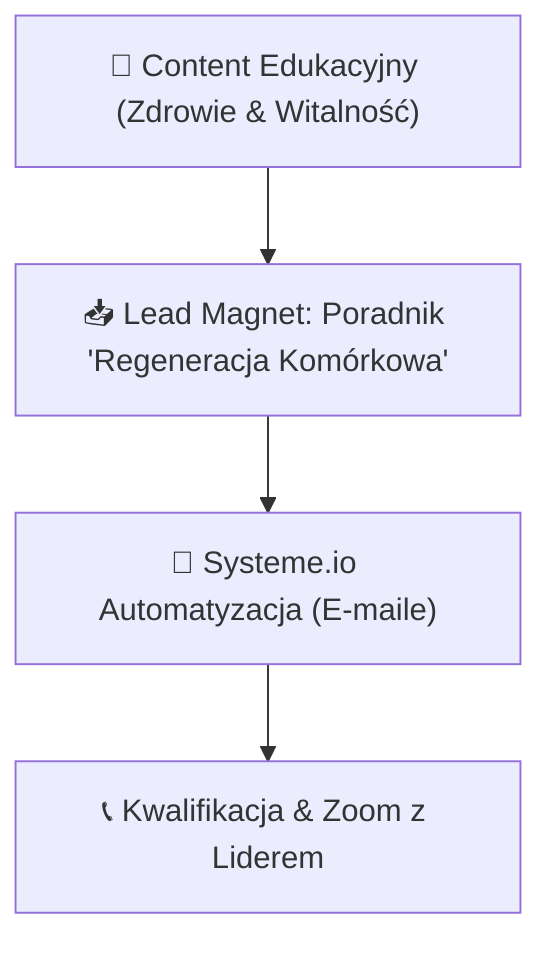

# 🧬 GHOST v2 PROFILE: LifeWave (Twórca MLM & Fototerapia)

## 📌 Tożsamość Marki & USP
- **Marka:** LifeWave (Budowanie Zespołu MLM & Biohacking Komórkowy)
- **Motto:** <strong>Automatyzuj to, co powtarzalne. Twórz to, co unikalne.</strong>
- **USP:** Połączenie nowoczesnej fototerapii komórkowej (plastry nanocząsteczkowe) z automatyzacją rekrutacji MLM. Eliminujemy namolny outreach — budujemy zaufanie i automatyczne lejki edukacyjne.

---

## 🗣️ Ton Wypowiedzi & Stylometryczny Głos Marki (NLP)
- **Styl:** Autentyczny, liderowski, pro-zdrowotny, zwięzły.
- **Forma Zwracania Się:** Bezpośrednio na "Ty".
- **Sensoryka VAK:** Głównie wzrokowo-kinestetyczna (pocruj wibrację, zobacz regenerację komórkową).
- **Czarna Lista (AI-ish Prohibition):** Zabronione zwroty: *warto pamiętać*, *kluczowy aspekt*, *w dzisiejszym świecie*, *warto zauważyć*.
- **Zasada Wyróżnień (Rule 13):** Pogrubienia pisane WYŁĄCZNIE tagami <strong>tekst</strong> w kodzie HTML.

---

## 🎯 Główny Lejek & Rekrutacja Partnerów

