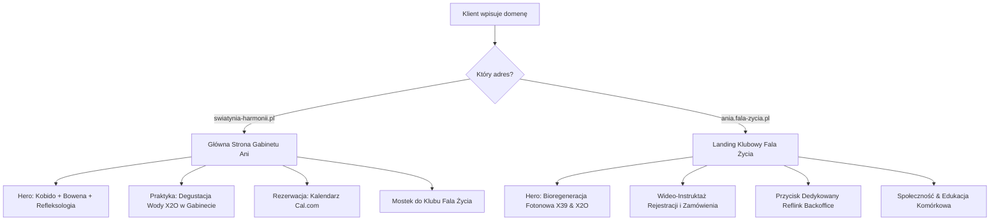

# 🌺 BRAND BOOK & BRAND IDENTITY SYSTEM: ŚWIĄTYNIA HARMONII
## Ania Pilawska — Luksusowa Marka Osobista & Gabinet Medycyny Holistycznej

---

### 👑 1. WIZJA I TOŻSAMOŚĆ MARKI

**Świątynia Harmonii** to unikalna synteza trzech światów:
1. **Ekskluzywnego Magazynu Modowego / Beauty** — estetyka, oddech, powściągliwy luksus.
2. **Luksusowego SPA** — wyciszenie, głęboki relaks, regeneracja sensoryczna.
3. **Nowoczesnej Medycyny Holistycznej** — precyzyjna praca z powięzią (Technika Bowena), stymulacja punktowa (Refleksologia), bezinwazyjny lifting (Masaż Kobido) oraz nawodnienie komórkowe na poziomie światła (Woda X2O, Cellergize, Fototerapia LifeWave X39).

**Główna Obietnica Marki:**
> *"Nie chodzi tylko o zabieg na twarz czy plecy. Chodzi o moment, w którym Twoje ciało przypomina sobie, jak to jest oddychać pełną piersią i funkcjonować w pełnej harmonii."*

---

### 🎨 2. SYSTEM KOLORISTYCZNY (COLOR PALETTE)

| Nazwa Koloru | Kod HEX | Kod RGB | Rola i Zastosowanie w Interfejsie |
|---|---|---|---|
| **Królewska Magenta / Purpura** | `#B32D52` | `rgb(179, 45, 82)` | Główny akcent marki, nagłówki hero, przyciski CTA, ikony kluczowe. |
| **Głęboka Magenta (Dark)** | `#982245` | `rgb(152, 34, 69)` | Stan hover dla przycisków, tła banerów. |
| **Szlachetne Perłowe Złoto** | `#D4AF37` | `rgb(212, 175, 55)` | Ramki Glassmorphism, Złota Linia Impulsu, ikony premium, gwiazdki opinii. |
| **Złoto Pustynne (Dark Gold)** | `#C5A059` | `rgb(197, 160, 89)` | Sub-nagłówki, etykiety kategorialne, stopka. |
| **Pudrowy Róż / Różana Mgła** | `#E8C5C8` | `rgb(232, 197, 200)` | Tła kart, tła podświetleń, sekcje relaksacyjne. |
| **Miękki Róż (Soft Pink)** | `#F9EFEF` | `rgb(249, 239, 239)` | Tła dopełniające, subtelne cienie. |
| **Ciepły Piasek / Perłowy Beż** | `#F5EBE6` | `rgb(245, 235, 230)` | Tło główne strony (`--bg-base`), ciepłe przejścia tonalne. |
| **Perłowa Biel** | `#FCF8F7` / `#FFFFFF` | `rgb(252, 248, 247)` | Tła kart, czyste przestrzenie ("oddech"). |
| **Głęboki Granat Nocy** | `#0D1B1E` | `rgb(13, 27, 30)` | Typografia nagłówków magazynowych, kontrastowy odczyt. |

---

### ✒️ 3. TYPOGRAFIA (TYPOGRAPHY SYSTEM)

1. **Serif Display Font (Nagłówki & Cytaty Magazynowe):**
   * **Rodzina:** `Cormorant Garamond` (Google Fonts)
   * **Wagi:** `400 Regular`, `600 SemiBold`, `700 Bold`, `Italic`
   * **Zastosowanie:** Tytuły sekcji, nagłówki Hero, cytaty i sentencje. Daje efekt luksusowego czasopisma beauty.

2. **Modern Sub-Heading Font (Kategorie & Etykiety):**
   * **Rodzina:** `Outfit` (Google Fonts)
   * **Wagi:** `500 Medium`, `600 SemiBold`, `700 Bold`
   * **Zastosowanie:** Nazwy usług, etykiety "GABINET HOLISTYCZNY", przyciski nawigacyjne.

3. **Clean Body Font (Tekst Główny & Opisy):**
   * **Rodzina:** `Plus Jakarta Sans` (Google Fonts)
   * **Wagi:** `300 Light`, `400 Regular`, `600 SemiBold`
   * **Zastosowanie:** Opisy zabiegów, opinie klientów, instrukcje rezerwacji. Gwarantuje najwyższą czytelność na urządzeniach mobilnych.

---

### ✨ 4. SYGNATUROWE AKCENTY WIZUALNE (SIGNATURE MOTIFS)

1. **Cienka Złota Linia Impulsu Bowena (The Golden Impuls Line):**
   * Płynna linia o grubości `1px` z gradientem liniowym (`linear-gradient(90deg, transparent, #D4AF37, transparent)`).
   * Symbolizuje delikatny ruch powięziowy w Technice Bowena, impuls światła oraz przepływ energii.
2. **Karty Editorial Glassmorphism:**
   * Tło: `rgba(255, 255, 255, 0.88)`
   * Rozmycie: `backdrop-filter: blur(16px)`
   * Obramowanie: `1px solid rgba(212, 175, 55, 0.3)`
   * Cień: `0 10px 30px rgba(179, 45, 82, 0.06)`
3. **Symbolika Ikonograficzna:**
   * **Lotos (Masaż Kobido / Lifting):** Rozkwit, czystość, piękno dojrzałe.
   * **Piórko / Delikatny Dotyk (Technika Bowena):** Lekkość, brak bólu, subtelność działania.
   * **Dłonie / Punkty Odruchowe (Refleksologia):** Oparcie, troska, praca u podstaw.
   * **Kropla Światła / Foton (Woda X2O & LifeWave):** Żywe nawodnienie komórkowe.

---

### 🗣️ 5. JĘZYK MARKI & COPYWRITING NLP (VOICE & TONE)

* **Ton:** Ciepły, opiekuńczy, pełen szacunku, ale jednocześnie bardzo konkretny i ekspercki.
* **Sensoryka VAK:** Słowa budzące odczucia fizyczne (*"oddech"*, *"uwolnienie napięcia"*, *"przestrzeń"*, *"lekkość"*, *"blask"*, *"nawodnienie od wewnątrz"*).
* **Bezwzględny Standard HTML:** Wszelkie pogrubienia w plikach HTML piszemy **wyłącznie za pomocą tagów `<strong>` i `</strong>`**. Kategoryczny zakaz wstawiania surowych gwiazdek Markdown (`**`).

---

### 📱 6. ZASADY STRUKTURY PODWÓJNEJ DOMENY

---
*Dokument sporządzony przez Sztab Zarządu J(AI)SON dla Świątyni Harmonii Ani Pilawska.*
