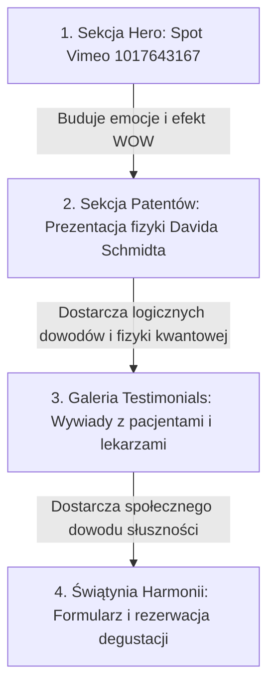
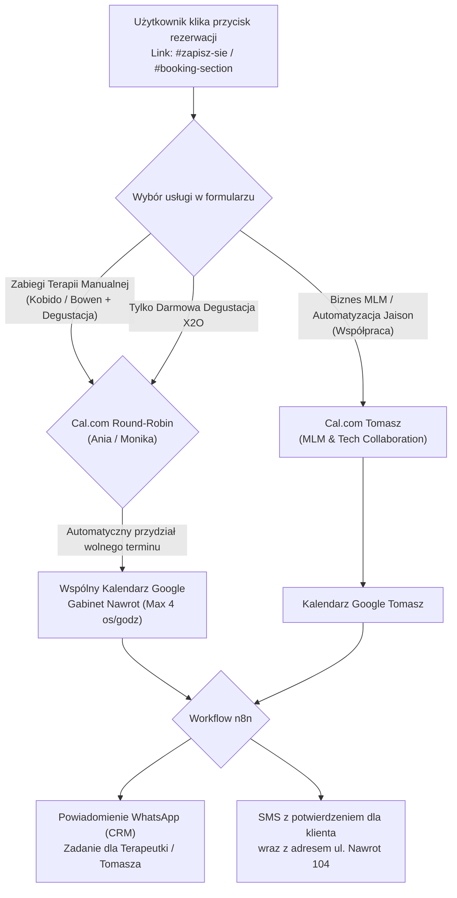

# Zintegrowany Blueprint Strategiczny: Digital Assets, Wideo & Automatyzacja Kalendarza X2O

Ten dokument stanowi ostateczny, zintegrowany przewodnik operacyjny dla ekosystemu <strong>x2o.jaison.pl</strong>, łączący audyty i zalecenia całego sztabu dyrektorskiego agencji Jaison (CPO, CMO, CSO, CTO) oraz specjalistyczne ustalenia Dyrektora ds. Projektowania 3D i UX/UI.

---

## 🎯 1. WNIKLIWY AUDYT MARKETINGOWO-TECHNICZNY (CPO & CMO)

### A. Sekcja Hero: Redefinicja Hooku (Zwiększenie Konwersji)
*   <strong>Obecny Hook:</strong> Pytanie <em>„A co jeśli woda mogłaby pełnić funkcję czegoś więcej niż tylko nawodnienia?”</em> jest dobrym punktem wyjścia, ale może wydawać się zbyt hipotetyczne i mało naukowe dla wymagających klientów premium oraz liderów biznesowych.
*   <strong>Proponowany Hook Premium (Medyczno-Biznesowy):</strong>
    <blockquote><strong>„Czy woda może być czymś więcej niż tylko nawodnieniem? Odkryj stan ciekłokrystaliczny EZ — kwantowy nośnik energii biofotonowej, który aktywuje Twoje mitochondria i uwalnia pełen potencjał komórek macierzystych.”</strong></blockquote>
    *   <em>Uzasadnienie:</em> Użycie sformułowań takich jak "stan ciekłokrystaliczny EZ", "energia biofotonowa" oraz "komórki macierzyste" natychmiast pozycjonuje produkt w kategorii naukowego biohackingu (High-End), a nie zwykłych filtrów kuchennych.

### B. Doświadczenie Użytkownika (UX / UI / User Flow)
*   <strong>Prostota i Scannability (ADHD-Friendly):</strong> Strona główna wykorzystuje luksusowy design Bento Grid, który dzieli skomplikowaną wiedzę fizyki kwantowej na łatwo przyswajalne porcje. Pogrubienia kluczowych słów (tagi `<strong>`) pozwalają na przeskanowanie strony w 15 sekund i zrozumienie 80% przekazu.
*   <strong>Separacja roli botów:</strong> Marketingowy bot na stronie głównej filtruje i kwalifikuje leady, odsyłając pytania techniczne na stronę instrukcji, co chroni użytkowników przed szumem informacyjnym.

---

## 🖼️ 2. PLAN ZASTĄPIENIA GRAFIKI CHRONIONEJ (UI/UX PRO)

Aby uniknąć powielania chronionych prawem autorskim, powtarzalnych zdjęć korporacyjnych LifeWave i zbudować unikalną, autentyczną tożsamość lokalną <strong>"LifeWave 4 Life"</strong>, zaplanowaliśmy zastąpienie 12 skanów instrukcji luksusowymi grafikami ze stocków premium (Unsplash, Pexels) lub dedykowanymi renderami 3D:

| Strona instrukcji | Obecna treść skanu | Proponowany Luksusowy Substytut Wizualny | Słowa kluczowe (Unsplash/Pexels) | Prompt dla generatora AI (np. Midjourney) |
| :--- | :--- | :--- | :--- | :--- |
| <strong>Strona 1 (Wstęp)</strong> | Okładka instrukcji, maszyna X2O | Minimalistyczne, zbliżone ujęcie krystalicznie czystej szklanki z wodą o strukturze heksagonalnej z neon-miętową poświatą. | "luxury water crystal glow", "hexagonal water structure abstract" | "A hyper-realistic close-up 3D render of a single hexagonal water liquid crystal vibrating with a subtle neon-mint glow, floating in a dark space-black background, quantum light particles, premium biohacking aesthetic, 8k --ar 16:9" |
| <strong>Strona 2 (Komponenty)</strong> | Rysunek części urządzenia | Luksusowy, trójwymiarowy render techniczny rozłożonej na części maszyny o strukturze ciemnego, szczotkowanego tytanu na czarnym marmurze. | "futuristic laboratory device titanium", "3d blueprint luxury gadget" | "An elegant 3D exploded view of a futuristic water filtration device, made of brushed dark titanium and obsidian glass, floating above a black marble table, glowing neon mint accents, clean blueprint style, volumetric lighting, photorealistic --ar 16:9" |
| <strong>Strona 3 (Przygotowanie)</strong> | Wymagania sieci, twardość wody | Elegancki blat kuchenny z ciemnego marmuru, na którym stoi luksusowa karafka z wodą źródlaną w otoczeniu naturalnych kryształów górskich. | "luxury kitchen marble countertop", "crystal glass pitcher water" | "An ultra-luxury modern kitchen with dark marble countertops and warm backlighting, a premium glass decanter filled with pure structured water sitting next to raw quartz crystals, photorealistic, architectural digest photography style --ar 16:9" |
| <strong>Strona 4 (Filtr Główny)</strong> | Montaż filtra kompozytowego | Makrofotografia zaawansowanego, czarnego filtra z włókna węglowego z naświetlonymi laserowo błękitnymi kanalikami wodnymi. | "nano technology carbon fiber close up", "futuristic water filter cylinder" | "A macro close-up of a high-tech carbon fiber water filter cylinder, microscopic blue water channels glowing within the structure, dark laboratory environment, cyberpunk neon cyan backlighting, hyper-detailed --ar 16:9" |
| <strong>Strona 5 (Filtr Wtórny)</strong> | Montaż rdzenia mineralnego | Zbliżenie na czysty, biały ceramiczny wkład mineralizujący, przez który przechodzi pulsująca wiązka światła biofotonowego. | "glowing glass rod light refraction", "optical fiber macro physics" | "A detailed shot of a pure white ceramic mineral rod being penetrated by a solid laser-like beam of emerald biofoton light, glowing particles, dark background, luxury clean tech, raytracing --ar 16:9" |
| <strong>Strona 6 (Płukanie Główne)</strong> | Podłączenie wężyka spustowego | Dynamiczne ujęcie strumienia czystej wody wylewającego się pod wysokim ciśnieniem z metalowej, ciemnej wylewki do ciemnego zlewu. | "luxury black kitchen faucet water splash", "water stream high speed photography" | "A high-speed action photograph of a powerful, perfectly laminar stream of water flowing from a dark bronze minimalist faucet, splashing into a dark graphite sink, frozen water droplets, moody lighting, editorial photography --ar 16:9" |
| <strong>Strona 7 (Finał Płukania)</strong> | Zamknięcie zaworu głównego | Zbliżenie dłoni premium (zegarek luksusowej marki) delikatnie przekręcającej minimalistyczne metalowe pokrętło z neon-miętową kropką. | "hand luxury watch turning knob", "minimalist metal switch detailed" | "A macro photograph of an elegant hand wearing a luxury minimalist black watch, turning a dark metallic cylindrical dial that has a tiny glowing neon-mint dot indicator, premium tactile hardware design, cinematic depth of field --ar 16:9" |
| <strong>Strona 8 (Płukanie Wtórne)</strong> | Zamknięcie obu zaworów | Dwa symetryczne, pionowe paski LED zintegrowane w komorze filtracyjnej, świecące na stały, uspokajający szmaragdowo-turkusowy kolor. | "dual vertical neon lines dark", "cyan led stripes background" | "Two parallel vertical glowing led stripes in neon mint and deep cyan colors, integrated into a dark carbon fiber recessed compartment, high-tech luxury control panel, symmetric clean composition --ar 16:9" |
| <strong>Strona 9 (Cykl Pracy)</strong> | Dozowanie wody do szklanki | Elegancki, sportowy mężczyzna lub kobieta w luksusowym apartamencie, nalewający wodę z krystalicznie czystym, laminalnym przepływem do szklanki. | "luxury athlete drinking water glass", "morning routine modern penthouse" | "An athletic successful person in a high-end minimalist penthouse apartment during sunrise, holding a premium borosilicate glass cup under a sleek water dispenser with a perfect laminar water flow, sophisticated ambient lighting --ar 16:9" |
| <strong>Strona 10 (Jak Pić)</strong> | Wytyczne spożywania, karafki | Luksusowa, minimalistyczna karafka ze szkła borokrzemowego stojąca na tacy z naturalnego łupka kamiennego rano. | "minimalist glass carafe morning light", "luxury water serving tray" | "A luxury minimalist borosilicate glass carafe filled with pure water, sitting on a dark natural slate stone tray, soft morning sunlight casting long beautiful shadows, high-end hotel wellness aesthetic --ar 16:9" |
| <strong>Strona 11 (Aktualizacja)</strong> | Port USB i wgrywanie firmware | Delikatnie podświetlony, minimalistyczny metalowy pendrive USB-C wsuwany do portu w ciemnej, futurystycznej obudowie urządzenia. | "luxury metallic usb drive plugged", "tech connector glow" | "A sleek dark metal USB key inserted into a precise port of a futuristic device, a thin halo of turquoise light emitting from the connection socket, premium consumer electronics design, dark mood --ar 16:9" |
| <strong>Strona 12 (Pomoc)</strong> | Dane kontaktowe i certyfikaty | Minimalistyczna, luksusowa recepcja kliniki medycyny estetycznej lub spa z podświetlaną, geometryczną ścianą z mchu i kamienia. | "luxury wellness center reception", "modern clinic interior design" | "A reception lobby of an ultra-exclusive modern biohacking clinic, minimalist dark stone counter, indirect warm glow, vertical moss wall in the background, serene, wealthy and professional atmosphere --ar 16:9" |

---

## 📽️ 3. PLAN LOKALIZACJI I ROZMIESZCZENIA WIDEO (CMO & CPO)

Materiały wideo zostały ułożone w logiczny ciąg, dopasowany do temperatury kontaktu klienta i jego gotowości zakupowej (Customer Journey):

### ⚙️ Pipeline Automatycznego Tłumaczenia Wideo (Low-Friction & Low-Cost):
Większość oficjalnych materiałów wideo LifeWave jest w języku angielskim. Aby ułatwić odbiór polskim klientom, agencja Jaison wdraża asynchroniczny potok lokalizacyjny:

1.  **Ekstrakcja i Transkrypcja:** Używamy narzędzia **OpenAI Whisper** do automatycznego przepisania tekstu z osiami czasu (plik `.srt`).
2.  **Kompaktowe Tłumaczenie:** Model **Gemini 1.5 Pro** tłumaczy napisy na język polski, dbając o to, by zdania były zwięzłe i idealnie zsynchronizowane czasowo z obrazem.
3.  **Dwie Ścieżki Lokalizacji (Wybór zależy od przeznaczenia filmu):**
    *   **Ścieżka Szybka (Napisy - Low Friction):** Używamy biblioteki `FFmpeg` / `MoviePy` do automatycznego wtopienia estetycznych, dużych napisów w stylu social-media na dole ekranu.
    *   **Ścieżka Premium (Polski Lektor AI):** Wykorzystujemy silnik **ElevenLabs Voice Dubbing** z funkcją klonowania oryginalnego głosu (Voice Cloning). Narzędzie to automatycznie generuje polską ścieżkę lektorską, idealnie dopasowaną do ruchu ust i oryginalnego tempa mówcy, wyciszając jednocześnie oryginalny głos angielski i zachowując muzykę w tle!

---

## 📅 4. AUTOMATYZACJA REZERWACJI I KALENDARZA (CTO)

Wdrożenie kalendarza dla <strong>Ani, Moniki i Tomasza</strong> musi być maksymalnie proste, bezawaryjne i zapobiegać nakładaniu się terminów, jednocześnie szanując specyfikę pracy gabinetu Świątyni Harmonii w Łodzi.

### A. Analiza Rozwiązań: Google Calendar vs Cal.com
*   *Wspólny Kalendarz Google:* Jest doskonałym, darmowym repozytorium danych, ale sam w sobie nie posiada interfejsu rezerwacyjnego dla klientów zewnętrznych, formularzy weryfikacji danych, ani mechanizmów zapobiegania przepełnieniu slotów.
*   *Rekomendacja CTO: Cal.com (Podpięty pod Kalendarz Google Ani)*
    <strong>Cal.com</strong> to absolutnie elitarne, nowoczesne narzędzie do rezerwacji (zgodne z duchem open-source i Jaison AI). Działa jako "inteligentna nakładka" na Twój Kalendarz Google.

### B. Jak to działa w praktyce dla Ani? (Ochrona przed kolizją usług)
1.  Ania prowadzi w swoim fizycznym Kalendarzu Google codzienne rezerwacje na masaże Kobido i Terapię Bowena.
2.  Cal.com jest połączony z jej Kalendarzem Google w trybie <strong>Real-time Busy-Check</strong>.
3.  Gdy Ania wpisze w swój kalendarz masaż Kobido we wtorek o 15:00, <strong>Cal.com automatycznie i natychmiast zablokuje możliwość rezerwacji darmowej degustacji wody X2O w tym samym terminie</strong>.
4.  Ania może w Cal.com zdefiniować osobne szablony dostępności (Availability Profiles) specjalnie pod degustacje X2O (np. tylko wtorki i czwartki od 12:00 do 17:00), nie kolidując z innymi swoimi obowiązkami.

### C. Zarządzanie Wydajnością: Limit 4 osób na godzinę
*   <strong>Wyzwanie:</strong> Maszyna X2O generuje 4 szklanki strukturyzowanej wody w cyklu 45-minutowym. Nie można przyjąć więcej niż 4 osób na godzinę.
*   <strong>Rozwiązanie CTO:</strong> W Cal.com konfigurujemy spotkanie typu <strong>"Group Booking"</strong> (lub rezerwacja slotowa) i ustawiamy parametr <strong>`Seats = 4`</strong> (Miejsca na jeden slot).
*   <em>Działanie:</em> Do jednego terminu (np. wtorek, godz. 16:00) może zapisać się maksymalnie 4 różnych użytkowników. Po zapisaniu czwartej osoby, ten konkretny termin automatycznie znika z widoku rezerwacji dla kolejnych chętnych.

### D. Nawigacja i Bezpośrednie Linkowanie (#zapisz-sie)
*   Sekcja rezerwacji na stronie głównej posiada unikalne ID: `id="booking-section"` oraz `id="zapisz-sie"`.
*   Wszelkie odnośniki w chatbotach, kampaniach marketingowych, postach na Facebooku czy wiadomościach prywatnych będą kierować bezpośrednio do tej sekcji:
    👉 <strong>`https://x2o.jaison.pl#zapisz-sie`</strong>
*   Po kliknięciu w taki link, strona użytkownika płynnie przewinie się w dół prosto do formularza rezerwacji (Cal.com embedded widget), dając ultra-proste doświadczenie rezerwacyjne (Low-Friction).
