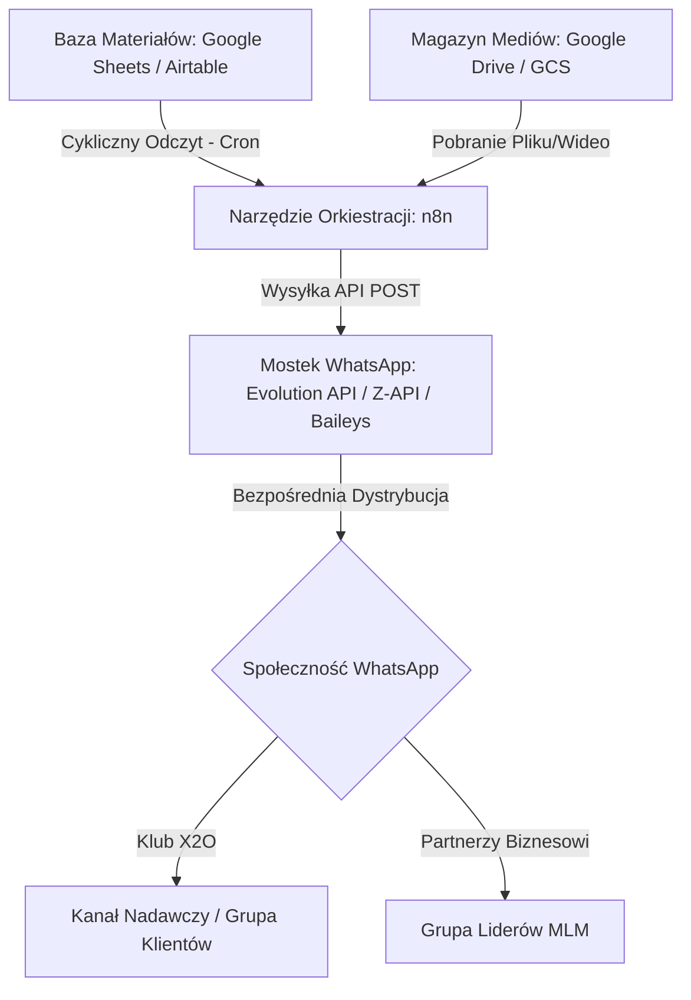
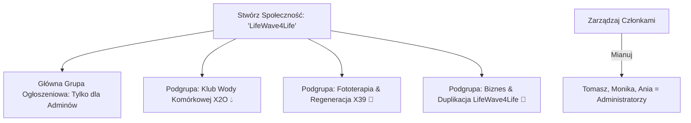

# 📱 Lekki Plan Automatyzacji Kanału Nadawczego i Grup WhatsApp (LifeWave4Life X2O)

Niniejszy dokument przedstawia prosty, niskokosztowy i wysoce skuteczny schemat automatycznego publikowania treści marketingowych (postów, plików PDF, opinii i nagrań wideo) na Twoim kanale nadawczym oraz w grupach społecznościowych WhatsApp. 

Wykorzystuje on architekturę asynchroniczną opartą na **n8n** oraz bezpłatne/tanie mostki API, wykluczając konieczność przechodzenia przez drogie i skomplikowane procesy zatwierdzania szablonów przez Meta (Facebook).

---

## 🏗️ 1. Architektura Systemu (Lekka i Elastyczna)



---

## 📦 2. Wymagany Stack Technologiczny

1.  **Orkiestrator (n8n):** Twój obecny system n8n (może być uruchomiony lokalnie lub na darmowej instancji Cloud). Odpowiada za logikę, harmonogram (kiedy wysyłać) oraz pobieranie danych.
2.  **Baza Treści (Google Sheets lub Airtable):** Super prosty arkusz kalkulacyjny, w którym Ty, Monika lub Ania możecie hurtowo planować posty na cały miesiąc (Batch Content Creation).
3.  **Bramka WhatsApp (Evolution API / Z-API lub Green-API):**
    *   *Rekomendacja:* **Evolution API** (open-source, darmowy, stabilny mostek oparty o bibliotekę Baileys) lub **Z-API** (tani, gotowy system SaaS, ok. 39 zł/miesięcznie).
    *   *Dlaczego?* Pozwalają na parowanie WhatsAppa za pomocą zwykłego kodu QR (tak jak Web WhatsApp) i dają pełne API do wysyłania tekstów, wideo, PDF-ów oraz obrazków bez zatwierdzania szablonów przez Meta i opłat za każdą wiadomość.

---

## 📊 3. Struktura Tabeli Harmonogramu (Google Sheets)

Stwórz prosty arkusz kalkulacyjny z następującymi kolumnami:

| ID | Data i Godzina | Grupa Docelowa | Tekst Postu (NLP) | URL do Mediów (Drive/GCS) | Typ Mediów | Status |
| :--- | :--- | :--- | :--- | :--- | :--- | :--- |
| `1` | `2026-07-20 10:00` | `klienci` | `Woda biofotonowa uwalnia...` | `https://drive.google.com/file/...` | `image` | `Gotowy` |
| `2` | `2026-07-22 12:00` | `klienci` | `David Schmidt o patentach...` | `https://vimeo.com/...` | `link` | `Gotowy` |
| `3` | `2026-07-24 15:00` | `partnerzy` | `Jak zduplikować obroty MLM...` | `https://drive.google.com/file/...` | `document` | `Gotowy` |

---

## ⚙️ 4. Prosty Przepływ Pracy n8n (Step-by-Step)

### Węzeł 1: Cron Trigger (Harmonogram)
*   **Zadanie:** Aktywacja przepływu w określone dni i godziny (np. poniedziałki, środy i piątki o 10:00).

### Węzeł 2: Google Sheets (Read Rows)
*   **Zadanie:** Pobranie wierszy z tabeli harmonogramu, gdzie `Status === 'Gotowy'` oraz `Data i Godzina` jest mniejsza lub równa aktualnemu czasowi.

### Węzeł 3: HTTP Request (Pobranie pliku, opcjonalnie)
*   Jeśli post zawiera plik graficzny lub PDF z Google Drive, n8n pobiera go jako dane binarne, by bramka WhatsApp mogła wysłać go jako natywny załącznik, a nie suchy link.

### Węzeł 4: HTTP Request (Mostek WhatsApp)
*   **Zadanie:** Wysłanie żądania POST do bramki API.
*   **Adres URL bramki:** `http://twoje-evolution-api.pl/message/sendText` lub `sendMedia`
*   **Przykładowy Payload (JSON):**
    ```json
    {
      "number": "ID_GRUPY_WHATSAPP_LUB_KANALU@g.us",
      "options": {
        "delay": 1200,
        "presence": "composing"
      },
      "textMessage": {
        "text": "Hej Klubowicze! 💧\\n\\nCzy wiesz, że regularne picie wody X2O..."
      }
    }
    ```

### Węzeł 5: Google Sheets (Update Row)
*   **Zadanie:** Oznaczenie wiersza jako `Status = 'Wysłany'` oraz dodanie daty wysyłki, aby zapobiec ponownemu wysłaniu tego samego materiału.

---

## 👥 5. Architektura Społeczności: Podgrupy Tematyczne WhatsApp (LifeWave4Life)

Aby odciążyć główny kanał nadawczy oraz grupę ogólną **LifeWave4Life** od natłoku wiadomości (szum informacyjny) i zapobiec opuszczaniu grup przez użytkowników, wdrażamy **podział tematyczny (segmentację)** za pomocą oficjalnej funkcji **Społeczności (WhatsApp Communities)**.

### ❓ Czym jest Społeczność (Community) na WhatsApp?
Społeczność to "parasol" łączący wiele grup tematycznych w jednym miejscu. Po jej założeniu:
1.  **Automatycznie tworzy się grupa ogłoszeniowa (Announcement Group):** Na niej tylko administratorzy (Tomasz, Monika, Ania) mogą pisać wiadomości. To Twój główny kanał nadawczy.
2.  **Uczestnicy mogą dołączać do podgrup:** Każdy członek społeczności widzi listę podgrup i może samodzielnie zdecydować, do której chce dołączyć (np. tylko do wody X2O, albo tylko do biznesu), nie będąc zasypywanym innymi tematami.

---

### 📲 Instrukcja krok po kroku: Jak założyć Społeczność i Podgrupy

Możesz to zrobić zarówno w zwykłym WhatsApp, jak i w **WhatsApp Business** (proces wygląda identycznie).



#### Krok 1: Inicjalizacja nowej Społeczności
1.  Otwórz aplikację **WhatsApp** lub **WhatsApp Business** na telefonie.
2.  Przejdź do zakładki **"Społeczności"** (ikona przedstawiająca trzy sylwetki osób):
    *   *Android:* Znajduje się na górze ekranu po lewej stronie lub w dolnym menu.
    *   *iPhone (iOS):* Znajduje się w dolnym menu na środku.
3.  Kliknij **"Nowa społeczność"** (lub przycisk **"+"** / **"Rozpocznij"**).
4.  Wpisz dane społeczności:
    *   **Nazwa:** `LifeWave4Life`
    *   **Opis:** `Oficjalna, elitarna społeczność zdrowia, energii i nowoczesnej duplikacji biznesowej LifeWave4Life. Działamy w myśl niezłomnej zasady "jeden za wszystkich, wszyscy za jednego"! Wspieramy się na każdym kroku, grając do jednej bramki. Nasz model biznesowy opiera się na czystej synergii Win-Win: tutaj nikt nie musi przegrać, abyś Ty mógł wygrać. Prawdziwy sukces budujemy razem – kiedy Twój partner biznesowy wygrywa i rośnie, Ty wygrywasz razem z nim! Witaj w rodzinie przyszłości.`
    *   **Zdjęcie profilowe:** Wgraj oficjalne logo społeczności:
        
5.  Kliknij **"Dalej"** (strzałkę).

#### Krok 2: Podpięcie istniejącej grupy oraz utworzenie nowych podgrup
Po kliknięciu "Dalej" WhatsApp zapyta Cię, jakie grupy chcesz przypisać do Społeczności:
1.  **Podepnij istniejącą grupę:** Wybierz opcję **"Dodaj istniejące grupy"** i wskaż Twoją obecną grupę **LifeWave4Life** (tę, w której masz już 3 administratorów).
2.  **Utwórz nową podgrupę A (Woda):**
    *   Kliknij **"Utwórz nową grupę"**.
    *   Nazwij ją: `Klub Wody Komórkowej X2O 💧`
    *   Wklej opis oraz ustaw grafikę (szczegóły poniżej).
3.  **Utwórz nową podgrupę B (Plastry X39):**
    *   Kliknij **"Utwórz nową grupę"**.
    *   Nazwij ją: `Fototerapia & Regeneracja X39 🧬`
    *   Wklej opis oraz ustaw grafikę (szczegóły poniżej).
4.  **Utwórz nową podgrupę C (Biznes):**
    *   Kliknij **"Utwórz nową grupę"**.
    *   Nazwij ją: `Biznes & Duplikacja LifeWave4Life 💼`
    *   Wklej opis (szczegóły poniżej).
5.  Po utworzeniu wszystkich grup kliknij zielony haczyk / **"Utwórz"**, aby zatwierdzić i uruchomić Społeczność!

#### Krok 3: Dodanie i mianowanie Administratorów (Monika, Ania, Tomasz)
Musisz upewnić się, że Monika i Ania mają pełne uprawnienia do zarządzania całą społecznością:
1.  Wejdź w nowo utworzoną społeczność **LifeWave4Life**.
2.  Kliknij nazwę społeczności na samej górze, aby wejść w jej szczegóły.
3.  Kliknij **"Zarządzaj członkami"** (lub ikonę listy uczestników).
4.  Znajdź Monikę i Anię na liście.
5.  Kliknij na ich profil i wybierz opcję **"Mianuj administratorem"** (Make admin).
6.  Zatwierdź. Teraz we trójkę macie identyczne, pełne uprawnienia administratorskie nad wszystkimi podgrupami!

---

### 📋 Szczegóły podgrup tematycznych do uzupełnienia:

### A. Podgrupa: Klub Wody Komórkowej X2O 💧
*   **Oficjalny Opis Grupy (do wklejenia w WhatsApp):**
    > Witaj w elitarnym gronie Klubu Wody Komórkowej X2O – integralnej części naszej społeczności LifeWave4Life! 💧 Ta przestrzeń jest stworzona dla każdego, kto chce zadbać o głębokie, komórkowe nawodnienie całego organizmu. Jako jeden żywy organizm dzielimy się tutaj praktycznymi wskazówkami, naukowymi faktami na temat wody o strukturze ciekłokrystalicznej EZ oraz wspieramy się nawzajem w budowaniu życiowej energii, witalności i regeneracji komórkowej. Pijemy na zdrowie, dzielimy się doświadczeniami i wspólnie dbamy o czyste zdrowie!
*   **Oficjalna Grafika Grupy (zapisz na telefonie i ustaw jako tło):**
    
    *Zaprojektowane, mieniące się trójwymiarowe kryształy wody EZ w odcieniach neonowego turkusu – idealna grafika dla grupy.*

### B. Podgrupa: Fototerapia & Regeneracja X39 🧬
*   **Oficjalny Opis Grupy (do wklejenia w WhatsApp):**
    > Oficjalna przestrzeń edukacyjno-naukowa społeczności LifeWave4Life dedykowana fototerapii biofotonowej! 🧬 Poznaj przełomową technologię aktywacji własnych komórek macierzystych za pomocą spektrum światła (protokoły X39 i X49). Działamy jako jedna wielka rodzina i jeden organizm, dzieląc się autentycznymi opiniami, badaniami klinicznymi, poradami dotyczącymi aplikacji oraz wzajemnym wsparciem. Razem przywracamy organizmowi naturalną zdolność do regeneracji, witalności i młodzieńczego zdrowia!
*   **Oficjalna Grafika Grupy (zapisz na telefonie i ustaw jako tło):**
    
    *Zaprojektowane spektrum biofotonowe światła własnego ciała oraz aktywacji komórkowej – idealna grafika dla grupy.*

### C. Podgrupa: Biznes & Duplikacja LifeWave4Life 💼
*   **Oficjalny Opis Grupy (do wklejenia w WhatsApp):**
    > 💼 Serce biznesowe i zamknięta grupa robocza dla Partnerów społeczności LifeWave4Life! Działamy jako jeden zgrany organizm, opierając się na niezłomnej zasadzie Win-Win oraz haśle "jeden za wszystkich, wszyscy za jednego". Gramy do jednej bramki – u nas sukces Twojego partnera jest bezpośrednim fundamentem Twojego sukcesu. Dzielimy się tu prostymi, skutecznymi narzędziami, sprawdzonymi systemami duplikacji struktur MLM oraz nowoczesną automatyzacją procesów. Pomagajmy sobie nawzajem rosnąć, wspierajmy nowo dołączające osoby i wspólnie sięgajmy po pełną wolność finansową!
*   **Oficjalna Grafika Grupy (zapisz na telefonie i ustaw jako tło):**
    
    *Zaprojektowana sieć wzajemnie połączonych węzłów i złotych ścieżek duplikacji w odcieniach szmaragdu i złota – idealna grafika dla grupy.*

---

## ✉️ 6. Szablony Zaproszeń i Wiadomości Powitalnych (NLP-Optimized)

Możesz skopiować i wysłać poniższe wiadomości, aby zachęcić członków głównej grupy do przejścia do podgrup tematycznych:

### 📨 Szablon 1: Zaproszenie do Klubu Wody X2O (Wysyłane na grupie głównej)
```text
Cześć! 💧 Czy wiesz, że większość z nas pije wodę, która jest strukturalnie "martwa" i nie dociera do wnętrza komórek?  

Chcemy dać Ci dostęp do rzetelnej wiedzy i codziennych rytuałów biohackingowych. Założyliśmy dedykowaną, kameralną podgrupę: 

👉 [TUTAJ WKLEJ LINK DO GRUPY KLUB WODY X2O]

Znajdziesz tam:
- Proste wyjaśnienia, jak działa stan ciekłokrystaliczny EZ wody
- Wyniki testów laboratoryjnych aktywatora X2O
- Praktyczne protokoły picia wody na czczo i w ciągu dnia

Wejdź i zadbaj o swoje mitochondria już dziś! 🚀
```


### 📨 Szablon 2: Zaproszenie do Grupy Fototerapii X39
```text
Witaj! 🧬 Odkrywanie możliwości własnego organizmu to fascynująca podróż. Jeśli chcesz zgłębić temat aktywacji komórek macierzystych za pomocą światła własnego ciała (fotobiomodulacja), dołącz do naszej podgrupy tematycznej:

👉 [TUTAJ WKLEJ LINK DO GRUPY FOTOTERAPIA X39]

Co tam na Ciebie czeka?
- Prawdziwe historie osób, które pożegnały przewlekły ból i odzyskały energię
- Naukowe analizy ponad 80 patentów Davida Schmidta
- Mapy i protokoły naklejania plastrów pod konkretne dolegliwości

Dołącz do rewolucji komórkowej! 🌿
```

---

## 📩 6.1. Nowe, Nieszablonowe Szablony Zaproszeń (Styl "Ghost v2" – Bez Spiny)

Te szablony są napisane bardzo luźnym, naturalnym, nieszablonowym językiem w stylu Twojej marki **Ghost** oraz wytycznych **Tomasza Damiana**. Są całkowicie wolne od sztywnego, korporacyjnego narzutu i idealnie nadają się do wysyłania w wiadomościach prywatnych (DM) lub na grupach.

### 💬 A. Zaproszenie Prywatne (DM) do Klubu Wody X2O 💧
```text
Cześć [Imię]! Słuchaj, krótki temat bez owijania w bawełnę. 

Generalnie większość z nas pije wodę, która po prostu przelatuje przez organizm i nawet nie nawadnia komórek. Zrobiliśmy z tym porządek. Odpaliliśmy kameralną grupę Klub Wody Komórkowej X2O. Pokazujemy tam proste, codzienne nawyki biohackingowe i esencję o wodzie EZ o strukturze ciekłokrystalicznej. Zero spamu, zero presji. 

Jeśli chcesz wejść w tryb goal ze swoim zdrowiem i poziomem energii, podeślę Ci link. Daj znać, czy chcesz zerknąć!
```

### 💬 B. Zaproszenie Prywatne (DM) do Grupy Fototerapii X39 🧬
```text
Cześć! Słuchaj, pewnie widzisz u mnie sporo o fototerapii biofotonowej. Generalnie brzmi to kosmicznie, ale chodzi o prostą rzecz – aktywowanie własnych komórek macierzystych za pomocą światła Twojego ciała. Zero chemii, czysta fizyka.

Mamy grupę "Fototerapia & Regeneracja X39". Wrzucamy tam konkretne badania, mapy naklejania plastrów pod różne dolegliwości i prawdziwe historie ludzi, którzy wyszli z przewlekłego bólu. Zero wciskania kitów, sama prawda od kuchni.

Jeśli masz wolne 5 minut i ciekawi Cię ten temat, daj znać – wrzucę Cię na grupę, żebyś sam to ocenił. Bez żadnej spiny.
```

### 💬 C. Zaproszenie Prywatne (DM) do Biznesu & Duplikacji LifeWave4Life 💼
```text
Cześć [Imię]! Słuchaj, sprawa jest krótka. Generalnie mam już dość oglądania ludzi, którzy w marketingu sieciowym udają milionerów i spamują znajomych na Messengerze. Zrobiliśmy z tym porządek.

W ramach naszej społeczności LifeWave4Life stworzyliśmy system ocieplania i automatyzacji kontaktów. Pokazujemy, jak zbudować stały, pasywny dochód w 12-24 miesiące, pracując mądrze po godzinie dziennie. Bez kawiarnianych spotkań, bez nękania rodziny. 

Jeśli szukasz sensownej opcji biznesowej i chcesz zobaczyć, jak wygląda u nas prawdziwa duplikacja bez sztucznej presji – daj znać. Wyślę Ci link do naszej grupy roboczej. Zobaczysz jak to działa i sam zdecydujesz. Co Ty na to?
```

### 💬 D. Zaproszenie (DM / Grupa) do Głównego Kanału Nadawczego WhatsApp 📣
```text
Słuchajcie, szybka piłka. Zrobiliśmy porządek z komunikacją, żeby nie zaśmiecać nikomu głowy setkami powiadomień. 

Jeśli chcecie być na bieżąco z tym, co robimy w społeczności LifeWave4Life – ze wszystkimi nowinkami o fototerapii, zdrowej wodzie komórkowej i naszych narzędziach – odpaliliśmy oficjalny kanał nadawczy na WhatsApp. 

To idealne rozwiązanie:
- Widzicie tylko najważniejsze, wyselekcjonowane ogłoszenia
- Nikt nie widzi Waszego numeru telefonu (pełna prywatność)
- Zero zbędnych dyskusji i spamu – piszemy tylko my, kiedy mamy coś naprawdę ważnego

Kliknijcie w link poniżej, dołączcie i koniecznie zaznaczcie ikonę dzwoneczka na górze, żeby nie przegapić kluczowych info:

👉 [TUTAJ WKLEJ LINK DO KANAŁU NADAWCZEGO WHATSAPP]

Zróbmy to razem i do zobaczenia na pokładzie! 🚀
```

---


---

## 💡 7. Szybkie Porady dla Tomasza (Jak Unikać Blokad Konta)

1.  **Dedykowany Numer:** Do obsługi automatyzacji grup używaj innego numeru telefonu (np. karty SIM dedykowanej dla Asystenta LifeWave4Life) niż Twój prywatny numer telefonu.
2.  **Naturalne Opóźnienia (Delays):** W konfiguracji Evolution API włącz opcję `"presence": "composing"` oraz opóźnienie wysyłki (delay) od 1 do 3 sekund między wiadomościami.
3.  **Początkowe Rozgrzewanie (Warm-up):** Nowy numer WhatsApp dedykowany do bota rozgrzewaj przez pierwszy tydzień – wysyłaj z niego wiadomości ręcznie do znajomych, wymieniaj krótkie konwersacje.
4.  **Używaj Kanałów Nadawczych (Broadcast Channels):** Na kanałach nadawczych WhatsApp ryzyko blokady konta wynosi **0%**, ponieważ użytkownicy sami dobrowolnie dołączają do subskrypcji.

---

## 🎨 8. Oficjalne Logo Nowego Portalu (Review)
 
 Zgodnie z Twoją dyspozycją, wdrożyliśmy nowe logo portalu **x2o.jaison.pl**. Zastąpiliśmy logo Supermana "S" na mieniącą się biało-srebrną literę **S** osadzoną wewnątrz trójwymiarowego, luksusowego diamentu o odcieniach **krwistej czerwieni (symbolizującej krew, serce i życie)**:
 
 

*Nowo zaprojektowane i wdrożone nasze oficjalne logo społeczności z motywem czerwonego serca i mieniącego się S.*

---

> [!TIP]
> Ten plan jest w pełni kompatybilny z Twoją obecną infrastrukturą n8n i może być wdrożony w ciągu jednego popołudnia. Daje niesamowite przełożenie na duplikację MLM oraz utrzymanie wysokiej retencji klientów (uświadamianie o zaletach regularnej hydratacji).
