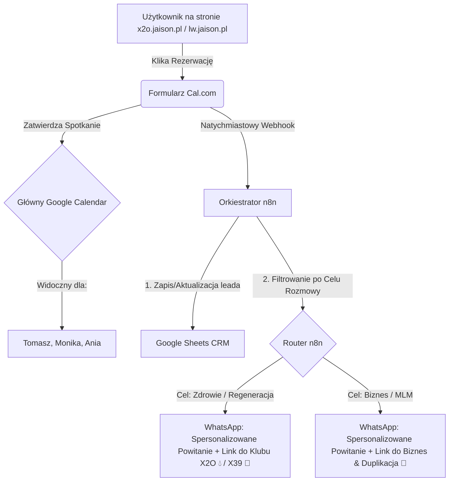
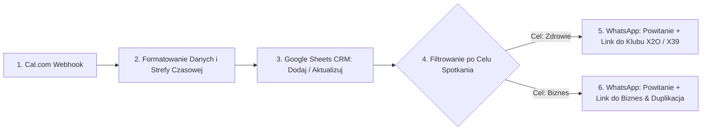

# 🗓️ Plan Integracji Cal.com, n8n i WhatsApp (LifeWave4Life)

Niniejszy dokument przedstawia **lekki, bezkosztowy i w pełni zautomatyzowany schemat obsługi rezerwacji spotkań**, który łączy system planowania **Cal.com**, platformę orkiestracji **n8n** oraz wysyłkę spersonalizowanych powiadomień i linków społecznościowych bezpośrednio na **WhatsApp**.

Wyeliminowaliśmy stąd potrzebę wdrażania skomplikowanych i limitowanych systemów CRM zewnętrznych (np. Systeme.io) na wczesnym etapie, zastępując je elastyczną bazą danych w **Google Sheets**, która nie posiada limitu kontaktów i tagów.

---

## 🏗️ 1. Architektura Przepływu (Bez Systeme.io)

Zamiast budować skomplikowaną synchronizację z Systeme.io (gdzie w darmowym planie mamy ograniczenie do 1 taga i 2000 kontaktów), dane płyną w ultra-czystej i bezpiecznej pętli:



---

## ⚙️ 2. Konfiguracja Cal.com (Krok po Kroku)

### 👤 2.1. Profil Główny (Profile Settings)
*   **Twoje imię (Full Name):** `LifeWave 4Life`
*   **Informacje o profilu (Bio):**
    ```markdown
    Witaj w społeczności LifeWave4Life! 🚀 

    Gramy do jednej bramki i działamy w czystej synergii Win-Win. Nasza społeczność łączy rewolucyjną fototerapię komórkową LifeWave i aktywację wody X2O™ z nowoczesnymi automatyzacjami biznesowymi. U nas sukces Twojego partnera jest bezpośrednim fundamentem Twojego sukcesu!

    Wybierz dogodny termin spotkania poniżej. Zbadajmy wspólnie, czy nadajemy na tych samych falach i jak nasz system może pracować dla Ciebie. 

    Zróbmy z tym porządek! 🤝
    ```

---

### 📅 2.2. Typy Wydarzeń (Event Types)
Zamiast domyślnych, ogólnych spotkań, skonfiguruj te trzy wydarzenia w panelu Cal.com:

| Nazwa Spotkania | Czas | Opis dla Użytkownika | Lokalizacja |
| :--- | :--- | :--- | :--- |
| **📞 Szybka Kwalifikacja & Start** | `15 min` | Krótka, konkretna rozmowa telefoniczna (lub WhatsApp). Sprawdzamy, czy nasze cele się pokrywają i jak możemy pomóc Ci wystartować w społeczności LifeWave4Life. Zero spamu, sama esencja. | Telefon (Organizator dzwoni) |
| **🧠 Strategia Budowy Rurociągu Finansowego** | `30 min` | Dla osób zdecydowanych na budowę pasywnego dochodu w oparciu o model MLM LifeWave i nasz system automatyzacji Hermes. Porównamy model klasyczny (wynajem kawalerki) z naszą dźwignią i ułożymy Twój plan na 12 miesięcy. | Google Meet / Zoom |
| **💧 Konsultacja Biohackingu: Woda X2O & Regeneracja** | `20 min` | Rozmowa dedykowana technologii aktywacji wody biofotonowej X2O™ oraz synergii z plastrami fototerapeutycznymi (X39/X49). Dowiedz się, jak wprowadzić swoje mitochondria i energię na wyższy poziom. | Telefon lub WhatsApp |

---

### 📝 2.3. Pytania w Formularzu (Booking Questions)
W ustawieniach każdego wydarzenia (zakładka **Booking Questions** / **Formularz rezerwacji**) dodaj lub zmodyfikuj pola zgodnie z poniższą tabelą. Pola te są kluczowe, ponieważ ich unikalne identyfikatory (Identifier / Slug) będą mapowane przez n8n.

| Nazwa Pola w Cal.com | Identyfikator (Slug) | Typ Pola | Status | Opcje wyboru (dla pól Select/Radio) |
| :--- | :--- | :--- | :--- | :--- |
| **Imię i Nazwisko** | `name` | Name | Wymagane | *Domyślne* |
| **Email** | `email` | Email | Wymagane | *Domyślne* |
| **Numer telefonu (WhatsApp)** | `phone` | Phone | Wymagane | *Wymaga wpisania kodu kraju (np. +48...)* |
| **Cel rozmowy** | `goal` | Radio / Select | Wymagane | 1. `Zdrowie i regeneracja (produkty)` <br>2. `Biznes (automatyzacja i MLM)` <br>3. `Oba obszary` |
| **Czy znasz już naszą technologię?** | `knowledge` | Radio / Select | Wymagane | 1. `Słyszę o tym pierwszy raz.` <br>2. `Znam, chcę zamówić/dołączyć.` <br>3. `Jestem już klubowiczem.` |
| **Gotowość do działania** | `commitment` | Radio / Select | Wymagane | 1. `Tak, wchodzę w tryb GOAL (min. 1h/dziennie)!` <br>2. `Chcę najpierw poznać szczegóły.` |

---

### ⚙️ 2.4. Przepływy Pracy w Cal.com (Workflows)

Wbudowany w Cal.com silnik **Workflows (Przepływy Pracy)** pozwala na bezkosztowe zautomatyzowanie e-mailowych oraz SMS-owych przypomnień o spotkaniach, minimalizując wskaźnik absencji (No-Show) niemal do zera.

W panelu Cal.com przejdź do zakładki **Workflows (Przepływy Pracy)** i utwórz następujące cztery reguły przypomnień przypisane do Twoich typów wydarzeń:

#### 1️⃣ Przepływ: Potwierdzenie i Instrukcje Wstępne (On Booking Created)
*   **Wyzwalacz (Trigger):** `When booking is created` (Przy utworzeniu rezerwacji)
*   **Akcja (Action):** `Send Email to Attendee` (Wyślij e-mail do uczestnika)
*   **Temat wiadomości (Subject):** `Potwierdzenie rezerwacji: {EVENT_NAME} (LifeWave4Life)`
*   **Treść wiadomości (Body):**
    ```text
    Witaj {ATTENDEE_NAME}! 👋

    Twoje spotkanie "{EVENT_NAME}" zostało pomyślnie zarezerwowane na dzień {EVENT_DATE} o godzinie {EVENT_TIME} (czas: {ORGANIZER_TIMEZONE}).

    Spotkanie poprowadzi: {ORGANIZER_NAME}
    Typ lokalizacji: {LOCATION}

    Zrobiliśmy porządek z tradycyjnymi, nudnymi spotkaniami – u nas gramy w trybie GOAL! 🚀

    P.S. Jeśli jeszcze tego nie zrobiłeś, koniecznie dołącz do naszego oficjalnego, prywatnego Kanału Nadawczego WhatsApp, aby być na bieżąco z najnowszymi automatyzacjami i informacjami:
    👉 https://whatsapp.com/channel/0029Vb6R9OaBfxoA1QUX9n3y

    Do usłyszenia wkrótce!
    ```

#### 2️⃣ Przepływ: Konkretne Przypomnienie przed Rozmową (24 Hours Before)
*   **Wyzwalacz (Trigger):** `24 hours before start` (24 godziny przed rozpoczęciem)
*   **Akcja (Action):** `Send Email / SMS to Attendee` (Wyślij e-mail/SMS do uczestnika)
*   **Temat wiadomości (Subject):** `Przypomnienie: Nasze spotkanie już jutro! ⏰`
*   **Treść wiadomości (Body):**
    ```text
    Cześć {ATTENDEE_NAME}! 

    To krótkie przypomnienie, że nasze spotkanie "{EVENT_NAME}" odbędzie się już jutro o {EVENT_TIME} ({EVENT_DATE}).

    Przygotuj dobrą kawę ☕ i pomyśl o swoich celach (zdrowie czy biznes/MLM), abyśmy mogli wycisnąć z tej rozmowy samą esencję i przejść od razu do konkretnych kroków działania.

    Jeśli chcesz zaprosić kogoś dodatkowo (np. partnera biznesowego), daj nam znać wcześniej na WhatsApp: https://wa.me/48791636644

    Do zobaczenia / usłyszenia! 🚀
    ```

#### 3️⃣ Przepływ: Ostatni Budzik (1 Hour Before)
*   **Wyzwalacz (Trigger):** `1 hour before start` (1 godzina przed rozpoczęciem)
*   **Akcja (Action):** `Send SMS to Attendee` (Wyślij SMS do uczestnika)
*   **Treść wiadomości (SMS Body):**
    ```text
    Cześć {ATTENDEE_NAME}! Widzimy się już za godzinę (o {EVENT_TIME}) na spotkaniu "{EVENT_NAME}". Przygotuj stabilne połączenie z internetem. Do usłyszenia! 🚀
    ```

#### 4️⃣ Przepływ: Asynchroniczny Follow-up (30 Minutes After Event Ends)
*   **Wyzwalacz (Trigger):** `30 minutes after event ends` (30 minut po zakończeniu spotkania)
*   **Akcja (Action):** `Send Email to Attendee` (Wyślij e-mail do uczestnika)
*   **Temat wiadomości (Subject):** `Dziękujemy za rozmowę! Oto Twoje kolejne kroki 🤝`
*   **Treść wiadomości (Body):**
    ```text
    Cześć {ATTENDEE_NAME}!

    Dziękujemy za Twój cenny czas i świetną, konkretną rozmowę. Niezależnie od tego, czy Twoim celem jest optymalizacja zdrowia i regeneracji, czy też budowa solidnego, pasywnego rurociągu finansowego – zrobimy z tym porządek!

    Oto linki do naszych dedykowanych społeczności na WhatsApp, o których rozmawialiśmy:

    💧 Klub Wody Komórkowej X2O (Opinie, wiedza o biofotonach):
    👉 https://chat.whatsapp.com/EKGnb8Znu5fBlcIZHV80HR

    🚀 Biznes & Duplikacja (Grupa partnerska, Hermes OS i MLM):
    👉 https://chat.whatsapp.com/H4KTNar9YQTCF9bCTC6TFe

    Dołącz do wybranej grupy, rozejrzyj się i zadaj pierwsze pytania. Jesteśmy tu, aby wspierać Twój wzrost na każdym etapie.

    Z szacunkiem,
    Zespół LifeWave4Life 🤝
    ```

---

## 🔗 3. Gdzie Umieścić Linki do WhatsApp (Strategia)

> [!IMPORTANT]
> **Dlaczego NIE warto umieszczać linków do grup WhatsApp w publicznym opisie spotkania?**
> Jeśli linki będą publicznie widoczne dla każdego na stronie rezerwacji przed spotkaniem, stracisz kontrolę nad tym, kto dołącza do Twoich grup. Na grupach pojawi się spam, a ludzie będą dołączać bez jakiejkolwiek wcześniejszej kwalifikacji.

### Rekomendowane Miejsca dystrybucji linków:

1.  **Ekran Potwierdzenia Rezerwacji (Cal.com Success Page):**
    Po pomyślnej rezerwacji Cal.com wyświetla komunikat o sukcesie. W sekcji **"Custom Success Message"** (Wiadomość po rezerwacji) umieszczamy link do **Głównego Kanału Nadawczego WhatsApp**:
    > "Dziękujemy! Twoje spotkanie zostało pomyślnie zarezerwowane. 📅 Aby nie przegapić najważniejszych aktualizacji w naszej społeczności, dołącz do naszego oficjalnego, w pełni prywatnego Kanału Nadawczego WhatsApp: **https://whatsapp.com/channel/0029Vb6R9OaBfxoA1QUX9n3y**"
2.  **Automatyczna Wiadomość WhatsApp od bota (n8n):**
    To najbardziej osobisty i skuteczny punkt styku. Dokładnie w momencie rezerwacji n8n wysyła do klienta wiadomość na WhatsApp (szczegóły w rozdziale 4).

---

## 🤖 4. Przebieg Workflow w n8n (Krok po Kroku)

Gdy użytkownik klika "Zarezerwuj" w Cal.com, w ułamku sekundy odpala się poniższy proces automatyzacji:



### Krok 1: Węzeł `Webhook Trigger` (Cal.com)
*   **Zadanie:** Nasłuchiwanie na zdarzenie `BOOKING_CREATED` z Cal.com.
*   **Otrzymywany Payload (JSON):**
    ```json
    {
      "triggerEvent": "BOOKING_CREATED",
      "payload": {
        "startTime": "2026-07-20T10:00:00Z",
        "attendees": [{ "name": "Jan Kowalski", "email": "jan@wp.pl", "timeZone": "Europe/Warsaw" }],
        "responses": {
          "phone": "+48791636644",
          "goal": "Zdrowie i regeneracja (produkty)",
          "knowledge": "Słyszę o tym pierwszy raz.",
          "commitment": "Tak, wchodzę w tryb GOAL (min. 1h/dziennie)!"
        }
      }
    }
    ```

### Krok 2: Węzeł `Set / Code` (Formatowanie Danych)
*   **Zadanie:** Konwersja czasu rozpoczęcia spotkania `startTime` (który Cal.com przesyła w formacie UTC) na polską strefę czasową (UTC+2) oraz sformatowanie daty, aby w wiadomości WhatsApp wyświetlić np. `Poniedziałek, 20 Lipca o godzinie 12:00` zamiast surowego ciągu znaków.

### Krok 3: Węzeł `Google Sheets` (Dodaj lub Aktualizuj Wiersz)
Zamiast płatnego CRM, n8n zapisuje dane w dedykowanym arkuszu Google. Kolumny w Twojej tabeli powinny wyglądać następująco:
*   `Data Rezerwacji` | `Imię i Nazwisko` | `Email` | `Telefon (WhatsApp)` | `Data i Godzina Spotkania` | `Cel Rozmowy` | `Stan Wiedzy` | `Zaangażowanie` | `Status Kontaktu` (domyślnie: *Nowy*) | `Notatki ze spotkania`

### Krok 4: Węzeł `Switch` / `Router` (Filtrowanie)
n8n analizuje wartość pola `responses.goal`:
*   **Warunek A:** Jeśli zawiera słowo `Zdrowie` -> Przekieruj na ścieżkę **Zdrowie**.
*   **Warunek B:** Jeśli zawiera słowo `Biznes` -> Przekieruj na ścieżkę **Biznes**.

### Krok 5: Węzeł `HTTP Request` (Wysyłka WhatsApp przez bramkę API)
n8n wysyła zapytanie do Twojego Evolution API / Z-API, które natychmiast dostarcza spersonalizowaną, nieszablonową wiadomość w stylu marki **Ghost** na telefon klienta:

#### Ścieżka 🟢 **ZDROWE NAWODNIENIE & REGENERACJA (Woda X2O / X39):**
```text
Cześć [Imię]! 👍 

Super, potwierdzam nasze spotkanie o nazwie "Konsultacja Biohackingu" dnia [Sformatowana_Data] o godzinie [Sformatowana_Godzina]. Ania, Monika lub Tomasz będziemy dzwonić na ten numer. 

Generalnie większość z nas pije dzisiaj wodę, która jest "martwa" i nie nawadnia komórek. Zrobiliśmy z tym porządek. Zanim się zdzwonimy, koniecznie wpadnij do naszej zamkniętej grupy "Klub Wody Komórkowej X2O" na WhatsApp. Pokazujemy tam od kuchni, jak działa woda strukturyzowana o stanie ciekłokrystalicznym:

👉 https://chat.whatsapp.com/EKGnb8Znu5fBlcIZHV80HR

Do usłyszenia wkrótce! 💧
```

#### Ścieżka 🔵 **BIZNES & DUPLIKACJA (MLM / Hermes):**
```text
Cześć [Imię]! 🤝 

Potwierdzam nasze spotkanie "Strategia Budowy Rurociągu Finansowego" dnia [Sformatowana_Data] o godzinie [Sformatowana_Godzina]. Widzimy się na Google Meet. Link do pokoju wpadł już na Twój e-mail.

Słuchaj, sprawa jest krótka. Generalnie mamy już dość "tradycyjnego" MLM-u, gdzie ludzie nękają znajomych po kawiarniach. Zrobiliśmy z tym porządek i wdrożyliśmy system automatyzacji duplikacji. 

Zanim pogadamy o konkretach, wejdź na naszą roboczą grupę dla Partnerów na WhatsApp. Zobaczysz tam esencję o tym, jak budujemy rurociąg finansowy bez żadnej presji:

👉 https://chat.whatsapp.com/H4KTNar9YQTCF9bCTC6TFe

Szykuj dobrą kawę na naszą rozmowę i do usłyszenia! 💼
```

---

## 👥 5. Koordynacja Zespołu (Wspólny Kalendarz Google)

Ponieważ kalendarz jest połączony bezpośrednio z Twoim głównym kontem Google Calendar, a spotkania obsługujesz wspólnie z **Anią i Moniką**, wdrożenie współdzielenia jest dziecinnie proste:

1.  **Udostępnienie Kalendarza:**
    *   Otwórz Google Calendar na komputerze.
    *   W menu po lewej stronie znajdź kalendarz, na który wpadają rezerwacje (np. Twoje główne konto lub dedykowany kalendarz `LifeWave4Life Meetings`).
    *   Najedź na niego myszką, kliknij ikonę trzech kropek i wybierz **"Ustawienia i udostępnianie" (Settings and sharing)**.
    *   Przejdź do sekcji **"Udostępnij konkretnym osobom" (Share with specific people)**.
    *   Dodaj adresy e-mail Moniki i Ani, nadając im uprawnienia: **"Wprowadzanie zmian i zarządzanie udostępnianiem" (Make changes and manage sharing)**.
2.  **Jak to działa w praktyce?**
    *   Monika i Ania natychmiast widzą każde nowe spotkanie w swoich kalendarzach na telefonach i komputerach.
    *   Dzięki temu, że n8n automatycznie zapisuje wszystkie zgłoszenia i dane z ankiety Cal.com w **Google Sheets CRM**, każda z Was przed wykonaniem połączenia może otworzyć tabelę i natychmiast sprawdzić, jaki cel ma dany klient, czy zna już technologię i na ile jest zaangażowany. 
    *   **To jest czysta, profesjonalna i asynchroniczna praca zespołu w trybie GOAL! 🚀**

---

## 💻 6. Zaawansowane Funkcje Programistyczne Cal.com (Webhooks, API, OAuth)

Cal.com to platforma stworzona z myślą o programistach (Developer-First Scheduling). Sekcja **Developer** w panelu Cal.com skrywa potężne mechanizmy, które w połączeniu z **n8n** oraz portalem **mlm.jaison.pl** pozwalają na zbudowanie w pełni zautomatyzowanego systemu rekrutacji o klasie enterprise.

Poniżej opisujemy, jak maksymalnie wykorzystać te trzy filary (API Keys, Webhooks, OAuth Clients) w naszym projekcie:

### 🔑 6.1. Klucze API (API Keys) - Programistyczna Kontrola
Klucz API pozwala zewnętrznym skryptom i automatyzacjom (np. **n8n**, backendowi PHP w **chat.php**) na wykonywanie operacji w Twoim imieniu bez konieczności logowania się przez przeglądarkę.

#### Do czego to wykorzystamy?
1. **Dynamiczne pobieranie wolnych terminów:** Możemy wyświetlać dostępne godziny bezpośrednio na stronie głównej w autorskim widżecie, bez ładowania ciężkiego iframe Cal.com.
2. **Automatyczne tworzenie rezerwacji:** Jeśli użytkownik przejdzie pozytywnie asynchroniczną kwalifikację u bota w `chat.php`, bot może automatycznie zarezerwować dla niego slot w kalendarzu i wysłać mu gotowe potwierdzenie na WhatsApp.
3. **Zarządzanie dostępnością zespołu:** n8n może dynamicznie blokować terminy w kalendarzu Tomasza, Ani lub Moniki na podstawie zdarzeń zewnętrznych (np. zaplanowanych kampanii marketingowych).

#### Jak wygenerować i przetestować klucz?
1. W panelu Cal.com przejdź do: **Settings (Ustawienia) -> Developer -> API Keys**.
2. Kliknij **Create a new API Key**, nazwij go `n8n-integration-key` i skopiuj wygenerowany token.
3. **Przykładowe zapytanie w n8n (HTTP Request Node) do pobrania typów wydarzeń:**
   - **Method:** `GET`
   - **URL:** `https://api.cal.com/v1/event-types`
   - **Headers:** `Authorization: Bearer <TWÓJ_KLUCZ_API>`

---

### 🪝 6.2. Zaawansowane Webhooki (Webhooks) - Reakcja w Czasie Rzeczywistym
Webhooki to asynchroniczne powiadomienia wysyłane przez Cal.com do **n8n** natychmiast po wystąpieniu określonego zdarzenia.

#### Do czego to wykorzystamy?
Zamiast ograniczać się tylko do tworzenia rezerwacji, konfigurujemy w Cal.com wysyłkę webhooków na ten sam adres URL webhooka w n8n dla następujących zdarzeń:

| Zdarzenie (Event Trigger) | Działanie w n8n i Google Sheets CRM | Powiadomienie WhatsApp |
| :--- | :--- | :--- |
| `BOOKING_CREATED` | Tworzy nowy wiersz leada w tabeli ze statusem **"Rezerwacja"**. | Wysyła spersonalizowane powitanie i linki do odpowiednich grup WhatsApp (Klub X2O / Biznes). |
| `BOOKING_RESCHEDULED` | Lokalizuje wiersz klienta po e-mailu/telefonie i aktualizuje datę oraz godzinę spotkania. Zmienia status na **"Przełożone"**. | Wysyła wiadomość: *"Cześć [Imię]! Potwierdzam, że pomyślnie przełożyliśmy nasze spotkanie na nową datę: [Nowa_Data]. Do usłyszenia!"* |
| `BOOKING_CANCELLED` | Lokalizuje wiersz klienta i zmienia jego status na **"Anulowane"**. | Wysyła wiadomość: *"Cześć [Imię]! Przykro nam, że spotkanie zostało odwołane. Jeśli chcesz wybrać inny termin w przyszłości, zapraszamy: [Link_Cal]"* |

#### Jak skonfigurować webhook w Cal.com?
1. Wejdź w **Settings -> Developer -> Webhooks**.
2. Kliknij **Add New Webhook**.
3. W polu **Subscriber URL** wklej adres produkcyjny Webhooka z Twojego n8n.
4. Zaznacz zdarzenia: `Booking Created`, `Booking Rescheduled`, `Booking Cancelled`.
5. W polu **Secret** wpisz losowy ciąg znaków (np. `x2o_secure_webhook_secret_2026`), który posłuży do weryfikacji autentyczności zapytań w n8n (zabezpieczenie przed podszywaniem się).

---

### 🛡️ 6.3. Klienci OAuth (OAuth Clients) - Skalowalność SaaS dla Partnerów MLM
Opcja **OAuth Clients** to najpotężniejsze narzędzie programistyczne w Cal.com. Służy do budowania integracji typu "Zaloguj się przez Cal.com" (analogicznie do "Zaloguj się przez Google").

#### Do czego to służy w kontekście Jaison MLM OS?
Gdy wdrażamy system **mlm.jaison.pl** dla **NOWYCH partnerów biznesowych** (rekrutowanych przez Tomasza), chcemy, aby każdy nowy partner otrzymywał własną podstronę rezerwacji z własnym kalendarzem, zachowując ten sam szablon pytań, lejków i automatyzacji n8n.

Dzięki **OAuth**:
1. Nowy partner wchodzi na panel zarządzania na **mlm.jaison.pl**.
2. Klika przycisk: **"Podłącz swój kalendarz Cal.com"**.
3. Zostaje przekierowany na bezpieczną stronę Cal.com, gdzie wyraża zgodę na dostęp dla aplikacji Jaison MLM OS.
4. Nasz system automatycznie otrzymuje token dostępu (OAuth Token) nowego partnera.
5. **Efekt:** n8n może w imieniu nowego partnera automatycznie utworzyć odpowiednie typy wydarzeń (np. Kwalifikacja, Strategia), pobierać jego dostępność i wysyłać powiadomienia na jego WhatsApp, bez konieczności ręcznego konfigurowania webhooków czy podawania haseł! To absolutny standard Premium SaaS i nieskończona skalowalność duplikacji w MLM.

---

### 🌐 6.4. Sposoby Osadzania Kalendarza (Embed Options)
Cal.com oferuje nieskazitelną integrację wizualną, która idealnie wpisuje się w naszą estetykę **Glassmorphism i Premium UI**. Na stronie rezerwacji `index.html` (oraz na przyszłym portalu `mlm.jaison.pl`) wdrożymy jedno z dwóch rozwiązań osadzania:

#### Opcja A: Płynny Pływający Przycisk (Floating Button - Rekomendowany)
Przycisk "Umów Degustację" stale unosi się w dolnym rogu ekranu. Po kliknięciu, na stronie wysuwa się piękny, ciemny, półprzezroczysty panel boczny (drawer) z kalendarzem, bez przeładowywania strony.
```html
<!-- Cal element-click embed code -->
<script type="text/javascript">
  (function (C, A, L) { let p = function (a, ar) { a.q.push(ar); }; C.Cal = C.Cal || function () { let a = C.Cal; if (!a.q) { a.q = []; } p(a, arguments); }; })(window, window.Cal, "init");
  Cal("init", {origin: "https://cal.com"});
  
  // Konfiguracja pływającego przycisku z ciemnym motywem i brandingiem X2O
  Cal("floatingButton", {
    calLink: "lifewave4life/szybka-kwalifikacja",
    buttonText: "Zarezerwuj Degustację 💧",
    buttonColor: "#00d2c4",
    buttonTextColor: "#0b132b",
    buttonPosition: "bottom-right"
  });
  Cal("ui", {"styles":{"branding":{"brandColor":"#00d2c4"}},"theme":"dark"});
</script>
```

#### Opcja B: Bezpośrednie osadzenie w sekcji (Inline Embed)
Kalendarz ładuje się jako integralna część sekcji `#booking-section` na ciemnym tle, dopasowując się automatycznie do szerokości ekranu (Responsive Layout).
```html
<div id="my-cal-inline" style="width:100%; height:700px; overflow:scroll;"></div>
<script type="text/javascript">
  (function (C, A, L) { let p = function (a, ar) { a.q.push(ar); }; C.Cal = C.Cal || function () { let a = C.Cal; if (!a.q) { a.q = []; } p(a, arguments); }; })(window, window.Cal, "init");
  Cal("init", {origin: "https://cal.com"});
  Cal("inline", {
    elementOrSelector: "#my-cal-inline",
    calLink: "lifewave4life/szybka-kwalifikacja",
    config: {"theme":"dark"}
  });
</script>
```

---

## 🚀 Podsumowanie Wdrożenia Cal.com
Dzięki połączeniu zaawansowanych webhooków Cal.com, orkiestracji n8n oraz spersonalizowanej komunikacji na WhatsApp eliminujemy jakiekolwiek tarcie operacyjne w zespole. Tomasz, Monika i Ania skupiają się wyłącznie na budowaniu relacji i przeprowadzaniu profesjonalnych rozmów, podczas gdy system asynchronicznie dba o rejestrację leada, przesyłanie linków do grup oraz minimalizację absencji. 

**Wszystko działa automatycznie, tanio i niezwykle profesjonalnie!**

