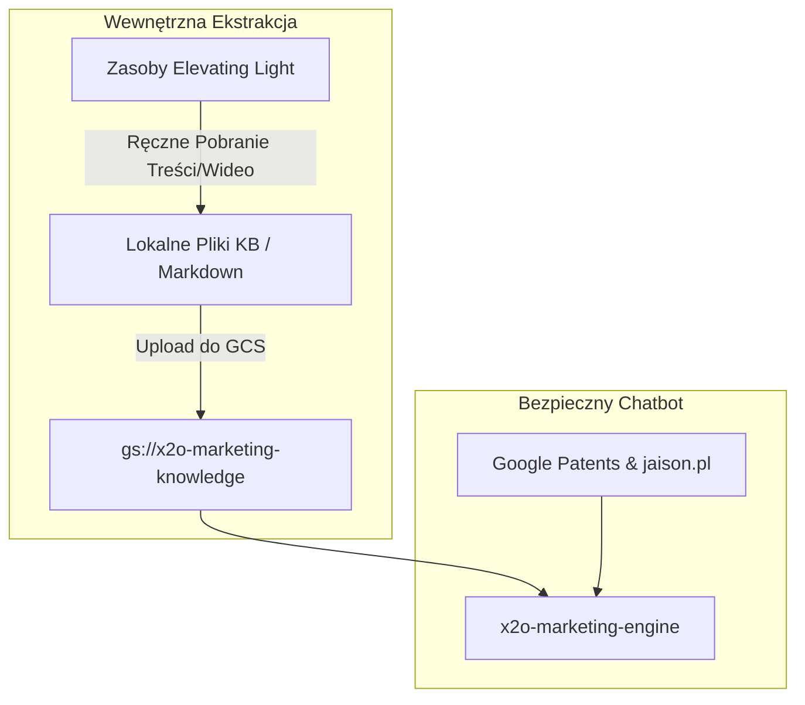
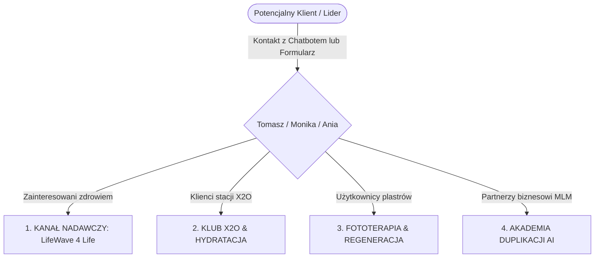

# Plan Zasilenia Baz Wiedzy GCP Vertex AI Search & Architektura WhatsApp

Dziękuję za cenne uwagi do planu! Wprowadziłem kluczowe poprawki eliminujące ryzyko wycieku leadów do konkurencyjnych struktur partnerskich LifeWave oraz precyzyjnie zaprojektowałem architekturę 4 dedykowanych grup WhatsApp zarządzanych przez Was (Tomasza, Monikę i Anię).

---

## 🏬 KOREKTA ARCHITEKTURY DATA STORE

W celu pełnego zabezpieczenia Twoich praw autorskich, marki osobistej i leadów, chatbot **nie może bezpośrednio indeksować i cytować domen konkurencyjnych** (takich jak `elevatinglight.com`). Zamiast tego wdrażamy strategię **Wewnętrznej Ekstrakcji Wiedzy**.

---

## 🛡️ 1. DATA STORE: MARKETING & MLM (`x2o-marketing-engine`)
Ten silnik zasila chatbot na stronie głównej ([index.html](file:///C:/Aplikacje%20MVP/02_CLIENTS_AND_PROJECTS/lifewave/02-website/index.html)).

### ❌ WYKLUCZENIA (Usunięte z Whitelistingu Chatbota):
*   `https://elevatinglight.com/*` — **USUNIĘTO**. Domena ta reprezentuje inną, konkurencyjną grupę partnerów LifeWave. Bezpośrednie indeksowanie tej strony przez bota mogłoby spowodować, że odsyłałby on potencjalnych klientów do obcych struktur.

### 📥 100% BEZPIECZNA STRATEGIA (Wewnętrzny Upload do Cloud Storage `gs://x2o-marketing-knowledge/`):
Zamiast kierować ruch na zewnątrz, „wyciskamy” wiedzę z konkurencyjnych zasobów i umieszczamy ją w Twojej własnej, prywatnej bazie chmurowej:
1.  `jaison-brand-blueprint.md` – Kompletny blueprint marki zawierający ToV, psychologię perswazji, historię, oraz autentyczne testimoniale.
2.  `lifewave-science-kb.md` – **[NOWY PLIK]** Spisana merytoryczna esencja naukowa z Elevating Light, w tym opisy fizyki kwantowej, biochemii i fototerapii bez żadnych odnośników do konkurencji.
3.  `lifewave-patch-patent.pdf` – Oficjalny patent technologii fototerapeutycznej LifeWave.
4.  `lifewave-patch-yage-glutathione-patent.pdf` – Oficjalny patent na biochemiczne podnoszenie poziomu glutationu za pomocą światła.
5.  `Czas-na-Lifewave (1).pdf` – Prezentacja biznesowa MLM opisująca wzrost firmy, rating AAA+ i zarobki w strukturze "LifeWave 4 Life".

### 🌐 DOZWOLONE LINKI ZEWNĘTRZNE (Do cytowania przez bota):
Gdy chatbot będzie chciał udowodnić fakty naukowe lub skierować użytkownika do oficjalnych źródeł, użyje wyłącznie **neutralnych, oficjalnych lub własnych platform**. Te źródła mogą być również umieszczone bezpośrednio na naszej stronie `x2o.jaison.pl`:

*   **Artykuły Branżowe i Analizy:**
    *   *Network Magazyn:* `https://networkmagazyn.pl/lifewave-corporate-swiety-graal-w-dziedzinie-zdrowia-i-biznesu-spolecznosciowego/` (Opis potęgi biznesowej LifeWave)
    *   *LeadIQ Profile:* `https://leadiq.com/c/lifewave/5fc69e434133a8a89a3f45e4`

*   **Oficjalne Strony Korporacyjne LifeWave:**
    *   Strona Główna: `https://lifewave.com/`
    *   Historia Marki: `https://lifewave.com/lifewaveinc/home/our-story`
    *   Profil Twórcy (David Schmidt): `https://lifewave.com/lifewaveinc/home/leadership/david_schmidt`
    *   Centrum Powitalne: `https://lifewave.com/lifewaveinc/home/welcome-center`
    *   Biura na Świecie: `https://lifewave.com/lifewaveinc/home/worldwide-offices`
    *   Dwudziestolecie Firmy: `https://lifewave.com/lifewaveinc/home/20th-anniversary`
    *   Zostań Partnerem Handlowym: `https://lifewave.com/lifewaveinc/home/become-a-brand-partner`
    *   Sklep z Produktami: `https://lifewave.com/lifewaveinc/store/products`

*   **Oficjalne Publikacje Naukowe, Katalogi i Raporty (PDF):**
    *   *Badania nad Plastrami Termalnymi:* `https://www.lifewave.com/Content/images/home/science/pdf/SciencePaper001-LWThermalPatchesShortVersion.pdf`
    *   *Raport z Badań Klinicznych X39:* `https://www.lifewave.com/Content/images/home/science/pdf/Experimental-Study-of-Lifewave-X-39-patches-report-Final-draft-3.pdf`
    *   *Katalog Produktów LifeWave:* `https://secure.lifewave.com/pdfs/marketing/PROD-CAT-EN_R02.pdf`
    *   *Raport Naukowy NIS:* `https://secure.lifewave.com/pdfs/Studies/StudyPDFS/NIS%20Lifewave%20Report%20206-001.pdf`

*   **Oficjalne Profile Społecznościowe:**
    *   LinkedIn Firmowy: `https://www.linkedin.com/company/lifewave-corporate`
    *   Wzmianka o 200 Patentach: `https://www.linkedin.com/posts/lifewave-corporate_200-patents-and-counting-true-innovation-activity-7310327150362939394-QWby`
    *   Facebook Oficjalny: `https://www.facebook.com/LifeWaveHealth/`
    *   Oficjalne Wideo (Our Story): `https://www.youtube.com/watch?v=UVte36q5uZY`

*   **Patenty Twórcy (David Schmidt):**
    *   Baza Patentów Justia: `https://patents.justia.com/assignee/lifewave-inc`
    *   Patent na Plastry Fototerapeutyczne (US10716953B1): `https://patents.google.com/patent/US10716953B1/en`

*   **Niezależne Badania Kliniczne i Opracowania Zewnętrzne:**
    *   *Podwójnie Ślepa Próba Poziomów GHK-Cu:* `https://researchopenworld.com/double-blind-testing-of-the-lifewave-x39-patch-to-determine-ghk-cu-production-levels/`
    *   *Badanie Medycyny Sportowej:* `https://clinmedjournals.org/articles/ijsem/international-journal-of-sports-and-exercise-medicine-ijsem-9-250.php?jid=ijsem`
    *   *Zmiany Metabolizmu przez Plaster X39:* `https://www.academia.edu/106369131/Phototherapy_Induced_Metabolism_Change_Produced_by_the_LifeWave_X39_Non_transdermal_Patch`
    *   *Niezależny Przewodnik Eriny:* `https://spiralspine.com/erins-guide-to-lifewave-patches/`

*   **Własny Ekosystem:**
    *   Domena Główna: `https://x2o.jaison.pl`
    *   Wideo Promocyjne (Vimeo): `https://vimeo.com/1017643167`
    *   Szybki Kontakt WhatsApp: `https://wa.me/48791636644`

---

## 🔧 2. DATA STORE: ASYSTENT TECHNICZNY (`x2o-technical-engine`)
Ten silnik zasila chatbot na podstronie z instrukcją ([x2o-guide-pl.html](file:///C:/Aplikacje%20MVP/02_CLIENTS_AND_PROJECTS/lifewave/02-website/x2o-guide-pl.html)).

### Pliki w Cloud Storage (`gs://x2o-tech-knowledge/`):
1.  `Instrukcja Users Guide X2O LifeWave.pdf` – Oryginalny, techniczny podręcznik użytkownika stacji X2O™.
2.  `x2o-guide-pl.html` – Zlokalizowany, polski, uproszczony podręcznik z procedurami płukania i kodami błędów.

---

## 💬 3. STRATEGIA SPOŁECZNOŚCI WHATSAPP ("LifeWave 4 Life")
Zamiast kierować wszystkich użytkowników na jeden, ogólny kanał nadawczy, chatbot oraz landing page będą precyzyjnie kierować ruch do dedykowanego ekosystemu **4 podgrup tematycznych**. 

Administrację nad wszystkimi grupami sprawujecie wspólnie: **Tomasz, Monika oraz Ania**.

### 📋 STRUKTURA 4 PODGRUP TEMATYCZNYCH:

1.  **📢 1. KANAŁ NADAWCZY: "LifeWave 4 Life" (Tylko dla Adminów)**
    *   **Administratorzy:** Tomasz, Monika, Ania.
    *   **Odbiorcy:** Wszyscy zainteresowani (klienci, partnerzy, zimne kontakty).
    *   **Cel:** Nadawanie kluczowych informacji – ogłoszenia o webinarach, nowe dostawy stacji X2O, nagrania ze spotkań, ważne aktualizacje ze świata zdrowia. Brak możliwości pisania przez uczestników gwarantuje czystość informacyjną (zero spamu).

2.  **💧 2. KLUB X2O & HYDRATACJA (Grupa Dyskusyjna)**
    *   **Administratorzy:** Tomasz, Monika, Ania.
    *   **Odbiorcy:** Klienci, którzy zakupili lub rozważają zakup stacji aktywacji biofotonowej X2O.
    *   **Cel:** Wymiana doświadczeń – jak woda wpływa na poziom energii, detoksykację, samopoczucie, optymalizacja smaku wody, porady eksploatacyjne, zdjęcia z darmowej degustacji w Gabinecie na ul. Nawrot w Łodzi.

3.  **✨ 3. FOTOTERAPIA & REGENERACJA (Grupa Dyskusyjna)**
    *   **Administratorzy:** Tomasz, Monika, Ania.
    *   **Odbiorcy:** Osoby stosujące plastry LifeWave (X39, X49, Glutation, Aeon itp.).
    *   **Cel:** Praktyczne wsparcie – schematy naklejania plastrów w różnych dolegliwościach, wzajemne motywowanie, opisywanie niesamowitych świadectw poprawy zdrowia, snu i redukcji bólu, oraz synergiczne łączenie fototerapii z nawodnieniem komórkowym X2O.

4.  **🚀 4. AKADEMIA DUPLIKACJI AI (Grupa Partnerska i Biznesowa)**
    *   **Administratorzy:** Tomasz, Monika, Ania.
    *   **Odbiorcy:** Zaangażowani Partnerzy Biznesowi budujący swoją strukturę MLM.
    *   **Cel:** Duplikacja i automatyzacja – udostępnianie gotowych skryptów rozmów, inspiracji, materiałów graficznych, instrukcji korzystania z narzędzi Jaison AI, wspólne domykanie leadów i wzajemna motywacja sprzedażowa.

---

### 🤖 Rola Chatbota w Kwalifikacji i Segmentacji na WhatsApp:
Gdy użytkownik wyrazi chęć kontaktu na chatbocie, bot nie wrzuca go bezpośrednio do losowej grupy, ale:
1.  **Pyta o cel:** *"Czy chcesz umówić się na bezpłatną degustację wody w Łodzi, dowiedzieć się więcej o technologii fototerapii, czy interesuje Cię budowanie dochodu pasywnego z naszymi systemami AI?"*
2.  **Kieruje do Lidera:** Odsyła na WhatsApp do Tomasza/Moniki/Ani: `https://wa.me/48791636644`, gdzie po krótkiej rozmowie lider przypisuje klienta do odpowiednich podgrup tematycznych z powyższej listy, budując od pierwszej sekundy elitarną relację premium (High-Touch).
