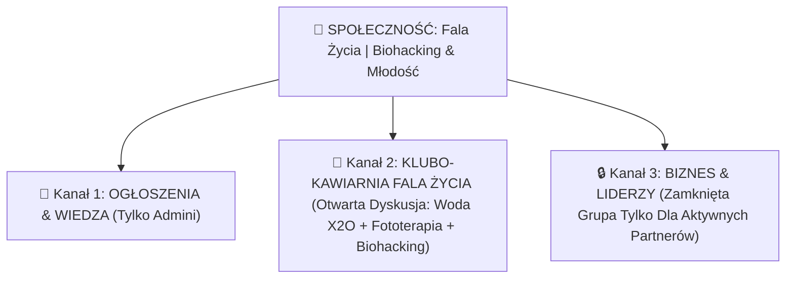

# 🥩 RAPORT ROASTU STRUKTURY SPOŁECZNOŚCI WHATSAPP "LIFEWAVE4LIFE" -> "FALA ŻYCIA"

---

> [!WARNING] ZAUWAŻONE BŁĘDY UX, PRZEBODŹCOWANIE & FRAKCJA UWAGI (ADHD / RETENTION CHECK):
> 
> 1. **Koszmar Rozproszenia Uwagi (Krajowe Przebodźcowanie):**  
>    Posiadanie **6 osobnych podgrup** na samym starcie społeczności (`Ogłoszenia`, `Administracja`, `Biznes & Duplikacja`, `Fototerapia & Regeneracja`, `Klub Wody Komórkowej`, `Ogólna`) to **przepis na martwą społeczność**! Nowy członek po wejściu dostaje 6 powiadomień naraz, wycisza wszystkie grupy i przestaje czytać cokolwiek.
> 
> 2. **Konflikt Starej Marki (`LifeWave4Life`):**  
>    Nazwa społeczności w nagłówku to wciąż stare `💙LifeWave4Life💕`. Jest to sprzeczne z naszą nową strategią pozycjonowania suwerennego klubu **"Fala Życia | Biohacking & Młodość Komórkowa"**.
> 
> 3. **Zacieranie Granicy B2C (Konsumenci) vs B2B (Liderzy/Biznes):**  
>    Wrzucanie zwykłych klientów szukających wsparcia zdrowotnego (Woda X2O, fototerapia) do tej samej społeczności co `Biznes & Duplikacja` i `Administracja` wywołuje opór psychologiczny (*"Aha, to jakiś MLM, chcą na mnie zarobić"*).
> 
> 4. **Dublowanie Kanałów Komunikacji (`Ogłoszenia` vs `Ogólna`):**  
>    Nikt nie wie, gdzie pisać, a gdzie tylko czytać. Wiadomości się dublują lub panuje głucha cisza.

---

## ⚡ OPTYMALNA, ODCHUDZONA STRUKTURA WHATSAPP (3 KANAŁY MAX!)

Zgodnie z zasadami **Holistic Soul & CPO AI (Ghost v2)**, ograniczamy architekturę Społeczności do **3 jasnych, wyrazistych filarów**:

---

### 📋 STAN DOCELOWY I POPRAWKI REBRANDINGOWE:

1. **Zmiana Nazwy Społeczności:**  
   Z `💙LifeWave4Life💕` ➔ na **`🌊 Klub Fala Życia | Biohacking & Młodość`**.
2. **Sczłonkowanie i Połączenie Grup (Z 6 do 3):**
   - **Kanał 1: `📣 Ogłoszenia & Wiedza`** (Tylko do odczytu) — Jednokierunkowe małe pigułki wiedzy, ogłoszenia live'ów, zaproszenia na degustacje u Ani/Moniki.
   - **Kanał 2: `💬 Klub Wody & Bioregeneracji`** (Połączona grupa Fototerapia + Woda X2O + Ogólna) — Zwykli klienci i członkowie klubu wymieniają się doświadczeniami, pytają o stosowanie, podsyłają wywiady.
   - **Kanał 3: `🚀 Biznes & Duplikacja Jaison OS`** (Osobna, ukryta grupa B2B) — Tylko dla zdeklarowanych partnerów biznesowych pracujących na maszynie `mlm.jaison.pl`.
3. **Usunięcie Grupy `Administracja` z Widoku Publicznego:**  
   Sprawy organizacyjne zarząd (Tomek, Monika, Ania) załatwia w prywatnej konwersacji WhatsApp, a nie na widoku społeczności.
