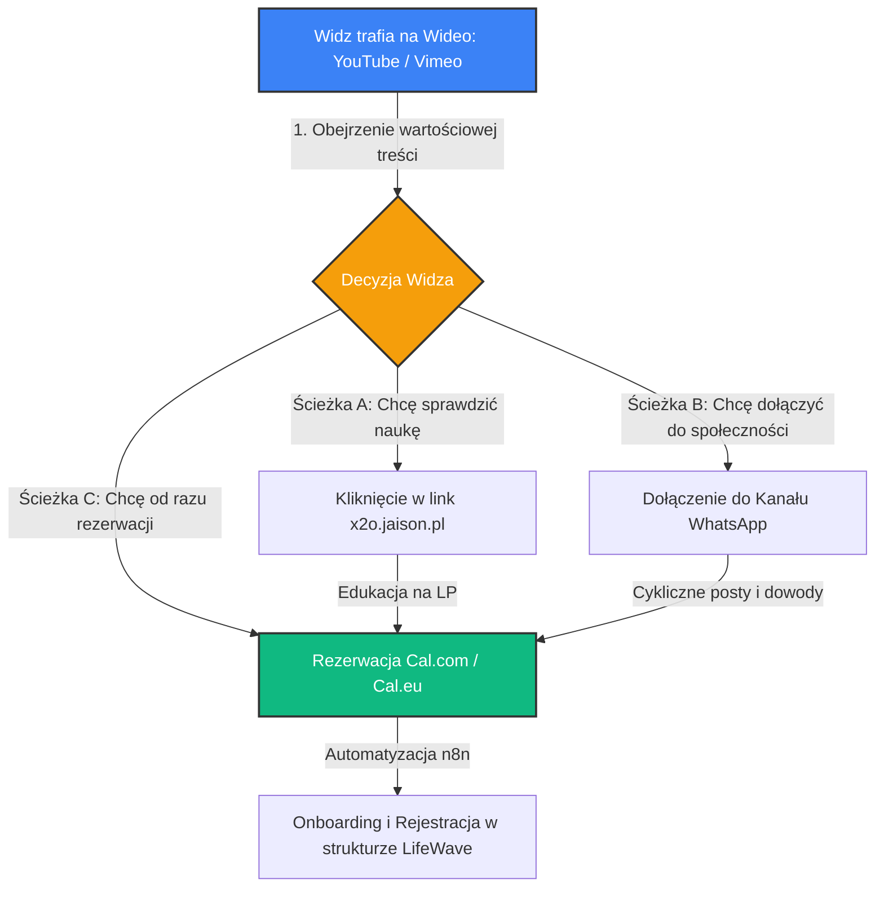

# 💎 Strategia Marketingowa & Plan Dystrybucji MLM: Wideo Technologii X2O
## Projekt: LifeWave4Life – Kanał YouTube & Punkty Styku (`x2o.jaison.pl`)

Niniejszy dokument stanowi kompletny plan marketingowy i pozycjonujący dla 53-minutowego filmu wprowadzającego w technologię biofotonowej hydratacji komórkowej X2O oraz fototerapii LifeWave. Został opracowany zgodnie z metodologią **NLP Copywriting**, standardem **GHOST v2** oraz zasadami duplikacji struktur lidera MLM (Tomasza Damiana).

Służy jako gotowy blueprint dla Dyrektora Marketingu (CMO) i Dyrektora Produktu (CPO) w celu wdrożenia spójnego lejka konwersji (Cal.com -> WhatsApp Channel -> Landing Page).

---

## 🗺️ 1. Architektura Lejka Konwersji (Customer Journey)

Wideo nie jest celem samym w sobie – jest "magnesem uwagi" (Attention Magnet), który ma przeprowadzić widza przez precyzyjnie zaprojektowane punkty styku:



---

## 🎨 2. Projekt Wizualny Planszy Końcowej (Layout Outro v2)

Wersja v2 planszy końcowej łączy tożsamość naszej **Społeczności LifeWave4Life** z oficjalną marką **LifeWave** (jako akredytowany Partner Marki), budując maksymalną wiarygodność prawną i merytoryczną.

### 📐 Siatka Układu Graficznego (Widescreen 16:9)

```
+-----------------------------------------------------------------------------------+
|                                                                                   |
|   [LOGO SPOŁECZNOŚCI]           "Zróbmy porządek z Twoim zdrowiem"                |
|     LifeWave4Life              "Aktywuj uśpiony potencjał komórkowy"              |
|                                                                                   |
|                               WYPEŁNIJ FORMULARZ & ZAREZERWUJ TERMIN:             |
|                                      cal.eu/lifewave-4life                        |
|                                                                                   |
|                                                                                   |
|   [LOGO OFICJALNE]                   POZDRAWIAM SERDECZNIE                        |
|       LifeWave                             TOMASZ DUDA                            |
|    Brand Partner                      Partner Marki LifeWave                      |
|                                                                                   |
+-----------------------------------------------------------------------------------+
```

### ✍️ Slogan & Przekaz NLP na Planszy:
*   **Nagłówek Wizualny:**
    > *"Zróbmy porządek z Twoją energią komórkową.*
    > *Aktywuj uśpiony potencjał regeneracyjny."*
*   **Uzasadnienie NLP:** Słowa *"Zróbmy porządek"* (Ghost style) budują autorytet i pokazują, że eliminujemy chaos informacyjny wokół zdrowia. *"Uśpiony potencjał"* pobudza ciekawość i podświadomą chęć odzyskania sił witalnych.

---

## 📝 3. Kompletny Opis Filmu na YouTube (SEO & Conversion Copywriting)

Poniższy opis został zoptymalizowany pod kątem algorytmów wyszukiwania YouTube (SEO) oraz psychologii konwersji. Zawiera precyzyjnie ułożone punkty styku.

```text
💧 Czym jest Woda Biofotonowa X2O i jak rewolucjonizuje zdrowie komórkowe?

Większość z nas każdego dnia pije wodę, która jest strukturalnie "martwa" – nie dociera do wnętrza komórek, przez co organizm cierpi na chroniczne odwodnienie na poziomie mitochondrialnym. W tym materiale wideo poznasz twarde, naukowe fakty stojące za technologią X2O™ oraz przełomowymi odkryciami Davida Schmidta w dziedzinie fotobiomodulacji i aktywacji komórek macierzystych za pomocą światła (peptyd GHK-Cu).

To nie są obietnice bez pokrycia – to czysta fizyka kwantowa i biologia molekularna w służbie Twojego zdrowia, witalności i długowieczności.

---

📌 TWÓJ PLAN DZIAŁANIA KROK PO KROKU (PUNKTY STYKU):

1️⃣ ZAREZERWUJ DARMOWĄ KONSULTACJĘ METABOLICZNĄ (30 MIN):
Chcesz dowiedzieć się, jak wdrożyć te rozwiązania u siebie? Wybierz dogodny termin w moim oficjalnym kalendarzu:
👉 https://cal.eu/lifewave-4life

2️⃣ DOŁĄCZ DO NASZEJ SPOŁECZNOŚCI NA WHATSAPP:
Chcesz być na bieżąco, otrzymywać badania kliniczne, mapy naklejania plastrów X39 oraz autentyczne opinie lekarzy i pacjentów bez szumu informacyjnego? Wejdź na nasz oficjalny kanał:
👉 [TUTAJ WKLEJ LINK DO KANAŁU NADAWCZEGO/GRUPY WHATSAPP]

3️⃣ ODWIEDŹ NASZ PORTAL MARKETINGOWO-EDUKACYJNY:
Poznaj pełną technologię, testy laboratoryjne oraz instrukcję krok po kroku:
👉 https://x2o.jaison.pl

---

🧬 O MNIE & O NASZEJ SPOŁECZNOŚCI:
Nazywam się Tomasz Duda i jestem certyfikowanym Partnerem Marki LifeWave. Wspólnie z Moniką, Anią i całym naszym zespołem tworzymy elitarną, wspierającą się społeczność "LifeWave4Life". 

Nasza filozofia jest prosta: działamy w myśl zasady "jeden za wszystkich, wszyscy za jednego". Oferujemy Ci nie tylko rewolucyjne produkty fototerapii, ale przede wszystkim pełne wsparcie merytoryczne, gotowe schematy i opiekę na każdym etapie Twojej drogi do zdrowia i wolności finansowej. U nas sukces budujemy razem – w czystej synergii Win-Win.

---

⚠️ NOTA PRAWNA (COMPLIANCE):
Produkty LifeWave nie są przeznaczone do diagnozowania, leczenia, łagodzenia ani zapobiegania jakimkolwiek chorobom. Przed rozpoczęciem jakiejkolwiek nowej terapii zdrowotnej skonsultuj się z lekarzem. Prezentowane materiały mają charakter wyłącznie informacyjno-edukacyjny i są własnością niezależnych Partnerów Marki LifeWave.
```

---

## 📈 4. Zalecenia MLM dla Nowych Partnerów (Duplikacja)

Aby ten film i cały lejek były łatwe do skopiowania (skalowania) przez innych partnerów handlowych na subdomenie `mlm.jaison.pl`, wdrażamy następujące zasady:

1.  **Szablon Opisu:** Każdy nowy partner otrzymuje identyczny opis YouTube. Jedyne co musi zmienić, to link w punkcie `1️⃣` (swoje konto Cal.com) oraz link w punkcie `2️⃣` (link do swojej podgrupy lub głównego kanału społeczności).
2.  **Modułowość:** Wideo jest osadzane na Landing Page za pomocą odtwarzacza Vimeo/YT, co pozwala na centralną aktualizację bez konieczności zmiany kodu u każdego partnera osobno.

---
