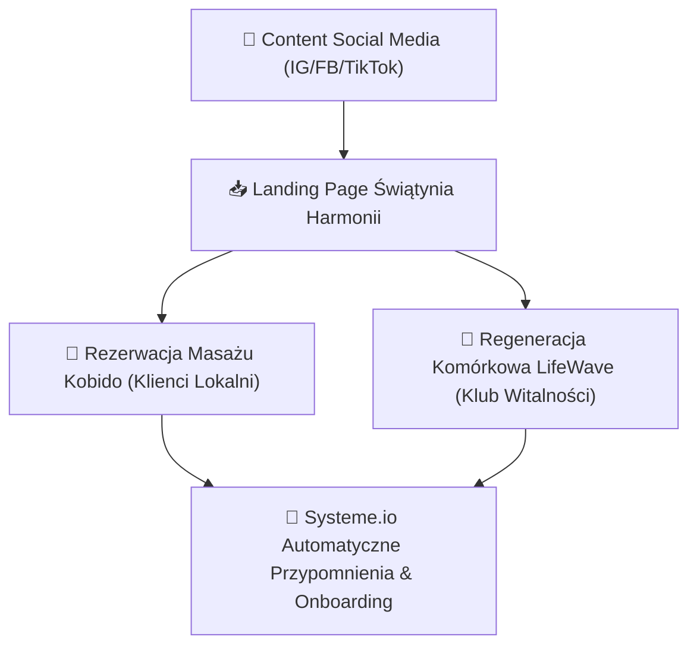

# 🌸 GHOST v2 PROFILE: Świątynia Harmonii (Ania — Kobido & LifeWave)

## 📌 Tożsamość Marki & USP
- **Marka:** Świątynia Harmonii (Gabinet Masażu Twarzy Kobido, Relaks & Bioregeneracja LifeWave)
- **Właścicielka:** Ania
- **Motto:** <strong>Odkryj naturalne piękno, głęboki relaks i komórkową witalność.</strong>
- **USP:** Połączenie tradycyjnego, nieinwazyjnego liftingu twarzy Kobido z nowoczesną technologią fototerapii komórkowej LifeWave. Naturalna alternatywa dla medycyny estetycznej i chemicznych zabiegów.

---

## 🗣️ Ton Wypowiedzi & Głos Marki (NLP VAK)
- **Styl:** Ciepły, empatyczny, luksusowy, uspokajający, pro-zdrowotny.
- **Sensoryka VAK:** 
  - **Kinestetyka (Dotyk & Czucie):** *"Poczuj jak napięcie znika z Twojej twarzy"*, *"Głęboki relaks mięśni powięziowych"*.
  - **Wzrok:** *"Promienna, młodsza skóra bez igieł i skalpela"*.
  - **Słuch:** *"Spokojny oddech, holistyczna harmonizacja"*.
- **Zasada Wyróżnień (Rule 13):** W kodzie HTML pod pogrubienia stosowane są WYŁĄCZNIE tagi <strong>tekst</strong> (zero gwiazdek `**`).

---

## 🎯 Architektura Lejka Hybrydowego (Usługa Lokalna + MLM)

