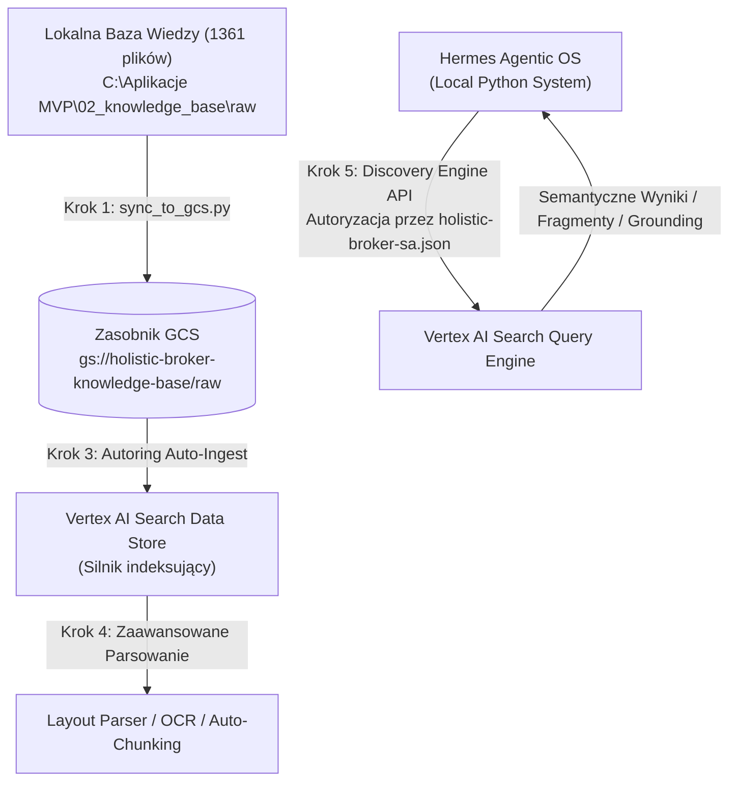

# Standard Operating Procedure (SOP): Konfiguracja Vertex AI Search (Gen AI App Builder) w Chmurze GCP
**Status:** Aktywny / Gotowy do wdrożenia  
**Rola:** Senior Cloud & Vertex AI Architect  
**Przeznaczenie:** Integracja bezserwerowego silnika RAG z systemem Hermes Agentic OS  

---

## 🎯 Wprowadzenie i Cel Architektoniczny

Niniejsza procedura (SOP) opisuje krok po kroku proces budowy **wysoko-zoptymalizowanego, bezserwerowego systemu RAG** (Retrieval-Augmented Generation) w oparciu o usługę **Vertex AI Search** (dawniej *Gen AI App Builder*). System ten ma za zadanie zainfekować i przetworzyć całą lokalną bazę wiedzy (1361 plików PDF, DOCX, Markdown, itp.) z katalogu:
`C:\Aplikacje MVP\02_knowledge_base\raw`

### Dlaczego Vertex AI Search?
* 🚀 **Zero-Management RAG**: Brak potrzeby ręcznego zarządzania bazą wektorową (jak Chroma, Pinecone, pgvector), chunkingiem, embeddingami czy modelami wyszukiwania semantycznego.
* 🔍 **Hybrydowe Wyszukiwanie**: Łączy tradycyjne wyszukiwanie słów kluczowych (BM25) z zaawansowanym wektorowym wyszukiwaniem semantycznym od Google.
* 📄 **Wbudowany Parser & OCR**: Natywne wsparcie dla skomplikowanych układów stron (tabele, kolumny, skany PDF) za pomocą technologii Google Document AI.
* 💰 **Efektywność Kosztowa**: 100% dopasowane do darmowego limitu GCP Free Trial (3600 PLN / $900).

---

## 🗺️ Schemat Architektury Przepływu Danych



---

## 📂 Krok 1: Upload plików do GCS (`sync_to_gcs.py`)

Do synchronizacji plików z chmurą Google Cloud Storage (GCS) używamy gotowego skryptu `sync_to_gcs.py`.

### Jak działa skrypt?
1. **Autoryzacja**: Aktywuje konto usługowe GCP na podstawie klucza JSON:  
   `C:\Aplikacje MVP\Holistic Jason\holistic-broker-sa.json`
2. **Tworzenie Zasobnika**: Tworzy bucket o nazwie domyślnej `holistic-broker-knowledge-base` w regionie `europe-west1` (Frankfurt - najbliższy i najbardziej opłacalny RODO-zgodny region), jeśli ten jeszcze nie istnieje.
3. **Synchronizacja (rsync)**: Wykonuje polecenie `gsutil rsync`, kopiując tylko nowe/zmienione pliki z lokalnego katalogu `raw`, pomijając zbędne katalogi techniczne (np. `.git`, `node_modules`, `.venv`).

### Uruchomienie synchronizacji:
Otwórz terminal PowerShell w katalogu `C:\Aplikacje MVP\02_knowledge_base` i wykonaj:
```powershell
python sync_to_gcs.py --bucket holistic-broker-knowledge-base
```

> [!NOTE]
> Synchronizacja pomija usunięte lokalnie pliki w chmurze tylko wtedy, gdy flaga `-d` jest aktywna (skrypt ją zawiera, co zapewnia idealne lustrzane odbicie struktury plików).

---

## 🔑 Krok 2: Konfiguracja GCS & Uprawnień IAM

Konto usługowe (Service Account) zdefiniowane w pliku `holistic-broker-sa.json` musi posiadać odpowiednie uprawnienia w projekcie Google Cloud, aby system działał poprawnie.

### Wymagane Role IAM dla Konta Usługowego (`holistic-broker`):
1. **Storage Object Admin** (`roles/storage.objectAdmin`): Umożliwia skryptowi `sync_to_gcs.py` zapisywanie, odczytywanie i usuwanie obiektów w zasobniku GCS.
2. **Discovery Engine Admin** (`roles/discoveryengine.admin`) lub **Discovery Engine Client** (`roles/discoveryengine.client`): Wymagane dla kodu Pythona w Hermes OS do odpytywania Vertex AI Search API.

### Jak nadać uprawnienia w GCP Console (Szybka instrukcja):
1. Wejdź do konsoli GCP -> **IAM & Admin** -> **IAM**.
2. Znajdź konto usługowe powiązane z kluczem (np. `holistic-broker-sa@holistic-broker.iam.gserviceaccount.com`).
3. Kliknij ikonę edycji (ołówek) i dodaj powyższe role. Kliknij **Save**.

---

## ⚙️ Krok 3: Konfiguracja Vertex AI Search Data Store

W tym kroku połączysz zasobnik GCS z silnikiem Vertex AI Search.

1. W konsoli GCP wyszukaj i przejdź do usługi **Vertex AI Search and Conversation** (często widocznej też pod nazwą *Agent Builder*).
2. Kliknij **Data Stores** w menu bocznym, a następnie kliknij **+ CREATE DATA STORE**.
3. Wybierz źródło danych: **Cloud Storage**.
4. Skonfiguruj ścieżkę do plików:
   * Wybierz **Folder**.
   * Wklej ścieżkę: `gs://holistic-broker-knowledge-base/raw/*`
   * Wybierz rodzaj danych: **Unstructured documents** (dokumenty nieustrukturyzowane).
   * Kliknij **CONTINUE**.
5. Nadaj nazwę dla Data Store:
   * **Data Store ID**: `holistic-knowledge-base-store`
   * **Display Name**: `Holistic Knowledge Base Store`
   * Kliknij **CREATE**.

---

## 🧠 Krok 4: Zaawansowane Opcje Aplikacji Search

Po utworzeniu Data Store należy utworzyć aplikację wyszukiwania (**Search App**) i skonfigurować zaawansowane parametry przetwarzania dokumentów.

### 1. Tworzenie aplikacji wyszukiwania (Search App)
1. W menu bocznym kliknij **Apps** -> **+ CREATE APP**.
2. Wybierz typ aplikacji: **Search**.
3. Wybierz konfigurację:
   * **Edition**: **Standard Edition** (kosztuje $1.50 za 1000 zapytań i w zupełności wystarcza do wyszukiwania semantycznego).
   * Do celów RAG **NIE** potrzebujesz *Enterprise Edition* (chyba że chcesz generować bezpośrednie odpowiedzi LLM wewnątrz konsoli GCP, co jest droższe - lepiej robić to lokalnie w Hermes OS).
4. Wpisz szczegóły aplikacji:
   * **App Name**: `holistic-search-app`
   * **Company/Organization**: `Holistic`
5. Wybierz lokalizację danych (Data Location): **global** (lub `europe` jeśli chcesz zachować dane blisko).
6. Połącz aplikację z utworzonym wcześniej Data Store (`holistic-knowledge-base-store`).
7. Kliknij **CREATE**.

### 2. Konfiguracja Parsowania, OCR i Metadanych (Kluczowe dla PDF/DOCX)
W menu bocznym przejdź do swojego **Data Store** -> **Activity** / **Configurations**:

* **Wbudowane OCR (Optical Character Recognition)**:
  Natywny cyfrowy parser w Vertex AI automatycznie wyodrębnia tekst cyfrowy. Jeśli w bazie wiedzy masz skany lub pliki PDF będące obrazami, Vertex AI Search automatycznie uruchomi proces OCR.
  > [!IMPORTANT]
  > Standardowy parser cyfrowy jest **darmowy** w ramach indeksowania. Zaawansowany parser układu stron (**Layout Parser** / **Document AI OCR**) kosztuje $10.00 za 1000 stron. Dla 1361 plików (zakładając średnio 5 stron na plik) pełne zaawansowane parsowanie kosztowałoby ok. $68. Zaleca się pozostawienie **domyślnego parsera cyfrowego** (Digital Parser) na start, który doskonale radzi sobie z natywnymi plikami PDF, Word i Markdown bez dodatkowych kosztów.
  
* **Automatyczny Chunking (Podział na fragmenty)**:
  Vertex AI Search posiada wbudowany inteligentny algorytm podziału tekstu, który respektuje strukturę dokumentów (nagłówki, akapity). Nie musisz konfigurować parametrów typu `chunk_size` czy `chunk_overlap` ręcznie — system robi to automatycznie, optymalizując pod kątem wyszukiwania semantycznego.

* **Wsparcie dla Metadanych**:
  Jeśli umieścisz w zasobniku plik JSONL z metadanymi obok plików raw, Vertex AI Search połączy je z dokumentami. Jednak domyślnie, Vertex AI automatycznie generuje bogate metadane systemowe (nazwa pliku, ścieżka GCS, typ dokumentu, data utworzenia), które możesz filtrować bezpośrednio w zapytaniach API.

---

## 🐍 Krok 5: Integracja API w Pythonie (Hermes Connector)

Poniższy skrypt przedstawia w pełni gotową integrację. Ładuje on klucz autoryzacyjny `holistic-broker-sa.json` dynamicznie i odpytuje silnik Vertex AI Search, zwracając najbardziej dopasowane fragmenty (RAG chunks) wraz ze ścieżkami źródłowymi.

### Instalacja biblioteki:
```bash
pip install google-cloud-discoveryengine
```

### Kod integracyjny (`vertex_search_client.py`):
```python
import os
from google.oauth2 import service_account
from google.cloud import discoveryengine_v1 as discoveryengine

def query_vertex_search(
    query_text: str,
    project_id: str = "holistic-broker",
    location: str = "global",
    data_store_id: str = "holistic-knowledge-base-store",
    sa_key_path: str = r"C:\Aplikacje MVP\Holistic Jason\holistic-broker-sa.json"
):
    """
    Wykonuje wyszukiwanie semantyczne w Vertex AI Search za pomocą klucza konta usługowego.
    """
    if not os.path.exists(sa_key_path):
        raise FileNotFoundError(f"Nie znaleziono pliku klucza SA: {sa_key_path}")

    # Autoryzacja za pomocą lokalnego pliku JSON
    credentials = service_account.Credentials.from_service_account_file(sa_key_path)
    
    # Inicjalizacja klienta Discovery Engine
    client = discoveryengine.SearchServiceClient(credentials=credentials)

    # Format ścieżki konfiguracyjnej wyszukiwania
    serving_config = (
        f"projects/{project_id}/"
        f"locations/{location}/"
        f"collections/default_collection/"
        f"dataStores/{data_store_id}/"
        f"servingConfigs/default_search"
    )

    # Konfiguracja zapytania
    # ContentSearchSpec pozwala na włączenie snippetów (fragmentów tekstu) idealnych do RAG
    content_search_spec = discoveryengine.SearchRequest.ContentSearchSpec(
        snippet_spec=discoveryengine.SearchRequest.ContentSearchSpec.SnippetSpec(
            return_snippet=True
        ),
        summary_spec=discoveryengine.SearchRequest.ContentSearchSpec.SummarySpec(
            summary_result_count=3,
            include_citations=True
        )
    )

    request = discoveryengine.SearchRequest(
        serving_config=serving_config,
        query=query_text,
        page_size=5,
        content_search_spec=content_search_spec
    )

    print(f"Wysyłam zapytanie semantyczne: '{query_text}'...")
    response = client.search(request)
    
    results = []
    print("\n=== WYNIKI WYSZUKIWANIA ===")
    for idx, result in enumerate(response.results, 1):
        doc = result.document
        gcs_uri = doc.derived_struct_data.get("link", "Brak linku GCS")
        
        # Pobranie wycinka tekstu (snippet)
        snippets = doc.derived_struct_data.get("snippets", [])
        snippet_text = snippets[0].get("snippet", "") if snippets else "Brak fragmentu"

        print(f"\n[{idx}] Trafność: {result.id}")
        print(f"    Źródło: {gcs_uri}")
        print(f"    Fragment: {snippet_text[:200]}...")
        
        results.append({
            "score_id": result.id,
            "gcs_uri": gcs_uri,
            "snippet": snippet_text
        })
        
    # Jeśli silnik wygenerował podsumowanie (RAG Summary)
    if response.summary:
        print("\n=== PODSUMOWANIE GENERATYWNE (GCP) ===")
        print(response.summary.summary_text)
        
    return results, response.summary.summary_text if response.summary else None

if __name__ == "__main__":
    # Testowe uruchomienie
    try:
        query_vertex_search("Jakie są główne procedury operacyjne?")
    except Exception as e:
        print(f"Błąd uruchomienia: {e}")
```

---

## 📊 Krok 6: Szacunki Kosztów & Optymalizacja Trialu

Twój budżet w GCP Free Trial wynosi **3600 PLN ($900)**. Zobaczmy, jak koszty Vertex AI Search mają się do tego limitu dla Twojej bazy **1361 plików** (szacowana objętość: **~500 MB / 0.5 GB** danych).

### Tabela Kosztów (Miesięczna estymacja dla Standard Edition)

| Element kosztowy | Jednostka rozliczeniowa | Cena standardowa | Estymacja dla Twojej bazy (0.5 GB, 5000 zapytań/msc) | Koszt miesięczny (USD) | Status w Free Trial |
| :--- | :--- | :--- | :--- | :--- | :--- |
| **Indeksowanie & Storage** | 1 GB / miesiąc | ~$5.00 | 0.5 GB (w bazie wektorowej) | **$0.00** *(Mieszczą się w darmowym pakiecie 10 GB)* |  **DARMOWE** |
| **Wyszukiwanie (Queries)** | 1,000 zapytań | $1.50 | 5,000 zapytań / miesiąc | **$7.50** |  **Pokryte z darmowych $900** |
| **Cloud Storage (GCS)** | 1 GB / miesiąc | $0.02 | 0.5 GB danych raw | **$0.01** |  **Pokryte z darmowych $900** |
| **Document AI Parsing (OCR)** | 1,000 stron | $10.00 (opcja layout) | *Wyłączone / używamy domyślnego darmowego parsera* | **$0.00** |  **DARMOWE** |
| **Suma miesięczna** | - | - | - | **~$7.51** |  **Całkowicie bezpłatne** |

### 💡 Ważne Porady Optymalizacyjne (Unikanie "Bill Shock"):
1. **Unikaj Enterprise Edition**: Standard Edition w zupełności wystarcza do wyszukiwania semantycznego (RAG). Wersja Enterprise kosztuje $4.00/1000 zapytań (ponad 2.5 raza drożej).
2. **Pozostań przy domyślnym parserze cyfrowym**: Nie włączaj opcji "Advanced Document AI Layout Parser" w ustawieniach Data Store, jeśli nie masz setek zeskanowanych obrazów bez warstwy tekstowej. Domyślny parser przetwarza PDF, DOCX i TXT bez naliczania opłat za Document AI.
3. **Ustaw limity budżetowe (Billing Alerts)**: Skonfiguruj powiadomienia w GCP Billing na poziomie 100 PLN i 500 PLN, aby kontrolować zużycie darmowych kredytów.

---

## 🛠️ Podsumowanie i Następne Kroki

Zaimplementowanie powyższych kroków da Ci zaawansowaną wyszukiwarkę omijającą ograniczenia kontekstu LLM, w pełni zasilaną infrastrukturą Google i zintegrowaną z lokalnym agentem Hermes OS.

1. **Uruchom synchronizację** za pomocą skryptu: `python sync_to_gcs.py`.
2. **Przejdź do GCP Console** i wykonaj konfigurację Data Store oraz Search App zgodnie z instrukcjami z Kroku 3 i 4.
3. **Zapisz powyższy kod kliencki** w systemie Hermes jako konektor bazy wiedzy.
4. **Ciesz się błyskawicznym i precyzyjnym wyszukiwaniem semantycznym!**
