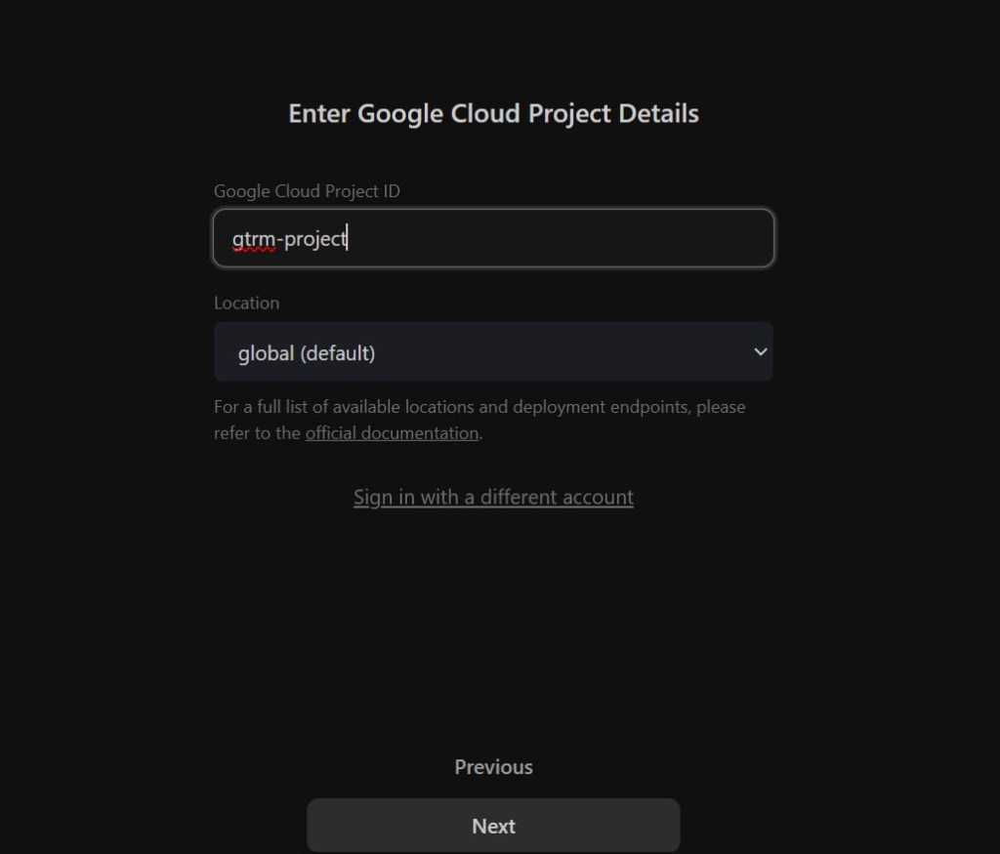
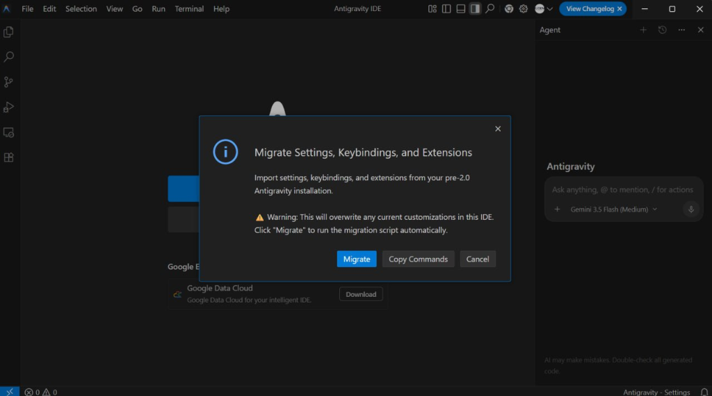
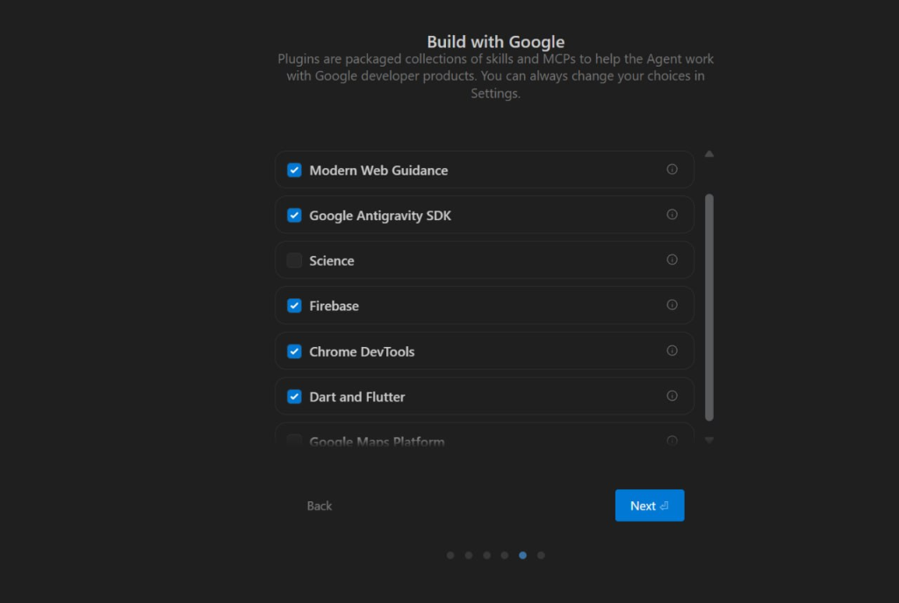
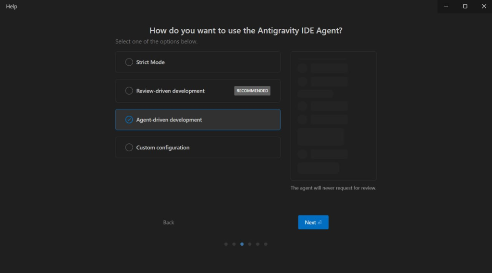
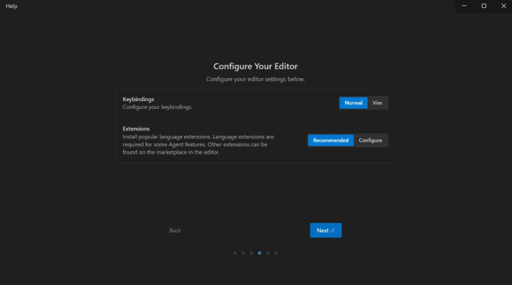
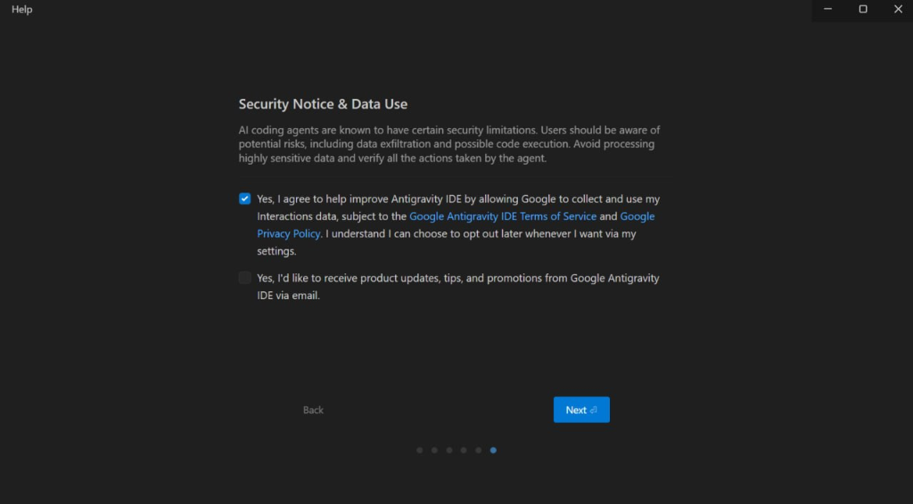

# ⚡ Szybki Start z Google Cloud: Krok po Kroku do Własnego AI i Automatyzacji
## Ilustrowany Przewodnik Wdrożeniowy (Wersja Ogólnodostępna - ADHD-friendly & NLP Copywriting)

---

> **Poczuj głęboką ulgę:** Zdejmij ze swoich barków stres związany z techniczną konfiguracją chmury. Ten ilustrowany przewodnik przeprowadzi Cię przez proces szybko, bez wysiłku i bez zbędnego chaosu informacyjnego. **Wyobraź sobie moment**, gdy Twoje lokalne środowisko agentowe połączy się bezpośrednio z potężnymi modelami Vertex AI, a Ty zyskasz pełną kontrolę nad budżetem, infrastrukturą i wszystkimi swoimi danymi. **Usłysz ten spokojny szum** działających automatyzacji, które bez Twojego zaangażowania wykonują powtarzalną pracę, dając Ci wolność i przestrzeń na to, co najważniejsze.

---

## 🎯 ETAP 1: Rejestracja bez tarcia (Od zera do pierwszego logowania)

*   [ ] **KROK 1.1:** Otwórz przeglądarkę i wejdź na oficjalną stronę: [Google Cloud Console](https://console.cloud.google.com/).
*   [ ] **KROK 1.2:** Zaloguj się na swoje konto Google. 
    *   *Sztuczka ułatwiająca życie:* **Możesz użyć zwykłego, darmowego konta Gmail!** Nie musisz na starcie kupować płatnego konta Google Workspace. Zwykły Gmail jest w 100% wystarczający do celów testowych i deweloperskich i nie generuje żadnych kosztów abonamentowych.
*   [ ] **KROK 1.3:** Zaakceptuj regulaminy i kliknij niebieski przycisk **„Aktywuj” / „Activate”** na banerze oferującym darmowy pakiet startowy (np. darmowe $300 USD na start).
*   [ ] **KROK 1.4:** **Krytyczne dla finansów (VAT) i struktury:** W oknie konfiguracji płatności przy wyborze typu konta zaznacz **„Konto organizacji / Organization”** (lub **„Firma / Business”** jeśli nie posiadasz jeszcze struktury organizacji podpiętej pod Google Workspace / Cloud Identity).
    *   *Dlaczego?* Pozwoli to na prawidłowe zarządzanie uprawnieniami w ramach Twojej domeny firmowej, a także zapobiegnie naliczeniu 23% VAT, ponieważ Google wystawi fakturę bezpośrednio na dane podatkowe Twojej firmy (NIP).


[Komentarz dla składu: Powyżej znajduje się zrzut ekranu przedstawiający formularz konfiguracji konta billingowego Google Cloud Console z zaznaczonym typem konta jako organizacja/firma i widocznym polem na wpisanie NIP-u (Tax ID).]

*   [ ] **KROK 1.5:** **Przedpłata weryfikacyjna (zależna od stażu konta):** Przy rejestracji na zupełnie nowym koncie Google (bez historii płatniczej), Google może wymagać jednorazowej przedpłaty weryfikacyjnej (która zasila Twoje saldo rozliczeniowe i nie przepada). W przypadku starszych, zaufanych kont Google, okres próbny aktywuje się zazwyczaj natychmiast, bez wnoszenia przedpłat.

[Komentarz dla składu: Tutaj warto dodać zrzut ekranu z oknem potwierdzenia udanej weryfikacji karty płatniczej w systemie Google Pay / GCP Billing.]

---

## 💰 ETAP 2: Aktywacja i zabezpieczenie darmowych środków

Po poprawnym skonfigurowaniu płatności, w Twoim panelu aktywują się dwie niezależne kasy z darmowymi środkami promocji startowej:

### 1. Pula $300 USD — ważna przez 90 dni
*   **Co to zasila?** Całą tradycyjną infrastrukturę GCP (maszyny wirtualne pod n8n/make, bazy danych SQL, pamięć dyskową Cloud Storage, aplikacje Cloud Run).
*   **Jak sprawdzić stan?** Wpisz w górnej wyszukiwarce GCP hasło **„Billing”** (Rozliczenia) i przejdź do pulpitu rozliczeń.

### 2. Pula $1000 USD (w ramach kredytów GenAI) — ważna przez 1 ROK
*   **Co to zasila?** Usługi generatywnej sztucznej inteligencji: **Vertex AI Search and Conversation** (twoje bazy wiedzy RAG) oraz powiązane z nimi inteligentne agenty.
*   **Aktywacja:** Środki te są automatycznie przypisywane do Twojego konta rozliczeniowego w momencie włączenia pierwszego API z rodziny Vertex AI.


[Komentarz dla składu: Powyższy zrzut ekranu prezentuje pulpit nawigacyjny Billing w GCP Console, pokazujący pasek postępu darmowych kredytów startowych ($300).]

---

## 🚀 ETAP 3: Program Google Cloud Startups (Zdobądź do $100 000 USD)

Nie musisz finansować rozwoju swojej technologii z własnej kieszeni. Jako młoda firma, start-up lub agencja wdrażająca nowoczesne rozwiązania, możesz ubiegać się o gigantyczne granty chmurowe. Google bardzo chętnie wspiera projekty technologiczne, o ile spełniają one rygorystyczne warunki wejściowe.

---

### 1. Ścieżka aplikacyjna i progi darmowych środków:
*   **Poziom START ($2 000 USD):** Przeznaczony dla wczesnych pomysłów (Bootstrap). Google przyznaje te środki (ważne przez 2 lata) niemal każdemu, kto posiada **konto organizacji Google Cloud** i opisze swój planowany produkt AI w formularzu aplikacyjnym.
*   **Poziom SCALE (do $100 000 USD):** Dla zweryfikowanych start-upów z finansowaniem zewnętrznym lub pod skrzydłami akredytowanych partnerów / akceleratorów (np. Y Combinator, Techstars, fundusze VC). Pokrywa do 100% kosztów całej Twojej infrastruktury chmurowej przez rok.

---

### 2. Jak myśli weryfikator Google? (Złote Zasady Kwalifikacji)
Google chroni swoje zasoby przed nadużyciami i odrzuca wnioski niespełniające kryteriów. Aby uzyskać akceptację, Twój projekt musi pomyślnie przejść przez cztery główne filtry weryfikacyjne:

*   ⚠️ **Filtr Rodzaju Działalności (Krytyczny):** Google wspiera **wyłącznie skalowalne produkty technologiczne (SaaS, aplikacje mobilne, platformy webowe, rynki dwustronne/marketplaces)**. Program **kategorycznie odrzuca**:
    *   Agencje marketingowe, SEO i interaktywne.
    *   Software house'y i firmy konsultingowe (wykonujące usługi "szyte na miarę" dla klientów).
    *   Szkolenia, portale informacyjne i blogi.
    *   Tradycyjne e-commerce (prosta sprzedaż towarów).
*   ⚠️ **Wiek firmy i historia:** Projekt lub powiązany z nim podmiot gospodarczy nie może mieć więcej niż 5 lat, a firma nie mogła wcześniej otrzymać najwyższych grantów z programu startupowego Google.
*   ⚠️ **Zasada Google Workspace (Poczta we własnej domenie):**
    *   Jeśli Twoja domena (np. `twojadomena.pl`) posiada aktywną, płatną subskrypcję Google Workspace wykupioną w ciągu ostatnich **31 dni** przed złożeniem wniosku, **nie otrzymasz darmowego Workspace z programu** (Google dodaje 12 miesięcy Workspace Business Plus za darmo dla nowych kont).
    *   *Zasada złotego czasu:* **Zawsze wnioskuj o grant zanim kupisz płatną pocztę Google Workspace**, aby otrzymać ją w 100% bezpłatnie na cały rok dla całego zespołu!

---

### 3. Jakie cechy techniczne SaaS-u faworyzuje Google?
Projektując aplikację pod kątem akceptacji, upewnij się, że opisujesz architekturę, którą Google uwielbia:
*   **Architektura Wielo-Dzierżawcza (Multi-Tenancy):** Jeden rdzeń aplikacji obsługujący wielu niezależnych klientów (tenantów), posiadających odseparowane dane w bazach (np. poprzez schematy w PostgreSQL lub AlloyDB).
*   **Orkiestracja i Konteneryzacja (Cloud Run / GKE):** Uruchamianie aplikacji w środowiskach kontenerowych, które skalują się automatycznie od zera do tysięcy zapytań w zależności od ruchu.
*   **Głębokie wykorzystanie Vertex AI:** Integracja modeli Gemini 2.5/3.1 z bazami wiedzy RAG (Vertex AI Search) ułatwia automatyzację procesów i sprawia, że Google widzi w Tobie idealnego partnera technologicznego.

---

### 4. Trik Pozycjonowania NLP (Jak przekształcić "usługę" w "SaaS" we wniosku?)
Jeśli prowadzisz agencję lub software house, Twoja aplikacja zostanie odrzucona. Rozwiązaniem jest **spakowanie Twojej wiedzy i powtarzalnych procesów w produkt technologiczny (SaaS)** i opisanie go jako platformy automatyzacyjnej, którą będziesz dystrybuować w modelu abonamentowym.

#### 📝 Gotowy szablon opisu projektu do skopiowania i adaptacji:
> *"Projekt [Nazwa Twojej Domeny / Produktu] to innowacyjna platforma typu **SaaS (Software-as-a-Service)** oparta o chmurę Google Cloud oraz Vertex AI. Dostarczamy firmom dedykowany, wieloagentowy system operacyjny, który przy użyciu autonomicznych agentów (CMO AI, CTO AI, CSO AI) oraz silnika wyszukiwania semantycznego (Vertex AI Search / RAG Engine) automatyzuje i optymalizuje czasochłonne procesy operacyjne w MŚP. Nasza platforma działa w modelu multi-tenant, oferując użytkownikom końcowym gotowe, asynchroniczne przepływy pracy (workflows) i zaawansowaną analitykę danych. Modele Gemini wykorzystujemy do wnioskowania, analizy konkurencji i automatycznego generowania struktur lejeków marketingowych."*

*   **Jak zaaplikować:** Wejdź na stronę [Google for Startups Cloud Program](https://cloud.google.com/startup) i kliknij **Apply Now**. Podepnij swoje konto i uzupełnij formularz aplikacyjny według powyższych wskazówek.

---

## 🔌 ETAP 4: Włączanie silników chmury (Kluczowe interfejsy API)

Aby Twoje lokalne systemy, skrypty i agenty mogły komunikować się z chmurą Google, musisz włączyć w konsoli GCP cztery kluczowe usługi.

```
[WYSZUKAJ W GÓRNYM PASKU GCP] ➔ [KLIKNIJ "ENABLE" (WŁĄCZ)]
```

*   [ ] **Vertex AI API:** Główny silnik modeli językowych z rodziny Gemini, generowania obrazów Imagen oraz wideo.
*   [ ] **Vertex AI Search and Conversation API:** Serce wyszukiwarki semantycznej (RAG) i bazy wiedzy dla agentów.
*   [ ] **Cloud Resource Manager API:** Umożliwia aplikacjom zewnętrznym odpytywanie o strukturę Twoich projektów.
*   [ ] **Cloud Run API / Compute Engine API:** Potrzebne do wdrażania dynamicznych aplikacji internetowych (SaaS, komunikatory, dashboardy) oraz maszyn wirtualnych.


[Komentarz dla składu: Powyżej znajduje się zrzut ekranu przedstawiający stronę szczegółów API Vertex AI w GCP Console, potwierdzający poprawne włączenie usługi (status „API Enabled” z niebieskim przyciskiem zarządzania API).]

---

## 🖥️ ETAP 5: Architektura Multi-Profilowa w PowerShell (Zarządzanie wieloma projektami)

Jeśli wdrażasz systemy AI dla wielu klientów lub prowadzisz równolegle kilka projektów, **kategorycznie unikaj ciągłego wylogowywania się i ponownego logowania!** Prowadzi to do chaosu i pomyłek w zasobach.

Narzędzie Google Cloud CLI posiada wbudowany, rewelacyjny mechanizm profili (`gcloud config configurations`). Pozwala on na błyskawiczne przełączanie całego kontekstu pracy (konto Google + powiązany projekt):

### 1. Tworzenie niezależnych profili:
Wpisz poniższe polecenia w terminalu (np. Windows PowerShell) jako One-Liners (w jednej linii):

```powershell
# Tworzenie profilu dla własnej firmy
gcloud config configurations create profil-wlasny

# Tworzenie profilu dla pierwszego klienta
gcloud config configurations create profil-klient-a
```

### 2. Autoryzacja i powiązanie projektu z profilem:
Przełącz się na dany profil, zaloguj się na właściwy e-mail i przypisz domyślny projekt chmurowy:

```powershell
# Konfiguracja profilu własnego
gcloud config configurations activate profil-wlasny; gcloud auth login twoj-email@gmail.com; gcloud config set project id-twojego-projektu; gcloud auth application-default login

# Konfiguracja profilu klienta
gcloud config configurations activate profil-klient-a; gcloud auth login email-klienta@gmail.com; gcloud config set project id-projektu-klienta; gcloud auth application-default login
```

### 3. Jak błyskawicznie przełączać się między projektami?
Gdy chcesz zmienić kontekst pracy i zacząć zarządzać infrastrukturą klienta, wpisujesz tylko:

```powershell
gcloud config configurations activate profil-klient-a
```
Aby wrócić do swoich zasobów:
```powershell
gcloud config configurations activate profil-wlasny
```

[Komentarz dla składu: Tutaj należy wstawić zrzut ekranu przedstawiający terminal z wykonaną komendą „gcloud config configurations list”, prezentujący listę zdefiniowanych konfiguracji i gwiazdkę oznaczającą aktywny profil.]

---

## 🔑 ETAP 6: Uruchomienie lokalnego logowania w Środowisku Deweloperskim

Możesz zalogować się i połączyć swoje lokalne środowisko z Google Cloud na dwa sposoby.

### Metoda A: Uwierzytelnianie przez graficzny interfejs (Zalecane) ⚡

W oknie logowania Twojego IDE lub aplikacji agentowej:
1.  Kliknij opcję logowania poprzez projekt Google Cloud (**„Use Google Cloud project instead”** / **„Continue with GCP”**).
2.  Spowoduje to automatyczne otwarcie bezpiecznego okna logowania w Twojej przeglądarce.
3.  Zaloguj się na konto Google, na którym utworzyłeś projekt GCP.
4.  Po udanej autoryzacji wklej do aplikacji swój **Project ID** (znajdziesz go na głównym pulpicie konsoli Google Cloud).



[Komentarz dla składu: Zrzut ekranu z kreatora logowania IDE z wprowadzonym przykładowym Project ID oraz domyślną lokalizacją global.]

---

### Metoda B: Uwierzytelnianie przez terminal Windows PowerShell

Otwórz Windows PowerShell i wykonaj te **trzy komendy jako One-Liners** (bez używania linuxowych znaków kontynuacji linii `\`):

*   [ ] **KROK 6.1: Logowanie globalne do chmury:**
    ```powershell
    gcloud auth login
    ```
*   [ ] **KROK 6.2: Wybór aktywnego projektu:**
    ```powershell
    gcloud config set project ID_TWOJEGO_PROJEKTU_GCP
    ```
*   [ ] **KROK 6.3: Wygenerowanie poświadczeń aplikacyjnych (ADC):**
    ```powershell
    gcloud auth application-default login
    ```

---

## 🌌 ETAP 7: Konfiguracja Środowiska Antigravity IDE od A do Z

Wdrożenie systemów agentycznych wymaga dobrze dobranych ustawień środowiska pracy. Antigravity IDE (wraz z wbudowanym asystentem Antigravity Agentic) podczas pierwszego uruchomienia prowadzi Cię przez kreator konfiguracji. Oto hierarchiczne omówienie każdego kroku w kreatorze, wyjaśnienie opcji oraz rekomendowane ustawienia.

### KROK 7.0: Bezpieczne przejście i migracja ustawień (Migrate Settings)
Podczas aktualizacji lub pierwszego uruchomienia nowej wersji IDE (np. 2.0+), na Twoim ekranie pojawi się okno dialogowe dotyczące migracji ustawień.



[Komentarz dla składu: Powyżej znajduje się zrzut ekranu okna „Migrate Settings, Keybindings, and Extensions” z przyciskami Migrate, Copy Commands oraz Cancel.]

**Zrozum to bez stresu i poczuj spokój:** Twój edytor dba o to, byś nie stracił dotychczas wypracowanych skrótów klawiszowych oraz zainstalowanych rozszerzeń z poprzednich wersji edytora. Zamiast budować środowisko od nowa i tracić cenną energię:
*   **Wybierz „Migrate” (Zalecane) ⚡:** Kliknięcie tego przycisku spowoduje automatyczne, bezwysiłkowe skopiowanie wszystkich Twoich wcześniejszych preferencji, skrótów klawiszowych i wtyczek. Poczujesz ulgę, widząc, że środowisko jest gotowe do pracy w ułamku sekundy, dokładnie tak, jak je zostawiłeś.
*   **Wybierz „Copy Commands”:** Jeśli jesteś zaawansowanym użytkownikiem chmury i chcesz dokładnie kontrolować, jakie skrypty wykonują się w tle, skopiuj komendy migracyjne i uruchom je ręcznie w terminalu.
*   **Wybierz „Cancel”:** Kliknij tylko wtedy, gdy chcesz rozpocząć pracę z całkowicie czystą kartą (czysta konfiguracja bez starych rozszerzeń i historii).

---

### KROK 7.1: Wybór wtyczek i pakietów (Build with Google)
Na pierwszym ekranie decydujesz, jakie pakiety umiejętności (skills) oraz serwerów MCP zostaną udostępnione Twojemu agentowi AI.



[Komentarz dla składu: Powyżej znajduje się zrzut ekranu z pierwszego kroku konfiguracji wtyczek deweloperskich (Build with Google).]

*   **Modern Web Guidance (Rekomendowane):** Udostępnia agentowi skille optymalizacji kodu webowego, analityki zdarzeń oraz standardy SEO i Schema.org.
*   **Google Antigravity SDK (Krytyczne / Wymagane):** Zapewnia bezpośrednią integrację z chmurą Google Cloud, Vertex AI oraz systemem zarządzania agentami. Bez tego agent nie będzie potrafił autoryzować Twoich skryptów w GCP.
*   **Firebase (Opcjonalne):** Włącz, jeśli Twój produkt korzysta z bezserwerowych baz danych Firestore, autoryzacji Firebase Auth lub hostingu Google.
*   **Chrome DevTools (Rekomendowane):** Daje agentowi możliwość automatycznego testowania i uruchamiania przeglądarki w tle, badania struktury DOM i szybkiego poprawiania błędów frontendu.
*   **Dart and Flutter (Opcjonalne):** Niezbędne do rozwoju aplikacji mobilnych (Android/iOS) i wieloplatformowych pisanych we Flutterze.
*   **Google Maps Platform (Opcjonalne):** Umożliwia agentowi korzystanie z protokołu MCP Google Maps, co pozwala mu na geokodowanie adresów, wyszukiwanie miejsc (Places API), wyliczanie tras (Directions API) oraz generowanie interaktywnych map. Włącz to tylko wtedy, gdy Twój projekt integruje się z usługami lokalizacyjnymi i geograficznymi (dzięki temu zaoszczędzisz kontekst roboczy agenta, wyłączając go, gdy nie jest potrzebny).

---

### KROK 7.2: Tryb autonomii agenta (How do you want to use the Antigravity IDE Agent?)
Wybierasz model współpracy z agentem. Określa on, jak bardzo samodzielny będzie asystent AI podczas edycji kodu i wykonywania komend terminala.



[Komentarz dla składu: Powyższy zrzut ekranu pokazuje ekran wyboru trybu współpracy (Strict Mode, Review-driven, Agent-driven).]

*   **Strict Mode (Tryb restrykcyjny):** Najbardziej zachowawczy. Agent pyta o zatwierdzenie niemal każdej operacji odczytu/zapisu plików i komend. Dobry dla osób stawiających pierwsze kroki w programowaniu.
*   **Review-driven development (Zalecane / Zbalansowane):** Agent przed rozpoczęciem prac tworzy w markdownie dokument `implementation_plan.md` i listę zadań `task.md`. Czeka na Twój przycisk "Zatwierdź" w UI przed wykonaniem jakichkolwiek modyfikacji kodu. Minimalizuje ryzyko niekontrolowanych zmian.
*   **Agent-driven development (W pełni autonomiczny):** Agent wykonuje komendy i modyfikuje kod w pętli bez pytania o zgodę na poszczególne kroki. 
    *   *Uwaga:* Wybierz ten tryb tylko wtedy, gdy masz włączoną kontrolę wersji (np. Git) i sprawnie zarządzasz historią commitów, aby w razie błędu łatwo cofnąć kod.
*   **Custom configuration (Własna):** Pozwala precyzyjnie zdefiniować, które operacje (np. odczyt plików, edycja kodu, uruchamianie poleceń powłoki) wymagają zgody użytkownika, a które mogą dziać się autonomicznie.

---

### KROK 7.3: Konfiguracja Edytora (Configure Your Editor)
Dopasowanie podstawowych skrótów klawiszowych i rozszerzeń językowych pod Twoje nawyki programistyczne.



[Komentarz dla składu: Zrzut ekranu przedstawiający opcje wyboru keybindings (Vim/Normal) oraz domyślnych wtyczek.]

*   **Keybindings (Skróty klawiszowe):**
    *   **Normal:** Standardowe skróty (jak w VS Code). Najlepsze dla 95% użytkowników.
    *   **Vim:** Aktywuje modalny tryb nawigacji za pomocą klawiatury dla użytkowników przyzwyczajonych do edytora Vim.
*   **Extensions (Rozszerzenia):**
    *   Wybierz opcję **Recommended**, aby automatycznie zainstalować zestaw rozszerzeń obsługujących najważniejsze języki programowania. Zapewnia to agentowi poprawny parser i lintery kodu.

---

### KROK 7.4: Prywatność i Telemetria (Security Notice & Data Use)
Ostatni etap dotyczy akceptacji ryzyka związanego z kodem generowanym przez AI oraz zbierania anonimowych danych telemetrycznych w celu poprawy algorytmów Google.



[Komentarz dla składu: Zrzut ekranu przedstawiający warunki prywatności i pola wyboru zgód w kreatorze.]

*   **Zgoda na zbieranie danych interakcji (Zalecana):** Pozwala Google na analizowanie sposobu interakcji z agentem w celu ulepszania jego modeli. Nie przekazuje wrażliwych danych z plików źródłowych projektu.
*   **Zgoda na komunikację marketingową (Opcjonalna):** Otrzymywanie nowości i poradników na e-mail powiązany z kontem Google Cloud.

---

### KROK 7.5: Wybór lokalizacji w ustawieniach projektu (GCP Project Settings)
W formularzu logowania projektu podajesz Project ID oraz strefę/lokalizację zasobów:
*   **Lokalizacja (Location):** Standardowo wybierz **`global (default)`**. Daje to najniższe opóźnienia w routingu zapytań do modeli Vertex AI oraz maksymalną kompatybilność z modelami językowymi (niektóre nowości są wdrażane regionalnie z dużym opóźnieniem).
*   **Kiedy zmienić na regionalną (np. europejską)?** Zmień lokalizację na regionalną (np. regiony EU) wyłącznie ze względów prawnych i wymogu przechowywania danych użytkowników w Unii Europejskiej (suwerenność danych / RODO).

---

## 🛡️ ETAP 8: Limity zapytań (Quotas) — Inspekcja i podnoszenie limitów

Gdy Twoje zaawansowane systemy wieloagentowe (np. Antigravity OS) zaczną wykonywać wiele zadań równolegle, domyślne limity zapytań Vertex AI na nowym koncie mogą wywołać błąd przekroczenia limitu zapytań (`429 Resource Exhausted`).

### 1. Weryfikacja konta rozliczeniowego (Billing)
Przed zgłoszeniem prośby o zwiększenie limitów upewnij się, że Twój projekt GCP jest podpięty pod właściwe, zweryfikowane konto rozliczeniowe. Na kontach z darmowym pakietem próbnym (bez podpiętej karty) wnioski o zwiększenie limitów Vertex AI są najczęściej odrzucane.

#### Jak sprawdzić status płatności w terminalu?
Wykonaj poniższe polecenie w terminalu PowerShell (jako One-Liner):
```powershell
gcloud beta billing projects describe ID_TWOJEGO_PROJEKTU_GCP
```
*   Upewnij się, że w wyniku widnieje parametr: `billingEnabled: true`.
*   Zweryfikuj poprawność powiązanego konta w linii `billingAccountName`. Listę swoich kont rozliczeniowych sprawdzisz przez:
```powershell
gcloud billing accounts list
```

[Komentarz dla składu: Zrzut ekranu z konsoli Google Cloud przedstawiający stronę IAM -> Quotas & System Limits z zaznaczoną konkretną metryką Vertex AI API i wybranym przyciskiem "Edit Quotas".]

### 2. Jak sprawdzić aktualne limity zapytań w konsoli PowerShell?
```powershell
gcloud services consumer-quota-metrics list --service=aiplatform.googleapis.com --project=ID_TWOJEGO_PROJEKTU_GCP
```

### 3. Zwiększenie limitów za pomocą jednej komendy w PowerShell (One-Liner)
Możesz wysłać oficjalną prośbę o modyfikację limitu (tzw. Quota Preference) bezpośrednio z Cloud Shell lub lokalnego komputera, korzystając z poniższego szablonu. 

Pamiętaj o podmieniu zmiennych `ID_TWOJEGO_PROJEKTU_GCP` oraz `TWÓJ_REGION_GCP` (np. `us-central1` lub `europe-west3`) na własne wartości:

```powershell
gcloud beta quotas preferences create --project=ID_TWOJEGO_PROJEKTU_GCP --service=aiplatform.googleapis.com --quota-id=generate_content_requests_per_minute_per_project_per_base_model --preferred-value=150 --dimensions=region=TWÓJ_REGION_GCP --preference-id=increase-gemini-rpm --justification="Wdrozenie produkcyjnego systemu agentowego w chmurze organizacji. Zwiekszenie limitu zapytan na minute (RPM) zapobiega powstawaniu krytycznych bledow HTTP 429 podczas wykonywania rownoleglych zadan orkiestracyjnych przez asynchroniczne agenty."
```

### 4. Gotowe szablony uzasadnienia biznesowego (Justification)
Google automatycznie odrzuci wniosek bez podania przekonującego powodu. Oto trzy szablony uzasadnień, które możesz wykorzystać w formularzu konsoli GCP lub w powyższym parametrze `--justification`:

#### Opcja A: Wdrożenie systemu operacyjnego agentów (np. Antigravity OS / Jaison AI)
> *"Wdrożenie produkcyjnego systemu operacyjnego opartego na agentach AI (Antigravity OS) w środowisku organizacji. System realizuje asynchroniczne zadania operacyjne w tle (kodowanie, analiza, orkiestracja). Zwiększenie limitów RPM/TPM jest kluczowe dla uniknięcia blokad wątków przy równoległych zapytaniach i pętli agentowych."*

#### Opcja B: Aplikacja kliencka w czasie rzeczywistym (Real-Time Client App)
> *"Uruchomienie komercyjnej usługi asystenta AI zintegrowanego w czasie rzeczywistym z panelem użytkownika. Aplikacja kierowana jest do użytkowników biznesowych (B2B), a domyślny limit zapytań (RPM) uniemożliwia stabilną obsługę jednoczesnych sesji wielu klientów."*

#### Opcja C: Masowe przetwarzanie danych (Batch Processing)
> *"Przetwarzanie potoków danych w tle (wsadowa analiza dokumentów technicznych, raportów PDF oraz automatyczna synteza baz wiedzy). Proces wymaga krótkotrwałych, seryjnych skoków obciążenia API, a obecny limit powoduje masowe odrzucanie zapytań."*

#### Jak sprawdzić status zgłoszonego wniosku o limity?
```powershell
gcloud beta quotas preferences list --project=ID_TWOJEGO_PROJEKTU_GCP
```

---

## 📉 ETAP 9: Audyt Kosztów — Usuwanie zbędnych i osieroconych zasobów

Aby Twoje darmowe środki starczyły na jak najdłużej, musisz regularnie czyścić chmurę z nieużywanych zasobów, które generują stałe, ukryte koszty za przechowywanie danych (Storage & Compute):

### 1. Wirtualne Maszyny i Dyski (Compute Engine -> Disks)
Nawet jeśli wyłączysz maszynę wirtualną, Google nadal nalicza opłaty za zarezerwowaną przestrzeń jej dysku twardego!
*   Regularnie sprawdzaj zakładkę **Disks (Dyski)** w menu Compute Engine.
*   Zidentyfikuj i usuń tzw. **dyski osierocone (unattached disks)** — czyli te, które w kolumnie *"Używany przez"* nie mają przypisanej żadnej aktywnej maszyny wirtualnej.

#### Komenda PowerShell do bezpiecznego usunięcia nieużywanego dysku:
```powershell
gcloud compute disks delete NAZWA_DYSKU --zone=NAZWA_STREFY_ZONE --quiet
```

[Komentarz dla składu: Zrzut ekranu przedstawiający konsolę GCP -> Compute Engine -> Disks, pokazujący kolumnę "In-use by" z pustymi polami oznaczającymi dyski osierocone (unattached).]

### 2. Zasobniki danych (Cloud Storage -> Buckets)
*   Usuwaj zasobniki utworzone automatycznie podczas dawnych testów, migracji baz danych czy jednorazowych importów plików CSV/FAQ.
*   Pamiętaj, że przechowywanie danych w regionach typu *"Multi-region"* (np. całe terytorium USA lub Europy) jest droższe niż w pojedynczych regionach lokalnych (np. `europe-west1` w Belgii).

#### Komenda PowerShell do usuwania zbędnego zasobnika wraz z zawartością:
```powershell
gcloud storage rm --recursive gs://nazwa-twojego-zasobnika
```

---

## 🌐 ETAP 10: Konfiguracja Cloudflare DNS i Wdrażanie Certyfikatów SSL

Gdy mapujesz własną subdomenę (np. `app.twojadomena.pl`) do usług Cloud Run w Google Cloud, możesz napotkać błąd **"Waiting for certificate provisioning"** lub **"Resource readiness deadline exceeded"**.

### Dlaczego tak się dzieje?
Domyślnie Cloudflare maskuje ruch i serwery docelowe, kierując go przez własne serwery proxy (status **Proxied / Pomarańczowa chmurka**). Podczas generowania darmowego certyfikatu SSL Let's Encrypt, roboty weryfikacyjne Google próbują połączyć się bezpośrednio z Twoją domeną. Ponieważ trafiają na proxy Cloudflare, weryfikacja własności domeny kończy się niepowodzeniem.

### Jak to naprawić bez stresu (Krok po Kroku):

1.  Zaloguj się do swojego panelu kontrolnego **Cloudflare**.
2.  Przejdź do domeny, na której konfigurujesz subdomenę -> sekcja **DNS -> Records**.
3.  Zlokalizuj rekord typu **A** (lub rekord **CNAME**) odpowiadający Twojej subdonienie i kierujący na adres IP/alias Google.
4.  Kliknij **Edit** przy tym rekordzie.
5.  Kliknij na pomarańczową ikonę chmurki, aby zmienić status z **Proxied (Pomarańczowa chmurka)** na **DNS Only (Szara chmurka)**.
6.  Kliknij **Save**.
7.  Wejdź do konsoli Google Cloud (Cloud Run -> Custom Domains). Google pomyślnie zweryfikuje domenę i w ciągu maksymalnie kilku godzin certyfikat SSL zostanie wystawiony i aktywowany!
8.  *(Opcjonalnie):* Po pełnej aktywacji certyfikatu możesz z powrotem włączyć pomarańczową chmurkę (Proxy) w Cloudflare, aby chronić swoją aplikację przed atakami sieciowymi.

[Komentarz dla składu: Wstaw zrzut ekranu z panelu zarządzania DNS w Cloudflare, przedstawiający rekord subdomeny typu A lub CNAME skierowany na Google Cloud Run z ikoną chmurki o kolorze szarym (DNS Only).]

---

## 🤖 ETAP 11: Nowoczesne Modele AI w Praktyce (Nomenklatura i Modele)

Budując nowoczesną infrastrukturę AI, zrezygnuj ze starszych wersji modeli. Korzystaj wyłącznie z najnowszych osiągnięć technologicznych Google Cloud Vertex AI oraz Google AI Studio:

1.  **Gemini 3.5 Flash:** Najszybszy model multimodalny. Doskonały do analizy dokumentów, wideo i obrazów, masowego przetwarzania danych i natychmiastowych odpowiedzi. Posiada gigantyczne okno kontekstowe.
2.  **Gemini 3.1 Pro:** Król zaawansowanej logiki, wieloetapowego planowania, kodowania i pisania skomplikowanych tekstów perswazyjnych (NLP). Rozumie głęboki kontekst biznesowy.
3.  **Imagen 3:** Najwyższa jakość generowania fotorealistycznych obrazów, logotypów i grafik marketingowych, cechująca się doskonałym renderowaniem napisów i detali.
4.  **Veo:** Przełomowy model do generowania wideo i dynamicznych animacji o wysokiej rozdzielczości z opisów tekstowych.

> **Twój sukces jest blisko:** Masz teraz przed sobą kompletną mapę chmury Google Cloud. Połączenie darmowych środków, nowoczesnych modeli AI oraz stabilnej automatyzacji da Ci niesamowitą dźwignię biznesową i operacyjną. Czas zacząć budować!
